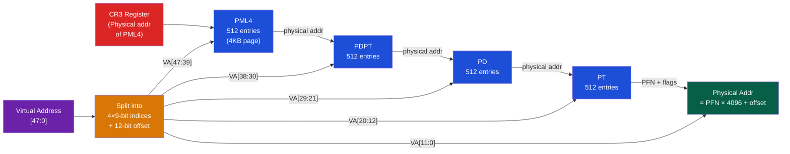

# 🗺️ Virtual Memory and TLB

> [!abstract] TL;DR
> Virtual memory gives each process a private address space (0 to 2^64−1 on x86-64), with the OS and MMU transparently mapping virtual pages (4KB) to physical frames via multi-level page tables. x86-64 uses 4-level page tables (PML4→PDPT→PD→PT), each walking 512 entries with 9-bit indices. The TLB (Translation Lookaside Buffer) is a fully-associative cache of recent translations (48–2048 entries); on TLB miss, hardware page-table walker (CR3 points to PML4) refills automatically. Huge pages (2MB/1GB) reduce TLB pressure. Meltdown (2018) exploited speculative execution reading kernel memory via user-space virtual addresses; mitigated by KPTI (kernel page-table isolation).

## Intuition — analogy FIRST

Virtual memory is like a hotel room numbering system: your room key says "Room 302" (virtual address) but you don't know if it's on the 3rd floor east or west wing (physical frame). The front desk (TLB) has a quick lookup table for frequent guests. If you're not in the table, the concierge walks the building directory (page table walk). Huge pages are like booking an entire floor — fewer directory lookups needed.

---

## How It Works

### Virtual Address Space (x86-64)

```
x86-64 virtual address space:
- 48-bit virtual addresses (256 TB total range)
- [47:39] PML4 index     (9 bits → 512 entries)
- [38:30] PDPT index     (9 bits → 512 entries)
- [29:21] PD index       (9 bits → 512 entries)
- [20:12] PT index       (9 bits → 512 entries)
- [11:0]  Page offset    (12 bits → 4096 bytes)

Total: 4 levels × 9 bits + 12 bit offset = 48 bits used
Canonical addresses: [47] must equal [63:48] (sign-extended)
User space:   0x0000_0000_0000_0000 – 0x0000_7FFF_FFFF_FFFF (lower 128TB)
Kernel space: 0xFFFF_8000_0000_0000 – 0xFFFF_FFFF_FFFF_FFFF (upper 128TB)
```

### 4-Level Page Table Walk



### Page Table Entry (PTE) Bits

Each PTE is 8 bytes (64-bit):
```
[63]    NX      — No-Execute (can't execute code from this page)
[62:52] Available for OS use
[51:12] PFN     — Physical Frame Number (40 bits → 52-bit phys addr)
[11]    Available
[10]    Available
[9]     Available
[8]     G       — Global (don't flush TLB on CR3 reload for this entry)
[7]     PS      — Page Size (1=2MB huge page at PD level)
[6]     D       — Dirty (was written)
[5]     A       — Accessed (was read or written)
[4]     PCD     — Page Cache Disable
[3]     PWT     — Page Write-Through
[2]     U/S     — User/Supervisor (0=kernel only)
[1]     R/W     — Read/Write (0=read-only)
[0]     P       — Present (1=valid mapping)
```

### TLB — Translation Lookaside Buffer

TLB is a **fully-associative** cache for PTEs (indexed by VPN, tagged for comparison):

```
TLB Entry:
┌──────┬──────┬──────┬──────┬─────────────┐
│ ASID │ VPN  │ PFN  │ Flags│ Valid bit   │
│ (16b)│(36b) │(40b) │ U/K  │             │
└──────┴──────┴──────┴──────┴─────────────┘
```

**ASID (Address Space ID)**: Tags each TLB entry with the process ID — allows TLB entries from different processes to coexist without flushing on context switch. Without ASID: TLB flush needed at every context switch → catastrophic performance.

| TLB Property | Typical Value |
|-------------|--------------|
| L1 ITLB (4KB) | 64–128 entries, 4-way |
| L1 DTLB (4KB) | 64 entries, 4-way |
| L2 STLB (shared) | 1024–2048 entries, 8-way |
| Hit latency | 0 extra cycles (parallel with L1 cache) |
| Miss penalty | ~40+ cycles (hardware page-table walk) |

### TLB Miss Handling

Two models:
- **Hardware-managed TLB** (x86, ARM): Hardware walker automatically walks page table on TLB miss. Transparent to OS. Hardware must know page table format.
- **Software-managed TLB** (MIPS, RISC-V with SFENCE.VMA): TLB miss triggers exception → OS TLB miss handler refills TLB. Flexible but slower.

RISC-V uses `SFENCE.VMA rs1, rs2` to flush TLB entries:
- `sfence.vma zero, zero` — flush all entries
- `sfence.vma a0, zero` — flush entries for virtual address a0 (all ASIDs)
- `sfence.vma zero, a1` — flush all entries for ASID in a1

### Huge Pages

Huge pages reduce TLB pressure for large working sets:

| Page Size | Levels Walked | TLB Coverage per Entry | Benefit |
|-----------|--------------|------------------------|---------|
| 4KB | 4 | 4 KB | Default |
| 2MB | 3 | 2 MB (PS bit in PD entry) | 512× fewer TLB entries |
| 1GB | 2 | 1 GB (PS bit in PDPT entry) | 262144× fewer TLB entries |

Linux huge pages:
```bash
# Transparent huge pages (automatic)
echo always > /sys/kernel/mm/transparent_hugepage/enabled

# Explicit huge pages (HugeTLBfs)
echo 512 > /proc/sys/vm/nr_hugepages      # reserve 512 × 2MB = 1GB
mmap(..., MAP_HUGETLB | MAP_HUGE_2MB, ...)
```

### Meltdown and Spectre — CPU Vulnerabilities

**Meltdown (CVE-2017-5754)**:
1. User process reads kernel virtual address (normally fault)
2. CPU speculatively executes the load (before permission check) — fetches kernel data into CPU cache
3. Permission check fails → fault, speculative load rolled back
4. BUT: cache side-channel remains — attacker probes cache timing to infer secret kernel byte
5. Mitigation: **KPTI** (Kernel Page Table Isolation) — separate page tables for user/kernel, kernel addresses unmapped in user page table

```
Before KPTI: Kernel memory mapped in user page tables (just not accessible: U/S=0)
After KPTI:  Kernel memory NOT present in user page tables at all
             Context switch flushes TLB → 5–30% overhead on syscall-heavy workloads
```

**Spectre (CVE-2017-5753/5715)**:
1. Train branch predictor to execute wrong path that accesses out-of-bounds array
2. Speculative execution loads array[secret_offset] → brings secret into cache
3. Cache timing side-channel reveals secret byte
4. Mitigations: Retpoline (for variant 2), LFENCE (for variant 1), indirect branch speculation controls (IBRS, eIBRS)

---

## Real-World Notes

- x86-64 with 5-level paging (Intel Ice Lake+): adds LA57 bit in CR4, extends to 57-bit virtual addresses (128 PB), adds PML5 level
- `perf stat -e dTLB-misses,iTLB-misses ./prog` measures TLB miss rate
- Database systems (PostgreSQL, MySQL) use huge pages for buffer pools: huge `shared_buffers` benefit from 2MB pages
- KPTI overhead is ~1% for compute-heavy workloads, up to 25-30% for syscall-heavy (Redis: ~16% regression observed in 2018)

---

## Common Pitfalls

1. **CR3 reload flushes non-Global TLB entries** — Every context switch reloads CR3 (to new page table), flushing all non-global TLB entries. PCID (Process Context IDentifier) in modern CPUs avoids this flush
2. **Huge page alignment** — 2MB huge pages require 2MB-aligned virtual and physical addresses. Misaligned huge pages silently fall back to 4KB pages
3. **THP (Transparent Huge Pages) fragmentation** — THP may fail to allocate contiguous 2MB physical frames under memory pressure; `khugepaged` demotes them. Production systems often use explicit huge pages
4. **NX bit and code execution** — Forgetting to set NX on data pages allows stack/heap code injection. Modern OS kernels set NX on all data, but misconfigured mmap regions can be exploitable
5. **Global TLB entries (G bit)** — Kernel pages marked G are not flushed on CR3 reload. Post-KPTI, kernel pages are in separate tables and never in user TLB at all — G bit less relevant

---

## Related Concepts

- [[_MOC_Memory_Systems|↑ Memory Systems MOC]]
- [[Cache_Hierarchy]] — TLB is itself a cache; TLB miss triggers memory accesses for page walks
- [[DRAM_Architecture]] — Page tables stored in DRAM; Meltdown exploited row buffer timing
- [[../02_CPU_Architecture/Branch_Prediction|Branch Prediction]] — Spectre exploits branch predictor speculation
- [[../02_CPU_Architecture/Superscalar_and_Out_of_Order_Execution|OOO Execution]] — Spectre/Meltdown exploit speculative OOO execution

---

## Review Questions

1. Calculate the physical memory required for a single-level page table (no multi-level) for a 64-bit address space with 4KB pages. Why is multi-level page tables necessary?
2. A process accesses 3GB of memory uniformly randomly. Estimate the TLB miss rate with 64 DTLB entries (4KB pages) vs with 64 DTLB entries (2MB huge pages). What is the expected latency impact?
3. Explain in precise steps why KPTI prevents Meltdown but not Spectre. What does Spectre require that KPTI cannot stop?

---

## Sources

- Lipp et al. "Meltdown: Reading Kernel Memory from User Space", USENIX Security 2018
- Kocher et al. "Spectre Attacks: Exploiting Speculative Execution", S&P 2019
- Intel SDM Vol 3, Ch. 4: Paging
- Linux kernel documentation: hugetlbpage.txt, kpti.rst

#Computer_Architecture #Memory_Systems #Virtual_Memory #TLB #Meltdown
