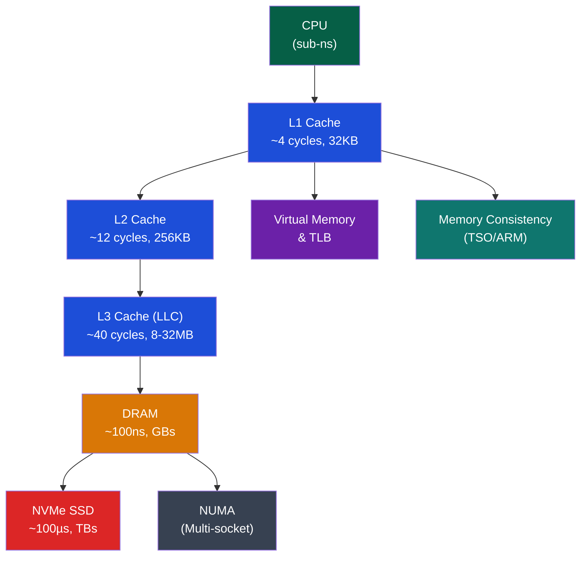

# 🗄️ Memory Systems — Section MOC

> [!abstract] Section Overview
> Memory systems bridge the gap between fast CPUs (sub-nanosecond) and slow DRAM (tens of nanoseconds) and even slower storage (microseconds). This section covers the cache hierarchy (L1/L2/L3 design, AMAT formula, replacement policies), DRAM internals (1T1C cell, timing, rowhammer), virtual memory (page tables, TLB, huge pages, Meltdown/Spectre), memory consistency models (sequential consistency vs TSO vs relaxed), and NUMA (non-uniform memory access in multi-socket systems).

---

## Concept Map

---

## Learning Path

1. [[Cache_Hierarchy]] — Three C's, AMAT, associativity, replacement, write policies
2. [[DRAM_Architecture]] — 1T1C cell, timing, DDR4/5, rowhammer, ECC
3. [[Virtual_Memory_and_TLB]] — Page tables, TLB, huge pages, Meltdown/Spectre
4. [[Memory_Consistency_Models]] — SC, TSO, ARM relaxed, C++11 atomics
5. [[NUMA_and_Memory_Bandwidth]] — NUMA topology, latency gap, numactl, HBM

---

## All Notes

| Note | Key Concepts | Difficulty |
|------|-------------|------------|
| [[Cache_Hierarchy]] | AMAT=Ht+MR×MP recursive, 3Cs, LRU, write-back | Intermediate |
| [[DRAM_Architecture]] | 1T1C, tRCD/tCL/tRP, DDR4/5, rowhammer, SECDED | Intermediate |
| [[Virtual_Memory_and_TLB]] | 4-level PT, ASID, huge pages, KPTI, Spectre | Advanced |
| [[Memory_Consistency_Models]] | SC vs TSO store-buffer, acquire/release, mfence | Advanced |
| [[NUMA_and_Memory_Bandwidth]] | Local vs remote 2-4×, first-touch, numactl, HBM | Advanced |

---

## Key Latency Numbers

| Level | Latency | Bandwidth |
|-------|---------|-----------|
| L1 cache (hit) | ~4 cycles / 1 ns | ~1 TB/s |
| L2 cache (hit) | ~12 cycles / 3 ns | ~400 GB/s |
| L3 cache (hit) | ~40 cycles / 10 ns | ~200 GB/s |
| DRAM (local) | ~100 ns | ~50 GB/s |
| DRAM (NUMA remote) | ~200-400 ns | ~25 GB/s |
| NVMe SSD | ~100 µs | ~7 GB/s |
| HDD | ~5-10 ms | ~200 MB/s |

---

## Related Sections

- [[_MOC_Computer_Architecture_Master|↑ Master MOC]]
- [[../02_CPU_Architecture/_MOC_CPU_Architecture|← CPU Architecture]] — Pipeline stalls when cache misses
- [[../04_IO_Systems/_MOC_IO_Systems|→ I/O Systems]] — DMA coherency with cache
- [[../06_Parallel_Computing/_MOC_Parallel_Computing|→ Parallel Computing]] — Cache coherence across cores

#Computer_Architecture #Memory_Systems #MOC
