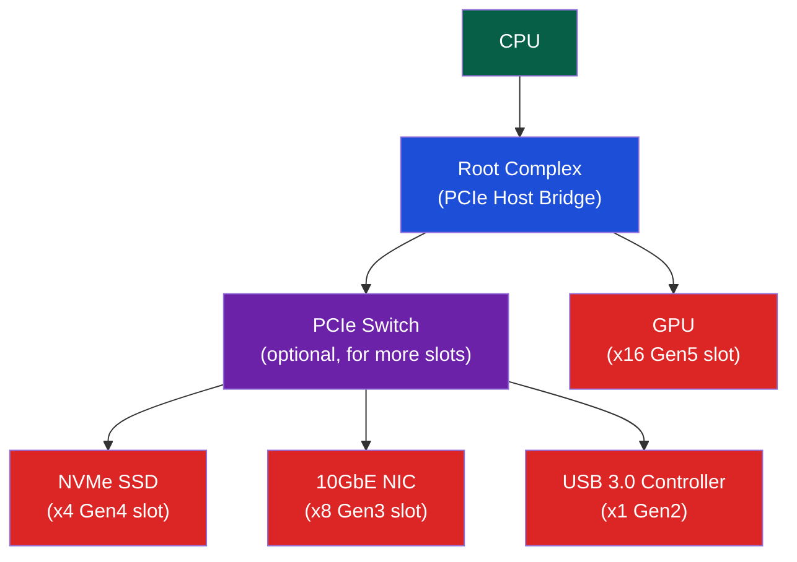

# 🔌 Bus Architectures and PCIe

> [!abstract] TL;DR
> Modern buses are serial point-to-point links rather than shared parallel buses. PCIe uses lanes (1 lane = 4 wires: TX+, TX−, RX+, RX−), with bandwidth scaling linearly: Gen3 ≈ 1 GB/s/lane, Gen5 ≈ 4 GB/s/lane (x16 ≈ 63 GB/s). PCIe packets have three layers: TLP (Transaction Layer Packet — actual data/config), DLLP (Data Link Layer — ACK/NAK, flow control), and Physical (PLP, 8b/10b or 128b/130b encoding). Device registers are accessed via BAR (Base Address Register) — physical addresses assigned by BIOS/OS and mapped into MMIO space. USB uses a host-controller topology; I2C uses open-drain with address-based arbitration; SPI is full-duplex with CPOL/CPHA phase settings.

## Intuition — analogy FIRST

PCIe is like a dedicated fiber-optic cable between your CPU and a device — private, high-speed, in both directions simultaneously (full-duplex). Old parallel buses (PCI, ISA) were like a shared party phone line: everyone waited for others to finish. PCIe's switch hierarchy is like a telephone switch: each device gets a dedicated connection to the switch, which routes packets to the correct destination.

---

## How It Works

### PCIe Architecture



### PCIe Generations

| Gen | Year | Encoding | Bandwidth/Lane | x16 Total |
|-----|------|----------|---------------|-----------|
| 1.0 | 2003 | 8b/10b | 0.25 GB/s | 4 GB/s |
| 2.0 | 2007 | 8b/10b | 0.5 GB/s | 8 GB/s |
| 3.0 | 2010 | 128b/130b | 1 GB/s | 16 GB/s |
| 4.0 | 2017 | 128b/130b | 2 GB/s | 32 GB/s |
| 5.0 | 2019 | 128b/130b | 4 GB/s | 63 GB/s |
| 6.0 | 2022 | PAM4+FEC | 8 GB/s | 126 GB/s |

**8b/10b encoding**: 8 data bits encoded as 10 wire bits (20% overhead). Ensures balanced DC (equal 0s and 1s) and embedded clock.
**128b/130b encoding**: 128 data bits + 2 overhead bits (1.5% overhead) — used from Gen3 onwards.

### PCIe Packet Structure

Three-layer packet model:

```
Application (Software)
       ↕
Transaction Layer Packet (TLP)    — actual data/commands
       ↕
Data Link Layer Packet (DLLP)     — reliability/flow control
       ↕
Physical Layer Packet (PLP)       — scrambling, encoding, framing
       ↕
Physical Wire (lane × differential pairs)
```

**TLP Types**:
| TLP Type | Purpose |
|----------|---------|
| MRd (Memory Read) | Read from device or system memory |
| MWr (Memory Write) | Write to device or system memory |
| CfgRd/CfgWr | Configuration space read/write |
| Cpl/CplD | Completion (response to read request) |
| Msg | Messages (interrupts via MSI/MSI-X) |

**DLLP Types**: Ack/Nak (retry), Flow Control (FC) credits (receiver tells sender how many TLPs it can accept)

### BAR (Base Address Registers)

Each PCIe device has up to 6 BARs (in PCI config space offset 0x10–0x24):

```
BIOS/OS enumeration:
1. Write all-1s to BAR → device returns size mask
2. Compute size: size = ~(mask & ~0xF) + 1
3. Assign a free physical address to BAR
4. Configure IOMMU to allow device access to that address
5. BAR address is now the device's MMIO window base

Driver:
void __iomem *bar = ioremap(pci_resource_start(pdev, 0),
                            pci_resource_len(pdev, 0));
u32 reg = readl(bar + REG_OFFSET);
```

### PCIe Configuration Space

```
Offset 0x00: Vendor ID (16-bit) + Device ID (16-bit)
Offset 0x04: Command + Status
Offset 0x08: Class Code + Revision
Offset 0x10: BAR0 (Base Address Register 0)
...
Offset 0x24: BAR5
Offset 0x3C: Interrupt Line + Interrupt Pin
Extended config space: 0x100–0xFFF (PCIe capabilities)
```

`lspci -vv` dumps config space for all devices.

### USB — Host Controller Topology

USB is a tiered-star topology (not a true bus — all traffic goes through host controller):

```
Host Controller (EHCI/xHCI)
  └── Root Hub (built-in to host)
       ├── USB Hub (external)
       │    ├── Keyboard (Low-Speed 1.5 Mb/s)
       │    └── Mouse (Low-Speed)
       ├── USB 3.0 Flash Drive (SuperSpeed 5 Gb/s)
       └── USB Webcam (HighSpeed 480 Mb/s)
```

| USB Version | Max Speed | Name |
|-------------|-----------|------|
| USB 1.1 | 12 Mb/s | Full-Speed |
| USB 2.0 | 480 Mb/s | High-Speed |
| USB 3.0 | 5 Gb/s | SuperSpeed |
| USB 3.1 Gen2 | 10 Gb/s | SuperSpeed+ |
| USB 3.2 Gen2×2 | 20 Gb/s | SuperSpeed+ (2 lanes) |
| USB4 Gen3×2 | 40 Gb/s | USB4 40Gbps |

xHCI (eXtensible Host Controller Interface) supports all USB speeds in a single controller.

### I2C — Inter-Integrated Circuit

I2C is a two-wire serial bus (SDA = data, SCL = clock):
- **Open-drain**: outputs only pull low (0); high (1) requires pull-up resistor
- **Multi-master**: any master can initiate; arbitration by monitoring SDA
- **7-bit address**: 128 devices on one bus (10-bit addressing: 1024 devices)
- Speeds: Standard 100 kHz, Fast 400 kHz, Fast+ 1 MHz, High-speed 3.4 MHz

```
I2C transaction (read):
[START][7-bit address][R/W=0][ACK][8-bit reg addr][ACK][REPEATED START]
[7-bit address][R/W=1][ACK][8-bit data][ACK/NAK][STOP]
```

### SPI — Serial Peripheral Interface

SPI is a 4-wire full-duplex bus: SCLK (clock), MOSI (master out, slave in), MISO (master in, slave out), CS/SS (chip select, active-low).

**CPOL/CPHA modes**:
| Mode | CPOL | CPHA | Clock idle | Data sampled |
|------|------|------|-----------|-------------|
| 0 | 0 | 0 | Low | Rising edge |
| 1 | 0 | 1 | Low | Falling edge |
| 2 | 1 | 0 | High | Falling edge |
| 3 | 1 | 1 | High | Rising edge |

SPI can run at 100+ MHz (vs I2C's 3.4 MHz max) — used for SPI flash, ADCs, display controllers.

---

## Real-World Notes

- NVMe over PCIe Gen4 x4 in Samsung 990 Pro: ~7 GB/s sequential read — near the theoretical max of 8 GB/s for Gen4 x4
- PCIe bifurcation: a x16 slot can be split into x8+x8 or x4+x4+x4+x4 for multiple devices
- Thunderbolt 4 = USB4 + PCIe tunneling (4× PCIe Gen3 lanes) — allows external GPU docks
- `lspci -tv` shows PCIe tree; `lspci -vv | grep -i bandwidth` shows negotiated link speed/width

---

## Common Pitfalls

1. **PCIe lane count ≠ physical slot size** — An x16 slot can run at x4 electrically. Check with `lspci -vv | grep "LnkSta"` for actual vs max link width
2. **BAR size alignment** — BARs must be naturally aligned to their size. A 4MB BAR must start at a 4MB-aligned address — OS handles this, but manual MMIO remapping must respect it
3. **I2C address conflicts** — Many sensors share the same 7-bit I2C address. Check datasheet for address pins (A0/A1/A2) that shift the address; max 8 identical devices
4. **SPI CS polarity** — CS is active-low by default; some devices use active-high. Wrong polarity = device never selected
5. **PCIe power limits** — x16 slot: 75W max from slot. GPU draws 300-600W via PCIe power connectors (6-pin = 75W, 8-pin = 150W). Oversizing can trigger PSU protection

---

## Related Concepts

- [[_MOC_IO_Systems|↑ I/O Systems MOC]]
- [[Interrupts_and_DMA]] — PCIe devices deliver interrupts via MSI/MSI-X TLPs
- [[Storage_Interfaces_NVMe_SATA]] — NVMe connects via PCIe
- [[Memory_Mapped_IO]] — BAR-mapped registers accessed via MMIO

---

## Review Questions

1. Calculate the effective payload bandwidth of PCIe Gen3 x16 accounting for 128b/130b encoding overhead and TLP header overhead (24-byte header, 4096-byte max payload). How close to 16 GB/s theoretical maximum does it get?
2. An I2C bus has 12 devices with 10kΩ pull-up resistors and capacitance of 100pF. At 400kHz, what is the maximum safe pull-up resistor value given the RC time constant constraint?
3. Explain why PCIe uses differential signaling (TX+/TX−) instead of single-ended, and what common-mode noise rejection advantage this provides.

---

## Sources

- PCI Express Base Specification Revision 5.0, PCI-SIG
- USB 3.2 Specification, USB-IF
- Weste & Harris, *CMOS VLSI Design*, PCIe chapter
- NXP UM10204 "I2C-bus specification"

#Computer_Architecture #IO_Systems #PCIe #Bus
