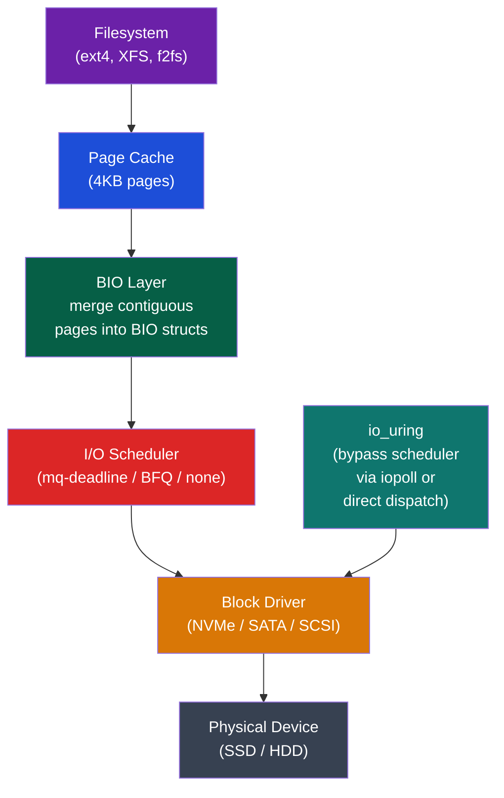
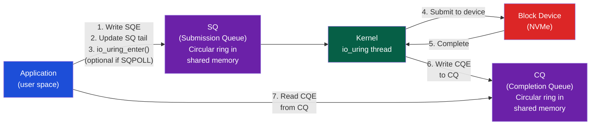

# 📋 I/O Scheduling and io_uring

> [!abstract] TL;DR
> Linux block I/O layer sits between filesystems and block devices, providing request merging, scheduling, and device-specific dispatch. The block layer uses BIO (Block I/O) structures; schedulers (mq-deadline, BFQ, none) order requests for fairness and latency. `mq-deadline` has low overhead with read-priority and deadline enforcement; BFQ provides per-process fairness; `none` (passthrough) is best for NVMe with internal queuing. `io_uring` (Linux 5.1+) provides a kernel-bypass-capable async I/O interface using two lock-free rings (SQ = submission, CQ = completion) in shared memory, enabling zero-copy, zero-syscall submission at high IOPS.

## Intuition — analogy FIRST

The I/O scheduler is like a hospital triage system: incoming requests (patients) are prioritized by urgency (deadlines), grouped by proximity (merge sequential I/O), and dispatched to the device efficiently. BFQ is like a fair triage that ensures no one waits indefinitely. `io_uring` skips triage entirely for known-healthy patients — they go straight to the treatment room (device), eliminating the overhead of the waiting room.

---

## How It Works

### Linux Block I/O Stack



### BIO Structure

```c
struct bio {
    struct block_device *bi_bdev;  // target device
    sector_t             bi_sector; // starting sector
    unsigned int         bi_size;   // bytes remaining
    struct bio_vec       bi_io_vec[]; // scatter-gather list of pages
    bio_end_io_t        *bi_end_io; // completion callback
    void                *bi_private; // caller data
};

struct bio_vec {
    struct page *bv_page;    // physical page
    unsigned int bv_offset;  // offset in page
    unsigned int bv_len;     // length
};
```

Multiple BIO requests for adjacent sectors are **merged** by the block layer (elevator merging): `bdev.merge_bvec_fn` decides if two BIOs can merge.

### I/O Schedulers

**Check/change scheduler**:
```bash
cat /sys/block/nvme0n1/queue/scheduler
# [none] mq-deadline bfq

echo mq-deadline > /sys/block/nvme0n1/queue/scheduler
```

| Scheduler | Best For | Algorithm | Key Properties |
|-----------|----------|-----------|----------------|
| `none` (noop) | NVMe SSDs | No reordering | Lowest overhead; device handles ordering |
| `mq-deadline` | SATA SSD, mixed | Separate read/write queues with deadlines | Read priority, prevents starvation |
| `bfq` | Desktop/laptop | Virtual time fair queuing | Per-process fairness, low latency for interactive |
| `kyber` | NVMe, low-latency | Target latency for read/write separately | Admission control based on latency targets |

**mq-deadline parameters**:
```bash
# Default read deadline 500ms, write deadline 5s
cat /sys/block/sda/queue/iosched/read_expire   # 500ms
cat /sys/block/sda/queue/iosched/write_expire  # 5000ms

# Reads always dispatched before writes when at deadline
cat /sys/block/sda/queue/iosched/writes_starved  # 2 (max writes ahead of reads)
```

**BFQ (Budget Fair Queuing)**:
- Assigns I/O time budgets per process
- Interactive processes (small, random I/O) get priority (short response time guarantee)
- Background processes (large sequential I/O) get remaining budget
- Used by default on laptop/desktop Linux kernels

### io_uring — Modern Async I/O

**Problem with traditional async I/O (libaio)**:
- `io_submit()` syscall per batch → overhead even with batching
- `io_getevents()` syscall to poll completions
- Multiple kernel/user transitions → high latency at >100K IOPS

**io_uring design** (Axboe, 2019):



**Key io_uring features**:

| Feature | Benefit |
|---------|---------|
| Shared memory rings | No copy between user/kernel for queue management |
| `IORING_SETUP_SQPOLL` | Kernel thread polls SQ continuously — zero syscalls at high IOPS |
| `IORING_SETUP_IOPOLL` | Poll CQ instead of interrupt — ~20µs vs ~100µs for NVMe |
| Fixed buffers (`IORING_REGISTER_BUFFERS`) | Register buffers once, reuse without `mmap` per I/O |
| Fixed files (`IORING_REGISTER_FILES`) | Register fds once, use file indices instead of fd lookups |
| Linked requests (`IOSQE_IO_LINK`) | Chain dependent operations without application intervention |
| Multishot | Accept/receive in loop with single submission |

**Minimal io_uring example**:
```c
#include <liburing.h>

struct io_uring ring;
io_uring_queue_init(256, &ring, 0);  // 256-entry SQ/CQ

// Submit a read
struct io_uring_sqe *sqe = io_uring_get_sqe(&ring);
io_uring_prep_read(sqe, fd, buf, sizeof(buf), offset);
sqe->user_data = 42;  // tag for completion

io_uring_submit(&ring);  // one syscall for whole batch

// Wait for completion
struct io_uring_cqe *cqe;
io_uring_wait_cqe(&ring, &cqe);
printf("Result: %d\n", cqe->res);
io_uring_cqe_seen(&ring, cqe);  // advance CQ head

io_uring_queue_exit(&ring);
```

**SQPOLL mode** (zero-syscall):
```c
struct io_uring_params params = {
    .flags = IORING_SETUP_SQPOLL,
    .sq_thread_idle = 2000,  // 2ms idle before sleeping
};
io_uring_queue_init_params(256, &ring, &params);
// Now just write SQE and update tail — no syscall needed!
// Kernel polling thread notices and submits
```

### io_uring vs Other Async APIs

| API | Syscalls/op | Zero-copy | Linked ops | Vectored | Best for |
|-----|------------|-----------|------------|----------|---------|
| read/write (blocking) | 1 per I/O | No | No | No | Simple I/O |
| epoll + read | 2 per I/O | No | No | No | Network |
| libaio | 1 per batch | Partial | No | Yes | Old async |
| io_uring | 0–1 per batch | Yes (fixed buf) | Yes | Yes | High IOPS |

---

## Real-World Notes

- `io_uring` is used by: io_uring-enabled Nginx, Tokio (Rust async runtime with io-uring backend), liburing (C), Java's JEP 380 (Unix domain sockets), PostgreSQL (in development for direct I/O)
- For NVMe SSDs: `scheduler=none` + io_uring with IOPOLL can achieve 1M+ IOPS/core on single NVMe
- `fio --ioengine=io_uring --iodepth=128 --numjobs=4` is the standard benchmark for io_uring performance
- io_uring vulnerabilities: several CVEs found (2022–2023) — often disabled in highly secure environments (gVisor, seccomp filters). Linux 5.16+ added `IORING_SETUP_SINGLE_ISSUER` for tighter isolation

---

## Common Pitfalls

1. **SQ/CQ ring overflow** — If CQ fills (application not draining), new completions are dropped (with `IORING_SETUP_CQ_NODROP` flag, submission blocks instead). Always drain CQ promptly
2. **Fixed buffer invalidation** — Modifying a registered buffer after submitting an I/O that uses it causes data corruption. Buffer must not be touched until CQE arrives
3. **Mixing SQPOLL and blocking I/O** — Mixing SQPOLL (kernel thread) and user-submitted I/O on same ring causes ordering issues. Use separate rings if mixing modes
4. **BFQ and NVMe** — BFQ was designed for rotating media (HDD); applying it to NVMe can actually hurt performance by serializing what the SSD could handle in parallel. Use `none` or `mq-deadline` for NVMe
5. **Linked request failure** — If a linked SQE fails (e.g., partial read), subsequent linked SQEs are cancelled with `-ECANCELED`. Always check `cqe->res` for each step

---

## Related Concepts

- [[_MOC_IO_Systems|↑ I/O Systems MOC]]
- [[Storage_Interfaces_NVMe_SATA]] — NVMe's multi-queue design pairs with io_uring's queue model
- [[Interrupts_and_DMA]] — io_uring IOPOLL replaces interrupt-driven completions with polling
- [[Memory_Mapped_IO]] — io_uring uses `mmap`-ed shared memory rings between user and kernel

---

## Review Questions

1. Compare the syscall overhead of processing 1000 read operations using: (a) blocking `read()`, (b) `libaio` with batch=128, (c) `io_uring` with SQPOLL. Estimate syscall count for each.
2. Why does `mq-deadline` give read operations priority over write operations, and how does this benefit interactive applications on a database server?
3. Design an io_uring-based file copy program that chains: open → read → write → close using linked SQEs. Draw the SQE/CQE timeline.

---

## Sources

- Axboe, J. "Efficient IO with io_uring" (2019), kernel.dk/io_uring.pdf
- Linux kernel documentation: Documentation/block/bfq-iosched.rst
- Corbet, J. "The rapid growth of io_uring", LWN.net (2020)

#Computer_Architecture #IO_Systems #IO_Scheduling #io_uring
