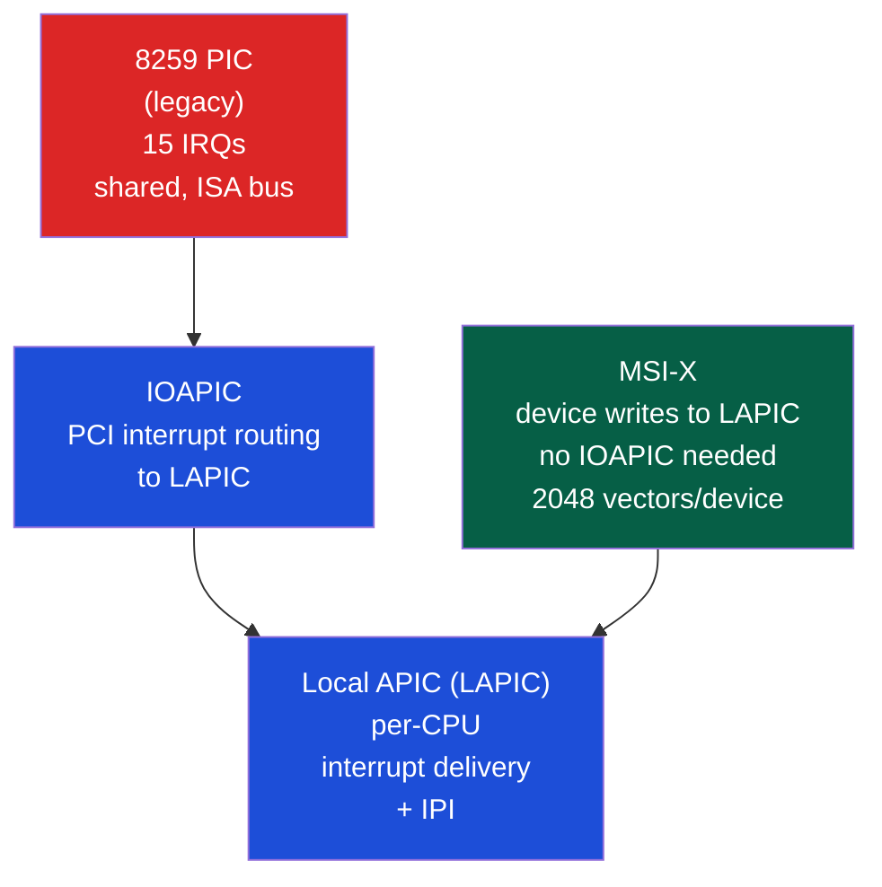
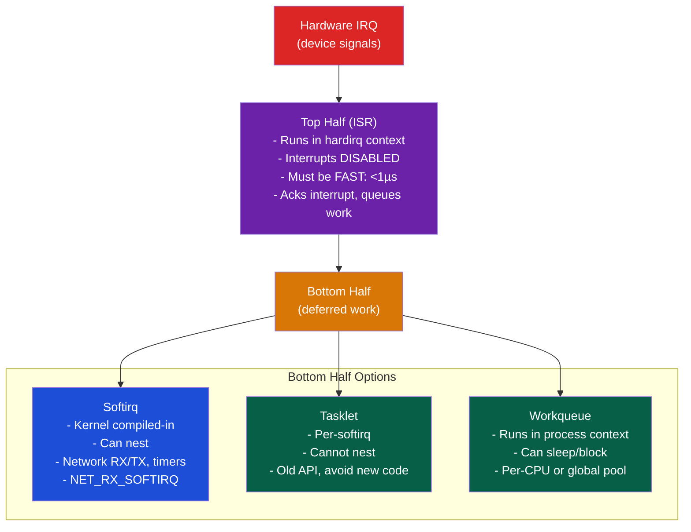
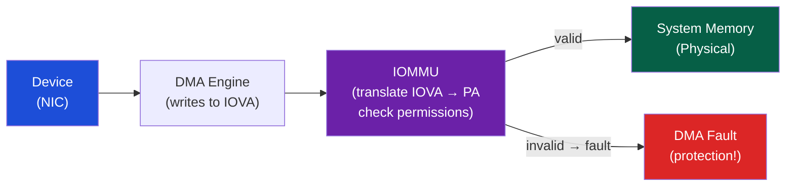

# ⚡ Interrupts and DMA

> [!abstract] TL;DR
> Interrupts allow devices to signal the CPU asynchronously without busy-polling. The IDT (Interrupt Descriptor Table, 256 entries) maps interrupt vectors to handler functions. Modern systems use APIC (Advanced PIC) for routing: IOAPIC converts PCI INTx to vectors, MSI-X allows devices to write directly to LAPIC (bypassing IOAPIC). Linux interrupt handling is split: top-half (ISR, minimal, hardirq context) and bottom-half (softirqs/tasklets/workqueues, deferrable work). DMA (Direct Memory Access) transfers data between device and memory without CPU involvement; scatter-gather DMA uses DMA descriptors for non-contiguous buffers. IOMMU (VT-d/AMD-Vi) enforces that devices can only DMA to their allocated regions, preventing DMA-based privilege escalation.

## Intuition — analogy FIRST

An interrupt is like a doorbell — you don't stand at the door watching for visitors (polling); instead you work on something else and the doorbell alerts you when someone arrives. The ISR (top-half) is like glancing at the door to see who it is quickly; the bottom-half is like actually dealing with them (which might take longer). DMA is like a delivery service — instead of you walking to the truck to carry packages one by one (PIO), the delivery person puts packages directly into your garage (DMA) while you work on something else.

---

## How It Works

### Interrupt Controller Evolution



### IDT — Interrupt Descriptor Table

```
IDT[0–31]:   CPU exceptions (divide-by-zero, page fault, GPF, etc.)
IDT[32–47]:  Hardware interrupts (PIC IRQ0-IRQ15 mapped to 32-47)
IDT[48–254]: Software/device interrupts
IDT[128]:    Linux syscall gate (int 0x80 on x86-32)
```

Each IDT entry = 16-byte gate descriptor:
- Segment selector + offset of handler function
- DPL (Descriptor Privilege Level): 0=kernel only, 3=user-callable
- Gate type: interrupt gate (IF cleared), trap gate (IF preserved)

`IDTR` register holds base address + limit of IDT.

### MSI vs MSI-X

**Legacy PCI INTx (line-based interrupts)**:
- Shared lines: multiple devices share IRQ → spurious interrupts, slow
- Level-triggered: device holds line until serviced

**MSI (Message Signaled Interrupts)**:
- Device writes a specific value to a specific address (LAPIC's ICR register)
- No wires, no sharing — up to 32 vectors per device
- Edge-triggered (write occurs once)

**MSI-X (MSI Extended)**:
- Up to 2048 vectors per device
- Each vector has own address + data (stored in device's MSI-X table in BAR)
- Different vectors routed to different CPU cores → interrupt affinity

```
MSI-X table (in device BAR):
┌──────────────────┬────────────────┬───────┐
│ Message Address  │ Message Data   │ Ctrl  │
│ (LAPIC address)  │ (vector number)│       │
└──────────────────┴────────────────┴───────┘
```

Linux: `cat /proc/interrupts` shows IRQ assignments per CPU core.

### Linux Interrupt Handling — Top/Bottom Half



**NAPI (New API)** for high-speed networking:
```
1. First packet arrives → interrupt fires
2. ISR: disable further interrupts for this NIC, schedule NAPI poll
3. Softirq: poll() called → drain RX ring (up to budget=64 packets)
4. If ring empty: re-enable interrupts
5. If budget exhausted: yield, re-schedule poll
```
NAPI reduces interrupt rate from per-packet to per-burst at high load.

### DMA — Direct Memory Access

Without DMA (PIO — Programmed I/O):
```
for each 4-byte word in transfer:
    CPU reads from device register → writes to memory (very slow)
```

With DMA:
```
CPU: program DMA controller (source addr, dest addr, length)
DMA controller: transfers data autonomously over bus
DMA controller: signals CPU via interrupt when done
CPU: process the data (now all in memory)
```

**DMA Descriptor Ring** (common pattern):
```c
struct dma_desc {
    uint64_t buf_addr;   // physical address of buffer
    uint32_t len;        // transfer length
    uint32_t flags;      // EOP (end of packet), writeback, etc.
};

// Producer: CPU writes new descriptors to ring
// Consumer: DMA controller reads descriptors, transfers data
```

**Scatter-Gather DMA**: Transfer to/from non-contiguous memory regions using a list of (addr, len) pairs:

```c
struct scatterlist sg[4];
sg_set_buf(&sg[0], buf0, len0);  // first fragment
sg_set_buf(&sg[1], buf1, len1);  // second fragment
sg_set_buf(&sg[2], buf2, len2);  // third fragment

dma_map_sg(dev, sg, 4, DMA_FROM_DEVICE);  // map physical addresses
// DMA controller fetches sg list and reads/writes each fragment
dma_unmap_sg(dev, sg, 4, DMA_FROM_DEVICE);
```

### IOMMU — I/O Memory Management Unit

IOMMU (Intel VT-d / AMD-Vi) is like a MMU for DMA:
- Creates I/O virtual addresses (IOVA) for each device
- Maps IOVA → physical address with per-device page tables
- Enforces that devices can only access their allocated regions



**DMA without IOMMU security**: A compromised PCIe device (e.g., Thunderbolt DMA attack) could DMA anywhere in physical memory, gaining kernel-level access.

**IOMMU with VFIO (device passthrough)**: QEMU/KVM uses IOMMU to safely pass PCIe devices directly to VMs without compromising host security.

---

## Real-World Notes

- `cat /proc/interrupts` shows per-CPU interrupt counts; high imbalance suggests need for `irqbalance` or manual affinity setting (`/proc/irq/N/smp_affinity`)
- Intel DMA Remapping (VT-d) is required for Thunderbolt security (Kernel DMA Protection)
- `dmesg | grep -i "iommu"` shows if IOMMU is active; `intel_iommu=on` kernel parameter enables it
- Interrupt coalescing (ITR — interrupt throttle rate): NVMe and NIC firmware batches multiple completions into one interrupt to reduce interrupt overhead at high IOPS

---

## Common Pitfalls

1. **Sleeping in IRQ handler** — Top-half runs with interrupts disabled; any sleep (mutex_lock, kmalloc with GFP_KERNEL) causes a deadlock or BUG. Always defer blocking work to workqueue
2. **DMA mapping direction** — `dma_map_single(dev, buf, len, DMA_TO_DEVICE)` flushes cache for CPU→device; `DMA_FROM_DEVICE` invalidates cache for device→CPU. Wrong direction = stale data
3. **Double-free of DMA mapping** — `dma_unmap` must be called exactly once per `dma_map`. Missing unmap = resource leak; double unmap = corruption
4. **MSI-X table in BAR** — The MSI-X table must be in a BAR region that is mapped; accessing it before `pci_enable_msix_range()` crashes
5. **IRQ affinity and NUMA** — Setting IRQ affinity to CPUs on a different NUMA node from the device's DMA memory → extra latency. Use `set_irq_affinity_hint()` to pin IRQ to same NUMA node

---

## Related Concepts

- [[_MOC_IO_Systems|↑ I/O Systems MOC]]
- [[Bus_Architectures_PCIe]] — MSI-X interrupts travel as PCIe TLP messages
- [[Memory_Mapped_IO]] — DMA coherency requires cache management
- [[IO_Scheduling_and_io_uring]] — io_uring uses DMA descriptors for async I/O
- [[../03_Memory_Systems/Cache_Hierarchy|Cache Hierarchy]] — DMA bypasses CPU cache by default (non-coherent DMA)

---

## Review Questions

1. Explain why MSI-X eliminates the "spurious interrupt" problem that affects legacy shared-IRQ PCI. What mechanism does MSI-X use instead of a wire?
2. A NIC generates 1M interrupts/second at 10 Gbps line rate (64-byte packets). Calculate the interrupt overhead assuming each ISR costs 1µs. How does NAPI reduce this, and what is the overhead with budget=64?
3. An attacker connects a malicious PCIe device to a system without IOMMU. Explain the DMA attack that could lead to kernel compromise, and why IOMMU prevents it.

---

## Sources

- Linux kernel documentation: Documentation/core-api/dma-api.rst
- Intel 64 and IA-32 Architectures Software Developer's Manual, Vol 3A Ch. 10 (APIC)
- Corbet, J. et al. *Linux Device Drivers*, 3rd ed., Chapters 10 (Interrupt Handling), 15 (Memory Mapping and DMA)

#Computer_Architecture #IO_Systems #Interrupts #DMA #APIC
