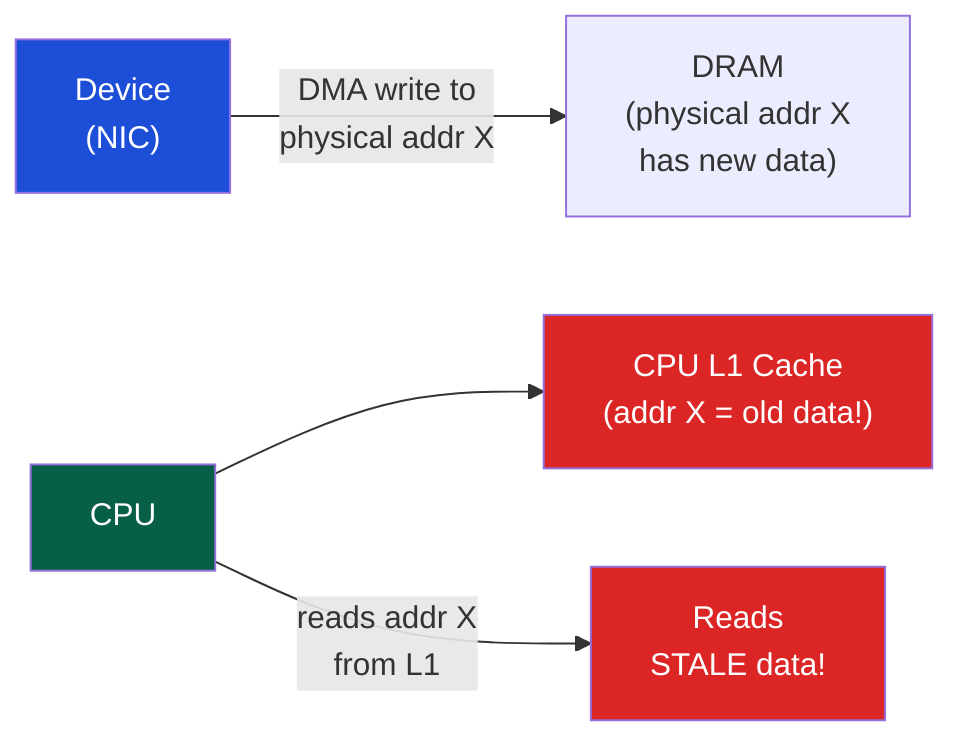

# 🗺️ Memory-Mapped I/O (MMIO)

> [!abstract] TL;DR
> Memory-Mapped I/O (MMIO) maps device registers into the CPU's physical address space, allowing software to read/write device state using ordinary load/store instructions. On x86, `ioremap()` maps the physical BAR address to a virtual kernel address; the resulting pointer must be accessed only via `readl()`/`writel()` (not raw pointer dereference) to ensure proper ordering and non-cached access. The C `volatile` qualifier prevents compiler optimization but does not enforce CPU memory ordering — use memory barriers (`mb()`, `wmb()`, `rmb()`) for ordering guarantees. DMA coherence: CPU cache and device memory must agree — coherent DMA (uses non-cacheable mappings or cache-flushed on every access) vs streaming DMA (explicit cache sync via `dma_sync_for_device()`/`dma_sync_for_cpu()`). Device discovery uses Device Tree (ARM/RISC-V embedded) or ACPI (x86 servers).

## Intuition — analogy FIRST

MMIO is like a special mailbox at a specific street address (physical address): writing to it sends a letter to the device, reading from it retrieves the device's current status. `ioremap()` is like giving that street address a memorable name in your address book (virtual address). `volatile` is like telling your assistant "never assume you already know what's in that mailbox — always check it again." DMA coherence is like ensuring that the mailbox and your filing cabinet (CPU cache) always agree on the contents.

---

## How It Works

### MMIO vs Port I/O (x86)

| Access Method | Mechanism | Range | Instructions |
|--------------|-----------|-------|-------------|
| MMIO | Physical address space | 0 to 2^52 physical | mov, ld, st (ordinary) |
| Port I/O (x86 only) | Separate I/O address space | 0x0000–0xFFFF (64K) | `in`, `out`, `ins`, `outs` |

Modern devices almost exclusively use MMIO. Port I/O is only used for legacy PC devices (COM ports, parallel ports, PIC).

### Physical Address Map

```
x86-64 Physical Address Space:
0x0000_0000 – 0x000F_FFFF: Legacy 1MB RAM (BIOS, VGA buffer)
0x0010_0000 – 0xBFFF_FFFF: Main DRAM
0xC000_0000 – 0xDFFF_FFFF: PCI MMIO low (32-bit BARs)
0xE000_0000 – 0xFEBF_FFFF: More PCI MMIO / APIC
0xFEC0_0000:               IOAPIC base
0xFEE0_0000:               Local APIC base
0x1_0000_0000 – ...:       Main DRAM continuation (above 4GB)
                           PCIe 64-bit BARs (above 4GB)
```

### ioremap — Kernel MMIO Mapping

```c
// Include
#include <asm/io.h>

// Map device physical address to virtual kernel address
void __iomem *regs = ioremap(bar_phys_addr, bar_size);

// Read/write device registers (use accessor functions!)
uint32_t status = readl(regs + STATUS_REG_OFFSET);
writel(1, regs + CTRL_REG_OFFSET);      // write 1 to control reg

// Explicitly ordered writes
writel(cmd, regs + CMD_REG);
wmb();                                  // ensure write reaches device
writel(doorbell, regs + DOORBELL_REG); // doorbell after cmd

// Cleanup
iounmap(regs);
```

`readl()`/`writel()` are NOT simple pointer dereferences. They:
1. Use the `__iomem` annotated pointer (Sparse checker verifies)
2. May include architecture-specific ordering barriers
3. Are non-cacheable (ioremap uses UC or WC memory types by default)

### volatile in C — What It Does (and Doesn't)

```c
// WRONG: plain pointer, compiler may cache in register
uint32_t *reg = (uint32_t *)bar_addr;
while (*reg == 0) {}  // compiler may hoist: if (*reg == 0) while (1) {}

// CORRECT: volatile, compiler re-reads every access
volatile uint32_t *reg = (volatile uint32_t *)bar_addr;
while (*reg == 0) {}  // compiler generates a load every iteration

// STILL WRONG for device drivers: use ioremap + readl/writel
// volatile doesn't prevent CPU reordering (store-load reordering, etc.)
```

**volatile prevents**:
- Compiler caching a register read (removes the memory access entirely)
- Compiler combining multiple reads into one
- Compiler removing "dead" writes to device registers

**volatile does NOT prevent**:
- CPU memory reordering (write-combining buffer, store buffer)
- DMA cache coherence issues

**In Linux drivers**: Always use `readl()`/`writel()` + `mb()` rather than raw `volatile`.

### DMA Coherence

When a device does DMA, it writes directly to physical memory. If the CPU has that region in its cache, the cache has stale data:



**Two DMA coherence models**:

**1. Coherent DMA** (consistent DMA):
- Memory is mapped non-cacheable (UC = Uncacheable)
- CPU and device always see the same data — no explicit flush needed
- Slower: every CPU access goes to DRAM
```c
// Allocate coherent DMA buffer (mapped UC)
void *buf = dma_alloc_coherent(dev, size, &dma_handle, GFP_KERNEL);
// buf is safe to access by both CPU and device without flushing
dma_free_coherent(dev, size, buf, dma_handle);
```

**2. Streaming DMA** (one-direction):
- Memory can be cached; explicit sync operations needed
- Faster for large transfers (sequential read/write benefits from write-combining)
```c
// CPU fills buffer, then hands to device
dma_addr_t dma_handle = dma_map_single(dev, buf, size, DMA_TO_DEVICE);
// → flushes cache for this buffer: CPU writes are flushed to DRAM
// device can now DMA-read correct data

// After device completes DMA:
dma_unmap_single(dev, dma_handle, size, DMA_TO_DEVICE);

// For device→CPU (device writes, CPU reads):
dma_handle = dma_map_single(dev, buf, size, DMA_FROM_DEVICE);
// → invalidates CPU cache for this buffer
// device DMAs data to DRAM
// CPU reads buf (cache-miss → loads from DRAM with fresh data)
dma_unmap_single(dev, dma_handle, size, DMA_FROM_DEVICE);
```

### Device Discovery — Device Tree vs ACPI

**Device Tree (ARM, RISC-V, embedded)**:
- Static description of hardware in DTS (Device Tree Source) → compiled to DTB (binary)
- Passed by bootloader to kernel at boot
- Describes: memory regions, interrupt controllers, clocks, peripherals

```dts
/* arch/arm64/boot/dts/my_board.dts */
/ {
    soc {
        uart0: serial@ff000000 {
            compatible = "snps,dw-apb-uart";
            reg = <0xff000000 0x10000>;    // MMIO base + size
            interrupts = <GIC_SPI 32 IRQ_TYPE_LEVEL_HIGH>;
            clocks = <&apb_clk>;
            status = "okay";
        };
    };
};
```

**ACPI (Advanced Configuration and Power Interface — x86)**:
- Firmware-provided tables (AML bytecode) interpreted by kernel
- Describes: CPU topology, NUMA, PCIe topology, power states, device resources
- Runtime: ACPI methods control power, thermal, hot-plug

| Aspect | Device Tree | ACPI |
|--------|-------------|------|
| Platform | ARM, RISC-V, embedded | x86, ARM servers |
| Format | DTS/DTB text/binary | AML bytecode |
| Provided by | Bootloader (U-Boot) | UEFI Firmware |
| Runtime control | No (static) | Yes (AML interpreter) |
| Driver binding | `compatible` string | ACPI HID/CID |

---

## Real-World Notes

- Write-combining (WC) memory type: used for GPU framebuffers and PCIe BARs. CPU can combine multiple stores into a single burst write — greatly improves write bandwidth to device memory
- `mmap()` with `MAP_FIXED` + `/dev/mem` allows user-space MMIO in Linux (requires `CONFIG_STRICT_DEVMEM=n` and root). Use `uio` (Userspace I/O) framework for safer user-space device drivers
- DPDK (Data Plane Development Kit) uses direct MMIO + polling (no interrupts, no kernel involvement) for 100 Gbps+ packet processing
- VFIO (Virtual Function I/O): safe MMIO passthrough to VMs via IOMMU — allows bare-metal-speed GPU passthrough in QEMU/KVM

---

## Common Pitfalls

1. **Accessing __iomem with raw pointer** — `*(uint32_t*)reg` bypasses ioremap's ordering semantics. Sparse static analyzer reports `__iomem` type mismatch. Always use `readl/writel`
2. **Missing wmb() between writes** — Device registers often have strict ordering requirements (write data before writing doorbell). Missing `wmb()` causes device to see doorbell before data
3. **Freeing coherent DMA before device completes** — `dma_free_coherent()` while device is still DMAsing to the buffer causes data corruption. Always wait for DMA completion (interrupt or polling status) before freeing
4. **DMA direction mismatch** — Using `DMA_TO_DEVICE` for a device-to-CPU transfer skips the cache invalidation. Result: CPU reads stale cached data even after device writes
5. **Device Tree overlays in production** — Dynamic device tree overlays for hot-pluggable hardware (Raspberry Pi HATs) can conflict with existing driver bindings if overlay applies wrong `compatible` strings

---

## Related Concepts

- [[_MOC_IO_Systems|↑ I/O Systems MOC]]
- [[Bus_Architectures_PCIe]] — BARs provide MMIO windows to PCIe devices
- [[Interrupts_and_DMA]] — DMA transfers require coherence; MMIO doorbell rings complete the loop
- [[../03_Memory_Systems/Virtual_Memory_and_TLB|Virtual Memory]] — ioremap creates kernel virtual → physical mappings with special page attributes (UC/WC)
- [[../03_Memory_Systems/Memory_Consistency_Models|Memory Consistency]] — MMIO access ordering is a superset of memory consistency model concerns

---

## Review Questions

1. Explain why a driver must use `wmb()` between writing a DMA descriptor and writing the doorbell register. What CPU optimization does `wmb()` prevent, and which architectures need it?
2. A user-space driver (via /dev/mem) accesses a PCI BAR. What security and correctness risks exist compared to a kernel driver using `ioremap()`?
3. Compare coherent DMA and streaming DMA for a network receive path (device writes 64KB packets to host memory, CPU reads them). Which is better and why? Calculate the cache traffic for each approach with a 32KB L1 cache.

---

## Sources

- Corbet, J. et al. *Linux Device Drivers*, 3rd ed., Ch. 9 (Communicating with Hardware), Ch. 15 (Memory Mapping and DMA)
- Linux kernel documentation: Documentation/driver-api/dma-api.rst, Documentation/devicetree/
- Intel 64 Architecture Memory Types (PAT), SDM Vol 3A, Ch. 11

#Computer_Architecture #IO_Systems #MMIO #DMA_Coherence
