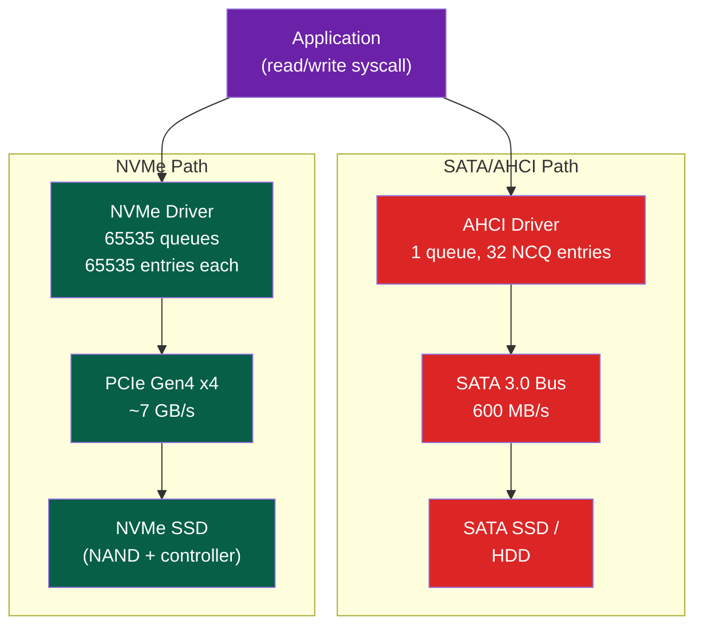

# 💾 Storage Interfaces — NVMe and SATA

> [!abstract] TL;DR
> NVMe (NVM Express) connects SSDs directly via PCIe, bypassing AHCI's single-queue bottleneck: up to 65,535 queues each with 65,535 entries, latency ≈ 100µs. SATA/AHCI has 1 queue with 32 Native Command Queuing (NCQ) entries, latency ≈ 70µs but bandwidth limited to 600 MB/s. NAND flash types: SLC (1 bit/cell, ~100K PE cycles), MLC (2 bit/cell, ~10K cycles), TLC (3 bit/cell, ~3K cycles), QLC (4 bit/cell, ~1K cycles). FTL (Flash Translation Layer) maps logical block addresses (LBAs) to physical pages, manages wear leveling (spread writes evenly), garbage collection (compact and free blocks), and over-provisioning. ZNS (Zoned Namespace) exposes NAND's erase-then-write constraint to the host, eliminating FTL overhead.

## Intuition — analogy FIRST

SATA/AHCI is like a post office with one window and 32 people in line — efficient for HDDs (sequential, one arm). NVMe is like 65,535 separate counters in a large sorting facility — matches the parallelism of flash memory. NAND flash is like a whiteboard that can only be written after being fully erased (by block, 256 pages at a time) — the FTL is the clever assistant that hides this from software using a mapping table and buffering.

---

## How It Works

### Interface Comparison



### NVMe Architecture

NVMe (NVM Express) spec defines a PCIe-attached storage protocol:

**Queue Pairs**: NVMe uses I/O Queue Pairs (SQ = Submission Queue, CQ = Completion Queue):
```
Host Memory:
┌─────────────────────────────────────────────────┐
│ Admin SQ/CQ (for format, firmware, ns mgmt)     │
│ I/O SQ #1: [cmd0][cmd1][cmd2]...                │
│ I/O CQ #1: [cpl0][cpl1][cpl2]...                │
│ I/O SQ #2: [cmd0][cmd1]...  (per CPU core)      │
│ I/O CQ #2: [cpl0][cpl1]...                      │
│ ...up to 65535 pairs...                          │
└─────────────────────────────────────────────────┘
```

**Command flow**:
```
1. CPU writes NVMe command to SQ (16 PRP/SGL pointers for data buffers)
2. CPU writes doorbell register (MMIO) → notifies device
3. NVMe controller reads SQ, executes I/O (DMA from/to host memory)
4. Controller writes completion entry to CQ, asserts MSI-X interrupt
5. Driver reads CQ, processes completion, updates CQ head doorbell
```

NVMe command latency: ~20µs controller + DMA overhead + NAND latency ≈ 100µs total (PCIe Gen4 NVMe).

### SATA and AHCI

SATA (Serial ATA) 3.0 = 6 Gbps raw → 600 MB/s effective.

AHCI (Advanced Host Controller Interface):
- 1 command queue per port, 32 NCQ (Native Command Queuing) slots
- NCQ reorders commands to minimize seek time (for HDDs); for SSDs it provides limited parallelism
- AHCI overhead: register-based HBA (Host Bus Adapter) with PCI-mapped registers

**M.2 form factor** can be either SATA or PCIe/NVMe (check the M2 key type: B key = SATA; M key = PCIe NVMe; B+M key = both).

### NAND Flash Types

| Type | Bits/Cell | Program/Erase Cycles | Read Latency | Cost | Use Case |
|------|-----------|---------------------|-------------|------|----------|
| SLC | 1 | 100,000 | ~25µs | Very High | Enterprise, caching |
| MLC (eMLC) | 2 | 10,000 | ~50µs | High | Enterprise SSDs |
| TLC | 3 | 3,000 | ~100µs | Medium | Consumer SSDs |
| QLC | 4 | 1,000 | ~200µs | Low | Bulk storage |

3D NAND: stacking NAND layers vertically (96–232 layers in current gen) to increase density. Reduces cost/GB but slightly higher latency per layer.

**SLC caching**: Consumer SSDs designate a portion of TLC NAND as SLC mode (1 bit/cell) for burst writes. After cache fills, writes slow to raw TLC speed (~200–500 MB/s vs SLC's ~3 GB/s).

### FTL — Flash Translation Layer

NAND constraints:
1. **Page is the write unit** (4–16 KB per page)
2. **Block is the erase unit** (256–512 pages per block, 1–8 MB per block)
3. **Must erase before write** (erase sets all bits to 1; write can only flip 1→0)
4. **Limited erase cycles** (3K–100K PE cycles per cell)

FTL provides a logical-to-physical mapping layer:

```
Logical Block Address (LBA)  →  FTL mapping table  →  Physical Page Address (PPA)

Write(LBA 100, data):
  1. Find a free page in a partially-written block
  2. Write data to new physical page
  3. Update L2P table: LBA 100 → new PPA
  4. Mark old physical page as stale (invalid)
```

**Garbage Collection (GC)**:
```
When free blocks run low:
1. Select victim block (highest stale page ratio)
2. Copy valid pages to free block
3. Erase victim block → becomes free
4. Update L2P table for moved pages
```

GC causes write amplification (WA):
```
Write Amplification = NAND bytes written / Host bytes written
WA = 1.0 (ideal, sequential) to ~10 (random writes, heavy GC)
```

**Wear Leveling**: Distribute writes across all blocks to even out erase counts. Static wear leveling also moves cold data (rarely written) to heavily-used blocks.

**Over-Provisioning (OP)**: Reserve ~7–28% of NAND capacity (not exposed to host). This buffer absorbs GC activity and allows FTL to maintain write performance.

### ZNS — Zoned Namespace

ZNS exposes NAND's block-level erase constraint to the host:
- Storage divided into **zones** (typically 256MB–2GB each)
- Within a zone: must write sequentially from zone start
- Zone reset: erase the zone (explicit host command)

Benefits:
- Eliminates FTL GC overhead → lower write amplification → better endurance
- Predictable latency (no GC pauses)
- Higher capacity (less over-provisioning needed)

```bash
# Linux ZNS usage with blkzone
blkzone report /dev/nvme0n1    # list zones with state (Empty/Full/Implicitly Open)
blkzone reset /dev/nvme0n1 --offset 0 --count 1  # reset zone 0

# f2fs and ZenFS (RocksDB plugin) support ZNS
mount -t f2fs -o gc_merge /dev/nvme0n1 /mnt/zns
```

---

## Real-World Notes

- Samsung 990 Pro (PCIe Gen4 x4 NVMe): 7.4 GB/s sequential read, ~150µs latency, 1.4M IOPS (4KB random read)
- Consumer vs Datacenter NVMe: enterprise SSDs have power-loss protection (capacitor), larger DRAM cache, higher OP%, and guaranteed 1 DWPD (Drive Writes Per Day) endurance
- `nvme smart-log /dev/nvme0` (nvme-cli) shows temperature, media errors, percentage-used, data-units-read/written
- Modern kernels with `io_uring` + NVMe can achieve ~1M IOPS per CPU core for 4KB random reads

---

## Common Pitfalls

1. **SATA vs NVMe on M.2** — Both use the same physical M.2 connector. Benchmark shows SATA SSD at 550 MB/s, NVMe at 5000 MB/s+ — a massive difference. Always check M.2 key type before purchasing
2. **SLC cache exhaustion** — Burst writes may be fast (3 GB/s), then suddenly drop to 300 MB/s when SLC cache fills. Benchmarks over sustained periods reveal true performance
3. **Write amplification in databases** — Random 4KB writes (database updates) cause high WA. Use larger I/O units or database-level log-structured storage to reduce WA
4. **TRIM/DISCARD** — Without TRIM, SSDs can't tell which blocks are free (from OS perspective). `hdparm -I /dev/sda | grep TRIM` verifies; `fstrim -v /` sends TRIM. Without it, GC overhead increases over time
5. **NVMe namespace misconception** — Multiple NVMe namespaces are like LUNs, not separate physical devices. They share the same NAND and controller resources

---

## Related Concepts

- [[_MOC_IO_Systems|↑ I/O Systems MOC]]
- [[Bus_Architectures_PCIe]] — NVMe runs over PCIe; SATA has its own physical link
- [[IO_Scheduling_and_io_uring]] — io_uring provides async interface to NVMe's many queues
- [[Interrupts_and_DMA]] — NVMe completions delivered via MSI-X; data via DMA

---

## Review Questions

1. An NVMe SSD has 65,535 I/O queues pinned to different CPU cores. Why does this reduce software latency compared to AHCI's single queue, even for random I/O?
2. Calculate the write amplification for the following FTL scenario: 100 write operations to 100 different LBAs, all in the same 128-page block. The FTL must GC this block to reclaim space after 64 overwrites.
3. A database uses 4KB random writes on a TLC NVMe SSD with WA=5 and 3000 PE cycles. If the drive is 1TB with 7% OP, how many host GB can be written before reaching endurance limit?

---

## Sources

- NVM Express Base Specification 2.0, NVMe.org
- Agrawal, N. et al. "Design Tradeoffs for SSD Performance", USENIX ATC 2008
- Bjørling, M. "ZNS: Avoiding the Block Interface Tax for Flash-based SSDs", USENIX ATC 2021

#Computer_Architecture #IO_Systems #NVMe #SATA #SSD #NAND
