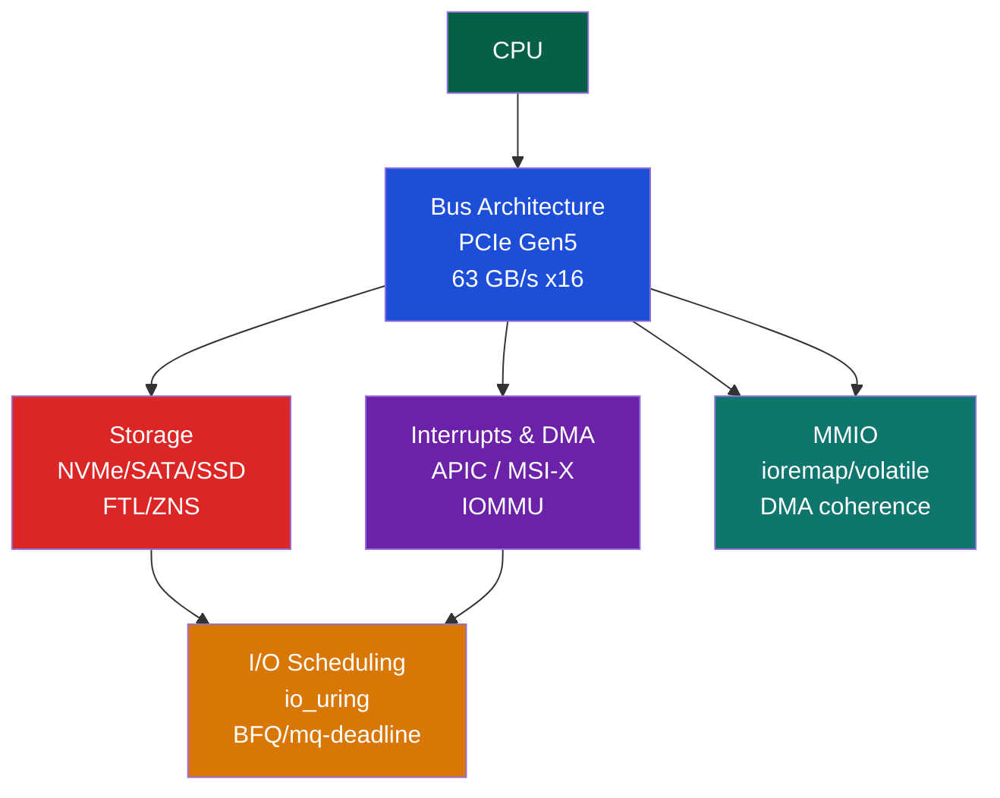

# 🔌 I/O Systems — Section MOC

> [!abstract] Section Overview
> I/O Systems connect the CPU and memory to the external world: storage devices, network interfaces, GPUs, and embedded sensors. This section covers bus architectures (PCIe, USB, I2C, SPI), interrupt delivery (PIC/APIC/MSI-X), DMA (Direct Memory Access for zero-copy transfers), storage interfaces (NVMe, SATA, SSD internals), Linux I/O scheduling, and memory-mapped I/O (MMIO) used for device register access.

---

## Concept Map

---

## Learning Path

1. [[Bus_Architectures_PCIe]] — PCIe lanes/packets, BAR, USB topology, I2C/SPI
2. [[Interrupts_and_DMA]] — IDT, APIC, MSI-X, NAPI, scatter-gather, IOMMU
3. [[Storage_Interfaces_NVMe_SATA]] — NVMe SQ/CQ, AHCI NCQ, NAND types, FTL, ZNS
4. [[IO_Scheduling_and_io_uring]] — Linux block layer, BFQ, io_uring SQ/CQ rings
5. [[Memory_Mapped_IO]] — volatile, ioremap, DMA coherence, device tree vs ACPI

---

## All Notes

| Note | Key Concepts | Difficulty |
|------|-------------|------------|
| [[Bus_Architectures_PCIe]] | Lanes=4 wires, TLP/DLLP, BAR, x16Gen5 | Intermediate |
| [[Interrupts_and_DMA]] | IDT, MSI-X, NAPI top/bottom half, IOMMU | Intermediate |
| [[Storage_Interfaces_NVMe_SATA]] | SQ/CQ pairs, 65535 queues, SLC/MLC/TLC, FTL | Intermediate |
| [[IO_Scheduling_and_io_uring]] | BFQ/mq-deadline/none, io_uring zero-copy | Advanced |
| [[Memory_Mapped_IO]] | ioremap, coherent vs streaming DMA | Advanced |

---

## Key Throughput Numbers

| Interface | Peak Bandwidth | Latency |
|-----------|---------------|---------|
| PCIe Gen5 x16 | 63 GB/s | ~100ns |
| NVMe (PCIe Gen4 x4) | ~7 GB/s | ~100µs |
| SATA 3.0 | 600 MB/s | ~70µs |
| USB 3.2 Gen2×2 | 2.4 GB/s | ~1ms |
| Ethernet 100GbE | 12.5 GB/s | ~1µs (NIC to CPU) |

---

## Related Sections

- [[_MOC_Computer_Architecture_Master|↑ Master MOC]]
- [[../03_Memory_Systems/_MOC_Memory_Systems|← Memory Systems]] — DMA coherence requires cache management
- [[../06_Parallel_Computing/_MOC_Parallel_Computing|→ Parallel Computing]] — GPU connects via PCIe; GPU memory via NVLink

#Computer_Architecture #IO_Systems #MOC
