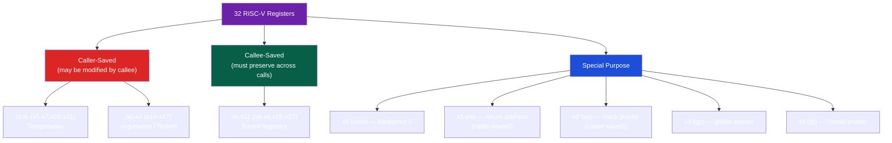

# 📦 ABI and Calling Conventions

> [!abstract] TL;DR
> The RISC-V LP64 ABI defines how functions interact: argument passing (a0–a7 for first 8 args, stack for the rest), return values (a0, a1 for 64-bit wide), caller-saved registers (t0–t6, a0–a7 — clobbered across calls), callee-saved registers (s0–s11 — preserved across calls), 16-byte stack alignment before any call, and struct passing rules (≤2 fields in reg, larger by reference). Variadic functions (`va_list`) pass fixed args in a0–a7, then variable args on the stack. The LP64D ABI extends LP64 with floating-point argument passing in f registers.

## Intuition — analogy FIRST

The ABI is like office etiquette for coworkers: caller-saved registers are your desk items — anyone borrowing your office (calling a function) might move things around, so put them away (save to stack) if you need them later. Callee-saved registers are conference room chairs — whoever uses the room (called function) must return them to their original positions (restore before returning). The stack alignment rule is like always returning the meeting room chairs in the proper arrangement.

---

## How It Works

### Register Conventions Summary



### Argument Passing Rules

**Integer/pointer arguments** (LP64 ABI):
```
Arg 1:  a0    (x10)
Arg 2:  a1    (x11)
...
Arg 8:  a7    (x17)
Arg 9+: pushed on stack (in caller's frame), right-to-left order
```

**Return values**:
```
32/64-bit: returned in a0
128-bit:   returned in a0 (low) + a1 (high)
Struct:    if ≤ 2 pointer-sized fields → a0+a1
           if larger → caller allocates space, passes pointer in a0, callee fills
```

**Floating-point** (LP64D — with F/D extension):
```
FP Arg 1: fa0  (f10)
FP Arg 2: fa1  (f11)
...
FP Arg 8: fa7  (f17)
Mixed: first 8 int/ptr args in a0-a7 AND first 8 FP args in fa0-fa7 independently
```

### Caller-Saved vs Callee-Saved Responsibilities

```c
// C source → assembly correspondence

void caller() {
    int x = some_computation();   // stored in s0 (callee-saved by callee)
    some_function();               // may trash t0-t6, a0-a7
    use(x);                        // s0 still valid!
}

// If x were in t0 (caller-saved):
void caller_unsafe() {
    // t0 = x
    // some_function() → destroys t0!
    // use(x) reads wrong value
    
    // Solution: save t0 to stack before call if we need it after
}
```

Assembly obligation:
```asm
# Callee obligation: save s-registers if used
foo:
    addi  sp, sp, -32
    sd    ra, 24(sp)     # ra is caller-saved BUT we must save it (we'll call others)
    sd    s0, 16(sp)     # save s0 if we use it
    sd    s1, 8(sp)      # save s1 if we use it

    # ... use s0, s1 freely ...
    # ... call other functions (t/a regs may be changed) ...

    ld    ra, 24(sp)     # restore ra
    ld    s0, 16(sp)     # restore s0
    ld    s1, 8(sp)      # restore s1
    addi  sp, sp, 32
    ret

# Caller obligation: assume t/a regs clobbered after any call
bar:
    # Want to use t0 across a call:
    addi  sp, sp, -16
    sd    t0, 8(sp)      # save t0 BEFORE call (caller-saved = caller's problem)
    call  baz
    ld    t0, 8(sp)      # restore t0 after call
    addi  sp, sp, 16
    ret
```

### Stack Frame Layout (Canonical)

```
┌─────────────────────────────────┐ ← fp (s0) = sp + frame_size
│ [Padding for 16-byte alignment] │
│ [Outgoing arguments > 8]        │ ← if callee needs > 8 args
├─────────────────────────────────┤
│ Saved ra                        │ fp - 8
│ Saved s0 (fp of caller)         │ fp - 16
│ Saved s1 ... s11 (as needed)    │
├─────────────────────────────────┤
│ Local variables                 │
│ Spilled registers               │
└─────────────────────────────────┘ ← sp (stack grows down)
```

**16-byte alignment invariant**: The stack pointer MUST be 16-byte aligned at any point where a `call` instruction is about to execute. This is required because:
- SSE/vector loads to stack require 16-byte alignment
- Hardware exception handlers assume 16-byte aligned SP

```asm
# Correct: allocating 24 bytes (round up to next multiple of 16 = 32)
addi  sp, sp, -32    # 32 = next multiple of 16 ≥ 24

# Wrong: allocating 24 bytes directly
addi  sp, sp, -24    # Stack may now be misaligned by 8!
```

### Struct Passing — Complete Rules

| Struct Size | Fields | Passed As |
|-------------|--------|----------|
| ≤ 8 bytes, 1 field | int/ptr | in one register |
| ≤ 16 bytes, 2 fields | int/ptr | in two registers (a0, a1) |
| ≤ 16 bytes, 1 FP + 1 int | FP + int | in fa0 + a0 (LP64D) |
| > 16 bytes | any | by reference (caller allocates, passes pointer) |

```c
struct Small { int x; int y; };     // 8 bytes → a0 (both fields packed)
struct Medium { long a; long b; };  // 16 bytes → a0=a, a1=b
struct Large { long a, b, c; };     // 24 bytes → pointer in a0

// Compiler output for Large struct argument:
// sub sp, sp, 24   ; allocate space for struct copy
// ... copy struct ...
// mv a0, sp        ; pass pointer to copy
// call func
```

### Variadic Functions (va_list)

RISC-V ABI variadic argument passing:
1. Fixed args: in a0-a7 (or fa0-fa7 for FP) as normal
2. Variable args: continue in remaining a-registers, then overflow to stack

```c
#include <stdarg.h>

int sum(int count, ...) {
    va_list ap;
    va_start(ap, count);    // 'count' = last named arg
    
    int total = 0;
    for (int i = 0; i < count; i++) {
        total += va_arg(ap, int);  // reads next int from ap
    }
    
    va_end(ap);
    return total;
}

// Call: sum(3, 10, 20, 30)
// Assembly: a0=3, a1=10, a2=20, a3=30
// va_arg reads from a1 (saved on stack by va_start), then a2, a3...
```

`va_start(ap, count)` on RISC-V: saves a1-a7 (and fa0-fa7 if LP64D) to the reg save area on stack, sets ap to point to the first variable argument location.

### Tail Call Optimization

A tail call is a function call in the tail position (the call's result is immediately returned):

```c
// With TCO: becomes a jump (no new stack frame)
int factorial_tail(int n, int acc) {
    if (n <= 1) return acc;
    return factorial_tail(n - 1, n * acc);  // TAIL CALL
}
```

```asm
# Compiler generates tail call: reuses current frame
factorial_tail:
    ble   a0, zero, .base
    mul   a1, a0, a1       # acc = n * acc
    addi  a0, a0, -1       # n--
    j     factorial_tail   # tail jump: no call, no new frame!
.base:
    mv    a0, a1
    ret
```

GCC `-O2` enables TCO automatically for eligible functions.

---

## Real-World Notes

- `objdump -d prog | grep -A 20 '<main>'` shows the calling convention in compiled binaries
- RISC-V LP64 is the dominant ABI; LP64F (FP args via FP regs for F ext only) and LP64D (with D ext) are variants
- Calling convention violations are a common source of C/assembly interoperability bugs — always verify with GDB
- C++ name mangling: `extern "C"` suppresses mangling for C++/C interoperability in assembly-callable functions

---

## Common Pitfalls

1. **Not restoring callee-saved registers** — Using s0-s11 in a function and not restoring them corrupts the caller's data. The bug manifests many instructions later, making it hard to trace
2. **Calling a function with misaligned SP** — Crashes inside the callee when the callee tries to save FP registers or when exception handlers fire. Always ensure SP % 16 == 0 before any `call`
3. **Treating ra as callee-saved** — `ra` is caller-saved semantically (callee can destroy it). BUT: any non-leaf function that calls another must save `ra` before the call
4. **struct too large for registers** — Passing a 24-byte struct assumes 3 registers, but ABI only passes 2. Oversized structs are passed by reference; failing to handle this causes silent data corruption
5. **va_arg type mismatch** — `va_arg(ap, int)` for a `double` argument is UB. The ABI stores doubles in FP registers (LP64D), so `va_arg(ap, double)` is required even if the value looks integer-sized

---

## Related Concepts

- [[_MOC_Assembly_RISCV|↑ Assembly & RISC-V MOC]]
- [[Assembly_Programming]] — Implements ABI in hand-written assembly
- [[RISCV_ISA_Fundamentals]] — ISA provides the registers and instructions
- [[Inline_Assembly_in_C]] — Must specify ABI-correct clobbers and constraints
- [[../02_CPU_Architecture/ISA_Design_RISC_vs_CISC|ISA Design]] — ABI sits on top of ISA

---

## Review Questions

1. A C function has signature `long foo(long a, long b, long c, long d, long e, long f, long g, long h, long i)` (9 arguments). Trace exactly how arguments are passed and where argument 9 lives in memory relative to the caller's SP.
2. Why does the caller-saved / callee-saved distinction allow efficient register usage without always spilling? Give a concrete code example showing how a loop avoids unnecessary saves.
3. A C function returns a `struct { double x, y, z; }` (24 bytes). Describe the exact mechanism by which it is returned: who allocates space, which register holds the pointer, and what the caller sees.

---

## Sources

- RISC-V ELF psABI Specification, v1.0, riscv-abi.github.io
- Patterson & Hennessy, *Computer Organization and Design RISC-V Edition*, Ch. 2.8
- System V AMD64 ABI (for comparison), refspecs.linuxbase.org

#Computer_Architecture #Assembly_RISCV #ABI #Calling_Conventions
