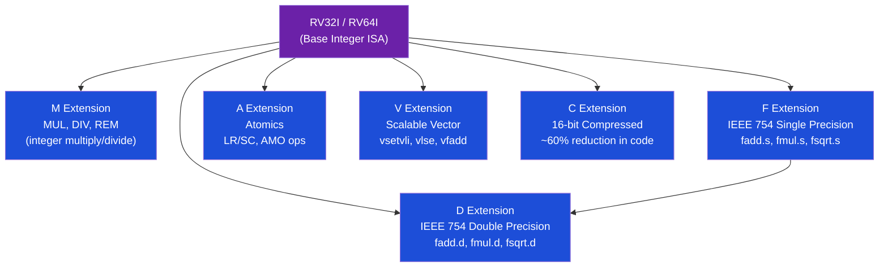

# 🔧 RISC-V Extensions

> [!abstract] TL;DR
> RISC-V's modular ISA allows optional standard extensions: **M** (multiply/divide: MUL, DIV, REM), **F/D** (IEEE 754 single/double FP: fadd.s, fma.s, fcsr rounding control), **A** (atomics: LR/SC for LL/SC-style CAS; AMO operations), **V** (scalable vector: `vsetvli` configures VLEN/SEW/LMUL, `vlse32.v` strided load, operates on up to LMUL×VLEN/SEW elements per vector), **C** (16-bit compressed: 60% coverage of common instructions, reduces code size 25-30%). A typical Linux target uses **IMAFDCV** or **IMAFD** for servers.

## Intuition — analogy FIRST

RISC-V extensions are like smartphone apps: the base phone (RV32I) is functional but basic; each extension adds specific capability (M=calculator, F=scientific notation, A=shared whiteboard with locks, V=spreadsheet that processes many cells at once, C=SMS shorthand). You only install what you need — embedded systems run with just I, while HPC servers run the full suite.

---

## How It Works

### Extension Overview



### M Extension — Integer Multiply and Divide

**MUL / MULH family**:

| Instruction | Operation | Result |
|-------------|-----------|--------|
| `mul  rd, rs1, rs2` | rd = (rs1 × rs2)[31:0] | Lower 32/64 bits |
| `mulh rd, rs1, rs2` | rd = (signed rs1 × signed rs2)[63:32] | Upper 32 bits, signed |
| `mulhu rd, rs1, rs2` | rd = (unsigned × unsigned)[63:32] | Upper 32 bits, unsigned |
| `mulhsu rd, rs1, rs2` | rd = (signed × unsigned)[63:32] | Upper 32 bits, mixed |
| `div  rd, rs1, rs2` | rd = rs1 / rs2 (signed) | Truncates toward zero |
| `divu rd, rs1, rs2` | rd = rs1 / rs2 (unsigned) | |
| `rem  rd, rs1, rs2` | rd = rs1 mod rs2 (signed) | |
| `remu rd, rs1, rs2` | rd = rs1 mod rs2 (unsigned) | |

```asm
# 64-bit multiply on RV32 (full 64-bit result):
# c = (int64_t)a * (int64_t)b
mul    a0, a2, a4      # a0 = low 32 bits of a×b
mulh   a1, a2, a4      # a1 = high 32 bits (signed)

# Division by constant — compiler optimizes to multiply+shift (no div instruction):
# x / 10 → x * (2^34/10) >> 34 ≈ multiply-high trick
```

**Corner cases**: Division by zero returns rs1 = max int (not exception); overflow (INT_MIN / -1) returns INT_MIN.

### F / D Extension — IEEE 754 Floating Point

**FP registers**: f0–f31 (separate from integer registers x0–x31)
- F extension: 32-bit floats in f0–f31
- D extension: 64-bit doubles in f0–f31 (same registers, wider)

**FCSR** (Floating-Point Control and Status Register):
```
fcsr bits [7:5] = frm (rounding mode: RNE/RTZ/RDN/RUP/RMM)
fcsr bits [4:0] = fflags (accrued exceptions: NV/DZ/OF/UF/NX)
```

**Key FP instructions**:
```asm
# Single precision (F extension)
fadd.s  fd, fs1, fs2      # fd = fs1 + fs2 (float)
fsub.s  fd, fs1, fs2      # subtraction
fmul.s  fd, fs1, fs2      # multiplication
fdiv.s  fd, fs1, fs2      # division
fsqrt.s fd, fs1           # square root
fmadd.s fd, fs1, fs2, fs3 # fd = fs1*fs2 + fs3 (FMA, one rounding)
fmsub.s fd, fs1, fs2, fs3 # fd = fs1*fs2 - fs3

# Conversion
fcvt.s.w  fd, rs1         # int32 → float
fcvt.w.s  rd, fs1, rtz    # float → int32 (toward zero)
fcvt.d.s  fd, fs1         # float → double
fcvt.s.d  fd, fs1         # double → float

# Move between int and FP (no conversion)
fmv.w.x  fd, rs1          # move int bits to FP reg
fmv.x.w  rd, fs1          # move FP bits to int reg (for bitwise ops on NaN)

# Comparison (result in integer register)
feq.s  rd, fs1, fs2       # rd = (fs1 == fs2)
flt.s  rd, fs1, fs2       # rd = (fs1 < fs2) (ordered)
fle.s  rd, fs1, fs2       # rd = (fs1 <= fs2) (ordered)

# Read/write FCSR
fscsr  rd, rs1            # swap fcsr: rd = old, fcsr = rs1
frcsr  rd                 # rd = fcsr
frrm   rd                 # rd = frm (rounding mode bits)
frflags rd                # rd = fflags (exception flags)
```

### A Extension — Atomics

**LR/SC (Load-Reserved / Store-Conditional)** — LL/SC pattern:
```asm
# Atomic Compare-and-Swap (CAS) using LR/SC:
cas:
    lr.w   t0, (a0)        # load-reserved: t0 = *a0, mark reservation
    bne    t0, a1, fail    # if *a0 != expected (a1), fail
    sc.w   t1, a2, (a0)   # store-conditional: *a0 = a2 (if reservation valid)
    bnez   t1, cas         # if sc failed (t1 != 0), retry
    mv     a0, t0          # return old value
    ret
fail:
    mv     a0, t0
    ret
```

**AMO (Atomic Memory Operations)**:
```asm
# Syntax: amoop.w[.aq][.rl] rd, rs2, (rs1)
# rd = old *rs1; *rs1 = op(old, rs2)
# .aq = acquire; .rl = release

amoadd.w   rd, rs2, (rs1)   # atomic add
amoswap.w  rd, rs2, (rs1)   # atomic swap
amoand.w   rd, rs2, (rs1)   # atomic AND
amoor.w    rd, rs2, (rs1)   # atomic OR
amoxor.w   rd, rs2, (rs1)   # atomic XOR
amomin.w   rd, rs2, (rs1)   # atomic min (signed)
amominu.w  rd, rs2, (rs1)   # atomic min (unsigned)
amomax.w   rd, rs2, (rs1)   # atomic max
amomaxu.w  rd, rs2, (rs1)   # atomic max (unsigned)

# Ordering examples:
amoswap.w.aq   rd, rs2, (rs1)   # acquire swap (memory barrier after)
amoswap.w.rl   rd, rs2, (rs1)   # release swap (memory barrier before)
amoswap.w.aqrl rd, rs2, (rs1)   # full fence (sc_cst equivalent)
```

### V Extension — Scalable Vector

RISC-V V is revolutionary: vector length (VLEN) is implementation-defined (128–65536 bits). Software configures operation parameters at runtime:

```asm
# vsetvli configures vector operation:
# vsetvli rd, rs1, vtypei
# rd = actual vector length (vl) granted
# rs1 = requested application vector length (avl)
# vtypei = e8/e16/e32/e64 (element width SEW) + m1/m2/m4/m8/mf2/mf4/mf8 (LMUL)

# LMUL (Length MULtiplier): how many vector registers per logical vector register
# LMUL=1: each vector register has VLEN/SEW elements
# LMUL=2: use 2 registers as one logical group (2× elements)
# LMUL=8: use 8 registers (8× elements, maximum throughput)
```

**Vector addition example**:
```asm
# void vec_add(float *a, float *b, float *c, int n) {
#     for (int i = 0; i < n; i++) c[i] = a[i] + b[i];
# }

vec_add:
    mv   t0, a3            # t0 = n (remaining elements)
loop:
    vsetvli  t1, t0, e32, m4, ta, ma  # configure: e32 (float32), LMUL=4, tail-agnostic, mask-agnostic
                                        # t1 = actual vl (granted length)
    # Load vectors (4 registers per logical vector with LMUL=4)
    vle32.v  v0, (a0)      # v0-v3 = a[0..vl-1] (contiguous load)
    vle32.v  v4, (a1)      # v4-v7 = b[0..vl-1]
    
    # Compute
    vfadd.vv v8, v0, v4    # v8-v11 = a + b (element-wise float add)
    
    # Store result
    vse32.v  v8, (a2)      # c[0..vl-1] = v8-v11
    
    # Advance pointers and counter
    slli  t2, t1, 2        # t2 = vl * 4 bytes
    add   a0, a0, t2       # a += vl
    add   a1, a1, t2       # b += vl
    add   a2, a2, t2       # c += vl
    sub   t0, t0, t1       # n -= vl
    bnez  t0, loop         # loop until all elements processed
    ret
```

Key V extension concepts:
- `ta` = tail-agnostic (result of tail elements undefined) vs `tu` (tail-undisturbed)
- `ma` = mask-agnostic vs `mu` (mask-undisturbed) — for masked operations
- Predicated/masked operations: `v0` register is the mask register by convention

### C Extension — 16-bit Compressed

C extension adds 16-bit encodings for the ~60 most common instructions:

| Compressed | Equivalent | Notes |
|------------|-----------|-------|
| `c.add rd, rs2` | `add rd, rd, rs2` | rd += rs2 |
| `c.mv rd, rs2` | `add rd, x0, rs2` | rd = rs2 |
| `c.addi rd, imm` | `addi rd, rd, imm` | 6-bit signed imm |
| `c.lw rd, offset(rs1)` | `lw rd, offset(rs1)` | 8-byte aligned offset |
| `c.sw rs2, offset(rs1)` | `sw rs2, offset(rs1)` | Store word |
| `c.j offset` | `jal x0, offset` | Jump |
| `c.jr rs1` | `jalr x0, rs1, 0` | Jump to register |
| `c.li rd, imm` | `addi rd, x0, imm` | Load small immediate |
| `c.nop` | `addi x0, x0, 0` | No-op |

C extension reduces code size by ~25–30% for typical C code by using 16-bit instructions for common short-range operations. Mixed 16/32-bit instruction streams are decoded seamlessly.

---

## Real-World Notes

- GCC compilation flags: `-march=rv64gc` = RV64 + IMAFDCV; `-march=rv64imac` = without FP/D
- RISC-V V extension hardware: SiFive P870 (2022), T-Head C908 (Alibaba), RVV in LLVM/GCC supports V1.0
- LR/SC reservation set is at least one cache line (64 bytes typically). Avoid doing heavy work between LR and SC — reservation can be lost on context switch or other core's write
- Zicsr extension (Control and Status Register instructions) is required for F/D (to access FCSR)

---

## Common Pitfalls

1. **LR/SC ABA problem** — LR/SC is NOT vulnerable to the ABA problem (a value changed from A→B→A between LR and SC). The reservation monitors the cache line, not the value — any write to the address invalidates the reservation
2. **vsetvli AVL=0** — If AVL=0, vl=0 and vector instructions do nothing. This correctly handles the loop tail case without special-casing
3. **FP NaN boxing** — F extension on RV64: a 32-bit float in a 64-bit register must be "NaN-boxed" (upper 32 bits = all-1s). Software moving floats through integer registers must preserve NaN-boxing
4. **AMO ordering** — `amoadd.w` without `.aq/.rl` provides no ordering. For a mutex unlock, use `amoswap.w.rl` (release) to ensure all preceding operations are visible before the lock is released
5. **C extension register restriction** — Many 16-bit compressed instructions only access x8-x15 (labeled s0-a5). Instructions using x0-x7 or x16-x31 have no 16-bit encoding and stay at 32 bits

---

## Related Concepts

- [[_MOC_Assembly_RISCV|↑ Assembly & RISC-V MOC]]
- [[RISCV_ISA_Fundamentals]] — Base ISA that extensions build on
- [[Arithmetic_Circuits_and_IEEE754|IEEE 754]] — F/D extension implements this standard
- [[../06_Parallel_Computing/SIMD_and_Vector_ISA|SIMD & Vector ISA]] — V extension is RISC-V's answer to x86 AVX-512
- [[../03_Memory_Systems/Memory_Consistency_Models|Memory Consistency]] — A extension atomics interact with memory model (LR/SC + AMO)

---

## Review Questions

1. Implement `__sync_fetch_and_add()` (atomic add, return old value) using RISC-V A extension LR/SC on a 32-bit integer. Handle the ABA-free property.
2. A processor implements RV64GCV with VLEN=512 bits. For e32 (float32) with LMUL=4, how many elements are processed per iteration? How many physical vector registers are consumed?
3. Why is `fmadd.s fd, fs1, fs2, fs3` (FMA) more numerically accurate than `fmul.s` followed by `fadd.s`? Express the difference in terms of rounding operations.

---

## Sources

- RISC-V ISA Specification Vol 1 (Unprivileged): M, A, F, D, C, V extensions
- RISC-V Vector Extension Specification v1.0
- Krste Asanović et al., "The RISC-V Instruction Set Manual"

#Computer_Architecture #Assembly_RISCV #RISC_V #Extensions #Vector
