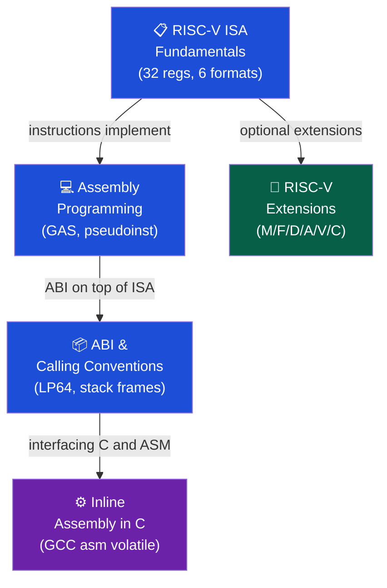

# 📟 Assembly and RISC-V — Section MOC

> [!abstract] Section Overview
> This section covers RISC-V assembly programming from ISA fundamentals through practical ABI conventions, RISC-V standard extensions (M, F, D, A, V, C), and C-level inline assembly. Understanding assembly enables reasoning about compiler output, writing performance-critical code, debugging at the machine level, and working on embedded systems without OS abstractions.

---

## Concept Map

---

## Learning Path

1. [[RISCV_ISA_Fundamentals]] — 32 regs, 6 formats, all RV32I instructions
2. [[Assembly_Programming]] — GAS syntax, directives, pseudoinstructions, stack, GDB
3. [[ABI_and_Calling_Conventions]] — LP64, caller/callee-saved, struct passing, variadic
4. [[RISCV_Extensions]] — M/F/D/A/V/C: multiply, float, atomic, vector, compressed
5. [[Inline_Assembly_in_C]] — GCC `asm volatile`, constraints, clobbers

---

## All Notes

| Note | Key Concepts | Difficulty |
|------|-------------|------------|
| [[RISCV_ISA_Fundamentals]] | x0-x31, R/I/S/B/U/J formats, FENCE | Intermediate |
| [[Assembly_Programming]] | .section, .word, li/la/mv, stack frames, GDB | Intermediate |
| [[ABI_and_Calling_Conventions]] | LP64, a0-a7, s0-s11, t0-t6, alignment | Intermediate |
| [[RISCV_Extensions]] | MUL/DIV, fcsr, LR/SC, AMO, vsetvli, C | Advanced |
| [[Inline_Assembly_in_C]] | asm volatile outputs:inputs:clobbers, r/m/i | Advanced |

---

## Register Quick Reference

| Register | ABI Name | Saver | Purpose |
|----------|---------|-------|---------|
| x0 | zero | — | Hardwired 0 |
| x1 | ra | Caller | Return address |
| x2 | sp | Callee | Stack pointer |
| x3 | gp | — | Global pointer |
| x4 | tp | — | Thread pointer |
| x5-x7 | t0-t2 | Caller | Temporaries |
| x8 | s0/fp | Callee | Saved / Frame ptr |
| x9 | s1 | Callee | Saved |
| x10-x11 | a0-a1 | Caller | Args / Return vals |
| x12-x17 | a2-a7 | Caller | Arguments |
| x18-x27 | s2-s11 | Callee | Saved |
| x28-x31 | t3-t6 | Caller | Temporaries |

---

## Related Sections

- [[_MOC_Computer_Architecture_Master|↑ Master MOC]]
- [[../02_CPU_Architecture/_MOC_CPU_Architecture|← CPU Architecture]] — Assembly runs on this microarchitecture
- [[../01_Digital_Logic/_MOC_Digital_Logic|← Digital Logic]] — ISA instructions map to circuit operations

#Computer_Architecture #Assembly_RISCV #MOC
