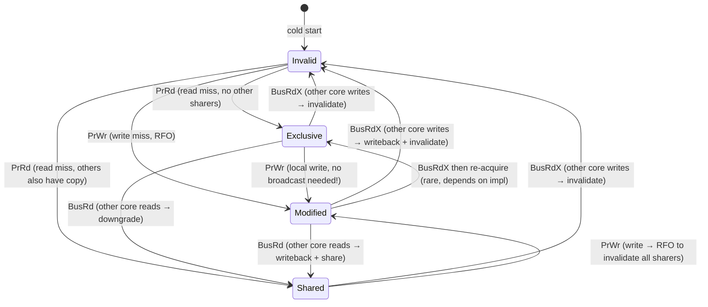
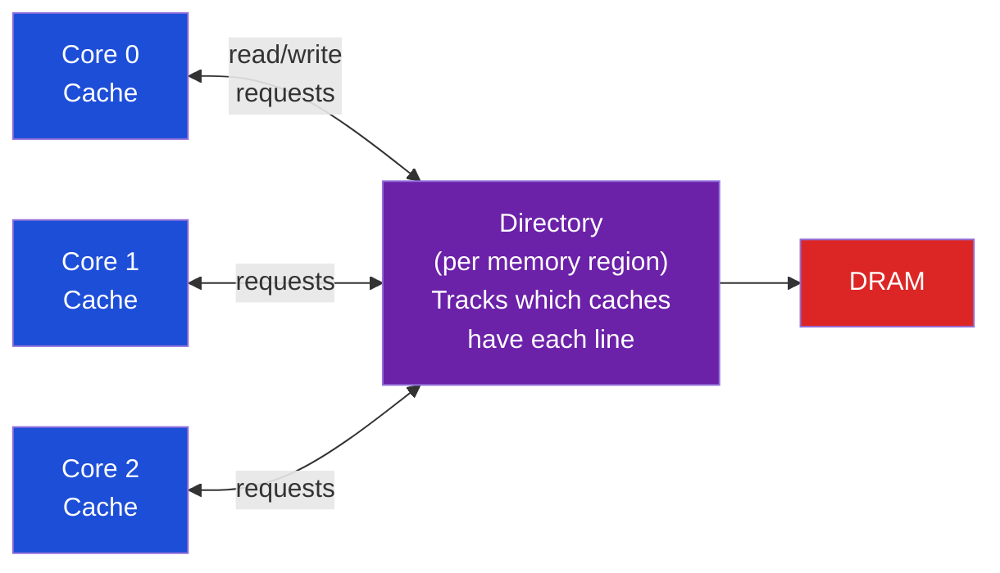

# 🔗 Cache Coherence — MESI Protocol

> [!abstract] TL;DR
> Cache coherence ensures that all cores see a consistent view of memory. The MESI protocol tracks each cache line in one of four states: Modified (dirty, exclusive), Exclusive (clean, exclusive), Shared (clean, multiple copies), Invalid (not present). On a write to a Shared or Invalid line, the CPU issues an RFO (Request For Ownership), which broadcasts an invalidation to all other caches and upgrades the line to Modified. Invalidation storms occur when many cores repeatedly write the same cache line (false sharing or contention). MOESI adds an Owned state to allow dirty sharing. Directory-based protocols replace snooping for NUMA/many-core systems.

## Intuition — analogy FIRST

MESI is like a library's whiteboard policy. A book (cache line) can be: Modified = you've scribbled notes (only you have it, it's dirty), Exclusive = you checked it out clean (only you have it, matches original), Shared = it's on the reference shelf (multiple people reading it, read-only), Invalid = you don't have it. If you want to write in it (write), you must first announce "I'm taking this book to scribble in it" (RFO) — everyone else must put down their copy (invalidate).

---

## How It Works

### MESI State Machine



**State Transitions**:

| State | Meaning | Private/Shared | Dirty/Clean |
|-------|---------|---------------|-------------|
| **M** Modified | Only copy, written (dirty) | Private | Dirty (not in memory) |
| **E** Exclusive | Only copy, not written | Private | Clean |
| **S** Shared | One of multiple copies | Shared | Clean |
| **I** Invalid | Not present in this cache | — | — |

**Operations**:
| Prefix | Meaning |
|--------|---------|
| `PrRd` | Processor Read (this core reads) |
| `PrWr` | Processor Write (this core writes) |
| `BusRd` | Bus Read (observed: another core is reading) |
| `BusRdX` | Bus Read Exclusive (observed: another core writes + invalidates) |

### RFO — Request For Ownership

When core A tries to write to a line in S or I state:
1. Core A issues `BusRdX` (broadcast on bus or coherence network)
2. All other cores that have the line in S state transition to I (invalidated)
3. If any core had line in M state → that core writes back dirty data, then transitions to I
4. Core A receives ownership, transitions to M
5. Core A performs the write

Cost of RFO:
- Snooping (bus-based): ~10–50 cycles (broadcast + ACK from all caches)
- Directory (NUMA): ~100–200ns (directory lookup + point-to-point messages)

### Invalidation Storm (Contention)

When N threads all repeatedly write the same cache line:
```
Thread 0: write to x → RFO → others invalidated → x in M state on core 0
Thread 1: write to x → RFO → core 0 writes back → x in M state on core 1
Thread 0: write to x → RFO → core 1 writes back → x in M state on core 0
... ping-pong!

With N threads: O(N²) coherence transactions per unit time → massive bandwidth waste
```

This is the hardware manifestation of **false sharing** (different variables on same line) or **true sharing** (same variable, many writers).

**Detection**: `perf c2c report` (cache-to-cache bounce detection):
```bash
perf c2c record ./prog
perf c2c report -NN --call-graph --stdio
```

### MESI Example — Lock Acquisition

```
Initial: lock = 0 (in DRAM, not cached)

Core 0: wants to acquire (CAS 0→1)
  1. Read lock: I→E (cache miss, exclusive because no sharers)
  2. CAS succeeds → E→M (write lock=1, no broadcast needed! E→M is free)
  
Core 1: wants to acquire (CAS 0→1)  
  3. Read lock: issues BusRd → Core 0's line downgrades M→S, writeback
  4. Core 1: I→S (receives value 1)
  5. CAS fails (lock=1, not 0) → Core 1 spins
  
Core 0: releases (write lock=0)
  6. PrWr: S→M, RFO broadcasts BusRdX → Core 1: S→I
  7. Core 0 writes 0
  
Core 1: retry
  8. BusRd: Core 0: M→S (writeback), Core 1: I→S
  9. CAS succeeds → Core 1: S→M (RFO)
```

### MOESI Protocol

MOESI adds an **Owned** state to avoid unnecessary writebacks:

| State | Meaning | Who Supplies Data |
|-------|---------|------------------|
| **M** Modified | Dirty, exclusive | This cache (on eviction) |
| **O** Owned | Dirty, but shared | This cache (supplies data to S sharers) |
| **E** Exclusive | Clean, exclusive | Memory |
| **S** Shared | Clean, multiple | Memory (or O owner) |
| **I** Invalid | Not present | — |

When Core 0 (M) receives BusRd from Core 1:
- MESI: Core 0 must writeback to memory first, then both get S from memory
- MOESI: Core 0 downgrades M→O, supplies data directly to Core 1 (Core 1 gets S). No memory writeback needed! Memory is updated lazily when O evicts.

AMD uses MOESI; Intel historically used MESI (inclusive L3 with S serving as the ownership resolver).

### Directory Protocol — Scaling to NUMA

Bus snooping doesn't scale beyond ~8-16 cores (bus becomes bottleneck). Directory protocols scale to hundreds/thousands of nodes:



**Directory entry per cache line**:
```
┌──────────────┬──────────────┬───────┐
│ State (M/S/I)│ Sharer bitmap│ Owner │
│              │ (one bit/core│       │
└──────────────┴──────────────┴───────┘
```

For read: directory → send data, add requester to sharer bitmap
For write: directory → send invalidation to all sharers, remove from bitmap

Protocols: SGI CC-NUMA (Origin 2000), Intel QPI/UPI, AMD HyperTransport/Infinity Fabric.

---

## Real-World Notes

- ARM's implementation is called "AMBA ACE" (AXI Coherence Extensions) — used in big.LITTLE and Cortex-A7x series
- x86 uses an extended MESIF protocol (adds F=Forward state, a special S that forwards data to new sharers)
- Intel's Ring Bus (Nehalem-Ivy Bridge) connects L3 slices and cores; Mesh (Skylake-X+) replaced ring for more scalable coherence
- `perf stat -e cache-misses,L1-dcache-load-misses` — L1 miss rate; high coherence traffic shows as L3 miss rate increase

---

## Common Pitfalls

1. **Assuming E state optimization** — E→M transition (write to exclusive line) requires no bus traffic. Applications that avoid false sharing stay in E state and pay zero coherence cost for writes
2. **Spinning on a cached copy** — Test-and-set spin locks (`while(TAS(&lock) != 0)`) generate RFO on every iteration. Use test-then-test-and-set: `while(lock || TAS(&lock))` reads in S state (no RFO) until lock looks free
3. **False sharing masquerading as true sharing** — Profiling shows coherence traffic on a lock variable but analysis should check if neighboring variables are on the same line
4. **Directory protocol latency** — 2-hop NUMA coherence (Core 0 → Directory → Core 1) takes ~200ns vs snooping's ~50ns. Minimize cross-socket writes in NUMA-aware code
5. **Inclusive vs non-inclusive L3 and coherence** — In Intel's inclusive L3, eviction from L3 also triggers L1/L2 invalidation (due to inclusion property). This "silent eviction" can unexpectedly invalidate hot working sets in L1

---

## Related Concepts

- [[_MOC_Parallel_Computing|↑ Parallel Computing MOC]]
- [[Multi_Core_Programming]] — False sharing is the primary manifestation of coherence cost in software
- [[Memory_Barriers_and_Ordering]] — Coherence ≠ consistency; barriers enforce ordering among coherent operations
- [[../03_Memory_Systems/Cache_Hierarchy|Cache Hierarchy]] — MESI is the hardware protocol running beneath the cache hierarchy
- [[../03_Memory_Systems/NUMA_and_Memory_Bandwidth|NUMA]] — Directory protocols enable coherence across NUMA nodes

---

## Review Questions

1. Trace the MESI state of a cache line through this sequence on a 4-core system: Core0 read, Core1 read, Core2 write, Core0 read. Show each core's state after each operation.
2. A hot mutex (acquired 1M times/second by 8 cores) sits in a single 64-byte cache line. How many RFOs occur per second? What is the coherence bandwidth consumed (assume 64B writeback + 64B read per RFO cycle)?
3. In MOESI, when the Owner (O state) evicts its line, what must happen? Compare the writeback cost to MESI's equivalent scenario.

---

## Sources

- Culler, D. et al. *Parallel Computer Architecture: A Hardware/Software Approach*, Ch. 5
- Hennessy & Patterson, *Computer Architecture: A Quantitative Approach*, Appendix I
- Sorin, D. et al. *A Primer on Memory Consistency and Cache Coherence*, Synthesis Lectures 2011

#Computer_Architecture #Parallel_Computing #Cache_Coherence #MESI
