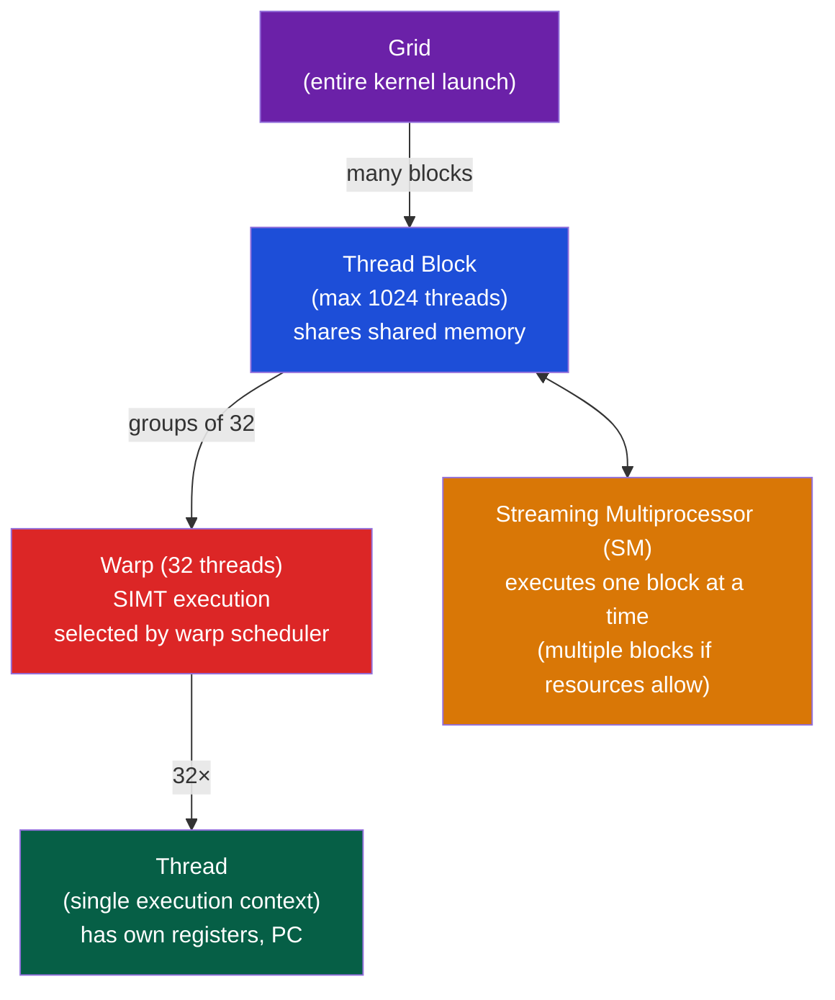
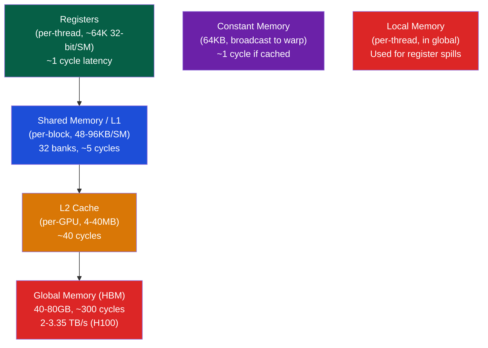

# 🎮 GPU Architecture and CUDA

> [!abstract] TL;DR
> GPUs execute SIMT (Single Instruction, Multiple Threads): 32 threads execute the same instruction in lock-step (one warp). A kernel launch creates a grid of thread blocks; each block runs on one SM (Streaming Multiprocessor). Global thread index: `i = blockIdx.x * blockDim.x + threadIdx.x`. Memory hierarchy: registers (fastest, per-thread) → shared memory (48KB/SM, 32 banks, ~5 cycles) → L1/L2 cache → global memory (HBM, ~300 cycles). 128-byte coalesced global access. Warp divergence (threads taking different branches) serializes execution. Occupancy = active warps / max warps per SM. Tensor Cores perform 4×4 matrix multiply-accumulate (MMA) in one instruction for deep learning.

## Intuition — analogy FIRST

A GPU SM is like a classroom where 32 students (threads = one warp) must all do the same exercise simultaneously (SIMT). If some students raise their hand (branch to different path), everyone waits while those students do their different exercise, then reconverge. Shared memory is the classroom's whiteboard — all 32 students can read from it simultaneously; they wait for a slow global memory (library book) trip only when whiteboard is empty.

---

## How It Works

### GPU Thread Hierarchy



### Thread Indexing

```cuda
// 1D grid of 1D blocks:
int i = blockIdx.x * blockDim.x + threadIdx.x;

// 2D grid of 2D blocks (for matrix operations):
int row = blockIdx.y * blockDim.y + threadIdx.y;
int col = blockIdx.x * blockDim.x + threadIdx.x;

// Launch configuration:
dim3 block(16, 16);              // 16×16 = 256 threads/block
dim3 grid((N+15)/16, (M+15)/16); // enough blocks for N×M matrix
kernel<<<grid, block>>>(d_A, d_B, d_C, N, M);
```

### Memory Hierarchy



### Coalesced Global Memory Access

128 bytes are loaded per warp (4 bytes × 32 threads). For coalesced access:
- Thread i accesses `arr[i]` → all 32 addresses in one 128-byte transaction
- Thread i accesses `arr[i * 32]` → 32 separate transactions (stride = cache line size)

```cuda
// COALESCED: thread i reads arr[i] → one 128-byte load
__global__ void good_kernel(float *arr, float *out, int N) {
    int i = blockIdx.x * blockDim.x + threadIdx.x;
    out[i] = arr[i] * 2.0f;  // consecutive threads, consecutive memory
}

// NON-COALESCED: thread i reads arr[i * 1024] → 32 separate loads
__global__ void bad_kernel(float *arr, float *out, int N) {
    int i = blockIdx.x * blockDim.x + threadIdx.x;
    out[i] = arr[i * 1024] * 2.0f;  // strided access, terrible bandwidth
}
```

### Shared Memory — Bank Conflicts

Shared memory has 32 banks (one per thread in a warp). Bank N holds words at addresses n, n+32, n+64, ...

**Bank conflict**: Two threads in the same warp accessing the same bank (different addresses) → serialized.

```cuda
// Bank conflict-free: thread i reads smem[i]
__shared__ float smem[32];
float val = smem[threadIdx.x];   // thread i reads bank i → no conflict

// Bank conflict: thread i reads smem[i * 2] (only 16 unique banks)
float val = smem[threadIdx.x * 2];  // 2-way bank conflict → 2× slower

// Exception: broadcast (all threads read same address) → no conflict
float val = smem[0];  // broadcast to all → one read, no serialization

// Fix column-major matrix access:
__shared__ float tile[32][33];  // +1 column padding breaks bank conflicts
float val = tile[threadIdx.y][threadIdx.x];  // now bank-conflict-free
```

### Warp Divergence

When threads in a warp take different paths in an `if`, the hardware executes BOTH paths (with masking):

```cuda
// Warp divergence: half threads take if, half take else
if (threadIdx.x < 16) {
    // executed by threads 0-15 while threads 16-31 are masked off
    do_work_A();
} else {
    // executed by threads 16-31 while threads 0-15 are masked off
    do_work_B();
}
// Total time = time(A) + time(B) in worst case

// Optimized: predicate within a single path if possible
float result = (threadIdx.x < 16) ? func_A() : func_B();
// Or: restructure to avoid branch within warp (e.g., sort by condition first)
```

### Occupancy

Occupancy = (active warps on SM) / (maximum warps on SM)

```
Maximum warps per SM: typically 64 (Ampere) or 64 (Turing)
Active warps limited by:
  - Registers: if kernel uses 64 regs/thread, 64-warp SM = 64×32×64 = 131K regs (may exceed 65K)
  - Shared memory: if kernel uses 32KB shared, only 2 blocks fit on SM with 64KB shared
  - Block count: max 32 blocks per SM (Ampere)

Occupancy formula:
 - Warps/block = ceil(blockDim / 32)
 - Max blocks from shared mem = floor(SM_shared / block_shared)
 - Max blocks from registers = floor(SM_registers / (regs_per_thread × blockDim))
 - Active blocks = min of all limits
 - Active warps = active_blocks × warps_per_block
 - Occupancy = active_warps / max_warps_per_SM
```

```bash
# CUDA occupancy calculator:
nvcc --ptxas-options=-v kernel.cu  # shows register/shared mem usage
# Use NVIDIA Nsight Compute for per-SM occupancy breakdown
```

### Matrix Multiplication with Shared Memory (Tiling)

```cuda
// Tiled matrix multiply: A(M×K) × B(K×N) → C(M×N)
#define TILE 16

__global__ void matmul(float *A, float *B, float *C, int M, int K, int N) {
    __shared__ float As[TILE][TILE];
    __shared__ float Bs[TILE][TILE];

    int row = blockIdx.y * TILE + threadIdx.y;
    int col = blockIdx.x * TILE + threadIdx.x;
    float sum = 0.0f;

    for (int t = 0; t < (K + TILE - 1) / TILE; t++) {
        // Collaboratively load tile from A and B into shared mem
        As[threadIdx.y][threadIdx.x] = A[row * K + t * TILE + threadIdx.x];
        Bs[threadIdx.y][threadIdx.x] = B[(t * TILE + threadIdx.y) * N + col];
        __syncthreads();  // barrier: all threads must finish load before compute

        // Compute dot product of this tile
        for (int k = 0; k < TILE; k++)
            sum += As[threadIdx.y][k] * Bs[k][threadIdx.x];
        __syncthreads();  // barrier before next tile load
    }
    C[row * N + col] = sum;
}
```

**Why tiling helps**: Each element of A and B is loaded TILE times from global memory instead of TILE× from global memory. With TILE=16: 16× fewer global loads → 16× higher arithmetic intensity.

### Tensor Cores

Tensor Cores compute `D = A × B + C` (MMA) in one instruction:
- A: 8×16 fp16 matrix
- B: 16×8 fp16 matrix
- C/D: 8×8 fp32 accumulator
- Throughput: 1MMA per 4 cycles = 128 fp16 FLOPS per cycle per Tensor Core

```cuda
#include <mma.h>
using namespace nvcuda::wmma;

// WMMA API (warp-level MMA)
fragment<matrix_a, 16, 16, 16, half, row_major> a_frag;
fragment<matrix_b, 16, 16, 16, half, col_major> b_frag;
fragment<accumulator, 16, 16, 16, float> c_frag;

fill_fragment(c_frag, 0.0f);           // initialize accumulator
load_matrix_sync(a_frag, a_ptr, 16);   // load 16×16 half-precision A
load_matrix_sync(b_frag, b_ptr, 16);   // load 16×16 half-precision B
mma_sync(c_frag, a_frag, b_frag, c_frag);  // D = A×B + C
store_matrix_sync(c_ptr, c_frag, 16, mem_row_major);  // store result
```

### CUDA Streams

Streams enable concurrent kernel execution and asynchronous H↔D transfers:

```cuda
cudaStream_t stream0, stream1;
cudaStreamCreate(&stream0);
cudaStreamCreate(&stream1);

// Overlap compute and data transfer
cudaMemcpyAsync(d_a, h_a, size, cudaMemcpyHostToDevice, stream0);
kernel<<<grid, block, 0, stream1>>>(d_b, out);  // run on stream1 while stream0 copies

cudaStreamSynchronize(stream0);
cudaStreamSynchronize(stream1);
```

---

## Real-World Notes

- NVIDIA H100 (Hopper): 80GB HBM3 @ 3.35 TB/s, 528 SMs, 4PF BF16 Tensor Core throughput
- `nvprof` (legacy) / `ncu` (Nsight Compute) for per-kernel profiling; `nsys` (Nsight Systems) for timeline
- cuBLAS, cuDNN handle optimized GEMM and convolution internally with auto-tuned kernels
- CUDA Unified Memory: `cudaMallocManaged()` allows CPU and GPU to share data via page migration — convenient but can be slower than explicit H↔D transfers for latency-sensitive applications

---

## Common Pitfalls

1. **Missing `__syncthreads()`** — Shared memory loads must be followed by `__syncthreads()` before data is used. Missing it causes data races within the block
2. **Thread block size not multiple of 32** — Blocks of 33 threads waste 31 thread slots in the incomplete warp. Use multiples of 32 (64, 128, 256, 512)
3. **Global memory in a loop** — Accessing global memory inside a tight inner loop (instead of loading to shared/registers) bottlenecks on DRAM latency
4. **Assuming sequential warp ordering** — Warps within a block execute in an undefined order relative to each other. Only `__syncthreads()` guarantees all warps have reached a sync point
5. **Register spilling** — Too many variables per thread → registers spill to local memory (= global memory). Use `-maxrregcount=64` or refactor kernel to reduce register pressure

---

## Related Concepts

- [[_MOC_Parallel_Computing|↑ Parallel Computing MOC]]
- [[SIMD_and_Vector_ISA]] — GPU SIMT and CPU SIMD are conceptually related: one instruction, multiple data
- [[Cache_Coherence_MESI]] — GPU has its own coherence domain; CPU-GPU coherence via NVLink or PCIe
- [[../03_Memory_Systems/NUMA_and_Memory_Bandwidth|NUMA & HBM]] — HBM on GPU is effectively NUMA-local memory for GPU cores

---

## Review Questions

1. A CUDA kernel uses 32 registers/thread and 16KB shared memory/block on an SM with 65536 registers and 48KB shared memory. Maximum block size = 256 threads. Calculate the occupancy.
2. Explain why matrix transpose requires shared memory for good performance on a GPU. Write the code pattern and identify where bank conflicts occur and how padding fixes them.
3. An H100 has 3.35 TB/s HBM bandwidth and 989 TFLOPS BF16 Tensor Core throughput. For a GEMM (matrix multiply) of size 4096×4096×4096, what is the arithmetic intensity, and is this compute-bound or memory-bound on H100?

---

## Sources

- NVIDIA CUDA C++ Programming Guide, docs.nvidia.com/cuda
- Harris, M. "CUDA Pro Tip: Occupancy API Simplifies Launch Configuration", developer.nvidia.com
- Volkov, V. "Better Performance at Lower Occupancy", GTC 2010

#Computer_Architecture #Parallel_Computing #GPU #CUDA #SIMT
