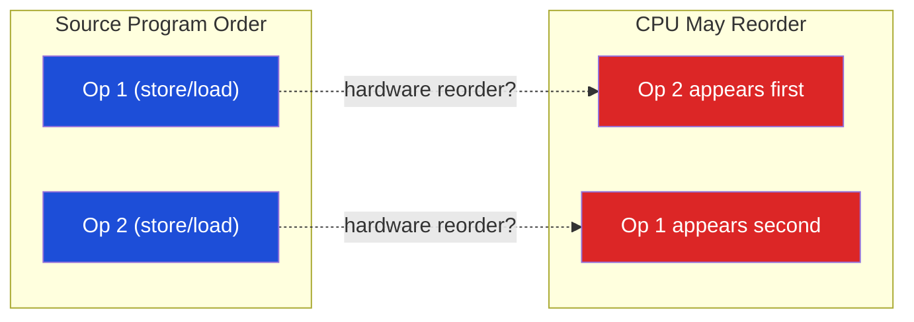

# 🚧 Memory Barriers and Ordering

> [!abstract] TL;DR
> Memory barriers (fences) prevent CPU and compiler reordering of memory operations. Four types of reordering exist: Store-Load (W→R, most common, allowed on x86 TSO), Load-Load (R→R), Store-Store (W→W), Load-Store (R→W). x86 TSO allows only W→R reordering; `mfence` prevents it (full fence), `sfence` orders stores, `lfence` orders loads. ARM relaxed model allows all four; `dmb ish` is the full fence, `dmb ishld`/`dmb ishst` are partial fences. `dsb` is stronger (waits for cache maintenance). C++ `memory_order_seq_cst` generates full fences; `acquire`/`release` generate partial fences; `relaxed` generates no fence (just atomicity). `volatile` ≠ `atomic` — volatile only prevents compiler optimization, not CPU reordering.

## Intuition — analogy FIRST

A memory barrier is like a "do not pass" road sign for the CPU's instruction reordering engine. Without barriers, the CPU's out-of-order engine and compiler optimizer freely reorder operations for performance. A barrier tells both: "every operation before this sign must complete before any operation after it can be seen by others." `mfence` is a full four-way stop; `sfence` only blocks trucks (stores); `lfence` only blocks cars (loads).

---

## How It Works

### The Four Memory Reorderings



| Reordering | Type | x86 TSO | ARM | Prevented By |
|------------|------|---------|-----|-------------|
| Store-Load | W→R | ALLOWED | ALLOWED | mfence / dmb ish |
| Load-Load | R→R | No | ALLOWED | lfence / dmb ishld |
| Store-Store | W→W | No | ALLOWED | sfence / dmb ishst |
| Load-Store | R→W | No | ALLOWED | Full fence |

**x86 TSO**: only W→R is allowed (store buffer drains lazily). All other orderings are free.
**ARM**: all four are allowed. Every shared memory access potentially needs explicit fencing.

### x86 Memory Fence Instructions

```asm
; MFENCE — Full memory fence
; Ensures: all loads/stores BEFORE mfence complete before any load/store AFTER
mfence
; Cost: ~40 cycles (serializes the store buffer + memory bus)

; SFENCE — Store fence
; Ensures: all stores BEFORE sfence are globally visible before any store AFTER
sfence
; Useful for: write-combining memory (WC), non-temporal stores

; LFENCE — Load fence  
; Ensures: all loads BEFORE lfence complete before any load AFTER
; Also: serializes out-of-order speculative execution (used for Spectre mitigation)
lfence
```

**When each is needed on x86**:
```c
// Scenario: producer-consumer with flag
// WRONG on x86 (store to data may not be visible before flag)
data = 42;         // store
flag = 1;          // store — may appear reordered with data store? NO on x86 (W→W preserved)
                   // BUT: flag load by consumer may bypass data store via store buffer!

// Thread 1 (producer):
data = 42;
_mm_sfence();      // sfence ensures data is globally visible before flag
flag = 1;

// Thread 2 (consumer):
while (!flag);
_mm_lfence();      // lfence ensures flag load completes before data load
int x = data;      // guaranteed to see 42 on x86 TSO (W→R was the only gap)

// SIMPLER: use std::atomic with release/acquire (compiler generates correct fences)
```

### ARM Memory Barrier Instructions

```asm
// DMB ISH — Data Memory Barrier (Inner Shareable domain)
// Ensures all preceding memory accesses visible before any following
dmb ish         // full fence (all preceding stores and loads visible)
dmb ishld       // load-load + load-store barrier (ordered loads)
dmb ishst       // store-store + load-store barrier (ordered stores)

// DSB ISH — Data Synchronization Barrier (stronger)
// Waits for all pending cache/TLB maintenance to complete + dmb
dsb ish         // required after cache invalidation, TLB operations

// ISB — Instruction Synchronization Barrier
// Flushes instruction pipeline; required after changing MMU settings
isb             // pipeline flush (very strong, very slow)

// STLR / LDAR — Hardware load-acquire / store-release
stlr x0, [x1]  // store-release: all preceding accesses visible before this store
ldar x0, [x1]  // load-acquire: this load visible before all following accesses
```

### C++ Memory Ordering — Complete Reference

```cpp
#include <atomic>
std::atomic<int> x{0}, y{0};

// seq_cst (Sequential Consistency — strongest, default)
x.store(1, std::memory_order_seq_cst);   // atomic + full fence
int v = x.load(std::memory_order_seq_cst);

// release (on store)
x.store(1, std::memory_order_release);   // all preceding ops visible before this store
// → x86: plain MOV (TSO W→W preserved) 
// → ARM: STLR (store-release)

// acquire (on load)
int v = x.load(std::memory_order_acquire);  // this load before all following ops
// → x86: plain MOV (TSO L→L preserved)
// → ARM: LDAR (load-acquire)

// acq_rel (for read-modify-write: atomic add, CAS)
x.fetch_add(1, std::memory_order_acq_rel);

// relaxed (no ordering, just atomicity)
x.store(1, std::memory_order_relaxed);   // atomic but no fence
x.fetch_add(1, std::memory_order_relaxed);  // atomic increment, no ordering
```

### Assembly Generated on x86 vs ARM

```cpp
std::atomic<int> flag{0};
int data = 0;

// Producer
data = 42;
flag.store(1, std::memory_order_release);
```

```asm
; x86-64 (store-release = just MOV on TSO):
mov DWORD PTR [data], 42
mov DWORD PTR [flag], 1     ; plain store (TSO prevents W→W reordering)

; ARM64 (store-release = STLR):
mov w0, #42
str w0, [data_addr]
mov w0, #1
stlr w0, [flag_addr]        ; STLR: store-release barrier
```

```cpp
// Consumer
while (!flag.load(std::memory_order_acquire));
int x = data;
```

```asm
; x86-64:
.loop:
    mov eax, [flag]           ; plain load (TSO prevents R→R reordering)
    test eax, eax
    jz .loop
    mov eax, [data]           ; guaranteed to see 42

; ARM64:
.loop:
    ldar w0, [flag_addr]     ; LDAR: load-acquire barrier
    cbz w0, .loop
    ldr w1, [data_addr]      ; loads after acquire, guaranteed to see 42
```

### Lock-Free Flag Pattern

```cpp
// Correct producer-consumer flag using acquire-release
std::atomic<int> flag{0};
int data[1024];   // shared, non-atomic

// Thread 1 (producer):
data[0] = compute();
flag.store(1, std::memory_order_release);  // "I'm done writing data"

// Thread 2 (consumer):
while (flag.load(std::memory_order_acquire) == 0) {}  // "Is producer done?"
process(data[0]);  // guaranteed to see computed value
```

### Linux Kernel Barrier Macros

```c
/* arch/riscv/include/asm/barrier.h */
#define mb()   __asm__ __volatile__ ("fence rw, rw" : : : "memory")
#define rmb()  __asm__ __volatile__ ("fence r, r"  : : : "memory")
#define wmb()  __asm__ __volatile__ ("fence w, w"  : : : "memory")

#define smp_mb()  mb()
#define smp_rmb() rmb()
#define smp_wmb() wmb()

/* arch/x86/include/asm/barrier.h */
#define mb()   asm volatile("mfence" : : : "memory")
#define rmb()  asm volatile("lfence" : : : "memory")
#define wmb()  asm volatile("sfence" : : : "memory")
#define smp_mb()  asm volatile("lock; addl $0, -4(%%rsp)" : : : "memory", "cc")
/* note: lock addl is cheaper than mfence on some microarchitectures */
```

### Volatile vs Atomic — Critical Distinction

```c
// WRONG: volatile doesn't prevent CPU reordering
volatile int flag = 0;
volatile int data = 0;

// Thread 1: data = 42; flag = 1;
// → compiler won't cache them, BUT CPU may reorder (esp. on ARM)
// → Thread 2 could see flag=1 before data=42!

// CORRECT: atomic with proper ordering
std::atomic<int> flag{0};
int data = 0;  // data doesn't need to be atomic (only flag synchronizes it)

// Thread 1:
data = 42;
flag.store(1, std::memory_order_release);  // ensures data visible before flag

// Thread 2:
while (!flag.load(std::memory_order_acquire)) {}
// NOW safe: acquire of flag creates happens-before with release of flag
// → data = 42 is visible
```

---

## Real-World Notes

- Linux READ_ONCE/WRITE_ONCE: prevents compiler from eliminating or merging reads/writes of non-atomic variables (equivalent to `volatile` in this limited sense) — used for lock-free algorithms where ordering is separately guaranteed
- Java `volatile`: provides full visibility guarantee + happens-before (effectively seq_cst in Java Memory Model)
- `lock cmpxchg` (x86 CAS): includes full fence semantics — prevents all reordering around it
- Memory barrier costs on x86: `mfence` ≈ 40 cycles; `sfence` ≈ 20 cycles; `lock add` ≈ 22 cycles (cheaper than mfence, often preferred)

---

## Common Pitfalls

1. **"volatile makes it thread-safe on x86"** — TSO prevents W→W and R→R reordering, so many buggy patterns accidentally work on x86. Port to ARM and they break. Always use `std::atomic`
2. **Missing barrier between DMA setup and doorbell** — MMIO doorbell must come after DMA descriptor write is visible. `wmb()` ensures descriptor write precedes doorbell on all architectures
3. **Acquire-release doesn't give total order** — Two threads each doing release-stores to different variables and acquire-loads of the other's variable can still observe inconsistency in the ordering. Only seq_cst gives a total global order
4. **Double-checked locking without barriers** — Classic broken singleton: `if (!init) { lock(); if (!init) { obj = new T(); init = true; } }`. `obj` may be visible before `init` without barriers. Fix: `init.store(true, release)`
5. **Benign vs pernicious data races** — A data race is undefined behavior in C++, even if it "works" on your machine. The compiler may optimize based on the assumption there are no data races, producing surprising code transformations

---

## Related Concepts

- [[_MOC_Parallel_Computing|↑ Parallel Computing MOC]]
- [[Cache_Coherence_MESI]] — Coherence ensures all caches agree on values; barriers ensure ordering of when those values become visible
- [[Multi_Core_Programming]] — Practical use of barriers in lock-free programming
- [[../03_Memory_Systems/Memory_Consistency_Models|Memory Consistency Models]] — The formal model defining what barriers guarantee
- [[../05_Assembly_RISCV/RISCV_Extensions|RISC-V A Extension]] — LR/SC and AMO include `.aq`/`.rl` ordering modifiers

---

## Review Questions

1. Show a specific four-thread execution where two release-stores to different variables, each followed by an acquire-load of the other variable, still produces an inconsistent result. Explain why `seq_cst` prevents this.
2. On ARM, write the minimal barrier sequence needed for: (a) a spinlock acquire, (b) a spinlock release. Justify each barrier choice.
3. The Linux kernel uses `lock; addl $0, -4(%rsp)` instead of `mfence` for `smp_mb()`. Why does this work, and what is the performance advantage? What does the `lock` prefix actually do?

---

## Sources

- McKenney, P. "Memory Barriers: a Hardware View for Software Hackers", lwn.net (2010)
- ARM Architecture Reference Manual, Section B2 (Memory Ordering)
- Boehm, H. "Can Seqlocks Get Along with Programming Language Memory Models?", MSPC 2012
- ISO/IEC 14882:2020 (C++20 Standard), Section 6.9.2 (Threads and data races)

#Computer_Architecture #Parallel_Computing #Memory_Barriers #Memory_Ordering
