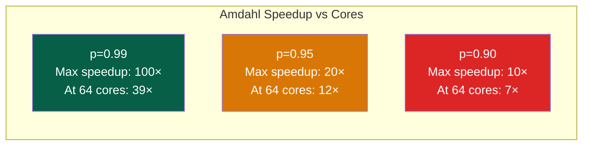

# 🔗 Multi-Core Programming

> [!abstract] TL;DR
> Multi-core programming exploits thread-level parallelism. Amdahl's Law: S = 1/((1−p) + p/N) — with serial fraction (1−p), maximum speedup = 1/(1−p) regardless of N. pthreads provide POSIX low-level threads; OpenMP adds `#pragma omp parallel for` for data-parallel loops with reduction clauses. False sharing occurs when two threads write to different variables sharing a cache line (64 bytes) — causes MESI invalidation storms. Solution: `alignas(64)` padding. Lock-free algorithms (Michael-Scott queue, hazard pointers) avoid mutex overhead. ThreadSanitizer (`-fsanitize=thread`) detects data races at runtime.

## Intuition — analogy FIRST

False sharing is like two chefs sharing a single cutting board: even though they each have their own corner to chop on, every time either chef makes a cut, the other must wait for the board to be passed back. The solution: give each chef their own cutting board (pad to separate cache lines). Amdahl's Law is like a road trip where highways (parallel) are fast but traffic jams (serial) always slow you down — no matter how many highways you add.

---

## How It Works

### Amdahl's Law

```
S(N) = 1 / ((1-p) + p/N)

S = speedup with N parallel resources
p = fraction of work that is parallelizable
(1-p) = serial fraction (cannot be parallelized)
```



**Gustafson's Law** (alternative): If problem size scales with N cores, speedup ≈ N (weak scaling). Amdahl assumes fixed problem size (strong scaling).

### pthreads — POSIX Threads

```c
#include <pthread.h>

typedef struct { double *arr; int start, end; double sum; } Work;

void *sum_thread(void *arg) {
    Work *w = (Work*)arg;
    w->sum = 0;
    for (int i = w->start; i < w->end; i++)
        w->sum += w->arr[i];
    return NULL;
}

int main() {
    const int T = 4, N = 1024*1024;
    double arr[N];   // initialized...
    pthread_t threads[T];
    Work work[T];

    for (int t = 0; t < T; t++) {
        work[t] = (Work){ arr, t*N/T, (t+1)*N/T, 0 };
        pthread_create(&threads[t], NULL, sum_thread, &work[t]);
    }

    double total = 0;
    for (int t = 0; t < T; t++) {
        pthread_join(threads[t], NULL);
        total += work[t].sum;
    }
    printf("Sum: %f\n", total);
}
```

**pthread synchronization primitives**:
```c
pthread_mutex_t lock = PTHREAD_MUTEX_INITIALIZER;
pthread_mutex_lock(&lock);
// critical section
pthread_mutex_unlock(&lock);

pthread_rwlock_t rwlock = PTHREAD_RWLOCK_INITIALIZER;
pthread_rwlock_rdlock(&rwlock);   // multiple readers OK
pthread_rwlock_wrlock(&rwlock);   // exclusive write
pthread_rwlock_unlock(&rwlock);

pthread_barrier_t barrier;
pthread_barrier_init(&barrier, NULL, T);  // T threads must reach
pthread_barrier_wait(&barrier);           // synchronize point
```

### OpenMP — Data-Parallel Loops

```c
#include <omp.h>

// Parallel loop with reduction
double sum = 0.0;
#pragma omp parallel for reduction(+:sum) schedule(static)
for (int i = 0; i < N; i++) {
    sum += arr[i];
}

// Parallel sections (different work in each thread)
#pragma omp parallel num_threads(4)
{
    int tid = omp_get_thread_num();
    printf("Thread %d of %d\n", tid, omp_get_num_threads());
    
    #pragma omp for schedule(dynamic, 64)  // dynamic: 64-element chunks
    for (int i = 0; i < N; i++) {
        result[i] = heavy_compute(input[i]);
    }
}

// Task-based (for recursive/irregular parallelism)
#pragma omp parallel
#pragma omp single
{
    #pragma omp task  // spawn task
    compute_A();
    #pragma omp task  // spawn another task (concurrent with A)
    compute_B();
    #pragma omp taskwait  // wait for both tasks
}
```

**Schedule types**:
| Schedule | Description | Best For |
|----------|-------------|---------|
| `static` | Equal chunks, assigned upfront | Uniform work |
| `dynamic, N` | N-element chunks, first-come-first-served | Variable work |
| `guided` | Large chunks initially, shrink to 1 | Varying load |
| `auto` | Runtime decides | General |

### C++11 Thread and Future

```cpp
#include <thread>
#include <future>
#include <numeric>

// std::thread
std::thread t([]{ std::cout << "hello from thread\n"; });
t.join();

// std::async — returns future
auto future = std::async(std::launch::async, []() {
    return std::accumulate(arr, arr+N, 0LL);
});
long result = future.get();  // blocks until computation done

// std::atomic — lock-free counter
std::atomic<int> counter{0};
#pragma omp parallel for
for (int i = 0; i < N; i++)
    counter.fetch_add(1, std::memory_order_relaxed);
```

### False Sharing

**Problem**: Two threads write to different variables that happen to be in the same 64-byte cache line. Every store by Thread A invalidates Thread B's cached line, causing cache misses.

```c
// BAD: false sharing
struct {
    int counter_a;  // Thread 0 writes this
    int counter_b;  // Thread 1 writes this  ← SAME CACHE LINE!
} shared;

// Thread 0: shared.counter_a++ (every write invalidates Thread 1's cache entry)
// Thread 1: shared.counter_b++ (every write invalidates Thread 0's cache entry)
// → Up to 40× slowdown vs single-thread!
```

**Fix: Pad to cache line boundary**:
```c
// GOOD: each counter in its own cache line
struct alignas(64) PaddedCounter {
    int value;
    char pad[60];   // pad to 64 bytes
};

PaddedCounter counter_a, counter_b;  // now separate cache lines

// C++17:
struct alignas(std::hardware_destructive_interference_size) CacheAligned {
    int value;
};
```

**Detection**: `perf stat -e cache-misses` shows increased misses; `perf c2c` (cache-to-cache) specifically identifies false sharing.

### Lock-Free Programming

**Michael-Scott Lock-Free Queue** (push/pop without mutex):
```cpp
#include <atomic>

template<typename T>
struct Node { T data; std::atomic<Node*> next{nullptr}; };

template<typename T>
struct LockFreeQueue {
    std::atomic<Node<T>*> head, tail;

    void push(T val) {
        auto node = new Node<T>{val};
        Node<T>* old_tail;
        while (true) {
            old_tail = tail.load();
            auto next = old_tail->next.load();
            if (next == nullptr) {
                if (old_tail->next.compare_exchange_weak(next, node))
                    break;  // CAS succeeded
            } else {
                tail.compare_exchange_weak(old_tail, next);  // help advance tail
            }
        }
        tail.compare_exchange_weak(old_tail, node);  // advance tail
    }
    // pop() similarly uses CAS on head
};
```

**ABA Problem**: Between loading a pointer and performing CAS, the pointed-to node might be freed and reallocated at the same address with a different value — CAS succeeds incorrectly. Solutions: tagged pointers (version counter in low/high bits), hazard pointers (prevent reuse while in use), epoch-based reclamation.

### ThreadSanitizer (TSan)

```bash
# Compile with ThreadSanitizer
gcc -O1 -fsanitize=thread -g ./racy_prog.c -o racy

# Run: TSan intercepts memory accesses
./racy

# Output on data race:
# WARNING: ThreadSanitizer: data race (pid=12345)
#   Write of size 4 at 0x7f4d... by thread T2:
#     #0 increment racy.c:12
#   Previous write of size 4 at 0x7f4d... by thread T1:
#     #0 increment racy.c:12
```

TSan overhead: 5–20× slowdown, 5–10× memory overhead — use in testing, not production.

---

## Real-World Notes

- OpenMP tasks + dependencies (`depend(in:a, out:b)`) enable DAG-style parallel execution, exposing more parallelism than simple loop parallelism
- `numactl --cpunodebind=0` pins all threads to one NUMA node — critical for latency-sensitive multi-thread workloads
- Go's goroutines and Rust's Rayon library provide higher-level abstractions with the same hardware mechanisms (SIMD + multi-core + atomics)
- `taskset -c 0-3 ./prog` pins a program to cores 0-3 (avoids thread migration overhead)

---

## Common Pitfalls

1. **Shared mutable state without synchronization** — Any shared write from multiple threads without atomics or mutexes is a data race = undefined behavior in C/C++
2. **False sharing at structure boundary** — Adjacent array elements accessed by different threads share cache lines. Use per-thread accumulator, then reduce at the end
3. **OpenMP reduction variable** — Don't manually update a shared reduction variable inside a parallel region: `sum += x` is not atomic. Use `reduction(+:sum)` clause
4. **Lock order violation → deadlock** — Two mutexes acquired in different order by two threads deadlock. Establish a canonical lock order (by address, by ID) and always acquire in that order
5. **Lock-free is not wait-free** — Lock-free guarantees some thread makes progress; wait-free guarantees ALL threads make progress in bounded steps. Michael-Scott queue is lock-free but not wait-free (a thread may be interrupted by others repeatedly)

---

## Related Concepts

- [[_MOC_Parallel_Computing|↑ Parallel Computing MOC]]
- [[SIMD_and_Vector_ISA]] — Orthogonal parallelism: SIMD within a core, multi-core across cores
- [[Cache_Coherence_MESI]] — Hardware mechanism underlying false sharing and coherence cost
- [[Memory_Barriers_and_Ordering]] — Lock-free algorithms require careful memory ordering
- [[../03_Memory_Systems/NUMA_and_Memory_Bandwidth|NUMA]] — Thread affinity affects NUMA performance in multi-core workloads

---

## Review Questions

1. A task has 5% serial fraction. Using Amdahl's Law, at how many cores does the speedup plateau at 90% of maximum? At what core count is the marginal speedup per added core < 1%?
2. Two threads each have a loop: `for(i) local_sum += arr[i * stride]`. With stride=1 and 4 threads on a 4-core machine, what stride value minimizes false sharing for local_sum if sums are stored in `sums[thread_id]`?
3. Design a lock-free stack (push/pop) using `std::atomic` and CAS. Identify where the ABA problem can occur and describe a tagged pointer solution.

---

## Sources

- Herlihy, M. & Shavit, N. *The Art of Multiprocessor Programming*, 2nd ed.
- OpenMP Specification 5.1, openmp.org
- Drepper, U. "What Every Programmer Should Know About Memory", Section 6

#Computer_Architecture #Parallel_Computing #Multi_Core #OpenMP #False_Sharing
