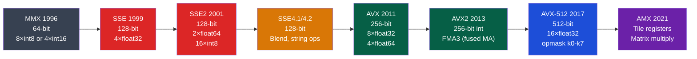

# 🚀 SIMD and Vector ISA

> [!abstract] TL;DR
> SIMD (Single Instruction, Multiple Data) applies one operation to multiple data elements simultaneously. x86 evolution: SSE (128-bit, 4×float32), SSE2 (128-bit int), AVX (256-bit, 8×float32), AVX2 (256-bit int + FMA), AVX-512 (512-bit, 16×float32, opmask registers k0–k7 for predicated operations). Intrinsics provide C-level access: `_mm256_add_epi32(a, b)` adds 8 int32s in one instruction. Data must be 32-byte aligned for AVX loads (`__attribute__((aligned(32)))`). GCC/Clang auto-vectorize with `-O3`; use `-fopt-info-vec` to see what was vectorized. AVX-512's 512-bit width processes 16 float32s per cycle at peak throughput.

## Intuition — analogy FIRST

SIMD is like a bakery's industrial bread slicer: instead of cutting one slice at a time (scalar), it cuts 16 slices simultaneously (SIMD). The bread loaf (data array) must be aligned to the slicer (aligned to SIMD width). Masked operations (AVX-512) are like the slicer cutting only the slices you specify, leaving others untouched.

---

## How It Works

### SIMD Evolution Timeline



### Register Width and Element Counts

| ISA | Register Width | float32 | float64 | int32 | int8 |
|-----|---------------|---------|---------|-------|------|
| SSE | 128-bit (xmm0-xmm15) | 4 | 2 | 4 | 16 |
| AVX | 256-bit (ymm0-ymm15) | 8 | 4 | 8 | 32 |
| AVX-512 | 512-bit (zmm0-zmm31) | 16 | 8 | 16 | 64 |

### Intrinsic Naming Convention

```
_mm[width]_[operation]_[type]

Width:   (empty) = 128, 256 = 256, 512 = 512
Type:    epi8/epi16/epi32/epi64 (signed int), epu8.. (unsigned), ps (float32), pd (float64)

Examples:
_mm_add_ps(a, b)          → 128-bit: 4×float32 add
_mm256_add_epi32(a, b)    → 256-bit: 8×int32 add
_mm512_mul_ps(a, b)       → 512-bit: 16×float32 multiply
_mm256_fmadd_ps(a, b, c)  → FMA: a*b + c, 8×float32
```

### AVX2 Code Example — SAXPY

```c
#include <immintrin.h>
#include <stddef.h>

// SAXPY: y[i] = a * x[i] + y[i] for i in [0, N)
void saxpy_avx2(float a, float *x, float *y, size_t N) {
    __m256 va = _mm256_set1_ps(a);  // broadcast scalar a to all 8 lanes
    
    size_t i = 0;
    // Vectorized loop: 8 floats per iteration
    for (; i + 8 <= N; i += 8) {
        __m256 vx = _mm256_loadu_ps(x + i);   // load 8 floats from x (unaligned)
        __m256 vy = _mm256_loadu_ps(y + i);   // load 8 floats from y
        vy = _mm256_fmadd_ps(va, vx, vy);     // vy = va*vx + vy (FMA, one rounding)
        _mm256_storeu_ps(y + i, vy);           // store 8 results
    }
    // Scalar cleanup for remainder
    for (; i < N; i++) {
        y[i] = a * x[i] + y[i];
    }
}
```

### Alignment

```c
// Aligned allocation: 32-byte alignment for AVX (256-bit)
float *buf = (float*)aligned_alloc(32, N * sizeof(float));
// Or: __attribute__((aligned(32))) float buf[N];

// Aligned vs unaligned load:
__m256 va = _mm256_load_ps(ptr);    // aligned load: ptr must be 32-byte aligned
__m256 vb = _mm256_loadu_ps(ptr);   // unaligned load: any alignment (slightly slower)

// AVX-512: 64-byte alignment
float *buf512 = (float*)aligned_alloc(64, N * sizeof(float));
__m512 vc = _mm512_load_ps(ptr64);  // 64-byte aligned load
```

### AVX-512 — Opmask Registers (k0–k7)

AVX-512 introduces 8 opmask (predicate) registers for per-element masking:

```c
#include <immintrin.h>

// Create mask: which lanes have values > threshold
__m512 vdata = _mm512_load_ps(data);
__m512 vthresh = _mm512_set1_ps(0.5f);
__mmask16 mask = _mm512_cmp_ps_mask(vdata, vthresh, _CMP_GT_OQ);  // 16-bit mask

// Masked add: only add where mask bit = 1
__m512 result = _mm512_mask_add_ps(vdata, mask, vdata, _mm512_set1_ps(1.0f));
// Elements where mask=0 retain original vdata value

// Zero-masked: elements where mask=0 become 0
__m512 result2 = _mm512_maskz_add_ps(mask, vdata, _mm512_set1_ps(1.0f));
```

### Auto-Vectorization

GCC/Clang automatically vectorize loops with `-O2` or `-O3`:

```bash
# Check what was vectorized
gcc -O3 -march=native -fopt-info-vec saxpy.c -o saxpy 2>&1 | grep "vectorized"

# Force a specific SIMD width
gcc -O3 -mavx2 -mfma saxpy.c -o saxpy

# Prevent vectorization of specific loop:
#pragma GCC novector
for (int i = 0; i < N; i++) { ... }
```

**Requirements for auto-vectorization**:
1. Loop with known or bounded iteration count
2. No loop-carried dependencies (each iteration independent)
3. Contiguous memory access (stride-1 or known stride)
4. No side effects that prevent reordering
5. Supported data types (float32, float64, int8–int64)

**Hints for auto-vectorization**:
```c
// Restrict keyword: promise pointers don't alias
void add(float * restrict a, float * restrict b, float * restrict c, int n) {
    for (int i = 0; i < n; i++) c[i] = a[i] + b[i];  // auto-vectorized with restrict
}

// OpenMP SIMD directive (explicit vectorization hint)
#pragma omp simd
for (int i = 0; i < N; i++) y[i] = a * x[i] + y[i];
```

### Performance Impact

| Implementation | Throughput (relative) | Cycles/iter |
|----------------|----------------------|-------------|
| Scalar (no SIMD) | 1× | 16 |
| SSE (4 float32) | 4× | 4 |
| AVX (8 float32) | 8× | 2 |
| AVX-512 (16 float32) | 16× | 1 |
| AVX-512 + FMA | 32× (2 ops/element) | 0.5 |

*Assumes same throughput latency; practical gains lower due to memory bandwidth.

---

## Real-World Notes

- Intel's frequency throttle: AVX-512 heavy workloads cause CPU frequency to drop by 100–400 MHz on Skylake-X (AVX-512 license reduction). Skylake-SP, Ice Lake-SP: no throttle
- GCC `__builtin_ia32_*` intrinsics are lower-level than the `_mm*` API — always prefer `_mm*`
- ARM SVE (Scalable Vector Extension) is ARM's answer to AVX-512 with variable SIMD width (128–2048 bits), conceptually similar to RISC-V V extension
- `godbolt.org` (Compiler Explorer) is the best tool for inspecting auto-vectorization output

---

## Common Pitfalls

1. **Alignment fault** — Using `_mm256_load_ps` on a non-32-byte-aligned pointer causes SIGBUS (or General Protection Fault on x86). Use `loadu` if alignment isn't guaranteed
2. **Horizontal operations are expensive** — `hadd`, `hsum` (horizontal add across lanes) require shuffles and are much slower than vertical ops. Restructure algorithms to keep operations vertical (same lane positions across vectors)
3. **AVX-512 throttling on older CPUs** — Running AVX-512 on Skylake-X throttles frequency. Measure end-to-end throughput, not just instruction throughput
4. **gather/scatter latency** — `_mm256_i32gather_ps` (indexed gather) is often slower than sequential load + shuffle for small stride patterns
5. **FP reassociation with SIMD** — Compiler may reorder FP operations for vectorization. `--fno-associative-math` prevents this (at cost of vectorization). Check if numerical results change

---

## Related Concepts

- [[_MOC_Parallel_Computing|↑ Parallel Computing MOC]]
- [[Multi_Core_Programming]] — Thread-level parallelism orthogonal to SIMD
- [[GPU_Architecture_and_CUDA]] — GPU uses SIMT (same instruction, multiple threads) — analogous to SIMD
- [[../05_Assembly_RISCV/RISCV_Extensions|RISC-V V Extension]] — RISC-V's scalable vector architecture

---

## Review Questions

1. A SAXPY kernel processes 1M float32 elements. Theoretical peak: 16 float32 FMA/cycle at 3 GHz with AVX-512. Memory bandwidth: 50 GB/s. Is this kernel compute-bound or memory-bound? Calculate the arithmetic intensity.
2. Write a branchless absolute value for 8 float32s using AVX2 intrinsics (hint: use `_mm256_andnot_ps` with sign mask). Verify correctness for positive, negative, and NaN inputs.
3. A loop has the pattern `y[i] = f(x[i]) + g(i)` where `g(i)` is a random memory access from a lookup table. Can this be auto-vectorized? Why or why not? What intrinsic would you use manually?

---

## Sources

- Intel Intrinsics Guide: software.intel.com/sites/landingpage/IntrinsicsGuide/
- Fog, A. "Software Optimization Manuals", agner.org/optimize/
- Nuzman, D. & Henderson, R. "Multi-platform Auto-Vectorization", CGO 2006

#Computer_Architecture #Parallel_Computing #SIMD #AVX #Vectorization
