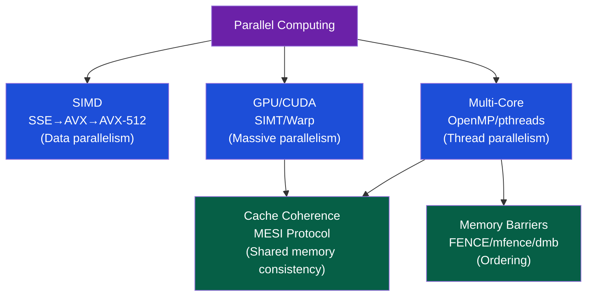

# ⚡ Parallel Computing — Section MOC

> [!abstract] Section Overview
> Parallel computing extracts performance by doing many things simultaneously. This section spans three levels: data-level parallelism (SIMD: SSE/AVX/AVX-512 intrinsics), thread-level parallelism (multi-core: OpenMP, C++ threads, false sharing, lock-free), and the massively parallel GPU (CUDA: SIMT execution, warp scheduling, shared memory optimization). Cache coherence (MESI protocol) keeps all cores' views consistent, and memory barriers enforce global memory ordering in relaxed-model architectures.

---

## Concept Map



---

## Learning Path

1. [[SIMD_and_Vector_ISA]] — SSE/AVX/AVX-512, intrinsics, alignment, auto-vectorization
2. [[Multi_Core_Programming]] — Amdahl, pthreads, OpenMP, false sharing, lock-free
3. [[GPU_Architecture_and_CUDA]] — SIMT, warp, occupancy, shared memory, streams
4. [[Cache_Coherence_MESI]] — M/E/S/I states, RFO, invalidation, MOESI, directory
5. [[Memory_Barriers_and_Ordering]] — x86/ARM reordering, mfence/dmb, C++ memory_order

---

## All Notes

| Note | Key Concepts | Difficulty |
|------|-------------|------------|
| [[SIMD_and_Vector_ISA]] | AVX-512 512-bit, k-mask, intrinsics, vectorization | Advanced |
| [[Multi_Core_Programming]] | Amdahl S=1/((1-p)+p/N), false sharing, ThreadSanitizer | Intermediate→Adv |
| [[GPU_Architecture_and_CUDA]] | warp32, coalescence 128B, shared mem 48KB, occupancy | Advanced |
| [[Cache_Coherence_MESI]] | MESI states, RFO, invalidation storms, MOESI | Advanced |
| [[Memory_Barriers_and_Ordering]] | 4 reorderings, x86 TSO, ARM dmb, seq_cst | Advanced |

---

## Amdahl's Law at a Glance

```
S = 1 / ((1-p) + p/N)

S = speedup, p = parallel fraction, N = cores

p=0.9, N=10:  S = 1/(0.1 + 0.09) = 5.26×
p=0.9, N=∞:  S = 1/0.1 = 10× (max)
p=0.99, N=100: S = 1/(0.01 + 0.0099) ≈ 50.2×
```

---

## Related Sections

- [[_MOC_Computer_Architecture_Master|↑ Master MOC]]
- [[../03_Memory_Systems/_MOC_Memory_Systems|← Memory Systems]] — Cache coherence extends cache hierarchy
- [[../02_CPU_Architecture/_MOC_CPU_Architecture|← CPU Architecture]] — Superscalar is intra-core ILP; this is inter-core/thread

#Computer_Architecture #Parallel_Computing #MOC
