# 🏛️ Computer Architecture & Digital Design — Master MOC

> [!abstract] Vault Overview
> 37-note vault covering the full stack from transistors to parallel GPU compute. Six sections span digital logic, CPU microarchitecture, memory hierarchies, I/O subsystems, RISC-V assembly, and parallel/SIMD/GPU programming. Designed for systems engineers, compiler writers, and anyone reasoning about hardware-software co-design.

---

## Vault Architecture

```mermaid
graph TD
    Master["🏛️ Computer Architecture Master"]:::master

    DL["⚡ 01 Digital Logic"]:::section
    CPU["🔧 02 CPU Architecture"]:::section
    MEM["🗄️ 03 Memory Systems"]:::section
    IO["🔌 04 I/O Systems"]:::section
    ASM["📟 05 Assembly & RISC-V"]:::section
    PAR["⚡ 06 Parallel Computing"]:::section

    Master --> DL & CPU & MEM & IO & ASM & PAR

    DL --> B["Boolean Algebra"]:::note
    DL --> C["Combinational Circuits"]:::note
    DL --> S["Sequential Circuits & FSMs"]:::note
    DL --> AR["Arithmetic & IEEE 754"]:::note
    DL --> HDL["HDLs & Verilog"]:::note

    CPU --> ISA["ISA: RISC vs CISC"]:::note
    CPU --> PIPE["Pipelining & Hazards"]:::note
    CPU --> BP["Branch Prediction"]:::note
    CPU --> OOO["Superscalar & OOO"]:::note
    CPU --> DP["CPU Datapath & Control"]:::note

    MEM --> CACHE["Cache Hierarchy"]:::note
    MEM --> DRAM["DRAM Architecture"]:::note
    MEM --> VM["Virtual Memory & TLB"]:::note
    MEM --> MC["Memory Consistency"]:::note
    MEM --> NUMA["NUMA & Bandwidth"]:::note

    IO --> BUS["Bus Arch & PCIe"]:::note
    IO --> IRQ["Interrupts & DMA"]:::note
    IO --> STOR["Storage: NVMe & SATA"]:::note
    IO --> SCHED["I/O Scheduling & io_uring"]:::note
    IO --> MMIO["Memory-Mapped I/O"]:::note

    ASM --> RISCV["RISC-V ISA Fundamentals"]:::note
    ASM --> APRG["Assembly Programming"]:::note
    ASM --> ABI["ABI & Calling Conventions"]:::note
    ASM --> EXT["RISC-V Extensions"]:::note
    ASM --> IASM["Inline Assembly in C"]:::note

    PAR --> SIMD["SIMD & Vector ISA"]:::note
    PAR --> MCORE["Multi-Core Programming"]:::note
    PAR --> GPU["GPU & CUDA"]:::note
    PAR --> MESI["Cache Coherence MESI"]:::note
    PAR --> MB["Memory Barriers & Ordering"]:::note

    classDef master fill:#6B21A8,color:#fff,stroke:#4C1D95
    classDef section fill:#1D4ED8,color:#fff,stroke:#1E3A8A
    classDef note fill:#065F46,color:#fff,stroke:#064E3B
```



---

## Sections Table

| # | Section | Notes | Core Concept | Difficulty |
|---|---------|-------|--------------|------------|
| 01 | [[_MOC_Digital_Logic\|⚡ Digital Logic]] | 5 | Boolean → FSM → IEEE 754 | Beginner→Int |
| 02 | [[_MOC_CPU_Architecture\|🔧 CPU Architecture]] | 5 | ISA → Pipeline → OOO | Intermediate |
| 03 | [[_MOC_Memory_Systems\|🗄️ Memory Systems]] | 5 | Cache → DRAM → Consistency | Intermediate→Adv |
| 04 | [[_MOC_IO_Systems\|🔌 I/O Systems]] | 5 | PCIe → DMA → NVMe | Intermediate |
| 05 | [[_MOC_Assembly_RISCV\|📟 Assembly & RISC-V]] | 5 | ISA Formats → ABI → Extensions | Intermediate |
| 06 | [[_MOC_Parallel_Computing\|⚡ Parallel Computing]] | 5 | SIMD → MESI → CUDA | Advanced |

---

## Learning Paths

### Path A — Systems Programmer
```
Boolean_Algebra → Combinational_Circuits → Sequential_Circuits →
ISA_Design → Pipelining → Cache_Hierarchy → Virtual_Memory →
RISCV_ISA → Assembly_Programming → ABI_Calling_Conventions
```

### Path B — Embedded/Hardware Engineer
```
Boolean_Algebra → Hardware_Description_Languages → Arithmetic_Circuits →
CPU_Datapath → RISCV_ISA → RISCV_Extensions → Inline_Assembly →
Bus_Architectures → Interrupts_DMA → Memory_Mapped_IO
```

### Path C — High-Performance Computing
```
Cache_Hierarchy → DRAM_Architecture → NUMA → Memory_Consistency →
SIMD_Vector_ISA → Multi_Core_Programming → Cache_Coherence_MESI →
Memory_Barriers → GPU_CUDA → Superscalar_OOO
```

### Path D — Security-Aware Systems
```
Virtual_Memory → Memory_Consistency → Cache_Hierarchy →
Branch_Prediction → Superscalar_OOO → Memory_Barriers →
DRAM_Architecture [Rowhammer] → Cache_Coherence
```

---

## Key Cross-Section Connections

| Concept | Appears In |
|---------|------------|
| ISA formats (R/I/S/B/U/J) | [[ISA_Design_RISC_vs_CISC\|ISA Design]] + [[RISCV_ISA_Fundamentals\|RISC-V ISA]] |
| Cache lines & alignment | [[Cache_Hierarchy\|Cache]] + [[SIMD_and_Vector_ISA\|SIMD]] + [[Multi_Core_Programming\|Multi-Core]] |
| Memory ordering | [[Memory_Consistency_Models\|Consistency]] + [[Memory_Barriers_and_Ordering\|Barriers]] + [[Cache_Coherence_MESI\|MESI]] |
| MMIO & DMA | [[Memory_Mapped_IO\|MMIO]] + [[Interrupts_and_DMA\|DMA]] + [[Cache_Hierarchy\|Cache coherency]] |
| TLB & page tables | [[Virtual_Memory_and_TLB\|VM/TLB]] + [[Interrupts_and_DMA\|IOMMU]] |
| IEEE 754 | [[Arithmetic_Circuits_and_IEEE754\|Arithmetic]] + [[RISCV_Extensions\|F/D extensions]] |

---

## Section MOC Index

- [[_MOC_Digital_Logic|⚡ Digital Logic MOC]]
- [[_MOC_CPU_Architecture|🔧 CPU Architecture MOC]]
- [[_MOC_Memory_Systems|🗄️ Memory Systems MOC]]
- [[_MOC_IO_Systems|🔌 I/O Systems MOC]]
- [[_MOC_Assembly_RISCV|📟 Assembly & RISC-V MOC]]
- [[_MOC_Parallel_Computing|⚡ Parallel Computing MOC]]

---

## Cross-Vault Links

- [[../AI-ML/_MOC_AI_ML_Master|AI/ML Master MOC]] — GPU compute bridges CUDA↔ML training
- [[../DSA/_MOC_DSA_Master|DSA Master MOC]] — Algorithm complexity ↔ cache-aware data structures
- [[../System Design/_MOC_SystemDesign_Master|System Design Master MOC]] — Hardware constraints inform distributed systems design
- [[../Database/_MOC_Database_Master|Database Master MOC]] — Storage interfaces, NVMe latency, buffer pool design

#Computer_Architecture #MOC #Master
