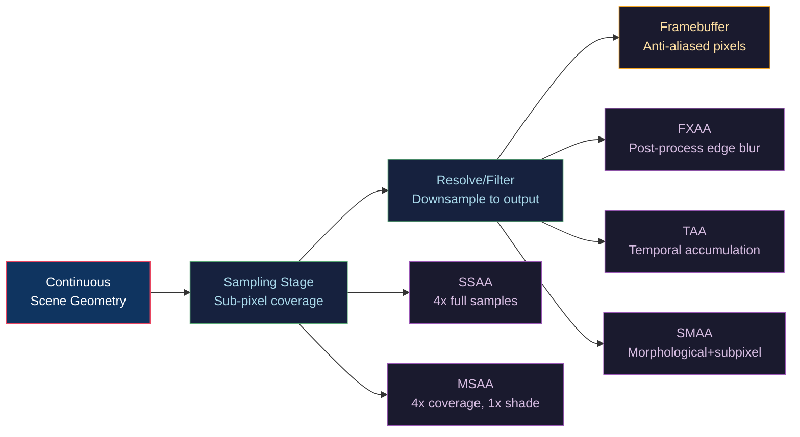

# 🔲 Anti-Aliasing

> [!abstract] TL;DR
> Aliasing is the spatial sampling artifact arising when the rasterization grid frequency falls below the Nyquist limit (fs > 2·fmax). SSAA renders at 4× resolution then downsamples — quality king but 4× cost. MSAA shares shading between sub-samples within a pixel, reducing cost to ~1.5–2× for typical geometry. FXAA is a pure post-process edge-blur (~0.5ms) with no G-buffer dependency. TAA accumulates jittered samples across frames using reprojection, achieving near-SSAA quality at near-zero per-frame cost but introducing ghosting on fast motion. SMAA combines morphological detection with sub-pixel blending for a balance of quality and cost without temporal history.

---

## Intuition — Analogy First

A photograph taken with a low-resolution camera of a fence will show Moiré patterns — the fence bars "beat" with the pixel grid, creating phantom patterns. Anti-aliasing is the photographic technique of slightly blurring the scene (pre-filtering) before sampling it, so no frequency survives that the grid cannot represent. In graphics, "blurring before sampling" means either averaging multiple samples per pixel (SSAA/MSAA) or approximating that average in a post-process (FXAA/SMAA/TAA).

---

## How It Works



### Nyquist–Shannon Sampling Theorem

For a signal with maximum frequency **fmax**, the sampling frequency **fs** must satisfy:

```
fs > 2 · fmax    (Nyquist criterion)
```

A pixel grid at resolution W×H samples the scene at frequency W pixels/unit horizontally. A sharp edge at a 45° angle produces frequency components up to the Nyquist limit. When the edge frequency exceeds the pixel grid frequency, aliasing occurs as "jaggies" (spatial aliasing) or "shimmer" (temporal aliasing on moving geometry).

---

## Key Concepts / Details

### SSAA — Supersampling Anti-Aliasing

Render the entire frame at N× resolution (typically 4× = 2× per axis), then downsample with a box or tent filter.

| Sample Count | Cost Multiplier | Quality |
|-------------|----------------|---------|
| 2× (1.41× per axis) | ~2× | Good |
| 4× (2× per axis) | ~4× | Excellent |
| 8× | ~8× | Near-perfect |

**Downsampling filter** — box filter averages all samples; tent filter weighs center samples more. The filter kernel determines frequency response.

### MSAA — Multisample Anti-Aliasing

MSAA decouples **geometry coverage** from **shading**. Within each pixel, N sub-sample positions are tested for triangle coverage. The fragment shader runs **once per pixel** (not per sample), and the final pixel color is the weighted average of covered samples.

```
Cost: O(N) for coverage tests, O(1) for shading
vs SSAA: O(N) coverage + O(N) shading
```

Sample positions are fixed patterns (e.g., MSAA-4x uses a rotated grid) to maximize coverage of different edge angles. The MSAA resolve (`glBlitFramebuffer`) averages the N color samples into the final output.

**Limitation**: MSAA only anti-aliases geometry edges. Texture aliasing, specular highlights, and alpha-tested geometry require additional techniques.

### FXAA — Fast Approximate Anti-Aliasing (NVIDIA)

Operates entirely as a post-process on the resolved LDR image, with no G-buffer or multi-sample buffers required.

**Algorithm sketch:**
1. Detect edges via luminance contrast: `luma = dot(color.rgb, vec3(0.299, 0.587, 0.114))`
2. Find local luma gradient direction (horizontal vs vertical edge)
3. Walk along the edge to find its extent
4. Blend the pixel with its neighbor perpendicular to the edge by subpixel blend factor

```glsl
// FXAA luma calculation
float FxaaLuma(vec4 rgba) {
    return rgba.w; // pre-computed alpha channel luma
}
// Contrast threshold
float rangeMax = max(lumaM, max(max(lumaN,lumaS), max(lumaE,lumaW)));
float rangeMin = min(lumaM, min(min(lumaN,lumaS), min(lumaE,lumaW)));
float range = rangeMax - rangeMin;
if(range < max(FXAA_EDGE_THRESHOLD_MIN, rangeMax * FXAA_EDGE_THRESHOLD))
    return rgbyM; // not an edge, return center
```

Cost: ~0.5ms on modern GPU. Quality: visible blur on fine detail (text, thin lines).

### TAA — Temporal Anti-Aliasing

Accumulates a new jittered sample each frame into a running history buffer. The jitter pattern (Halton sequence or blue noise) ensures complete sub-pixel coverage over 8–16 frames.

**Reprojection**: for each pixel, project back to previous frame using the motion vector, sample the history buffer, and blend:

```
current_output = lerp(history_reprojected, current_shaded, alpha)
// alpha ≈ 0.1 (10% new sample, 90% history)
```

**Ghosting mitigation**: clamp history sample to the neighbourhood color AABB of the current pixel before blending (variance clipping or YCoCg clamping).

**Temporal stability cost**: essentially free per-frame; requires motion vectors (GBuffer pass already produces these in deferred rendering).

### SMAA — Enhanced Sub-Pixel Morphological Anti-Aliasing

Combines morphological edge detection (like FXAA) with accurate sub-pixel blending weights computed from edge length estimates. Higher quality than FXAA with minimal extra cost.

| Technique | Cost | Quality | Temporal Stability | G-Buffer Needed |
|-----------|------|---------|-------------------|-----------------|
| SSAA 4× | 4× | Best | Perfect | No |
| MSAA 4× | ~1.5–2× | Very Good (edges only) | Good | No |
| FXAA | ~0.5ms | Fair (blurry) | Good | No |
| TAA | ~1ms (MV pass) | Very Good | Ghosting risk | Motion Vectors |
| SMAA | ~1ms | Good | Good | No |
| SMAA+TAA | ~1.5ms | Excellent | Best | Motion Vectors |

---

## Real-World Notes

- **Modern games** use TAA + SMAA hybrid; pure MSAA is rare in deferred pipelines (incompatible with G-buffers without MSAA resolve per-buffer).
- **DLSS/FSR** use temporal accumulation with ML upscaling — effectively TAA with learned upsampling, enabling rendering at 50% resolution.
- **VR** commonly uses MSAA because latency matters more than history stability.
- **Specular aliasing** (flickering highlights) requires separate filtering: `roughness = max(roughness, GeometricRoughness)` computed from mesh curvature.

---

## Common Pitfalls

1. **Alpha-tested leaves/fences with MSAA** — MSAA won't anti-alias within a triangle; use alpha-to-coverage (`gl_SampleMask`) instead.
2. **TAA ghosting on particles/VFX** — translucent objects often lack motion vectors; TAA treats them as static, causing smearing.
3. **FXAA on UI text** — morphological blur destroys sub-pixel rendering quality; disable FXAA for UI layers.
4. **MSAA with deferred shading** — G-buffers at 4× MSAA increase bandwidth 4× with no benefit for lighting; use SMAA or TAA instead.

---

## Related Concepts

- [[_MOC_2D_Graphics|↑ 2D Graphics MOC]]
- [[Rasterization_Algorithms|Rasterization Algorithms]] — the aliasing source
- [[../04_Shaders/Fragment_Shaders_and_Effects|Fragment Shaders]] — `dFdx`/`dFdy` for shader-level AA
- [[../03_Rendering_Pipeline/Framebuffers_and_Render_Targets|Framebuffers]] — MSAA FBO setup and resolve
- [[../05_Lighting_and_Materials/Texture_Mapping_and_UV|Texture Mapping]] — mipmapping as pre-filtering (texture AA)

---

## Review Questions

1. A game renders at 1080p with 4× MSAA. What is the approximate memory bandwidth increase for the framebuffer? How does TAA avoid this cost?
2. Why does MSAA fail to anti-alias specular highlights while SSAA handles them correctly?
3. Describe the ghosting artifact in TAA. What causes it, and how does variance clipping mitigate it?

---

## Sources

#Computer_Graphics #2D_Graphics #Anti_Aliasing
