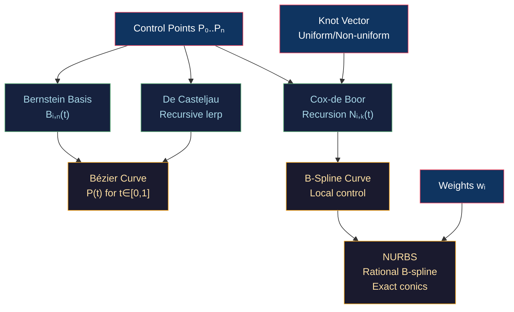

# 〰️ Bézier Curves and B-Splines

> [!abstract] TL;DR
> Bézier curves are polynomial parametric curves defined by n+1 control points via Bernstein basis polynomials Bᵢ,ₙ(t) = C(n,i)·tⁱ·(1−t)ⁿ⁻ⁱ. De Casteljau's algorithm evaluates any point by recursive linear interpolation — numerically stable, adaptive subdivision-ready. Cubic Bézier (degree 3, 4 control points) is the workhorse used in SVG, CSS, and font curves. B-splines generalize Bézier with local control (moving one point affects only k+1 spans) using Cox-de Boor recursion and knot vectors. NURBS (Non-Uniform Rational B-splines) add weights to represent conics exactly, enabling CAD-grade circles and ellipses. C0/C1/G1/G2 continuity describe positional, tangent, and curvature matching at join points.

---

## Intuition — Analogy First

Imagine a rubber band stretched between pegs. A Bézier curve is like pulling that band with an additional set of "ghost pegs" (control points) that attract the curve but which the curve need not pass through. The curve is the path a marble would roll along if the band had mass proportional to the distance from each ghost peg. Adding more pegs gives you more complex shapes, but each peg influences the entire curve (global control). B-splines fix this: each peg only influences a local segment, like separate rubber bands joined at seams.

---

## How It Works



---

## Key Concepts / Details

### Bernstein Basis

For degree n with parameter t ∈ [0,1]:

```
Bᵢ,ₙ(t) = C(n,i) · tⁱ · (1−t)^(n−i)
```

The curve is a weighted sum of control points:

```
P(t) = Σᵢ₌₀ⁿ Pᵢ · Bᵢ,ₙ(t)
```

Key properties:
- **Partition of unity**: Σ Bᵢ,ₙ(t) = 1 for all t → curve stays inside convex hull of control points
- **Endpoint interpolation**: P(0) = P₀, P(1) = Pₙ
- **Symmetry**: Bᵢ,ₙ(t) = Bₙ₋ᵢ,ₙ(1−t)

### De Casteljau Algorithm

Recursive linear interpolation for degree n at parameter t:

```
Pᵢ⁰ = Pᵢ                            (initial control points)
Pᵢʳ = (1−t)·Pᵢʳ⁻¹ + t·Pᵢ₊₁ʳ⁻¹     (r = 1..n, i = 0..n−r)
P(t) = P₀ⁿ                           (final result)
```

```python
def de_casteljau(points, t):
    """Evaluate Bezier curve at parameter t using De Casteljau."""
    pts = list(points)
    n = len(pts)
    for r in range(1, n):
        pts = [(1-t)*pts[i] + t*pts[i+1] for i in range(n - r)]
    return pts[0]

def bezier_subdivide(points, t=0.5):
    """Split a Bezier curve into two sub-curves at t."""
    left, right = [], []
    pts = list(points)
    left.append(pts[0])
    n = len(pts)
    for r in range(1, n):
        pts = [(1-t)*pts[i] + t*pts[i+1] for i in range(n - r)]
        left.append(pts[0])
        right.append(pts[-1])  # not quite right, simplified
    right.reverse()
    right.append(points[-1])
    return left, right
```

Subdivision is why De Casteljau is preferred for rendering: recursively subdivide until each sub-curve is flat (< 0.5px deviation from its chord), then draw a line segment.

### Degree Table

| Degree | Points | Name | Use |
|--------|--------|------|-----|
| 1 | 2 | Linear | Straight line |
| 2 | 3 | Quadratic | SVG Q command, TrueType fonts |
| 3 | 4 | Cubic | SVG C command, CSS timing, OpenType |
| n | n+1 | Degree-n | Animation blend curves |

### Continuity Conditions

| Class | Condition | Meaning |
|-------|-----------|---------|
| C0 | P(1) = Q(0) | Endpoints touch (no gap) |
| C1 | P'(1) = Q'(0) | Tangent direction AND magnitude match |
| G1 | P'(1) ∥ Q'(0) | Tangent direction only (any magnitude) |
| C2 | P''(1) = Q''(0) | Curvature continuity |
| G2 | Curvature magnitude matches | Smooth highlight transitions |

C1 requires the last two control points of segment 1 and first two of segment 2 to be **collinear and equidistant** from the join. G1 only requires collinearity (more flexible for designers).

### B-Splines and Cox-de Boor

A B-spline curve is:

```
C(t) = Σᵢ₌₀ⁿ Pᵢ · Nᵢ,ₖ(t)
```

Where Nᵢ,ₖ(t) is the B-spline basis of order k (degree k−1), computed via Cox-de Boor recursion:

```
Nᵢ,₁(t) = 1 if tᵢ ≤ t < tᵢ₊₁, else 0
Nᵢ,ₖ(t) = (t−tᵢ)/(tᵢ₊ₖ₋₁−tᵢ) · Nᵢ,ₖ₋₁(t)
         + (tᵢ₊ₖ−t)/(tᵢ₊ₖ−tᵢ₊₁) · Nᵢ₊₁,ₖ₋₁(t)
```

The **knot vector** T = {t₀, t₁, ..., tₘ} determines the parameterisation:
- **Uniform**: equal spacing → uniform speed
- **Clamped**: first and last knots repeated k times → curve passes through endpoints
- **Non-uniform**: allows varying density for complex shapes

**Local support**: Nᵢ,ₖ(t) is nonzero only on [tᵢ, tᵢ₊ₖ], so moving control point Pᵢ only affects spans i to i+k−1.

### NURBS — Non-Uniform Rational B-Splines

Adds a weight wᵢ per control point:

```
C(t) = Σ wᵢ·Pᵢ·Nᵢ,ₖ(t) / Σ wᵢ·Nᵢ,ₖ(t)
```

Setting weights correctly allows **exact representation of conics** (circles, ellipses, parabolas) — impossible with polynomial Bézier curves. Used in CAD (STEP files), 3D modeling (Rhino, CATIA), and subdivision surface tools.

---

## Real-World Notes

- **SVG path commands**: `C x1 y1 x2 y2 x y` = cubic Bézier; `Q x1 y1 x y` = quadratic Bézier
- **CSS easing functions**: `cubic-bezier(0.25, 0.1, 0.25, 1.0)` defines an easing curve clamped to t∈[0,1]
- **Font rendering**: TrueType uses quadratic Bézier (faster GPU tessellation); OpenType CFF uses cubic
- **Game splines**: Catmull-Rom splines are a special case of B-splines that pass through all control points (C1 continuity)

---

## Common Pitfalls

1. **High-degree Bézier curves** — degree 9+ becomes ill-conditioned (Runge phenomenon); use piecewise cubics (B-splines) instead.
2. **Confusing C1 and G1** — CSS/SVG designers often want G1 (smooth) but C1 (equal tangent magnitude) forces ugly control point placement when segment lengths differ.
3. **NURBS weight of 0** — causes division by zero in the rational formula; weights must be positive.
4. **Non-clamped B-spline endpoints** — a uniform B-spline does NOT pass through its first/last control points unless the knot vector is clamped.

---

## Related Concepts

- [[_MOC_2D_Graphics|↑ 2D Graphics MOC]]
- [[SVG_and_Vector_Graphics|SVG & Vector Graphics]] — SVG path `C`/`Q` commands use Bézier
- [[Canvas_2D_API|Canvas 2D API]] — `bezierCurveTo()` API
- [[../06_Animation_and_Simulation/Skeletal_Animation_and_Skinning|Skeletal Animation]] — slerp is the quaternion analogue of lerp used in De Casteljau

---

## Review Questions

1. Why does De Casteljau's algorithm handle subdivision naturally? How would you adaptively flatten a cubic Bézier to line segments?
2. You have two cubic Bézier segments joined at a point. What constraint on the control points ensures C1 continuity? What relaxation gives G1?
3. A NURBS circle with 9 control points can represent a perfect circle. Why can't a polynomial Bézier curve represent a circle exactly?

---

## Sources

#Computer_Graphics #2D_Graphics #Bezier #Curves
