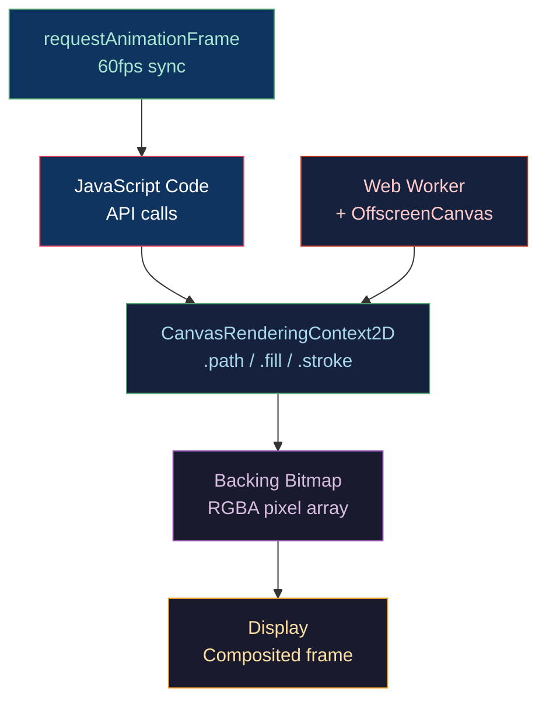

# 🖌️ Canvas 2D API

> [!abstract] TL;DR
> The HTML5 Canvas 2D API provides an immediate-mode raster drawing surface. `getContext('2d')` returns a `CanvasRenderingContext2D`; drawing calls immediately rasterize to the backing bitmap. The path API (beginPath/moveTo/lineTo/arc/bezierCurveTo/closePath + fill/stroke) forms the core. `globalCompositeOperation` controls Porter-Duff compositing (source-over, destination-out, xor, etc.). `getImageData`/`putImageData` give direct RGBA pixel access. `OffscreenCanvas` + `transferControlToOffscreen()` moves rendering to a Worker thread, preventing main-thread jank. The animation loop uses `requestAnimationFrame(callback)` which syncs to the display refresh rate.

---

## Intuition — Analogy First

Canvas 2D is like painting on a physical canvas: each brush stroke is permanent immediately, you can't "undo" by removing a shape (you must repaint the whole area), and there are no individual "objects" — just pixels. This is opposite to SVG's retained-mode model where shapes exist as DOM nodes. The trade-off is raw performance: pixel-level operations, thousands of shapes per frame, and full control over exactly what hits the screen.

---

## How It Works



---

## Key Concepts / Details

### Canvas Setup and Context

```html
<canvas id="c" width="800" height="600"></canvas>
```

```javascript
const canvas = document.getElementById('c');
const ctx = canvas.getContext('2d', {
    alpha: false,           // opaque canvas — 15% faster compositing
    desynchronized: true,   // low-latency (skips VSync on some browsers)
    willReadFrequently: true // hint for pixel readback optimization
});

// DPI scaling for sharp display on HiDPI screens
const dpr = window.devicePixelRatio || 1;
canvas.width = 800 * dpr;
canvas.height = 600 * dpr;
canvas.style.width = '800px';
canvas.style.height = '600px';
ctx.scale(dpr, dpr);
```

**Important**: CSS `width`/`height` set display size; `canvas.width`/`canvas.height` set pixel buffer size. Mismatch = blurry canvas on HiDPI.

### Path API

```javascript
ctx.beginPath();           // clear current path
ctx.moveTo(10, 10);
ctx.lineTo(100, 10);
ctx.lineTo(100, 100);
ctx.arc(50, 50, 40, 0, Math.PI * 2);  // x,y,r,startAngle,endAngle
ctx.bezierCurveTo(20, 40, 80, 40, 100, 80); // cp1x,cp1y,cp2x,cp2y,x,y
ctx.quadraticCurveTo(50, 0, 100, 100);      // cpx,cpy,x,y
ctx.closePath();           // line back to beginPath start

ctx.fillStyle = '#3498db';
ctx.fill('evenodd');       // fill rule: 'nonzero' or 'evenodd'
ctx.strokeStyle = 'rgba(0,0,0,0.5)';
ctx.lineWidth = 2;
ctx.stroke();
```

`beginPath()` is critical — forgetting it causes all previous paths to re-draw on each `fill()`/`stroke()` call, accumulating exponentially.

### globalCompositeOperation

Porter-Duff compositing modes control how new drawing blends with existing pixels:

| Mode | Effect | Use Case |
|------|--------|----------|
| `source-over` (default) | Painter's algorithm: new over old | Normal drawing |
| `destination-out` | New shape punches hole in old | Eraser, masking |
| `destination-in` | Keep only area covered by new | Clipping |
| `source-atop` | New only where old exists | Texture on shape |
| `xor` | XOR of alpha | Invert overlap |
| `lighter` | Additive blend | Glow, fire effects |
| `multiply` | Multiply RGB | Shadow darkening |
| `screen` | 1−(1−a)(1−b) | Lighten, bloom |

```javascript
// Create a spotlight effect: draw a circle that reveals background
ctx.globalCompositeOperation = 'destination-in';
ctx.beginPath();
ctx.arc(mouseX, mouseY, 100, 0, Math.PI * 2);
ctx.fill();
```

### ImageData — Direct Pixel Access

```javascript
// Read pixels
const imageData = ctx.getImageData(0, 0, canvas.width, canvas.height);
const data = imageData.data; // Uint8ClampedArray: [R,G,B,A, R,G,B,A, ...]

// Modify pixels (e.g., greyscale filter)
for (let i = 0; i < data.length; i += 4) {
    const avg = (data[i] + data[i+1] + data[i+2]) / 3;
    data[i] = data[i+1] = data[i+2] = avg; // R=G=B=grey
    // data[i+3] is alpha, leave unchanged
}

// Write back
ctx.putImageData(imageData, 0, 0);
```

`Uint8ClampedArray` clamps values to [0,255] automatically — no manual clamping needed. For convolution kernels (blur, edge detect), copy to a Float32Array first to avoid intermediate clamping.

Pixel index formula for (x, y): `idx = (y * canvas.width + x) * 4`

### OffscreenCanvas + Workers

```javascript
// main.js
const canvas = document.getElementById('c');
const offscreen = canvas.transferControlToOffscreen();
const worker = new Worker('renderer.js');
worker.postMessage({ canvas: offscreen }, [offscreen]);

// renderer.js (Web Worker)
self.onmessage = (e) => {
    const canvas = e.data.canvas;
    const ctx = canvas.getContext('2d');
    function render() {
        ctx.clearRect(0, 0, canvas.width, canvas.height);
        // ... draw frame ...
        requestAnimationFrame(render); // rAF works in workers
    }
    render();
};
```

OffscreenCanvas prevents long rendering operations from blocking the main thread's event handling (scroll, input response).

### requestAnimationFrame Animation Loop

```javascript
let lastTime = 0;
function animate(timestamp) {
    const dt = (timestamp - lastTime) / 1000; // seconds since last frame
    lastTime = timestamp;

    ctx.clearRect(0, 0, canvas.width, canvas.height); // or fillRect for background

    update(dt);  // physics/game logic
    draw(ctx);   // render

    requestAnimationFrame(animate); // schedule next frame
}
requestAnimationFrame(animate);
```

`requestAnimationFrame` callbacks receive a `DOMHighResTimeStamp` (milliseconds, sub-millisecond precision). The browser pauses rAF when the tab is backgrounded, preventing wasted CPU.

### State Save/Restore

```javascript
ctx.save();                    // push state: transform, clip, styles
ctx.translate(50, 50);
ctx.rotate(Math.PI / 4);
ctx.fillStyle = 'red';
ctx.fillRect(-25, -25, 50, 50);
ctx.restore();                 // pop state
// transform, fillStyle, etc. back to before save()
```

State includes: transform matrix, clip region, fill/stroke style, line settings, globalAlpha, globalCompositeOperation, font, textAlign, shadow settings.

### Performance Tips

| Technique | Benefit |
|-----------|---------|
| `alpha: false` in `getContext` | Skips alpha compositing ~15% faster |
| Layer canvases (background/game/UI on separate `<canvas>`) | Only redraw changed layers |
| Cache paths with `Path2D` objects | Avoid rebuilding path each frame |
| `ctx.drawImage(offscreenCanvas)` | Blit pre-rendered sub-scenes |
| Avoid `getImageData` in animation loop | GPU→CPU readback is slow (~5ms) |
| Use integer coordinates | Avoids sub-pixel anti-aliasing work |

---

## Real-World Notes

- **Chart libraries** (Chart.js) use Canvas for performance; D3 uses SVG for interactivity — both are valid.
- **Game engines** (Phaser, PixiJS) use Canvas 2D fallback when WebGL is unavailable, or for UI overlays.
- **Video effects**: draw a `<video>` to canvas each frame, process with `getImageData`, then stream via `captureStream()`.
- **OffscreenCanvas** is supported in Chrome 69+, Firefox 105+, Safari 16.4+.

---

## Common Pitfalls

1. **Missing `beginPath()`** — every `fill()`/`stroke()` will re-draw the entire accumulated path history, causing O(n²) overdraw.
2. **Canvas size vs CSS size mismatch** — forgetting to account for `devicePixelRatio` makes canvas blurry on Retina/HiDPI displays.
3. **`ctx.save()`/`ctx.restore()` imbalance** — unmatched saves/restores corrupt the transform stack; transforms accumulate unexpectedly.
4. **`clearRect` performance** — on very large canvases, `fillRect` with a background color is sometimes faster than `clearRect` on certain GPUs.

---

## Related Concepts

- [[_MOC_2D_Graphics|↑ 2D Graphics MOC]]
- [[SVG_and_Vector_Graphics|SVG & Vector Graphics]] — retained-mode alternative
- [[Anti_Aliasing|Anti-Aliasing]] — Canvas uses browser's built-in sub-pixel AA
- [[../04_Shaders/Compute_Shaders_GPGPU|Compute Shaders]] — GPU analogue of pixel-level Canvas manipulation
- [[Bezier_and_Bsplines|Bézier Curves]] — `bezierCurveTo()` is De Casteljau under the hood

---

## Review Questions

1. An animation loop calls `ctx.fillRect` 1000 times per frame without `beginPath`. What actually happens, and why is the performance catastrophic?
2. Explain how you would implement a spotlight/flashlight effect on a dark canvas layer using `globalCompositeOperation`.
3. Compare the trade-offs of running your render loop in a Worker via `OffscreenCanvas` vs on the main thread. When would you NOT use a Worker?

---

## Sources

#Computer_Graphics #2D_Graphics #Canvas
