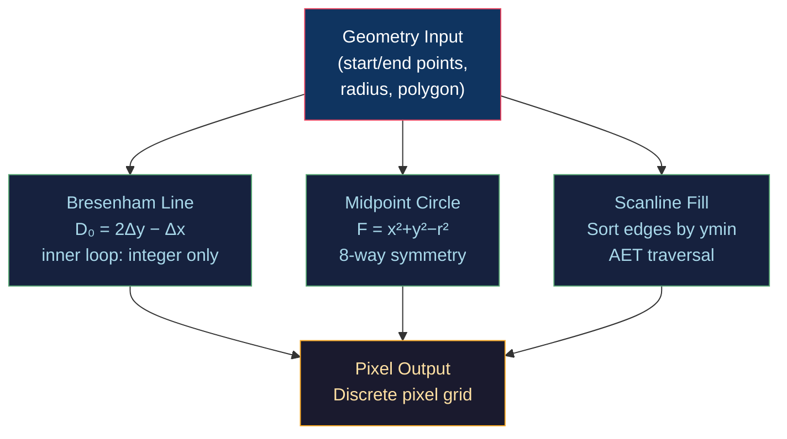

# 📏 Rasterization Algorithms

> [!abstract] TL;DR
> Rasterization converts continuous geometry (lines, circles, polygons) into discrete pixel grids. Bresenham's line algorithm uses decision variable D₀ = 2Δy − Δx and increments only integers, eliminating floating-point from the inner loop. Midpoint circle exploits F(x,y) = x² + y² − r² and 8-way symmetry to draw full circles from 1/8 arc. Scanline fill maintains an Active Edge Table (AET) with half-open intervals [ymin, ymax) to avoid double-counting shared vertices, using even-odd or nonzero winding rules for self-intersecting polygons.

---

## Intuition — Analogy First

Imagine drawing a staircase on graph paper to approximate a diagonal line. You must decide, at each step, whether to move right or diagonally. Instead of measuring the exact distance each time (expensive floating-point division), you keep a running "error budget" that tracks how far your staircase has drifted from the true line. When the budget crosses zero, you step diagonally; otherwise you stay horizontal. That running error budget IS Bresenham's decision variable.

For a circle, the symmetry argument is even stronger: if you know one point (x, y) on the arc, you immediately know seven others by reflection across the x-axis, y-axis, and both diagonals — so you only compute 1/8 of the arc.

---

## How It Works



### Bresenham's Line Algorithm

For a line from (x₀, y₀) to (x₁, y₁) with 0 ≤ slope ≤ 1:

| Variable | Meaning |
|----------|---------|
| `Δx = x₁ − x₀` | Horizontal span |
| `Δy = y₁ − y₀` | Vertical span |
| `D₀ = 2Δy − Δx` | Initial decision variable |
| `ΔE = 2Δy` | Error increment when moving East |
| `ΔNE = 2(Δy − Δx)` | Error increment when moving NorthEast |

Decision rule:
- If `D < 0` → move East (x+1, y stays), `D += ΔE`  
- If `D ≥ 0` → move NorthEast (x+1, y+1), `D += ΔNE`

```python
def bresenham_line(x0, y0, x1, y1):
    """Integer-only Bresenham for slope 0..1 (first octant)."""
    dx, dy = x1 - x0, y1 - y0
    D = 2 * dy - dx        # decision variable — no float!
    y = y0
    pixels = []
    for x in range(x0, x1 + 1):
        pixels.append((x, y))
        if D >= 0:
            y += 1
            D += 2 * (dy - dx)
        else:
            D += 2 * dy
    return pixels
```

All other octants are handled by swapping/negating Δx, Δy before running the same loop, then un-swapping the output coordinates.

---

## Key Concepts / Details

### Midpoint Circle Algorithm

Implicit circle equation: **F(x, y) = x² + y² − r²**
- F < 0 → point inside circle
- F = 0 → on circle
- F > 0 → outside circle

Start at (0, r). Decision variable at midpoint between candidate E pixel (x+1, y) and SE pixel (x+1, y−1):

```
p = F(x+1, y−0.5) = (x+1)² + (y−0.5)² − r²
```

Incrementally updated (integers only, multiply through by 4 to clear fractions):

```python
def midpoint_circle(cx, cy, r):
    x, y = 0, r
    p = 1 - r   # initial decision: 3 - 2r works too (integer)
    points = []
    def plot8(px, py):
        for sx, sy in [(px,py),(-px,py),(px,-py),(-px,-py),
                       (py,px),(-py,px),(py,-px),(-py,-px)]:
            points.append((cx+sx, cy+sy))
    plot8(x, y)
    while x < y:
        x += 1
        if p < 0:
            p += 2*x + 1        # move E
        else:
            y -= 1
            p += 2*(x - y) + 1  # move SE
        plot8(x, y)
    return points
```

The 8-way symmetry reduces computation by 8×.

### Scanline Fill with Active Edge Table (AET)

**Half-open interval rule**: edge is active for `y ∈ [ymin, ymax)` — the top scanline is excluded to prevent double-counting shared vertices at corners.

```
Algorithm:
1. Build Edge Table (ET): for each non-horizontal edge,
   store (ymax, x_at_ymin, 1/slope)
2. Sort ET buckets by ymin
3. For each scanline y (bottom to top):
   a. Move edges from ET[y] → AET
   b. Remove edges where ymax == y  (half-open)
   c. Sort AET by x
   d. Fill pixel pairs: (AET[0].x, AET[1].x), (AET[2].x, AET[3].x)...
   e. Increment all AET x values by 1/slope
```

### Winding Rules

| Rule | Definition | Use Case |
|------|-----------|----------|
| Even-Odd | Count crossings; fill if odd | Simple polygons, SVG `fill-rule:evenodd` |
| Nonzero Winding | Count signed crossings; fill if ≠ 0 | Complex/self-intersecting shapes |

For a ray cast from P rightward: CW edge crossing = +1, CCW = −1 (nonzero winding).

---

## Real-World Notes

- **GPU rasterization** uses Bresenham's ideas but parallelizes across many pixels simultaneously with coverage masks (MSAA).
- Most **GPU APIs** rasterize triangles, not arbitrary polygons; scanline fill is a software-renderer concept.
- **Sub-pixel rasterization** (ClearType) applies Bresenham per colour channel (R, G, B at staggered x positions).
- The **half-open interval** on edges is also why OpenGL's top-left fill convention exists for tie-breaking.

---

## Common Pitfalls

1. **Forgetting octant mapping** — Bresenham's direct form only covers slope 0..1; forgetting to swap axes/directions for other octants draws wrong pixels.
2. **Double-counting shared vertices** — not using the half-open `[ymin, ymax)` rule causes scanlines to light up twice at polygon corners, breaking fill.
3. **Integer overflow** — for very large coordinates, `2*Δy` or `2*Δx` can overflow 32-bit integers; use `int64` or normalize first.
4. **Horizontal edges** — must be excluded from the AET entirely; including them causes undefined intersection count behaviour.

---

## Related Concepts

- [[_MOC_2D_Graphics|↑ 2D Graphics MOC]]
- [[Anti_Aliasing|Anti-Aliasing]] — next step: fixing the staircase artifacts
- [[../04_Shaders/Fragment_Shaders_and_Effects|Fragment Shaders]] — GPU fragment stage IS a rasterization output
- [[../02_3D_Fundamentals/Depth_Buffering_and_Precision|Depth Buffering]] — depth is interpolated per rasterized fragment

---

## Review Questions

1. Derive D₀ = 2Δy − Δx from the implicit line equation. Why multiply by 2?
2. A polygon has two edges sharing vertex V at y=5. Which edge includes scanline y=5 and which excludes it, and why?
3. Given a self-intersecting star polygon, describe how nonzero winding differs from even-odd in determining the filled region.

---

## Sources

#Computer_Graphics #2D_Graphics #Rasterization
