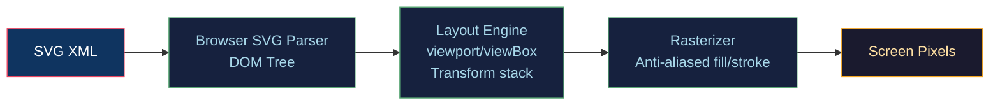

# 🎨 SVG and Vector Graphics

> [!abstract] TL;DR
> SVG (Scalable Vector Graphics) is an XML-based format for resolution-independent 2D graphics. The viewport/viewBox pair (`width`/`height` vs `viewBox="minX minY w h"`) controls coordinate scaling. Path data uses the compact command grammar: M(moveTo), L(lineTo), C(cubic Bézier), Q(quadratic), A(arc), Z(close). SVG transforms compose as a matrix stack (translate→rotate→scale, applied right-to-left). SVGO strips redundant attributes and collapses path data, typically reducing file size 40–70%. SVG is the right choice over Canvas when you need DOM interactivity, accessibility, CSS animation, or resolution independence; Canvas wins for per-pixel manipulation, thousands of dynamic objects, or pixel-level effects.

---

## Intuition — Analogy First

Think of SVG as an "instruction manual" for drawing: instead of storing which pixels are red, it stores "draw a red circle of radius 50 centred at (100,100)". No matter how large you print the page, the browser re-executes the instructions at full resolution. Canvas, by contrast, is a "photograph" — enlarge it and you see pixels. SVG trades storage efficiency (instructions vs bitmap) for resolution independence and the ability to select, click, and animate individual shapes.

---

## How It Works



---

## Key Concepts / Details

### Viewport vs viewBox

The `width`/`height` attributes set the **viewport** — the physical space the SVG occupies in the page (CSS pixels). The `viewBox="minX minY width height"` attribute defines the **user coordinate system** — what coordinate space the SVG content is drawn in.

```xml
<svg width="400" height="200" viewBox="0 0 100 50">
  <!-- coordinate space is 100x50 units mapped to 400x200px -->
  <!-- 1 unit = 4px horizontally, 4px vertically -->
  <circle cx="50" cy="25" r="20" fill="steelblue"/>
</svg>
```

Scaling factor: `scaleX = viewport_width / viewBox_width = 400/100 = 4`

The `preserveAspectRatio` attribute controls alignment and letterboxing when aspect ratios differ (`xMidYMid meet` is the default).

### Path Command Grammar

All path data lives in the `d` attribute. Commands use uppercase for absolute coordinates, lowercase for relative:

| Command | Syntax | Description |
|---------|--------|-------------|
| `M x,y` | `M 10 20` | Move to absolute |
| `m dx,dy` | `m 10 20` | Move to relative |
| `L x,y` | `L 50 80` | Line to absolute |
| `H x` | `H 100` | Horizontal line |
| `V y` | `V 50` | Vertical line |
| `C x1,y1 x2,y2 x,y` | `C 20,40 60,40 80,20` | Cubic Bézier |
| `Q x1,y1 x,y` | `Q 40,80 80,20` | Quadratic Bézier |
| `A rx,ry rot laf,sf x,y` | `A 20,20 0 0,1 60,20` | Arc |
| `Z` | `Z` | Close path |

```xml
<!-- Heart shape using cubic Bézier -->
<path d="M 10,30
         C 10,20 25,5 40,30
         C 55,5 70,20 70,30
         C 70,50 40,65 40,65
         C 40,65 10,50 10,30 Z"
      fill="red"/>
```

The arc command's `large-arc-flag` (0/1) and `sweep-flag` (0=CCW, 1=CW) select among the four possible arcs connecting two endpoints with given radii.

### SVG Transforms

Transforms apply to an element and all its children. They compose as a matrix product (applied right-to-left in SVG attribute order):

```xml
<g transform="translate(50,50) rotate(45) scale(2)">
  <!-- first scaled 2x, then rotated 45°, then translated by (50,50) -->
</g>
```

Equivalent matrix: `M = T · R · S`

Under the hood each transform is a 3×3 affine matrix. The SVG `transform` attribute can also take a raw `matrix(a b c d e f)` where:

```
[a c e]   [scaleX  skewY  translateX]
[b d f] = [skewX   scaleY translateY]
[0 0 1]   [0       0      1         ]
```

### Styling: fill, stroke, opacity

```xml
<path fill="none" stroke="#333" stroke-width="2"
      stroke-linecap="round" stroke-linejoin="miter"
      stroke-dasharray="5,3" opacity="0.8"/>
```

`fill-rule` accepts `nonzero` (default) or `evenodd` — matching the scanline winding rules from [[Rasterization_Algorithms]].

### SVG Filters and Effects

```xml
<defs>
  <filter id="blur">
    <feGaussianBlur stdDeviation="3"/>
  </filter>
  <filter id="shadow">
    <feDropShadow dx="2" dy="2" stdDeviation="2" flood-color="black"/>
  </filter>
</defs>
<rect filter="url(#blur)" .../>
```

SVG filter primitives (`feBlend`, `feComposite`, `feColorMatrix`, `feTurbulence`, etc.) are a complete image-processing pipeline. `feTurbulence` generates Perlin noise directly in SVG.

### SVGO Optimization

SVGO (SVG Optimizer) is a Node.js tool that runs a pipeline of plugins:

| Plugin | Typical Saving | Action |
|--------|---------------|--------|
| `removeDoctype` | ~50 bytes | Remove DOCTYPE declaration |
| `collapseGroups` | 5–15% | Merge unnecessary `<g>` nesting |
| `convertPathData` | 20–40% | Convert absolute ↔ relative, remove redundant commands |
| `mergePaths` | 5–10% | Combine paths with same style |
| `removeHiddenElems` | Variable | Drop `display:none` subtrees |
| `cleanupIds` | 10–30% | Shorten long IDs |

```bash
npx svgo input.svg -o output.svg --multipass
# Typically achieves 40–70% file size reduction
```

### SVG vs Canvas Decision Matrix

| Factor | SVG | Canvas |
|--------|-----|--------|
| Resolution | Infinite (vector) | Fixed (bitmap) |
| DOM access | Yes (querySelector, events) | No |
| Accessibility | Native ARIA roles | Must add manually |
| 1000+ dynamic objects | Slow (DOM overhead) | Fast |
| Per-pixel manipulation | Difficult | `getImageData()` |
| CSS animation | Native | Use JS/WebAnimations |
| WebGL output | No | Yes (context=webgl) |
| File embed | `` | Export PNG |

---

## Real-World Notes

- **Icon libraries** (Heroicons, Lucide, Feather) ship as SVG; inline SVG allows CSS theming via `currentColor`.
- **Data visualization** (D3.js) uses SVG because individual bars/paths need event listeners.
- **Maps** (Leaflet vector layers) use SVG or Canvas depending on feature count: SVG < 10k features, Canvas/WebGL for more.
- **Fonts** (icon fonts vs SVG sprites): SVG sprites avoid FOUT, support multi-colour, and have better accessibility.

---

## Common Pitfalls

1. **Forgetting `viewBox` with percentage-sized SVG** — without viewBox, a `width="100%"` SVG has no intrinsic aspect ratio and collapses to 0 height.
2. **`overflow="hidden"` by default** — SVG clips content outside its viewBox; use `overflow="visible"` for drop shadows that extend beyond bounds.
3. **SVGO removing IDs needed by CSS** — SVGO's `cleanupIds` renames IDs that are referenced in external CSS; prefix critical IDs or add them to the preserve list.
4. **Arc `sweep-flag` confusion** — `sweep-flag=1` means clockwise in SVG's Y-down coordinate system, which is counter-intuitive if thinking in math (Y-up).

---

## Related Concepts

- [[_MOC_2D_Graphics|↑ 2D Graphics MOC]]
- [[Bezier_and_Bsplines|Bézier & B-Splines]] — SVG `C`/`Q` path commands
- [[Canvas_2D_API|Canvas 2D API]] — alternative raster API
- [[Rasterization_Algorithms|Rasterization Algorithms]] — fill-rule (evenodd/nonzero) same concept

---

## Review Questions

1. An SVG has `width="200" height="100" viewBox="0 0 400 200"`. What is the scale factor, and how large will a `<rect width="100" height="100"/>` appear in CSS pixels?
2. Explain the four arc flags (large-arc, sweep) and give an example where the wrong flag choice produces a completely different curve.
3. Why does SVGO's `convertPathData` plugin achieve large savings, and what math does it use to decide absolute vs relative commands?

---

## Sources

#Computer_Graphics #2D_Graphics #SVG #Vector
