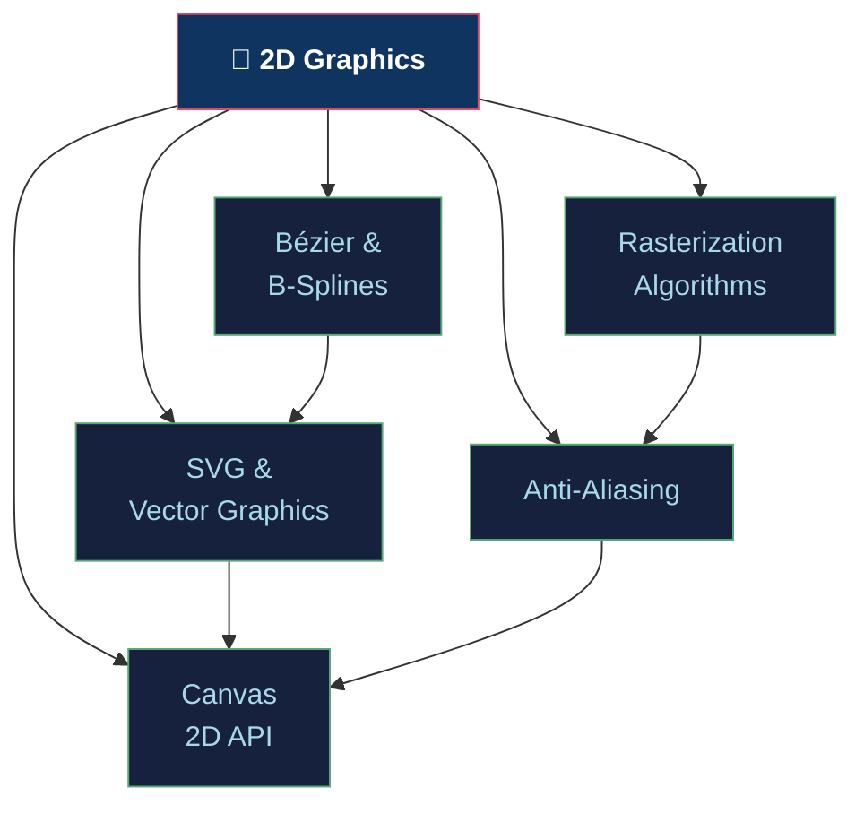

# 📐 2D Graphics — Section Map of Content

> [!abstract] Section Overview
> Covers the entire 2D rendering stack: integer rasterization (Bresenham, midpoint circle), anti-aliasing theory (Nyquist → SSAA/MSAA/TAA), parametric curves (Bézier/B-splines/NURBS), SVG vector format, and the browser Canvas 2D API. These algorithms underpin every renderer from embedded displays to web browsers.

---

## Concept Map

---

## Learning Path

1. [[Rasterization_Algorithms|Rasterization Algorithms]] — Integer line/circle drawing, scanline fill, AET
2. [[Anti_Aliasing|Anti-Aliasing]] — Nyquist, SSAA, MSAA, FXAA, TAA, SMAA
3. [[Bezier_and_Bsplines|Bézier & B-Splines]] — De Casteljau, Bernstein, Cox-de Boor, NURBS
4. [[SVG_and_Vector_Graphics|SVG & Vector Graphics]] — viewport, path commands, transforms, SVGO
5. [[Canvas_2D_API|Canvas 2D API]] — Path API, compositing, ImageData, OffscreenCanvas

---

## Notes at a Glance

| Note | Core Algorithm | Key Formula | Difficulty |
|------|---------------|-------------|------------|
| [[Rasterization_Algorithms]] | Bresenham line, midpoint circle | `D₀ = 2Δy − Δx` | Beginner |
| [[Anti_Aliasing]] | MSAA, TAA | Nyquist: `fs > 2·fmax` | Intermediate |
| [[Bezier_and_Bsplines]] | De Casteljau | Bernstein Bᵢₙ | Intermediate |
| [[SVG_and_Vector_Graphics]] | SVG path grammar | viewBox scaling | Beginner |
| [[Canvas_2D_API]] | OffscreenCanvas | rAF loop | Intermediate |

---

## Key Questions

1. Why does Bresenham's algorithm avoid floating-point in the inner loop?
2. How does MSAA differ from SSAA in cost and coverage?
3. What is the difference between C1 and G1 continuity for splines?
4. When should you prefer SVG over Canvas for interactive graphics?
5. How does TAA handle ghosting artifacts?

---

## Related Sections

- [[_MOC_Computer_Graphics_Master|↑ Master MOC]]
- [[../02_3D_Fundamentals/_MOC_3D_Fundamentals|→ 3D Fundamentals]] (rasterization extends to 3D triangles)
- [[../04_Shaders/_MOC_Shaders|→ Shaders]] (fragment shader anti-aliasing via dFdx/dFdy)

---

#Computer_Graphics #2D_Graphics #MOC
