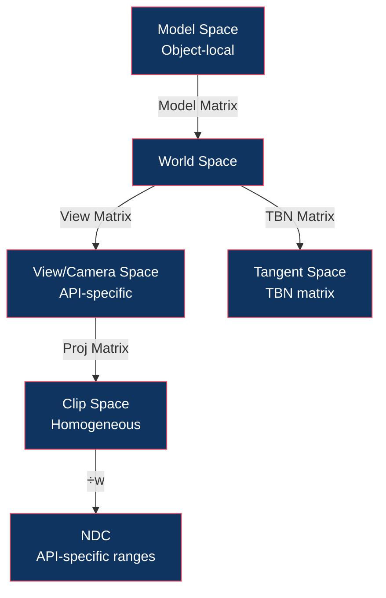

# 🧭 Coordinate Systems and Handedness

> [!abstract] TL;DR
> Coordinate system conventions vary by API and mathematics tradition. OpenGL uses a right-hand system (camera looks down −Z, Y-up), Vulkan/DX12/Metal use left-hand or have Y-flipped NDC. Cross products and winding order depend on handedness: in a right-hand system, CCW front faces are the default for backface culling. Tangent space (TBN matrix) is a per-vertex or per-face coordinate system used for normal mapping, with the tangent T along UV-U, bitangent B = cross(N,T)·tangent.w (tangent.w encodes mirroring), and normal N from the mesh. Understanding all these conventions prevents mysterious mirror-flips, inverted normals, and seam artifacts when porting across APIs.

---

## Intuition — Analogy First

Point your right hand so your fingers curl from the X-axis toward the Y-axis (counterclockwise). Your thumb points in the Z-direction — that's the right-hand rule. In OpenGL, Z points toward you (out of the screen), and the camera looks down −Z. Now use your LEFT hand the same way — your thumb points in the opposite direction. DirectX uses this left-hand system with Z pointing into the screen. These conventions affect everything: matrix multiplication order, cross products for normals, winding order for backface culling, and NDC Z range.

---

## How It Works



---

## Key Concepts / Details

### Handedness Summary

| Axis | OpenGL (RH) | DirectX / Vulkan (LH)* |
|------|------------|----------------------|
| X | Right | Right |
| Y | Up | Up (DX) / Down NDC (Vulkan) |
| Z | Toward viewer | Away from viewer |
| Camera looks | Down −Z | Down +Z |
| Front face winding | CCW | CW (DX) / CCW in mesh (Vulkan) |
| NDC Z range | [−1, 1] | [0, 1] |
| Cross product AB×BA | RH: out of plane | LH: into plane |

*Vulkan physically uses right-hand geometry but Y-flips NDC, making it behave like left-hand for rasterization. Metal uses left-hand with Z [0,1].

### Right-Hand Cross Product

```
C = A × B

Cx = Ay·Bz − Az·By
Cy = Az·Bx − Ax·Bz
Cz = Ax·By − Ay·Bx
```

The direction follows the right-hand rule: curl fingers from A to B, thumb points along C.

Practical use:
```glsl
vec3 normal = normalize(cross(edge1, edge2));  // CCW winding → normal points toward viewer
```

### Winding Order and Backface Culling

Triangle vertex order determines which face is "front" via the right-hand rule applied to screen-projected edges:

```
CCW in screen space → front face (OpenGL default)
CW in screen space  → back face (culled)
```

```cpp
glEnable(GL_CULL_FACE);
glCullFace(GL_BACK);          // cull back faces
glFrontFace(GL_CCW);          // CCW = front face (default)
```

For DirectX with left-hand convention, the default is CW = front face.

**Mirror transforms** (negative scale on one axis) flip winding order, turning CCW into CW. Must either flip `glFrontFace` or disable culling for mirrored meshes.

### Y-Flip in Vulkan

Vulkan NDC has Y+ = down (origin top-left), opposite of OpenGL (Y+ = up, origin bottom-left). This affects:
- Projection matrix: negate the Y scale (`[1][1]` element becomes negative)
- Texture coordinates: V = 0 is top in DX/Vulkan/Metal, bottom in OpenGL
- Viewport: Vulkan 1.1+ allows negative viewport height (`VkViewport.height = -height`) to flip Y

```cpp
// Vulkan projection matrix Y-flip fix
proj[1][1] *= -1;  // flip Y (GLM is column-major, [col][row])
```

### Texture Coordinate Conventions

| API | U origin | V origin | V direction |
|-----|---------|---------|------------|
| OpenGL | Left | Bottom | Up |
| Vulkan | Left | Top | Down |
| DirectX | Left | Top | Down |
| Metal | Left | Top | Down |

Artists typically export UVs with V=0 at top (matching DX/Vulkan). OpenGL requires either V-flip on import or flipping in the shader: `tex.sample(uv.x, 1.0 - uv.y)`.

### Tangent Space and TBN Matrix

Normal maps encode surface normals in **tangent space** — a per-vertex or per-face coordinate system aligned to the UV layout. This decouples the detail normal from the mesh normal, allowing a flat quad to appear curved.

TBN = [T, B, N] where:
- **N** = surface normal (from vertex data)
- **T** = tangent (along UV-U direction, computed from triangle edges)
- **B** = bitangent = cross(N, T) · tangent.w

The `tangent.w` (stored as ±1) encodes whether B should be flipped (for UV-mirrored surfaces). Computing B as `cross(N, T) * tangent.w` handles mirroring correctly.

```glsl
// Vertex shader: build TBN matrix
mat3 TBN = mat3(
    normalize(mat3(model) * tangent.xyz),
    normalize(mat3(model) * cross(normal, tangent.xyz) * tangent.w),
    normalize(mat3(model) * normal)
);

// Fragment shader: transform sample from tangent space to world space
vec3 normalSample = texture(normalMap, uv).rgb * 2.0 - 1.0;  // [0,1] → [-1,1]
vec3 worldNormal = normalize(TBN * normalSample);
```

**Re-orthogonalizing TBN**: after interpolation across a triangle, T and N may no longer be perpendicular (Gram-Schmidt re-orthogonalization):
```glsl
T = normalize(T - dot(T, N) * N);
B = cross(N, T) * tangent.w;
```

### Space Summary Table

| Space | Defined By | Key Property |
|-------|-----------|-------------|
| Object/Model | Per-mesh local axes | Unchanged by world position |
| World | Scene origin | Common space for lighting |
| View/Camera | Camera's position/orientation | Camera at origin, looking −Z (GL) |
| Clip | After projection matrix | Homogeneous w ≠ 1 |
| NDC | After ÷w | API-specific [-1,1] or [0,1] |
| Screen | After viewport | Integer pixel coordinates |
| Tangent | Per-vertex UV axes | Used for normal mapping |

---

## Real-World Notes

- **Asset pipeline**: FBX/GLTF exporters have settings for Y-up vs Z-up world space; Blender uses Z-up internally but exports Y-up for GLTF.
- **Physics engines** (Bullet, PhysX) typically use Y-up right-hand — must convert if your renderer uses Z-up.
- **Cubemaps**: OpenGL cubemap faces use a left-hand coordinate system internally for historical reasons — even in a right-hand renderer.
- **Normal map seams**: discontinuities in tangent space at UV seams cause visible lighting seams; mikktspace tangent generation is the standard fix.

---

## Common Pitfalls

1. **Forgetting to negate B with `tangent.w`** — UV-mirrored meshes (symmetric characters) get inverted normals on one half without the ±1 bitangent sign.
2. **Importing Z-up FBX without rotation** — the mesh appears lying flat; requires a 90° X-axis rotation to convert to Y-up.
3. **Y-flip and shadow maps** — when Y is flipped in Vulkan, shadow map UV sampling must account for the flipped V coordinate, otherwise self-shadowing artifacts appear on the wrong face.
4. **CW vs CCW confusion when combining DX and OpenGL meshes** — importing a DX mesh into an OpenGL renderer with CCW front faces causes all front faces to be culled.

---

## Related Concepts

- [[_MOC_3D_Fundamentals|↑ 3D Fundamentals MOC]]
- [[3D_Transforms_and_Matrices|3D Transforms]] — matrices encode coordinate system changes
- [[Projection_and_Viewing|Projection & Viewing]] — NDC conventions differ by API
- [[../05_Lighting_and_Materials/Texture_Mapping_and_UV|Texture Mapping & UV]] — tangent space used for normal maps
- [[../03_Rendering_Pipeline/Vulkan_Architecture|Vulkan Architecture]] — Y-flip handling

---

## Review Questions

1. A mesh is exported from Maya (Y-up, right-hand) and imported into a DirectX (Y-up, left-hand) game engine. List every transform/convention that must be adjusted for correct rendering.
2. Why does `tangent.w` need to be ±1 rather than always computing B = cross(N,T)? Give a specific mesh example where the wrong sign causes a visible artifact.
3. Explain the Vulkan Y-flip problem and two different approaches to solve it (projection matrix vs viewport).

---

## Sources

#Computer_Graphics #3D_Fundamentals #Coordinates #Handedness
