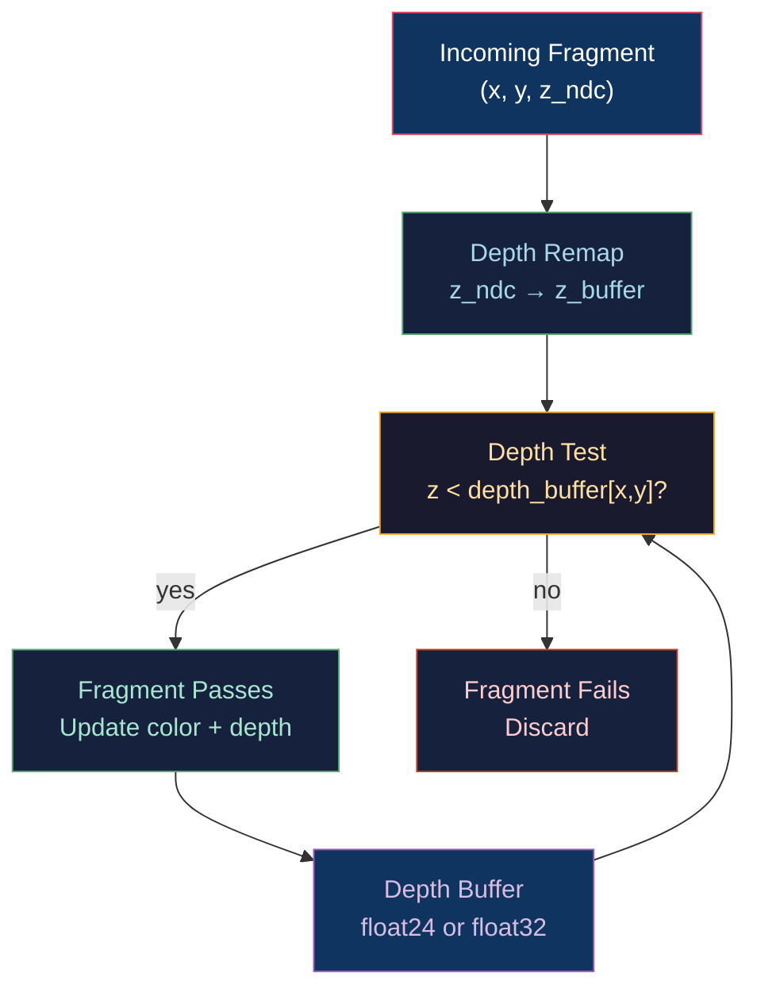

# 🎯 Depth Buffering and Precision

> [!abstract] TL;DR
> The Z-buffer stores, per pixel, the nearest fragment's normalized depth (0=near, 1=far in DX/Vulkan) enabling correct hidden-surface removal without sorting. Perspective projection warps depth non-linearly: half the floating-point precision is consumed by the nearest 1% of the depth range, leaving catastrophically little for distant objects — this causes Z-fighting (shimmering where two coplanar surfaces alternate each frame). Reverse-Z flips depth to (1=near, 0=far), aligning floating-point's high precision with the near region where it's most needed, improving effective precision by 10–100×. Log depth distributes precision evenly across the full range at the cost of a custom z = log(z/n)/log(f/n) formula per vertex or an `fma` fragment shader trick. Near/far ratio must stay below ~1:10,000 for standard Z; reverse-Z allows ratios up to 1:1,000,000.

---

## Intuition — Analogy First

Imagine you have a ruler with millimetre marks, but the marks are clustered near the 0cm end — most of the ruler's precision is spent in the first centimetre, and the last 99 centimetres share only a handful of marks. That's what the perspective Z-buffer does: your spaceship at 100m gets crisp depth; the mountain at 100km has only 10 depth levels. Z-fighting is what happens when two objects share those 10 levels and the GPU alternates which one "wins" each frame.

Reverse-Z flips the ruler: now the dense marks are at the near end (where you care), and the precision gradually spreads toward the far end — exactly matching where visual fidelity matters most.

---

## How It Works



---

## Key Concepts / Details

### Depth Non-Linearity

After perspective projection and divide, the depth value stored in the Z-buffer is:

```
z_ndc = (f/n · z_eye − f)  /  (z_eye − n)     [OpenGL, simplified]
```

Remapped to `[0,1]`:
```
z_buf = (z_ndc + 1) / 2
```

The critical insight: **z_buf is non-linear in z_eye (true depth)**. The mapping `z_eye → z_buf` is a hyperbolic function:

```
z_buf ≈ 1 − n/z_eye   (for large f relative to n)
```

This means:
- z_eye ∈ [n, 2n]: uses ~50% of depth buffer range
- z_eye ∈ [2n, 4n]: uses ~25%
- z_eye ∈ [n, f/100]: uses ~99% of precision

### Z-Fighting

Z-fighting occurs when two coplanar (or near-coplanar) surfaces map to identical or very close depth buffer values. The GPU alternates which surface "wins" the depth test per-pixel per-frame, producing a shimmering pattern.

Causes:
- Large far/near ratio (far/near > 10,000)
- Coplanar geometry (decals on surfaces, shadow surfaces)
- Float24 depth with a distant far plane

Mitigations:
- **Polygon offset**: `glPolygonOffset(-1.0, -1.0)` shifts depth by a small bias for decals
- **Reduce far/near ratio**: keeps the hyperbola gentler in the working range
- **Reverse-Z**: reallocates precision (see below)
- **Logarithmic depth**: uniform precision across the full range

### Depth Buffer Formats

| Format | Bits | Range | Use |
|--------|------|-------|-----|
| `D16_UNORM` | 16 | [0,1] | Mobile, simple scenes |
| `D24_UNORM_S8_UINT` | 24+8 | [0,1] + stencil | Standard desktop |
| `D32_SFLOAT` | 32 (float) | [0,1] | High-precision, reverse-Z |
| `D32_SFLOAT_S8_UINT` | 32+8 | [0,1] + stencil | High-precision + stencil |

D32 float with reverse-Z is the gold standard for precision-demanding scenes.

### Reverse-Z Technique

Instead of near=0, far=1, use **near=1, far=0** in the depth buffer (greater-equals depth test wins):

```cpp
// OpenGL
glDepthRange(1.0f, 0.0f);   // near maps to 1, far maps to 0
glDepthFunc(GL_GEQUAL);      // pass if incoming >= stored (reversed)
glClearDepth(0.0f);          // clear to 0 (the "far" value)

// Vulkan
VkPipelineDepthStencilStateCreateInfo ds{};
ds.depthCompareOp = VK_COMPARE_OP_GREATER_OR_EQUAL;
// Set clearValue.depthStencil.depth = 0.0f
```

**Why it helps**: IEEE 754 float32 has more precision near 0 (subnormals/small exponents). Reverse-Z maps the near region (where precision matters most) to values near 1 — wait, actually reverse-Z maps near→1 and far→0, so the precision-dense float range near 0 serves the far region... 

Actually the precision gain comes from: with forward Z, `z_buf` values are clustered near 1.0 for most of the depth range. Float32 has uniform precision in each ULP interval. With reverse-Z, `z_buf` values for the near region (small z_eye) are near 1.0, while the far region maps near 0.0 — and float precision near 0.0 is higher (more ULPs between 0 and ε). Net effect: **the far region gets MORE precision** under reverse-Z, which is where Z-fighting actually happens.

| Technique | Near:Far Ratio Max | Precision Distribution |
|-----------|-------------------|----------------------|
| Standard Z (float24) | ~1:3,000 | Front-heavy |
| Standard Z (float32) | ~1:30,000 | Front-heavy |
| Reverse-Z (float32) | ~1:1,000,000+ | More uniform |
| Logarithmic depth | Unlimited | Perfectly uniform |

### Logarithmic Depth Buffer

Distributes depth precision logarithmically across the entire [near, far] range:

```glsl
// Vertex shader (write linear z to varying for fragment correction)
varying float vLogDepth;
void main() {
    gl_Position = MVP * vec4(pos, 1.0);
    vLogDepth = gl_Position.w;  // save w for fragment
}

// Fragment shader
uniform float uFcoef;  // = 2.0 / log2(far + 1.0)
void main() {
    gl_FragDepth = log2(vLogDepth + 1.0) * uFcoef * 0.5;
    // ... color output ...
}
```

Cost: one `log2` per fragment — ~2ns per pixel. Worth it for astronomical/planetary scenes (near=0.1m, far=1,000,000,000m).

### Depth Precision Budget

For near=0.1, far=10,000 (10,000:1 ratio) with D24:
- Total ULPs available: 2²⁴ = 16,777,216
- ULPs allocated to [n, 2n] (first doubling): ~50% = 8M ULPs
- ULPs for [100, 10000]: ~0.1% = 16,777 ULPs
- Z-fighting occurs when two surfaces are <1/16777 of far apart ≈ 0.6m — easily triggered for distant mountains

---

## Real-World Notes

- **Unity and Unreal Engine** both support reverse-Z as a project setting; enabled by default in UE5 for large open worlds.
- **Depth prepass**: render scene with depth-only first, then render color with `GL_EQUAL` depth test to avoid overdraw — common in dense scenes.
- **SSAO and screen-space reflections** reconstruct world-space positions from depth buffer — requires care to reconstruct non-linearly mapped depth correctly.
- **Shadow maps** use a separate depth texture rendered from the light's perspective — orthographic (directional lights) or perspective (spotlights).

---

## Common Pitfalls

1. **Not inverting depth clear value for reverse-Z** — forgetting to `glClearDepth(0.0f)` means the buffer starts at 1.0, and ALL geometry fails the `GL_GEQUAL` test.
2. **Stencil bits lost on D32** — `D32_SFLOAT` has no stencil; use `D32_SFLOAT_S8_UINT` if stencil is needed.
3. **Reconstructing world-space from linear depth** — many tutorials store `depth = gl_FragCoord.z` and assume it's linear for position reconstruction; it's not, requires the proper un-projection.
4. **Near plane at 0** — `n = 0` causes division by zero in the projection matrix (1/n → ∞). Minimum practical near plane is ~0.001 units.

---

## Related Concepts

- [[_MOC_3D_Fundamentals|↑ 3D Fundamentals MOC]]
- [[Projection_and_Viewing|Projection & Viewing]] — source of depth non-linearity
- [[Frustum_Culling_and_Clipping|Frustum Culling]] — near/far planes define frustum bounds
- [[../03_Rendering_Pipeline/Framebuffers_and_Render_Targets|Framebuffers]] — depth buffer as attachment
- [[../05_Lighting_and_Materials/Global_Illumination|Global Illumination]] — shadow map depth precision

---

## Review Questions

1. Derive why z_buf = 1 − n/z_eye (approximately) for a perspective projection. What does this imply about precision distribution?
2. Explain the exact mechanism by which reverse-Z improves precision. Where in the scene does precision improve, and why?
3. A flight simulator renders from 1m (cockpit) to 1,000,000m (horizon). What depth buffer strategy would you use, and what parameters (format, near, far, technique) would you choose?

---

## Sources

#Computer_Graphics #3D_Fundamentals #Depth #ZBuffer
