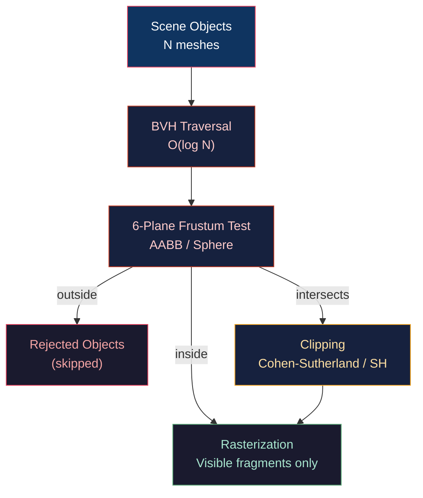
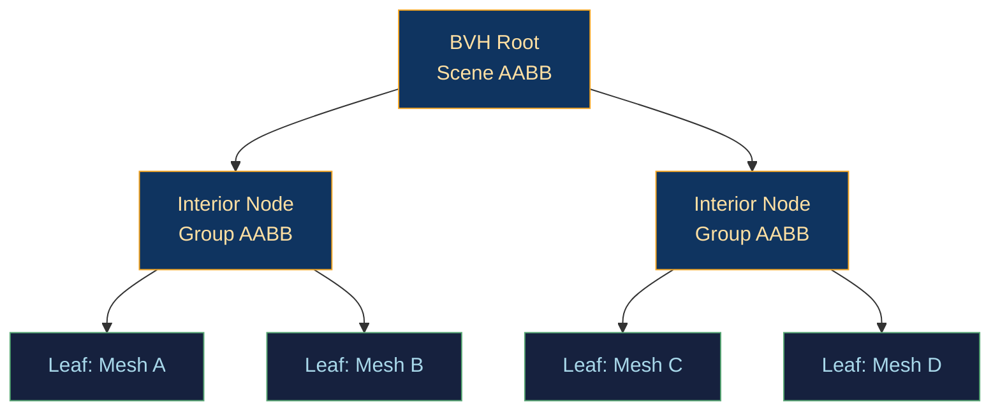

# ✂️ Frustum Culling and Clipping

> [!abstract] TL;DR
> Frustum culling discards objects outside the view frustum before they reach the GPU pipeline. The frustum is defined by 6 half-space planes (near, far, left, right, top, bottom) extracted from the combined PV matrix. AABB (axis-aligned bounding box) tests check each box corner against all 6 planes — O(8·6) = O(48) dot products per object. OBB (oriented bounding box) tests use the Separating Axis Theorem. BVH (Bounding Volume Hierarchy) organizes the scene into a tree for hierarchical culling, reducing culled-set checks to O(log n). Cohen-Sutherland uses 4-/6-bit outcodes for fast line clipping; Sutherland-Hodgman clips polygons against each half-plane iteratively, generating the clipped polygon vertex list.

---

## Intuition — Analogy First

Imagine you're a stage director: before asking actors to perform, you check if they're even visible to the audience. If an actor is entirely behind a pillar (outside the frustum), you don't call them on stage at all. If only part of an actor is hidden, you clip the visible portion. The frustum culling check is the "are you visible at all?" pre-screen, and polygon clipping is the "show only the visible half" refinement.

BVH is like a library catalogue: instead of searching every book for the keyword, you check the floor (all books), then the row, then the shelf — stopping as soon as a whole section is confirmed empty.

---

## How It Works



---

## Key Concepts / Details

### Extracting Frustum Planes from PV Matrix

Given the combined projection-view matrix M = P · V, the 6 frustum planes can be extracted from the rows of M:

```
Left   plane: row3 + row0  (i.e., M[3] + M[0])
Right  plane: row3 − row0
Bottom plane: row3 + row1
Top    plane: row3 − row1
Near   plane: row3 + row2   (OpenGL: row3 + row2; Vulkan/DX: row2)
Far    plane: row3 − row2
```

Each plane is `(a, b, c, d)` where `a·x + b·y + c·z + d = 0`.

A point `p` is on the positive (inside) side if `a·p.x + b·p.y + c·p.z + d > 0`.

Normalize the plane for distance queries: divide `(a,b,c,d)` by `sqrt(a²+b²+c²)`.

### AABB Frustum Test

For an AABB with min corner `bmin` and max corner `bmax`, test against each plane:

```python
def aabb_outside_plane(bmin, bmax, plane):
    """Returns True if AABB is entirely on negative side of plane (outside)."""
    a, b, c, d = plane
    # Positive vertex: maximizes dot product with plane normal
    px = bmax.x if a >= 0 else bmin.x
    py = bmax.y if b >= 0 else bmin.y
    pz = bmax.z if c >= 0 else bmin.z
    return a*px + b*py + c*pz + d < 0  # positive vertex still outside?

def aabb_frustum_test(aabb, planes):
    for plane in planes:
        if aabb_outside_plane(aabb.min, aabb.max, plane):
            return "OUTSIDE"
    return "INSIDE_OR_INTERSECT"  # conservative — may still be outside
```

Cost: 6 plane tests × 3 comparisons + 3 multiply-adds = ~48 operations per object.

**Conservative**: AABB tests can report INSIDE when the AABB corners are all inside each plane individually, but the box still doesn't intersect the frustum (false positive). For most scenes this is acceptable.

### Sphere Frustum Test (Faster, Less Tight)

```glsl
bool sphereInsideFrustum(vec3 center, float radius, vec4 planes[6]) {
    for (int i = 0; i < 6; i++) {
        if (dot(planes[i].xyz, center) + planes[i].w < -radius)
            return false;  // sphere center farther than radius outside plane
    }
    return true;
}
```

Sphere tests are cheaper (no per-plane vertex selection) but less tight than AABB for elongated objects.

### OBB Test — Separating Axis Theorem (SAT)

Two convex shapes DO NOT intersect if there exists a separating axis along which their projections do not overlap. For frustum vs OBB, test 6 frustum plane normals + 3 OBB axes + 15 cross products of edge pairs (for exact test). In practice, AABB tests suffice for real-time culling; OBB tests are used in physics narrow phase.

### BVH Hierarchical Culling



Build: bottom-up surface area heuristic (SAH) — split the axis with maximum variance, choosing the split that minimizes `SA(left)·N(left) + SA(right)·N(right)`.

Traversal (frustum cull):
```
traverse(node, frustum):
    if node.aabb outside frustum: return (cull entire subtree)
    if leaf: add node.mesh to visible list
    else: traverse(left, frustum); traverse(right, frustum)
```

Best case: O(log n). Worst case for tightly packed geometry: O(n).

### Cohen-Sutherland Line Clipping

Assigns a 6-bit outcode to each endpoint based on which half-spaces it lies outside:

| Bit | Condition | Side |
|-----|-----------|------|
| bit 0 | x < left | Left |
| bit 1 | x > right | Right |
| bit 2 | y < bottom | Bottom |
| bit 3 | y > top | Top |
| bit 4 | z < near | Near |
| bit 5 | z > far | Far |

```
if (code_A | code_B) == 0: trivially inside
if (code_A & code_B) != 0: trivially outside (same half-space)
else: clip against the plane indicated by the outcode bit
```

### Sutherland-Hodgman Polygon Clipping

Clips a polygon against each half-plane sequentially, producing the output vertex list:

```python
def sutherland_hodgman(polygon, clip_planes):
    output = polygon
    for plane in clip_planes:
        input = output
        output = []
        for i, current in enumerate(input):
            previous = input[(i-1) % len(input)]
            inside_curr = is_inside(current, plane)
            inside_prev = is_inside(previous, plane)
            if inside_curr:
                if not inside_prev:
                    output.append(intersect(previous, current, plane))
                output.append(current)
            elif inside_prev:
                output.append(intersect(previous, current, plane))
        if not output: break  # fully clipped
    return output
```

Each clip plane can add at most 1 vertex; n clip planes → at most n additional vertices.

---

## Real-World Notes

- **GPU hardware** clips in clip space (post-projection, before perspective divide) — hardware clipping is free; CPU frustum culling prevents submitting invisible draw calls at all.
- **Occlusion culling** goes beyond frustum: hierarchical Z-buffer (Hi-Z) on GPU checks if an object's bounding box depth is entirely behind existing depth values — cuts overdraw for dense urban scenes.
- **Portal culling** (Doom, Quake, modern indoor games) uses BSP/portals to avoid testing all objects — O(visible) instead of O(total).
- **GPU-driven rendering** computes frustum culling in a compute shader, filling draw call buffers on-GPU without CPU readback.

---

## Common Pitfalls

1. **Stale frustum planes** — extracting planes from last frame's PV matrix causes pop-in on fast camera movement.
2. **Missing near-plane clip** — forgetting the near plane allows objects behind the camera to project to screen with inverted w, causing geometry to "wrap around."
3. **Conservative AABB false positives** — large, diagonal bounding boxes of thin objects (diagonal columns) frequently pass the AABB test but are actually invisible; tighter OBB or convex hull saves performance.
4. **Sutherland-Hodgman for non-convex polygons** — S-H assumes convex input; concave polygons may produce incorrect output; triangulate first.

---

## Related Concepts

- [[_MOC_3D_Fundamentals|↑ 3D Fundamentals MOC]]
- [[Projection_and_Viewing|Projection & Viewing]] — PV matrix used for plane extraction
- [[Depth_Buffering_and_Precision|Depth Buffering]] — Hi-Z occlusion culling uses depth buffer
- [[../06_Animation_and_Simulation/Rigid_Body_Physics|Rigid Body Physics]] — BVH also used for broad-phase collision detection

---

## Review Questions

1. Given the combined projection-view matrix M, derive the left frustum plane equation from M's rows. What does normalizing the plane give you?
2. Two objects pass the AABB frustum test. One is actually visible; one is not (false positive). Describe the geometry that causes a false positive and how OBB/SAT would catch it.
3. Explain why Cohen-Sutherland can reject lines more quickly than Sutherland-Hodgman. In what scenario does S-H outperform C-S?

---

## Sources

#Computer_Graphics #3D_Fundamentals #Culling #Clipping
