# 📷 Projection and Viewing

> [!abstract] TL;DR
> Projection maps 3D camera-space geometry to 2D clip space. The perspective projection matrix encodes FOV and aspect ratio; the perspective divide (÷w_clip) converts to NDC. For vertical FOV `fovy`, the Y scale is `f = 1/tan(fovy/2)`, X scale is `f/aspect`. OpenGL NDC is `[-1,1]³` (Z range `[-1,1]`); Vulkan/DX12/Metal use `[0,1]` for Z. Orthographic projection (for UIs, shadow maps, CAD) skips the perspective divide, mapping the view volume linearly to NDC. The perspective divide is also responsible for correct perspective-correct interpolation of texture coordinates across triangles.

---

## Intuition — Analogy First

Perspective projection is how a camera lens works: parallel railroad tracks appear to converge to a vanishing point because distant objects project to smaller screen regions. The "magic" is the perspective divide: dividing clip-space x and y by the clip-space w (which encodes depth) makes far objects appear smaller. Orthographic projection, used for architectural blueprints and shadow maps, skips this divide — objects are the same size regardless of distance, like projecting with a telecentric lens.

---

## How It Works

```mermaid
graph LR
    EYE["Camera Space\nx,y,z,w=1"]:::space
    PMAT["Perspective Matrix\nor Ortho Matrix"]:::mx
    CLIP["Clip Space\nx_c,y_c,z_c,w_c"]:::space
    DIVIDE["÷ w_c\nPerspective Divide"]:::op
    NDC["NDC\n[-1,1]² × [0,1 or -1,1]"]:::space
    VPORT["Viewport Transform\n+ depth range"]:::op
    SCREEN["Window Coords\npixels + depth"]:::space

    EYE --> PMAT --> CLIP --> DIVIDE --> NDC --> VPORT --> SCREEN

    classDef space fill:#0f3460,stroke:#e94560,color:#fff
    classDef mx fill:#16213e,stroke:#57a773,color:#a8d8ea
    classDef op fill:#1a1a2e,stroke:#f5a623,color:#ffe0a3
```



---

## Key Concepts / Details

### Perspective Projection Matrix (OpenGL, Z ∈ [−1,1])

For vertical FOV `fovy` (radians), aspect ratio `a = w/h`, near plane `n`, far plane `f`:

```
f_y = 1 / tan(fovy/2)        (cotangent of half-FOV)
f_x = f_y / aspect

P = [f_x  0    0               0          ]
    [0    f_y  0               0          ]
    [0    0    (n+f)/(n−f)    2·n·f/(n−f)]
    [0    0    −1              0          ]
```

After perspective divide `÷w_clip`:
- `x_ndc = (f_x · x_eye) / (−z_eye)`  ← z_eye is negative in camera space (OpenGL right-hand)
- `y_ndc = (f_y · y_eye) / (−z_eye)`
- `z_ndc = [(n+f)·z_eye + 2nf] / [(n−f)·(−z_eye)]`

Note `w_clip = −z_eye`: depth information is encoded in w and recovered by the divide.

### NDC Z Range by API

| API | NDC Z range | Clip Z range |
|-----|------------|-------------|
| OpenGL | `[−1, 1]` | `[−w, w]` |
| Vulkan | `[0, 1]` | `[0, w]` |
| DirectX 12 | `[0, 1]` | `[0, w]` |
| Metal | `[0, 1]` | `[0, w]` |

When porting OpenGL code to Vulkan, the projection matrix Z row must change. GLM provides `glm::perspectiveRH_ZO` (right-hand, Z-zero-to-one) for Vulkan.

Additionally, Vulkan has **Y-flipped** NDC (Y+ = down) relative to OpenGL (Y+ = up). Either flip the Y component in the projection matrix or use `VK_KHR_maintenance1` negative viewport heights.

### FOV and Frustum Geometry

```
        Near Plane
         /------\
        /        \
       /          \
      / fovy/2    \
     Eye-----------  Far Plane
```

Half-height of near plane: `h_near = n · tan(fovy/2)`  
Half-width: `w_near = h_near · aspect`

FOV conversion:
```
fovx = 2 · arctan(tan(fovy/2) · aspect)
```

### Orthographic Projection Matrix

Maps axis-aligned box `[l,r] × [b,t] × [n,f]` to NDC:

```
P_ortho = [2/(r−l)   0         0         −(r+l)/(r−l)]
          [0         2/(t−b)   0         −(t+b)/(t−b)]
          [0         0        −2/(f−n)   −(f+n)/(f−n)]  ← OpenGL Z[−1,1]
          [0         0         0          1           ]
```

No perspective divide (w stays 1.0). Used for:
- HUD/UI overlays (screen-space ortho)
- Shadow map generation (directional lights use ortho)
- CAD/isometric views

### Perspective-Correct Interpolation

When rasterizing a triangle, vertex attributes (UVs, colors) must be interpolated **in world space**, not screen space. Naïve linear interpolation in screen space is wrong for perspective — it "stretches" textures near the camera.

**Correct method** (hardware does this automatically):
```
// Vertex stage — attach 1/w to interpolation
varying float inv_w = 1.0 / gl_Position.w;
varying vec2 uv_over_w = texCoord / gl_Position.w;  // perspective-correct UV

// Fragment stage — recover
vec2 uv = uv_over_w / inv_w;
```

This is why GPU interpolators output `smooth` (perspective-correct, default) vs `noperspective` (linear screen-space). The `noperspective` qualifier is useful for effects like screen-space fog where you intentionally want linear interpolation.

### Viewport Transform

After NDC, the viewport transform maps to window coordinates:

```
x_win = (x_ndc + 1) / 2 · viewport_width  + viewport_x
y_win = (y_ndc + 1) / 2 · viewport_height + viewport_y  (OpenGL Y-up)
z_win = (z_ndc + 1) / 2 · (depthRange_far − depthRange_near) + depthRange_near
```

Default depth range: `[0.0, 1.0]` (set via `glDepthRange`).

```cpp
// OpenGL viewport
glViewport(0, 0, width, height);
glDepthRange(0.0f, 1.0f);  // default; reverse-Z: glDepthRange(1.0f, 0.0f)
```

---

## Real-World Notes

- **Infinite far plane**: setting `f = ∞` gives `P[2][2] = −1`, `P[2][3] = −2n` — avoids far plane z-fighting at the cost of full-range Z precision loss. Used with reverse-Z to make this acceptable.
- **Split frustum** (shadow map cascades): subdivide near/far range into 3–4 frustum slices, each with its own ortho shadow map — eliminates shadow resolution mismatch between near and far.
- **Oblique projection** (portal rendering, water reflections): shift the near plane by modifying P[2] — clips to a custom near plane without changing geometry.
- **XR/VR**: separate left/right eye projection matrices with different eye offsets; the IPD (inter-pupillary distance ~65mm) determines stereo separation.

---

## Common Pitfalls

1. **Wrong NDC Z range** — forgetting that Vulkan/DX12/Metal use `[0,1]` and using an OpenGL `[-1,1]` matrix causes the near half of the depth range to vanish (everything clips).
2. **Y-flip forgetting in Vulkan** — geometry appears upside-down because Vulkan NDC Y-axis is flipped vs OpenGL.
3. **Dividing by z_eye instead of −z_eye** — in OpenGL, camera looks down the negative Z axis, so z_eye is negative; dividing by z_eye instead of −z_eye gives a mirrored result.
4. **UV interpolation artifacts** — using `noperspective` for texture coordinates produces the classic "broken texture" bug on perspective quads.

---

## Related Concepts

- [[_MOC_3D_Fundamentals|↑ 3D Fundamentals MOC]]
- [[3D_Transforms_and_Matrices|3D Transforms & Matrices]] — the View matrix before projection
- [[Depth_Buffering_and_Precision|Depth Buffering]] — z_ndc non-linearity detail
- [[Frustum_Culling_and_Clipping|Frustum Culling]] — uses the same 6 frustum planes derived from P·V
- [[Coordinate_Systems_and_Handedness|Coordinate Systems]] — NDC conventions differ by API/handedness

---

## Review Questions

1. Derive the Y_NDC formula for a perspective projection given eye-space coordinates. What happens to objects with z_eye = 0?
2. You are porting an OpenGL renderer to Vulkan. Name two differences in the projection matrix and explain how to fix each.
3. Why does perspective-correct interpolation divide attributes by w at the vertex stage? Describe the artifact that appears without it.

---

## Sources

#Computer_Graphics #3D_Fundamentals #Projection
