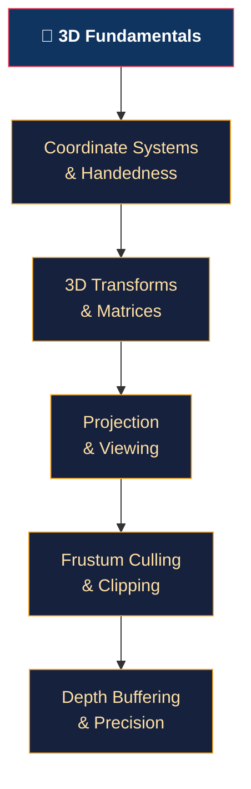

# 🧊 3D Fundamentals — Section Map of Content

> [!abstract] Section Overview
> The mathematical and spatial foundation of all 3D rendering: homogeneous coordinates, the TRS transform chain (Model→World→Camera→Clip→NDC→Screen), perspective and orthographic projection, frustum culling and clipping algorithms, Z-buffer depth precision pitfalls, and coordinate system conventions (handedness, winding order, NDC ranges). Mastery here is prerequisite for every section that follows.

---

## Concept Map

---

## Learning Path

1. [[Coordinate_Systems_and_Handedness|Coordinate Systems & Handedness]] — right-hand vs left-hand, Y-up vs Z-up
2. [[3D_Transforms_and_Matrices|3D Transforms & Matrices]] — TRS, MVP, homogeneous, quaternion slerp
3. [[Projection_and_Viewing|Projection & Viewing]] — perspective divide, FOV, NDC
4. [[Frustum_Culling_and_Clipping|Frustum Culling & Clipping]] — 6-plane test, BVH, Cohen-Sutherland
5. [[Depth_Buffering_and_Precision|Depth Buffering & Precision]] — Z-buffer, reverse-Z, log depth

---

## Notes at a Glance

| Note | Core Concept | Key Formula | Difficulty |
|------|-------------|-------------|------------|
| [[Coordinate_Systems_and_Handedness]] | NDC ranges, winding | Right-hand cross product | Beginner |
| [[3D_Transforms_and_Matrices]] | M=T·R·S column-major | Quaternion slerp | Intermediate |
| [[Projection_and_Viewing]] | Perspective divide | `x_ndc = x_clip / w_clip` | Intermediate |
| [[Frustum_Culling_and_Clipping]] | 6-plane AABB test | Cohen-Sutherland outcodes | Intermediate |
| [[Depth_Buffering_and_Precision]] | Non-linear depth, reverse-Z | `z_ndc = (f+n−2fn/z)/(f−n)` | Advanced |

---

## Key Questions

1. Why are w=0 vectors (directions) unaffected by translation in homogeneous coords?
2. What causes gimbal lock and how does quaternion slerp avoid it?
3. Why is perspective-projected depth non-linear, and how does reverse-Z reclaim precision?
4. An AABB test says "outside frustum" — can the object still be partially visible? (BVH false negative rate)
5. How does the left-hand/right-hand handedness difference manifest in Vulkan vs OpenGL NDC?

---

## Related Sections

- [[_MOC_Computer_Graphics_Master|↑ Master MOC]]
- [[../01_2D_Graphics/_MOC_2D_Graphics|← 2D Graphics]] (2D rasterization)
- [[../03_Rendering_Pipeline/_MOC_Rendering_Pipeline|→ Rendering Pipeline]] (MVP goes into vertex shaders)
- [[../04_Shaders/_MOC_Shaders|→ Shaders]] (gl_Position = MVP · vertex_position)

---

#Computer_Graphics #3D_Fundamentals #MOC
