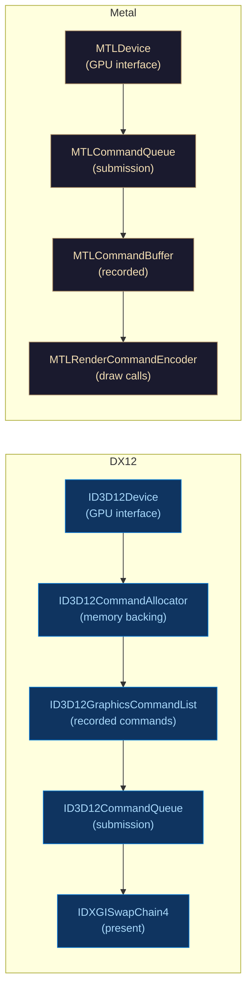

# 🪟 DirectX 12 and Metal

> [!abstract] TL;DR
> DirectX 12 (Windows/Xbox) and Metal (Apple platforms) are platform-specific explicit GPU APIs comparable to Vulkan. DX12: command lists record GPU work → command allocators manage memory → command queues execute → DXGI swap chain presents. Root signatures define the shader resource binding layout (like Vulkan pipeline layouts); descriptor tables point into descriptor heaps. Heap types: upload (CPU-write, GPU-read), default (GPU only), readback (GPU-write, CPU-read). Resource barriers transition resources between states. SM6 (Shader Model 6) adds wave intrinsics and mesh shaders. Metal: MTLDevice → MTLCommandQueue → MTLCommandBuffer → MTLRenderCommandEncoder. Argument buffers encode resource tables for bindless rendering. MTLLibrary caches MSL compilation.

---

## Intuition — Analogy First

Think of DX12 and Metal as "Vulkan with a different accent" — the concepts are identical (explicit pipeline state, command recording, synchronization barriers, descriptor/resource binding), but the vocabulary and defaults differ. DX12 uses HLSL with root signatures; Metal uses MSL with argument buffers. Both give you the same performance headroom as Vulkan while targeting specific ecosystems (Windows vs Apple Silicon).

---

## How It Works



---

## Key Concepts / Details

### DirectX 12 Command Architecture

```cpp
// Device creation (simplified)
D3D12CreateDevice(adapter, D3D_FEATURE_LEVEL_12_0, IID_PPV_ARGS(&device));

// Command queue
D3D12_COMMAND_QUEUE_DESC queueDesc{};
queueDesc.Type = D3D12_COMMAND_LIST_TYPE_DIRECT;
device->CreateCommandQueue(&queueDesc, IID_PPV_ARGS(&commandQueue));

// Command allocator (one per frame in flight)
device->CreateCommandAllocator(D3D12_COMMAND_LIST_TYPE_DIRECT,
                               IID_PPV_ARGS(&commandAllocator));

// Command list
device->CreateCommandList(0, D3D12_COMMAND_LIST_TYPE_DIRECT,
                          commandAllocator.Get(), nullptr,
                          IID_PPV_ARGS(&commandList));

// Record commands
commandList->SetGraphicsRootSignature(rootSignature.Get());
commandList->SetPipelineState(pipelineState.Get());
commandList->DrawIndexedInstanced(indexCount, 1, 0, 0, 0);
commandList->Close();

// Execute
ID3D12CommandList* lists[] = { commandList.Get() };
commandQueue->ExecuteCommandLists(1, lists);
```

**Fence for CPU-GPU sync:**
```cpp
commandQueue->Signal(fence.Get(), fenceValue);
if (fence->GetCompletedValue() < fenceValue) {
    fence->SetEventOnCompletion(fenceValue, fenceEvent);
    WaitForSingleObject(fenceEvent, INFINITE);
}
```

### Root Signatures

Root signatures define the interface between the application and the shader (what resources are bound and where). They are analogous to Vulkan's `VkPipelineLayout`.

```cpp
// Root parameters: constants, descriptors, or descriptor tables
CD3DX12_ROOT_PARAMETER rootParams[3];
rootParams[0].InitAsConstantBufferView(0); // b0 — per-object constants
rootParams[1].InitAsShaderResourceView(0); // t0 — structured buffer
rootParams[2].InitAsDescriptorTable(1, &srvRange); // SRV range (textures)

CD3DX12_VERSIONED_ROOT_SIGNATURE_DESC rsDesc;
rsDesc.Init_1_1(3, rootParams, 1, &staticSampler,
                D3D12_ROOT_SIGNATURE_FLAG_ALLOW_INPUT_ASSEMBLER_INPUT_LAYOUT);

// Serialize and create
ComPtr<ID3DBlob> signature, error;
D3DX12SerializeVersionedRootSignature(&rsDesc, ..., &signature, &error);
device->CreateRootSignature(0, signature->GetBufferPointer(),
                            signature->GetBufferSize(), IID_PPV_ARGS(&rootSignature));
```

Root signature cost: 64 DWORDs (256 bytes) of root space. Root constants (32-bit values) are free; CBVs/SRVs are 8 bytes each; descriptor tables are 4 bytes per table reference.

### Descriptor Heaps and Tables

```cpp
// SRV/CBV/UAV heap
D3D12_DESCRIPTOR_HEAP_DESC heapDesc{};
heapDesc.Type = D3D12_DESCRIPTOR_HEAP_TYPE_CBV_SRV_UAV;
heapDesc.NumDescriptors = 1000;
heapDesc.Flags = D3D12_DESCRIPTOR_HEAP_FLAG_SHADER_VISIBLE;
device->CreateDescriptorHeap(&heapDesc, IID_PPV_ARGS(&srvHeap));

// Create SRV at heap[0]
device->CreateShaderResourceView(texture.Get(), &srvDesc,
                                 srvHeap->GetCPUDescriptorHandleForHeapStart());

// Bind heap and table at draw time
commandList->SetDescriptorHeaps(1, srvHeap.GetAddressOf());
commandList->SetGraphicsRootDescriptorTable(2, srvHeap->GetGPUDescriptorHandleForHeapStart());
```

### Resource Heap Types

| Type | CPU Access | GPU Access | Use |
|------|-----------|-----------|-----|
| `D3D12_HEAP_TYPE_UPLOAD` | Write (uncached) | Read-only | Constant buffers, staging |
| `D3D12_HEAP_TYPE_DEFAULT` | None (copy only) | Read/Write | Textures, render targets, vertex/index buffers |
| `D3D12_HEAP_TYPE_READBACK` | Read | Write-only | GPU→CPU readback (screenshots, compute results) |

```cpp
// Upload buffer for per-frame constants
CD3DX12_HEAP_PROPERTIES uploadHeap(D3D12_HEAP_TYPE_UPLOAD);
CD3DX12_RESOURCE_DESC bufDesc = CD3DX12_RESOURCE_DESC::Buffer(bufferSize);
device->CreateCommittedResource(&uploadHeap, D3D12_HEAP_FLAG_NONE,
                                &bufDesc, D3D12_RESOURCE_STATE_GENERIC_READ,
                                nullptr, IID_PPV_ARGS(&uploadBuffer));
```

### Resource Barriers (DX12)

```cpp
// Transition backbuffer from Present to RenderTarget
CD3DX12_RESOURCE_BARRIER barrier = CD3DX12_RESOURCE_BARRIER::Transition(
    backBuffer.Get(),
    D3D12_RESOURCE_STATE_PRESENT,
    D3D12_RESOURCE_STATE_RENDER_TARGET);
commandList->ResourceBarrier(1, &barrier);

// ... draw commands ...

// Transition back to Present
barrier = CD3DX12_RESOURCE_BARRIER::Transition(
    backBuffer.Get(),
    D3D12_RESOURCE_STATE_RENDER_TARGET,
    D3D12_RESOURCE_STATE_PRESENT);
commandList->ResourceBarrier(1, &barrier);
swapChain->Present(1, 0);  // vsync
```

### Shader Model 6 (HLSL SM6) Features

| Feature | SM Level | Description |
|---------|---------|-------------|
| Wave intrinsics | SM 6.0 | `WaveActiveSum`, `WavePrefixSum`, `WaveGetLaneIndex` |
| 64-bit operations | SM 6.0 | Double-precision, 64-bit atomics |
| Mesh shaders | SM 6.5 | Replace VS/GS with task + mesh |
| Amplification shaders | SM 6.5 | GPU-culled instance amplification |
| Raytracing (DXR) | SM 6.3+ | RT shaders (raygen, closest-hit, miss) |

### Metal Architecture

```swift
// Swift / Objective-C
let device = MTLCreateSystemDefaultDevice()!
let commandQueue = device.makeCommandQueue()!

// Shader library (pre-compiled MSL)
let library = device.makeDefaultLibrary()!
let vertexFn = library.makeFunction(name: "vertexShader")!
let fragmentFn = library.makeFunction(name: "fragmentShader")!

// Pipeline state
let pipelineDesc = MTLRenderPipelineDescriptor()
pipelineDesc.vertexFunction = vertexFn
pipelineDesc.fragmentFunction = fragmentFn
pipelineDesc.colorAttachments[0].pixelFormat = .bgra8Unorm
let pipelineState = try! device.makeRenderPipelineState(descriptor: pipelineDesc)

// Command recording
let commandBuffer = commandQueue.makeCommandBuffer()!
let encoder = commandBuffer.makeRenderCommandEncoder(descriptor: renderPassDescriptor)!
encoder.setRenderPipelineState(pipelineState)
encoder.drawPrimitives(type: .triangle, vertexStart: 0, vertexCount: 3)
encoder.endEncoding()
commandBuffer.present(drawable)
commandBuffer.commit()
```

### Metal Argument Buffers (Bindless)

```metal
// Metal Shading Language (MSL)
struct SceneResources {
    array<texture2d<float>, 1024> textures;
    array<sampler, 4> samplers;
    constant float4* transforms;
};
fragment float4 myFragment(
    constant SceneResources& resources [[buffer(0)]],
    uint texIdx [[user(texIdx)]])
{
    return resources.textures[texIdx].sample(resources.samplers[0], uv);
}
```

Argument buffers allow GPU-side indirect resource addressing — Metal's equivalent of DX12 bindless descriptors.

---

## Real-World Notes

- **PIX** (DX12 GPU debugger) and **Xcode GPU Frame Capture** (Metal) are the native profiling tools — far more integrated than RenderDoc for platform-specific features.
- **DX12 Agility SDK**: Microsoft's runtime distribution package allows using latest DX12 features on older Windows 10 builds without an OS update.
- **MetalFX**: Metal's upscaling solution (similar to DLSS/FSR), with spatial and temporal modes.
- **DXGI swap chain**: `DXGI_SWAP_EFFECT_FLIP_DISCARD` is the required mode for HDR and variable refresh rate (VRR) on Windows.

---

## Common Pitfalls

1. **Reusing command allocator before GPU is done** — calling `commandAllocator->Reset()` while the GPU is still executing from it causes corruption; always wait on fence first.
2. **Wrong heap type for texture** — creating a texture in `HEAP_TYPE_UPLOAD` works but is uncached and slow; textures must be in `HEAP_TYPE_DEFAULT` for GPU performance.
3. **Missing UAV barrier between dispatch calls** — when a compute shader writes a buffer that the next compute shader reads, an explicit UAV barrier is required between dispatches.
4. **Metal pipeline state creation on main thread** — PSO compilation blocks; use `makeRenderPipelineState(descriptor:completionHandler:)` for async creation.

---

## Related Concepts

- [[_MOC_Rendering_Pipeline|↑ Rendering Pipeline MOC]]
- [[Vulkan_Architecture|Vulkan Architecture]] — parallel explicit API
- [[../04_Shaders/HLSL_for_DirectX|HLSL for DirectX]] — shading language for DX12
- [[Framebuffers_and_Render_Targets|Framebuffers]] — render target setup in DX12/Metal

---

## Review Questions

1. Compare DX12 root signatures to Vulkan pipeline layouts. What is the "64 DWORD" constraint and why does it matter for performance?
2. Explain why a resource must transition from `D3D12_RESOURCE_STATE_RENDER_TARGET` to `D3D12_RESOURCE_STATE_PRESENT` before `Present()`. What happens without this barrier?
3. A Metal app creates pipeline states on the main thread during game loading. Users report a stutter on the first render. What is the cause and fix?

---

## Sources

#Computer_Graphics #Rendering_Pipeline #DirectX12 #Metal
