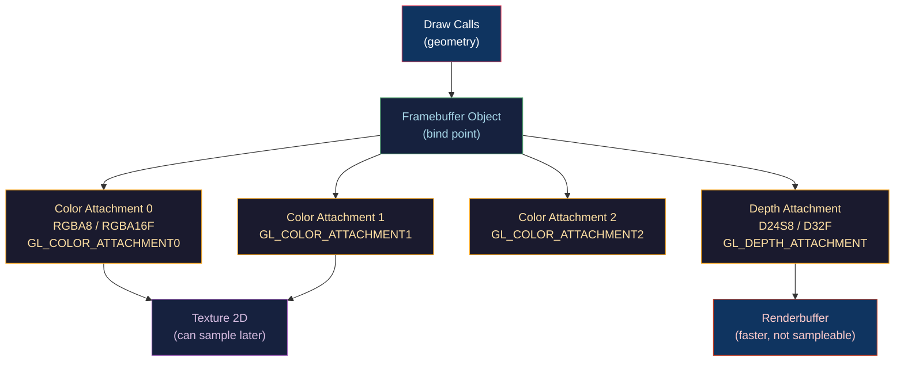

# 🖼️ Framebuffers and Render Targets

> [!abstract] TL;DR
> A Framebuffer Object (FBO) is an off-screen render target: a container binding color attachments (textures/renderbuffers), a depth attachment, and optionally a stencil attachment. MRT (Multiple Render Targets) allows a single draw call to write to up to 8 color attachments simultaneously — essential for deferred shading G-buffers. Ping-pong framebuffers alternate between two FBOs each frame for iterative post-processing (bloom, blur). MSAA FBOs require a separate multisampled renderbuffer and explicit resolve via `glBlitFramebuffer`. HDR rendering uses `RGBA16F` (half-float) or `RGBA32F` color attachments to preserve values above 1.0 for tonemapping. Renderbuffers (not textures) are preferred for attachments not needed as shader inputs (depth, stencil).

---

## Intuition — Analogy First

A framebuffer is like a painter's workspace: the "default framebuffer" is the canvas everyone sees (the screen), and FBOs are auxiliary canvases you paint privately. You can have multiple auxiliary canvases (MRT), use the same canvas alternately as source/target (ping-pong), and work at higher fidelity (HDR float format) before presenting the final result. The "resolve" step is like photographing a high-detail canvas at lower resolution for display.

---

## How It Works



---

## Key Concepts / Details

### FBO Creation (OpenGL)

```cpp
GLuint fbo;
glGenFramebuffers(1, &fbo);
glBindFramebuffer(GL_FRAMEBUFFER, fbo);

// Attach a color texture
GLuint colorTex;
glGenTextures(1, &colorTex);
glBindTexture(GL_TEXTURE_2D, colorTex);
glTexImage2D(GL_TEXTURE_2D, 0, GL_RGBA8, width, height, 0,
             GL_RGBA, GL_UNSIGNED_BYTE, nullptr);  // nullptr = allocate only
glTexParameteri(GL_TEXTURE_2D, GL_TEXTURE_MIN_FILTER, GL_LINEAR);
glFramebufferTexture2D(GL_FRAMEBUFFER, GL_COLOR_ATTACHMENT0, GL_TEXTURE_2D, colorTex, 0);

// Attach a depth renderbuffer (faster than texture for depth-only)
GLuint depthRbo;
glGenRenderbuffers(1, &depthRbo);
glBindRenderbuffer(GL_RENDERBUFFER, depthRbo);
glRenderbufferStorage(GL_RENDERBUFFER, GL_DEPTH24_STENCIL8, width, height);
glFramebufferRenderbuffer(GL_FRAMEBUFFER, GL_DEPTH_STENCIL_ATTACHMENT,
                          GL_RENDERBUFFER, depthRbo);

// Verify completeness
GLenum status = glCheckFramebufferStatus(GL_FRAMEBUFFER);
assert(status == GL_FRAMEBUFFER_COMPLETE);
```

### Multiple Render Targets (MRT)

MRT allows the fragment shader to write to multiple color attachments in one pass. The classic use is G-buffer generation for deferred shading.

```cpp
// Attach multiple color textures
glFramebufferTexture2D(GL_FRAMEBUFFER, GL_COLOR_ATTACHMENT0, GL_TEXTURE_2D, albedoTex, 0);
glFramebufferTexture2D(GL_FRAMEBUFFER, GL_COLOR_ATTACHMENT1, GL_TEXTURE_2D, normalTex, 0);
glFramebufferTexture2D(GL_FRAMEBUFFER, GL_COLOR_ATTACHMENT2, GL_TEXTURE_2D, materialTex, 0);

// Tell OpenGL which attachments to draw into
GLenum drawBuffers[] = { GL_COLOR_ATTACHMENT0, GL_COLOR_ATTACHMENT1, GL_COLOR_ATTACHMENT2 };
glDrawBuffers(3, drawBuffers);
```

```glsl
// Fragment shader with MRT output
layout(location = 0) out vec4 gAlbedo;    // attachment 0
layout(location = 1) out vec4 gNormal;    // attachment 1
layout(location = 2) out vec4 gMaterial;  // attachment 2 (roughness, metallic, AO, ...)

void main() {
    gAlbedo   = vec4(albedo, 1.0);
    gNormal   = vec4(normal * 0.5 + 0.5, 0.0);  // encode [-1,1] → [0,1]
    gMaterial = vec4(roughness, metallic, ao, 0.0);
}
```

Maximum simultaneous attachments: `GL_MAX_COLOR_ATTACHMENTS` ≥ 8 (minimum required).

### Ping-Pong Framebuffers

For iterative effects (Gaussian blur, bloom extraction), alternate between two FBOs each iteration:

```cpp
// Two FBOs with swapped input/output textures
GLuint pingFBO, pongFBO, pingTex, pongTex;
// ... create both FBOs with their textures ...

bool horizontal = true;
glUseProgram(gaussianBlurShader);
for (int i = 0; i < 10; i++) {  // 10 blur passes
    glBindFramebuffer(GL_FRAMEBUFFER, horizontal ? pongFBO : pingFBO);
    glUniform1i(uHorizontal, horizontal);
    glBindTexture(GL_TEXTURE_2D, horizontal ? pingTex : pongTex);
    renderQuad();  // full-screen quad
    horizontal = !horizontal;
}
// Final result is in pingTex or pongTex depending on parity
```

### MSAA FBO Setup and Resolve

```cpp
// Create MSAA color renderbuffer (4x)
GLuint msaaFBO, msaaColorRBO, msaaDepthRBO;
glGenFramebuffers(1, &msaaFBO);
glBindFramebuffer(GL_FRAMEBUFFER, msaaFBO);

glGenRenderbuffers(1, &msaaColorRBO);
glBindRenderbuffer(GL_RENDERBUFFER, msaaColorRBO);
glRenderbufferStorageMultisample(GL_RENDERBUFFER, 4, GL_RGBA8, width, height);
glFramebufferRenderbuffer(GL_FRAMEBUFFER, GL_COLOR_ATTACHMENT0,
                          GL_RENDERBUFFER, msaaColorRBO);

// ... also create MSAA depth RBO ...

// Create resolve FBO (1x, sampleable texture)
GLuint resolveFBO, resolveTex;
glGenFramebuffers(1, &resolveFBO);
glBindFramebuffer(GL_FRAMEBUFFER, resolveFBO);
glFramebufferTexture2D(GL_FRAMEBUFFER, GL_COLOR_ATTACHMENT0,
                       GL_TEXTURE_2D, resolveTex, 0);

// Resolve: blit from MSAA FBO to resolve FBO
glBindFramebuffer(GL_READ_FRAMEBUFFER, msaaFBO);
glBindFramebuffer(GL_DRAW_FRAMEBUFFER, resolveFBO);
glBlitFramebuffer(0, 0, width, height, 0, 0, width, height,
                  GL_COLOR_BUFFER_BIT, GL_LINEAR);
```

### HDR Framebuffer

```cpp
// RGBA16F: each channel is 16-bit float → can store values > 1.0
glTexImage2D(GL_TEXTURE_2D, 0, GL_RGBA16F, width, height, 0,
             GL_RGBA, GL_FLOAT, nullptr);

// RGBA32F: full 32-bit float per channel (usually excessive for color)
// R11F_G11F_B10F: packed HDR without alpha (11+11+10 bits) — good for HDR color
glTexImage2D(GL_TEXTURE_2D, 0, GL_R11F_G11F_B10F, width, height, 0,
             GL_RGB, GL_FLOAT, nullptr);
```

HDR tonemapping in the final blit shader converts HDR values to LDR [0,1]:

```glsl
// Reinhard tonemapping
vec3 hdr = texture(hdrFBO, uv).rgb;
vec3 ldr = hdr / (hdr + vec3(1.0));

// ACES filmic tonemapping (more accurate for film look)
vec3 AcesTonemap(vec3 x) {
    float a=2.51, b=0.03, c=2.43, d=0.59, e=0.14;
    return clamp((x*(a*x+b))/(x*(c*x+d)+e), 0.0, 1.0);
}
```

### Attachment Format Quick Reference

| Format | Size | Use |
|--------|------|-----|
| `GL_RGBA8` | 32 bpp | LDR color, albedo |
| `GL_RGBA16F` | 64 bpp | HDR color, normals (precise) |
| `GL_RGBA32F` | 128 bpp | Scientific, floating point data |
| `GL_R11F_G11F_B10F` | 32 bpp | HDR color (no alpha, compact) |
| `GL_RGB10_A2` | 32 bpp | HDR with 2-bit alpha (UI blend) |
| `GL_DEPTH24_STENCIL8` | 32 bpp | Standard depth + stencil |
| `GL_DEPTH32F_STENCIL8` | 40 bpp | High-precision depth |
| `GL_DEPTH_COMPONENT32F` | 32 bpp | Shadow maps, reverse-Z |

---

## Real-World Notes

- **G-buffer bandwidth**: 3–4 MRT attachments at 1080p × 4 bytes = ~25–33MB per frame pass; a primary concern for mobile deferred rendering.
- **Renderbuffer vs texture**: renderbuffers can use tiling/compression the GPU driver applies natively; textures must meet format constraints. Use renderbuffers for depth/stencil unless you sample it (e.g., shadow maps or SSAO).
- **Depth texture sampling**: to sample a depth texture (SSAO, shadow), set `GL_TEXTURE_COMPARE_MODE = GL_NONE` for raw access; `GL_COMPARE_REF_TO_TEXTURE` for hardware PCF comparison.

---

## Common Pitfalls

1. **Forgetting `glDrawBuffers` with MRT** — by default only `GL_COLOR_ATTACHMENT0` is active; other MRT outputs are silently discarded.
2. **FBO not complete** — `GL_FRAMEBUFFER_INCOMPLETE_ATTACHMENT` usually means a texture's format is incompatible with the attachment type, or its size is 0×0.
3. **Sampling from an attached texture without unbinding the FBO** — reading from a texture that's currently attached as a framebuffer output is undefined behavior (feedback loop).
4. **MSAA resolve filter GL_NEAREST for depth** — depth buffers must be resolved with `GL_NEAREST` (not `GL_LINEAR`) since interpolated depth values are meaningless.

---

## Related Concepts

- [[_MOC_Rendering_Pipeline|↑ Rendering Pipeline MOC]]
- [[OpenGL_Core_Profile|OpenGL Core Profile]] — glFramebufferTexture2D API
- [[Deferred_and_Forward_Rendering|Deferred & Forward Rendering]] — MRT G-buffer
- [[../02_3D_Fundamentals/Depth_Buffering_and_Precision|Depth Buffering]] — depth attachment formats and precision
- [[Anti_Aliasing|Anti-Aliasing]] — MSAA FBO and resolve

---

## Review Questions

1. You attach 3 textures to an FBO but only the first attachment gets data. What did you forget, and why?
2. Explain the difference between a renderbuffer and a texture attachment. When is each preferred?
3. A bloom effect requires 5 passes of Gaussian blur on a bright-areas texture. Describe the ping-pong FBO setup and why a single FBO cannot be used for in-place blurring.

---

## Sources

#Computer_Graphics #Rendering_Pipeline #Framebuffer #RenderTarget
