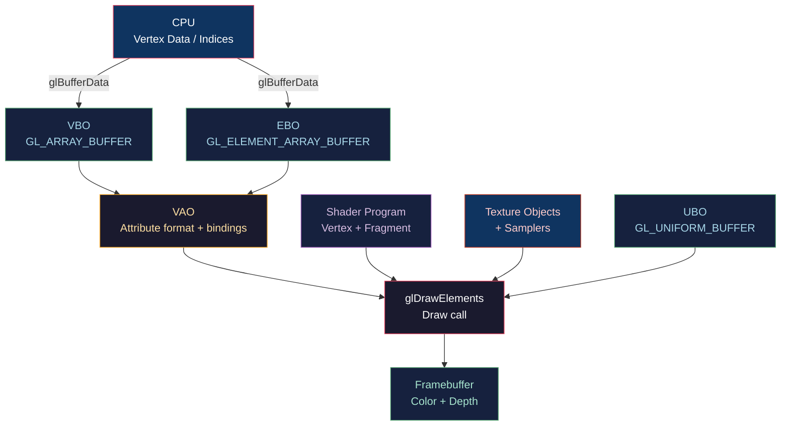

# 🟢 OpenGL Core Profile

> [!abstract] TL;DR
> OpenGL Core Profile (3.2+) removes legacy fixed-function features and requires explicit shader-based rendering. The core objects are: VAO (Vertex Array Object — stores attribute format + VBO bindings), VBO (Vertex Buffer Object — raw vertex data), EBO (Element Buffer Object — index array). Setup order: create VAO → bind VAO → create/bind VBO → upload data → set attrib pointers → unbind VAO. Shaders are compiled/linked into programs. Textures bind to texture units (GL_TEXTURE0+i) and samplers reference these via uniform integers. UBOs (Uniform Buffer Objects) share large uniform blocks across multiple shaders. State is global per context — blend/depth/stencil state persists until changed.

---

## Intuition — Analogy First

OpenGL is a state machine like a factory floor: before you start machining a part, you configure the machines (bind VAO, bind textures, set blend state), then issue the work order (draw call). The factory "remembers" its configuration between orders — dangerous if you forget to reconfigure before the next part. VAO is the "job ticket" that records which raw materials (VBOs) go to which machines (attribute slots), so you only configure once per mesh type.

---

## How It Works



---

## Key Concepts / Details

### VAO / VBO / EBO Setup Order

**Critical: bind VAO before binding VBO/EBO — VAO records the bindings.**

```cpp
// 1. Create objects
GLuint vao, vbo, ebo;
glGenVertexArrays(1, &vao);
glGenBuffers(1, &vbo);
glGenBuffers(1, &ebo);

// 2. Bind VAO FIRST
glBindVertexArray(vao);

// 3. Upload vertex data
glBindBuffer(GL_ARRAY_BUFFER, vbo);
glBufferData(GL_ARRAY_BUFFER, sizeof(vertices), vertices, GL_STATIC_DRAW);

// 4. Upload index data
glBindBuffer(GL_ELEMENT_ARRAY_BUFFER, ebo);
glBufferData(GL_ELEMENT_ARRAY_BUFFER, sizeof(indices), indices, GL_STATIC_DRAW);

// 5. Set vertex attribute pointers (recorded into VAO)
// Position: layout(location=0) vec3
glVertexAttribPointer(0, 3, GL_FLOAT, GL_FALSE, 8*sizeof(float), (void*)0);
glEnableVertexAttribArray(0);
// Normals: layout(location=1) vec3
glVertexAttribPointer(1, 3, GL_FLOAT, GL_FALSE, 8*sizeof(float), (void*)(3*sizeof(float)));
glEnableVertexAttribArray(1);
// UVs: layout(location=2) vec2
glVertexAttribPointer(2, 2, GL_FLOAT, GL_FALSE, 8*sizeof(float), (void*)(6*sizeof(float)));
glEnableVertexAttribArray(2);

// 6. Unbind VAO (optional; VBO can be unbound too)
glBindVertexArray(0);
```

What VAO stores: the attrib format (location, type, stride, offset) AND the VBO binding AND the EBO binding. Rebinding VAO restores all of this instantly.

### Shader Compile and Link Pipeline

```cpp
// Compile vertex shader
GLuint vs = glCreateShader(GL_VERTEX_SHADER);
glShaderSource(vs, 1, &vertSrc, nullptr);
glCompileShader(vs);
// Check: glGetShaderiv(vs, GL_COMPILE_STATUS, &success)

// Compile fragment shader
GLuint fs = glCreateShader(GL_FRAGMENT_SHADER);
glShaderSource(fs, 1, &fragSrc, nullptr);
glCompileShader(fs);

// Link program
GLuint prog = glCreateProgram();
glAttachShader(prog, vs);
glAttachShader(prog, fs);
glLinkProgram(prog);
// Check: glGetProgramiv(prog, GL_LINK_STATUS, &success)

glDeleteShader(vs);  // safe after linking
glDeleteShader(fs);

glUseProgram(prog);
```

### Texture Objects and Samplers

```cpp
GLuint tex;
glGenTextures(1, &tex);
glBindTexture(GL_TEXTURE_2D, tex);

// Upload image data
glTexImage2D(GL_TEXTURE_2D, 0, GL_RGBA8, width, height, 0,
             GL_RGBA, GL_UNSIGNED_BYTE, pixels);

// Filtering parameters
glTexParameteri(GL_TEXTURE_2D, GL_TEXTURE_MIN_FILTER, GL_LINEAR_MIPMAP_LINEAR);
glTexParameteri(GL_TEXTURE_2D, GL_TEXTURE_MAG_FILTER, GL_LINEAR);
glTexParameteri(GL_TEXTURE_2D, GL_TEXTURE_WRAP_S, GL_REPEAT);
glTexParameteri(GL_TEXTURE_2D, GL_TEXTURE_WRAP_T, GL_REPEAT);

glGenerateMipmap(GL_TEXTURE_2D);  // generate mip chain

// Bind to texture unit and set uniform
glActiveTexture(GL_TEXTURE0);      // select unit 0
glBindTexture(GL_TEXTURE_2D, tex); // bind texture to unit 0
glUniform1i(glGetUniformLocation(prog, "uAlbedo"), 0);  // unit index, not object ID
```

Texture unit limit: at least 80 per stage (GL_MAX_TEXTURE_IMAGE_UNITS ≥ 16 required by spec).

### Uniform Buffer Objects (UBOs)

UBOs allow sharing large blocks of uniforms across multiple programs without re-uploading:

```cpp
struct CameraUBO {
    glm::mat4 view;       // 64 bytes
    glm::mat4 projection; // 64 bytes
    glm::vec4 cameraPos;  // 16 bytes (vec3 needs vec4 alignment in std140!)
};  // total: 144 bytes

GLuint ubo;
glGenBuffers(1, &ubo);
glBindBuffer(GL_UNIFORM_BUFFER, ubo);
glBufferData(GL_UNIFORM_BUFFER, sizeof(CameraUBO), &cameraData, GL_DYNAMIC_DRAW);
glBindBufferBase(GL_UNIFORM_BUFFER, 0, ubo);  // bind to binding point 0
```

```glsl
// GLSL shader
layout(std140, binding = 0) uniform CameraBlock {
    mat4 view;
    mat4 projection;
    vec4 cameraPos;
};
```

**std140 layout rules**: scalars aligned to 4 bytes, vec2 to 8, vec3/vec4 to 16, arrays of scalars to 16-byte stride. Use `std430` (for SSBOs) or pack manually if sizes matter.

### Instanced Drawing

```cpp
// Draw 1000 instances of the same mesh
glDrawElementsInstanced(GL_TRIANGLES, indexCount, GL_UNSIGNED_INT, 0, 1000);
```

```glsl
// Vertex shader accesses instance data
in int gl_InstanceID;  // 0..999

// Per-instance data via instanced VBO (divisor=1)
layout(location = 3) in mat4 instanceMatrix;  // 4 vec4s = locations 3,4,5,6
```

```cpp
// Setup instance matrix VBO with divisor=1
glVertexAttribPointer(3, 4, GL_FLOAT, GL_FALSE, sizeof(glm::mat4), (void*)0);
glVertexAttribDivisor(3, 1);  // advance once per instance (not per vertex)
// repeat for locations 4,5,6 (each column of mat4)
```

### Blend, Depth, Stencil State

```cpp
// Depth test
glEnable(GL_DEPTH_TEST);
glDepthFunc(GL_LESS);           // default; GL_LEQUAL for depth prepass
glDepthMask(GL_TRUE);           // enable depth writes

// Alpha blending
glEnable(GL_BLEND);
glBlendFunc(GL_SRC_ALPHA, GL_ONE_MINUS_SRC_ALPHA);  // Porter-Duff source-over
glBlendEquation(GL_FUNC_ADD);

// Stencil
glEnable(GL_STENCIL_TEST);
glStencilFunc(GL_EQUAL, 1, 0xFF);   // pass if stencil == 1
glStencilOp(GL_KEEP, GL_KEEP, GL_REPLACE);  // update stencil on pass
```

---

## Real-World Notes

- **DSA (Direct State Access)**: OpenGL 4.5+ allows `glTextureParameteri(tex, ...)` without binding — cleaner, avoids state leak.
- **Bindless textures** (ARB_bindless_texture): make textures resident and pass 64-bit handles as uniforms — avoids the 80-texture-unit limit.
- **SPIR-V shaders**: OpenGL 4.6+ supports pre-compiled SPIR-V via `glShaderBinary` — enables offline compilation and cross-API shader sharing.
- **Debug callback**: `glDebugMessageCallback(myDebugFn, nullptr)` with `GL_DEBUG_OUTPUT` enabled gives human-readable error messages instead of polling `glGetError()`.

---

## Common Pitfalls

1. **Binding VBO before VAO** — the attrib pointer calls are recorded into whatever VAO is currently bound; if none is bound, they're lost.
2. **Using uniform index, not object ID, for textures** — `glUniform1i("sampler", texID)` is wrong; it should be the texture UNIT index (0, 1, 2...).
3. **Forgetting `std140` padding rules** — `vec3` in a UBO is padded to 16 bytes; using a C `struct` with `float[3]` causes misalignment.
4. **Not clearing depth buffer** — forgetting `GL_DEPTH_BUFFER_BIT` in `glClear` leaves last frame's depth, causing geometry to vanish.

---

## Related Concepts

- [[_MOC_Rendering_Pipeline|↑ Rendering Pipeline MOC]]
- [[Vulkan_Architecture|Vulkan Architecture]] — modern replacement for OpenGL
- [[Framebuffers_and_Render_Targets|Framebuffers & Render Targets]] — FBO setup
- [[../04_Shaders/GLSL_Vertex_Shaders|GLSL Vertex Shaders]] — shaders used in this pipeline
- [[Deferred_and_Forward_Rendering|Deferred & Forward Rendering]] — rendering strategies using this API

---

## Review Questions

1. Explain exactly what information is stored in a VAO object, and why binding the VAO before configuring attrib pointers is mandatory.
2. What is the std140 layout rule for `vec3` in a UBO, and how would you lay out a C struct to avoid misalignment?
3. You have 200 different textures to use across a scene. What are two approaches to exceed the 80 texture unit limit in OpenGL?

---

## Sources

#Computer_Graphics #Rendering_Pipeline #OpenGL
