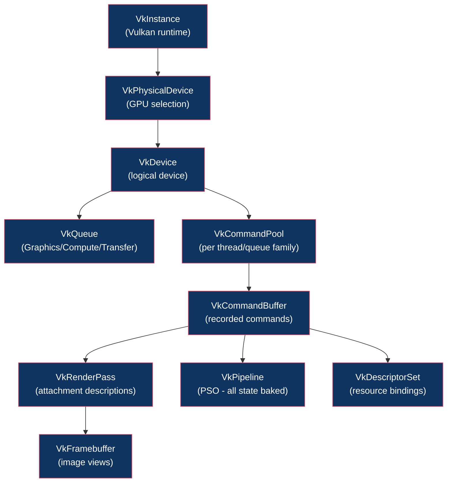

# 🔺 Vulkan Architecture

> [!abstract] TL;DR
> Vulkan is an explicit, low-overhead GPU API where the application manages all synchronization, memory, and command recording manually. Object hierarchy: VkInstance → VkPhysicalDevice → VkDevice → VkQueue. Recording chain: VkCommandPool (per thread/queue family) → VkCommandBuffer → vkCmd* calls. Render passes define attachment formats and load/store operations; subpasses declare dependencies for efficient tiling GPU optimization. Image layout transitions (UNDEFINED → COLOR_ATTACHMENT_OPTIMAL → SHADER_READ_ONLY_OPTIMAL) require explicit pipeline barriers with src/dst stage and access masks. PSOs (Pipeline State Objects) bake all state at creation; descriptor sets bind resources. Semaphores sync across queues; fences sync GPU→CPU; pipeline barriers sync within a command buffer.

---

## Intuition — Analogy First

OpenGL is a hire-a-contractor model: you say "paint this wall blue" and the contractor handles tools, timing, and cleanup. Vulkan is a full construction project where you specify every tool, who holds it when, and how materials flow between workers. This verbosity allows the GPU driver to do zero hidden work — what you schedule is exactly what runs. The payoff: predictable performance, multi-threaded command recording, and no "mystery stutters" from driver state validation.

---

## How It Works



---

## Key Concepts / Details

### Object Initialization Chain

```cpp
// 1. Instance
VkInstanceCreateInfo instInfo{VK_STRUCTURE_TYPE_INSTANCE_CREATE_INFO};
instInfo.enabledLayerCount = layers.size();
instInfo.ppEnabledLayerNames = layers.data();
vkCreateInstance(&instInfo, nullptr, &instance);

// 2. Physical device selection (pick discrete GPU)
vkEnumeratePhysicalDevices(instance, &count, physDevices.data());
// select by VkPhysicalDeviceProperties.deviceType == VK_PHYSICAL_DEVICE_TYPE_DISCRETE_GPU

// 3. Queue family selection
// Find family that supports VK_QUEUE_GRAPHICS_BIT
uint32_t graphicsFamily = findQueueFamily(physDevice, VK_QUEUE_GRAPHICS_BIT);

// 4. Logical device + queue
float priority = 1.0f;
VkDeviceQueueCreateInfo queueInfo{VK_STRUCTURE_TYPE_DEVICE_QUEUE_CREATE_INFO};
queueInfo.queueFamilyIndex = graphicsFamily;
queueInfo.queueCount = 1;
queueInfo.pQueuePriorities = &priority;

VkDeviceCreateInfo devInfo{VK_STRUCTURE_TYPE_DEVICE_CREATE_INFO};
devInfo.queueCreateInfoCount = 1;
devInfo.pQueueCreateInfos = &queueInfo;
vkCreateDevice(physDevice, &devInfo, nullptr, &device);
vkGetDeviceQueue(device, graphicsFamily, 0, &graphicsQueue);
```

### Command Recording

```cpp
// Create pool (reset-able commands, one per thread)
VkCommandPoolCreateInfo poolInfo{VK_STRUCTURE_TYPE_COMMAND_POOL_CREATE_INFO};
poolInfo.flags = VK_COMMAND_POOL_CREATE_RESET_COMMAND_BUFFER_BIT;
poolInfo.queueFamilyIndex = graphicsFamily;
vkCreateCommandPool(device, &poolInfo, nullptr, &cmdPool);

// Allocate command buffer
VkCommandBufferAllocateInfo allocInfo{};
allocInfo.commandPool = cmdPool;
allocInfo.level = VK_COMMAND_BUFFER_LEVEL_PRIMARY;
allocInfo.commandBufferCount = 1;
vkAllocateCommandBuffers(device, &allocInfo, &cmdBuf);

// Record
vkBeginCommandBuffer(cmdBuf, &beginInfo);
  vkCmdBeginRenderPass(cmdBuf, &rpInfo, VK_SUBPASS_CONTENTS_INLINE);
    vkCmdBindPipeline(cmdBuf, VK_PIPELINE_BIND_POINT_GRAPHICS, pipeline);
    vkCmdBindDescriptorSets(cmdBuf, VK_PIPELINE_BIND_POINT_GRAPHICS,
                            pipelineLayout, 0, 1, &descriptorSet, 0, nullptr);
    vkCmdBindVertexBuffers(cmdBuf, 0, 1, &vertexBuffer, offsets);
    vkCmdBindIndexBuffer(cmdBuf, indexBuffer, 0, VK_INDEX_TYPE_UINT32);
    vkCmdDrawIndexed(cmdBuf, indexCount, 1, 0, 0, 0);
  vkCmdEndRenderPass(cmdBuf);
vkEndCommandBuffer(cmdBuf);
```

### Render Passes and Subpasses

A render pass describes attachments (format, load/store ops, initial/final layouts) and subpasses (which attachments are written/read per pass):

```cpp
VkAttachmentDescription colorAttachment{};
colorAttachment.format = swapchainFormat;
colorAttachment.samples = VK_SAMPLE_COUNT_1_BIT;
colorAttachment.loadOp = VK_ATTACHMENT_LOAD_OP_CLEAR;      // clear on begin
colorAttachment.storeOp = VK_ATTACHMENT_STORE_OP_STORE;    // write to memory
colorAttachment.initialLayout = VK_IMAGE_LAYOUT_UNDEFINED;
colorAttachment.finalLayout = VK_IMAGE_LAYOUT_PRESENT_SRC_KHR;
```

On mobile (tile-based GPUs like Apple M-series, Qualcomm Adreno), subpass dependencies allow the driver to keep framebuffer data in on-chip tile memory between subpasses — a massive bandwidth saving for G-buffer deferred rendering.

### Image Layout Transitions (Pipeline Barriers)

Vulkan requires explicit image layout transitions. A pipeline barrier declares:
- Which pipeline stages produce (srcStageMask) and consume (dstStageMask)
- Which memory accesses are involved (srcAccessMask, dstAccessMask)
- The old and new image layouts

```cpp
VkImageMemoryBarrier barrier{VK_STRUCTURE_TYPE_IMAGE_MEMORY_BARRIER};
barrier.oldLayout = VK_IMAGE_LAYOUT_UNDEFINED;           // don't care about old contents
barrier.newLayout = VK_IMAGE_LAYOUT_COLOR_ATTACHMENT_OPTIMAL;
barrier.srcAccessMask = 0;                               // nothing to flush
barrier.dstAccessMask = VK_ACCESS_COLOR_ATTACHMENT_WRITE_BIT;
barrier.image = colorImage;
barrier.subresourceRange = {VK_IMAGE_ASPECT_COLOR_BIT, 0, 1, 0, 1};

vkCmdPipelineBarrier(cmdBuf,
    VK_PIPELINE_STAGE_TOP_OF_PIPE_BIT,        // srcStageMask
    VK_PIPELINE_STAGE_COLOR_ATTACHMENT_OUTPUT_BIT,  // dstStageMask
    0, 0, nullptr, 0, nullptr, 1, &barrier);
```

Common layout transitions:

| Old Layout | New Layout | Use |
|-----------|-----------|-----|
| UNDEFINED | COLOR_ATTACHMENT_OPTIMAL | Before rendering |
| COLOR_ATTACHMENT_OPTIMAL | SHADER_READ_ONLY_OPTIMAL | After rendering, before sampling |
| SHADER_READ_ONLY_OPTIMAL | COLOR_ATTACHMENT_OPTIMAL | Ping-pong effect |
| COLOR_ATTACHMENT_OPTIMAL | PRESENT_SRC_KHR | Before presenting to swapchain |

### Pipeline State Objects (PSOs)

PSOs bake ALL pipeline state at creation (no late binding):

```cpp
VkGraphicsPipelineCreateInfo pipelineInfo{};
// Shader stages
pipelineInfo.stageCount = 2;
pipelineInfo.pStages = shaderStages;  // VS + FS
// Fixed-function state
pipelineInfo.pVertexInputState = &vertexInputInfo;
pipelineInfo.pInputAssemblyState = &inputAssembly;  // GL_TRIANGLES etc.
pipelineInfo.pViewportState = &viewportState;
pipelineInfo.pRasterizationState = &rasterizer;    // polygon mode, cull mode
pipelineInfo.pMultisampleState = &multisampling;
pipelineInfo.pDepthStencilState = &depthStencil;
pipelineInfo.pColorBlendState = &colorBlending;
pipelineInfo.layout = pipelineLayout;  // descriptor set layouts + push constants
pipelineInfo.renderPass = renderPass;
pipelineInfo.subpass = 0;
vkCreateGraphicsPipelines(device, pipelineCache, 1, &pipelineInfo, nullptr, &pipeline);
```

PSO creation is expensive (~100ms for complex shaders). Use a **pipeline cache** (`VkPipelineCache`) to save/load compiled PSOs across runs.

### Descriptor Sets

Descriptor sets bind resources (buffers, textures, samplers) to shader binding points:

```cpp
// Descriptor pool → allocate sets
VkDescriptorSetAllocateInfo allocInfo{};
allocInfo.descriptorPool = descriptorPool;
allocInfo.descriptorSetCount = 1;
allocInfo.pSetLayouts = &descriptorSetLayout;
vkAllocateDescriptorSets(device, &allocInfo, &descriptorSet);

// Write descriptors
VkWriteDescriptorSet write{VK_STRUCTURE_TYPE_WRITE_DESCRIPTOR_SET};
write.dstSet = descriptorSet;
write.dstBinding = 0;              // binding = 0 in GLSL layout
write.descriptorType = VK_DESCRIPTOR_TYPE_COMBINED_IMAGE_SAMPLER;
write.descriptorCount = 1;
write.pImageInfo = &imageInfo;
vkUpdateDescriptorSets(device, 1, &write, 0, nullptr);
```

### Synchronization Summary

| Primitive | Scope | Use |
|-----------|-------|-----|
| `VkSemaphore` | Queue→Queue | Signal when swapchain image ready; wait before present |
| `VkFence` | GPU→CPU | Wait on CPU for frame N-2 to complete before re-recording |
| Pipeline barrier | Within cmd buffer | Memory/execution dependency for layout transitions |
| `vkQueueSubmit` wait semaphores | Submit-level | Wait for image acquire before drawing |

---

## Real-World Notes

- **Vulkan's validation layers** (`VK_LAYER_KHRONOS_validation`) catch synchronization errors and invalid usage — always enable in development.
- **Dynamic rendering** (Vulkan 1.3 / `VK_KHR_dynamic_rendering`) eliminates render pass objects — just call `vkCmdBeginRendering` with attachment info directly.
- **Bindless descriptors** with `VK_EXT_descriptor_indexing` allow storing all scene textures in one descriptor array — eliminate per-draw descriptor binding.
- **Mesh shaders** (`VK_EXT_mesh_shader`): replace vertex/geometry stages with task+mesh shaders for GPU-driven geometry amplification.

---

## Common Pitfalls

1. **Missing pipeline barrier** — accessing an image in UNDEFINED layout or with wrong access masks causes undefined rendering results or GPU hang.
2. **Re-recording command buffers without resetting** — appending commands to an already-recorded buffer causes validation errors; reset with `vkResetCommandBuffer` first.
3. **Descriptor set layout mismatch** — the layout used during `vkCreatePipelineLayout` must match the layout used during `vkAllocateDescriptorSets`.
4. **Not setting fence initial state to signalled** — if a fence is initially unsignalled, the first `vkWaitForFences` at the start of a frame blocks indefinitely.

---

## Related Concepts

- [[_MOC_Rendering_Pipeline|↑ Rendering Pipeline MOC]]
- [[OpenGL_Core_Profile|OpenGL Core Profile]] — simpler predecessor
- [[DirectX12_and_Metal|DirectX 12 & Metal]] — parallel explicit APIs
- [[Framebuffers_and_Render_Targets|Framebuffers]] — VkFramebuffer and render passes
- [[../04_Shaders/Compute_Shaders_GPGPU|Compute Shaders]] — Vulkan compute pipelines same model

---

## Review Questions

1. What is the purpose of `oldLayout = VK_IMAGE_LAYOUT_UNDEFINED` vs `VK_IMAGE_LAYOUT_COLOR_ATTACHMENT_OPTIMAL` when transitioning to `SHADER_READ_ONLY_OPTIMAL`?
2. Explain why PSO creation is expensive and how pipeline cache objects amortize this cost across application runs.
3. Compare Vulkan semaphores and fences. Give a concrete example where each is the correct choice.

---

## Sources

#Computer_Graphics #Rendering_Pipeline #Vulkan
