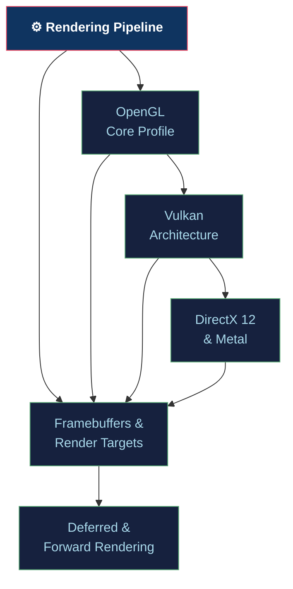

# ⚙️ Rendering Pipeline — Section Map of Content

> [!abstract] Section Overview
> The rendering pipeline section covers the complete GPU execution model from CPU command submission to displayed pixels. Topics include: OpenGL Core Profile (VAO/VBO/EBO, shader compilation, state machine), Vulkan's explicit architecture (instance→device→queue→command buffer, render passes, synchronization), DirectX 12 and Metal (command lists, root signatures, argument buffers), Framebuffers (MRT, MSAA, HDR), and rendering strategies (Forward vs Deferred shading).

---

## Concept Map

---

## Learning Path

1. [[OpenGL_Core_Profile|OpenGL Core Profile]] — VAO/VBO/EBO, state machine, shader pipeline
2. [[Vulkan_Architecture|Vulkan Architecture]] — explicit GPU control, render passes, sync
3. [[DirectX12_and_Metal|DirectX 12 & Metal]] — command lists, root signatures, argument buffers
4. [[Framebuffers_and_Render_Targets|Framebuffers & Render Targets]] — MRT, MSAA, HDR, ping-pong
5. [[Deferred_and_Forward_Rendering|Deferred & Forward Rendering]] — G-buffer, lighting passes, comparison

---

## Notes at a Glance

| Note | Core Concept | Key API Object | Difficulty |
|------|-------------|---------------|------------|
| [[OpenGL_Core_Profile]] | State machine + VAO | `glDrawElements` | Intermediate |
| [[Vulkan_Architecture]] | Explicit pipeline control | `VkCommandBuffer` | Advanced |
| [[DirectX12_and_Metal]] | Command list + root sig | `ID3D12GraphicsCommandList` | Advanced |
| [[Framebuffers_and_Render_Targets]] | MRT + MSAA resolve | `glFramebufferTexture2D` | Intermediate |
| [[Deferred_and_Forward_Rendering]] | G-buffer vs per-light | Multiple render passes | Advanced |

---

## Key Questions

1. Why must VAO be bound before VBO in OpenGL? What does VAO actually store?
2. What is the purpose of a Vulkan render pass and why can't you just draw without one?
3. How do root signatures in DX12 differ from Vulkan descriptor sets?
4. What is the G-buffer and why does deferred rendering need it?
5. When is forward+ rendering preferred over deferred?

---

## Related Sections

- [[_MOC_Computer_Graphics_Master|↑ Master MOC]]
- [[../02_3D_Fundamentals/_MOC_3D_Fundamentals|← 3D Fundamentals]] (MVP feeds into vertex shader)
- [[../04_Shaders/_MOC_Shaders|→ Shaders]] (pipeline stages contain shaders)
- [[../05_Lighting_and_Materials/_MOC_Lighting_and_Materials|→ Lighting]] (deferred passes use G-buffer for lighting)

---

#Computer_Graphics #Rendering_Pipeline #MOC
