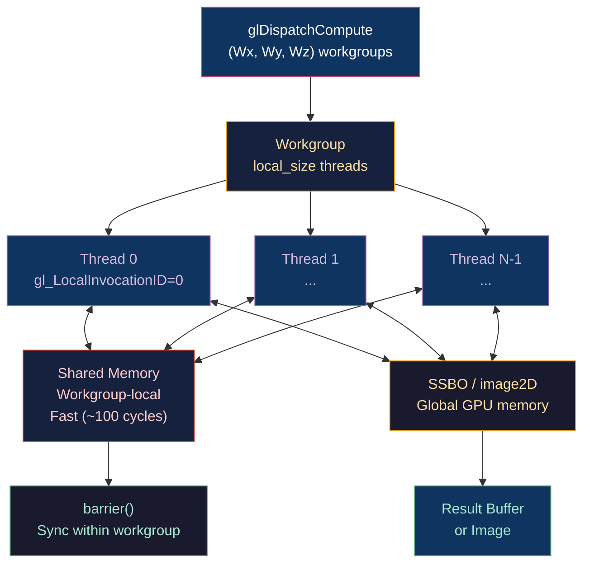

# 💻 Compute Shaders and GPGPU

> [!abstract] TL;DR
> Compute shaders provide general-purpose GPU computation outside the graphics pipeline. They execute in 3D workgroups (local_size_x × local_size_y × local_size_z threads) across a grid of groups dispatched via `glDispatchCompute`. Built-ins: `gl_GlobalInvocationID` (absolute thread index), `gl_LocalInvocationID` (within workgroup), `gl_WorkGroupID`. Shared memory (`shared` keyword) enables fast inter-thread communication within a workgroup (workgroup-local L1). `barrier()` + `memoryBarrier()` synchronize shared memory visibility within a workgroup — NOT across workgroups. SSBOs (Shader Storage Buffer Objects) provide read-write access to large buffers; `image2D` gives texel-level atomic write access. Classic GPU algorithms: parallel prefix sum (scan), histogram, particle simulation, BVH construction.

---

## Intuition — Analogy First

A compute shader is a factory floor with thousands of workers (threads). Each worker knows their station number (`gl_GlobalInvocationID`), their team number (`gl_WorkGroupID`), and their position within their team (`gl_LocalInvocationID`). Workers on the same team share a short conveyor belt (`shared` memory) for passing results to each other — fast but limited to their team. `barrier()` is the foreman's whistle: "everyone finish your current piece before picking up the next." Workers from different teams cannot directly share the conveyor belt — they must communicate via the main warehouse (`SSBO`).

---

## How It Works



---

## Key Concepts / Details

### Compute Shader Structure

```glsl
#version 450 core

layout(local_size_x = 256, local_size_y = 1, local_size_z = 1) in;

// Shader Storage Buffer Object — read/write by GPU
layout(std430, binding = 0) buffer InputBuffer  { float data[]; };
layout(std430, binding = 1) buffer OutputBuffer { float result[]; };

// Shared memory — fast, workgroup-local
shared float localData[256];

void main() {
    uint gid = gl_GlobalInvocationID.x;  // global thread index
    uint lid = gl_LocalInvocationID.x;  // local thread index (0..255)
    uint wid = gl_WorkGroupID.x;         // which workgroup

    // Load from global to shared memory
    localData[lid] = (gid < data.length()) ? data[gid] : 0.0;
    
    barrier();        // wait for all threads in workgroup to load
    memoryBarrier();  // flush shared memory writes
    
    // Process: parallel reduction (sum)
    for (uint stride = 128; stride > 0; stride >>= 1) {
        if (lid < stride) {
            localData[lid] += localData[lid + stride];
        }
        barrier();
    }
    
    // Thread 0 writes the workgroup's result
    if (lid == 0) {
        result[wid] = localData[0];
    }
}
```

Dispatch: `glDispatchCompute(N/256, 1, 1)` launches `ceil(N/256)` workgroups, each with 256 threads.

### Built-in Variables

| Variable | Type | Description |
|----------|------|-------------|
| `gl_GlobalInvocationID` | uvec3 | Absolute thread ID: `WorkGroupID * WorkGroupSize + LocalInvocationID` |
| `gl_LocalInvocationID` | uvec3 | Thread position within workgroup |
| `gl_WorkGroupID` | uvec3 | Workgroup position in the dispatch grid |
| `gl_WorkGroupSize` | uvec3 | `(local_size_x, local_size_y, local_size_z)` — compile-time constant |
| `gl_NumWorkGroups` | uvec3 | Total workgroup count in each dimension |

### Bounds Checking (Critical!)

The last workgroup in a 1D dispatch may contain more threads than data elements:

```glsl
// ALWAYS bounds-check — especially trailing workgroup
if (gl_GlobalInvocationID.x >= totalElements) return;
```

Forgetting this causes out-of-bounds SSBO writes, which corrupt data or crash the driver.

### SSBOs vs Uniform Buffers vs image2D

| Resource | Max Size | Access | Atomic | Use |
|----------|---------|--------|--------|-----|
| UBO | 64KB | Read-only | No | Small per-frame constants |
| SSBO | 128MB+ | Read/Write | Yes (limited) | Large data, compute output |
| `image2D` | Texture size | Random texel RW | Yes (imageAtomicAdd) | Tile-based algorithms, histograms |

```glsl
// SSBO declaration (std430 — packed layout, no vec3 padding issue)
layout(std430, binding = 2) buffer ParticleBuffer {
    vec4 positions[];   // xyz = pos, w = mass
    vec4 velocities[];
};

// image2D — direct texel write (not sampled)
layout(rgba32f, binding = 0) uniform image2D outputImage;

void main() {
    ivec2 coord = ivec2(gl_GlobalInvocationID.xy);
    vec4 value = vec4(1.0, 0.5, 0.2, 1.0);
    imageStore(outputImage, coord, value);
    
    // Atomic add to integer image (histogram bin)
    // layout(r32ui, binding=1) uniform uimage2D histogram;
    // imageAtomicAdd(histogram, ivec2(bin, 0), 1u);
}
```

### Parallel Prefix Sum (Exclusive Scan)

The prefix sum algorithm computes `output[i] = input[0] + ... + input[i-1]`:

```glsl
// Work-efficient parallel prefix sum (Blelloch scan)
// Phase 1: Up-sweep (reduce)
for (uint d = n/2; d > 0; d >>= 1) {
    barrier();
    if (lid < d) {
        uint ai = 2*(lid+1)*stride - 1;
        uint bi = ai + stride;
        localData[bi] += localData[ai];
    }
    stride <<= 1;
}
// Phase 2: Down-sweep
if (lid == 0) localData[n-1] = 0;  // set last element to 0
for (uint d = 1; d < n; d <<= 1) {
    barrier();
    stride >>= 1;
    if (lid < d) {
        uint ai = 2*(lid+1)*stride - 1;
        uint bi = ai + stride;
        float t = localData[ai];
        localData[ai] = localData[bi];
        localData[bi] += t;
    }
}
```

Used for: stream compaction (packing non-zero elements), histogram equalization, GPU-driven draw call generation.

### Particle Simulation Example

```glsl
layout(local_size_x = 256) in;
layout(std430, binding = 0) buffer Particles {
    vec4 pos[];   // xyz=position, w=life
    vec4 vel[];   // xyz=velocity, w=mass
};

uniform float uDeltaTime;
uniform vec3 uGravity;

void main() {
    uint i = gl_GlobalInvocationID.x;
    if (i >= numParticles) return;
    
    // Symplectic Euler integration
    vel[i].xyz += uGravity * uDeltaTime;          // update velocity
    pos[i].xyz += vel[i].xyz * uDeltaTime;        // update position
    pos[i].w   -= uDeltaTime;                     // reduce lifetime
    
    // Bounds check / respawn
    if (pos[i].w <= 0.0) {
        pos[i] = vec4(spawnPos(), randomLifetime());
        vel[i] = vec4(randomVelocity(), 0.0);
    }
}
```

CPU dispatch: `glDispatchCompute((numParticles + 255) / 256, 1, 1)`. Memory barrier before drawing: `glMemoryBarrier(GL_SHADER_STORAGE_BARRIER_BIT)`.

### Optimal Workgroup Size

| GPU Architecture | Warp/Wave Size | Optimal local_size |
|-----------------|---------------|-------------------|
| NVIDIA (Warp) | 32 threads | 128 or 256 (4–8 warps) |
| AMD (Wavefront) | 64 threads | 256 (4 wavefronts) |
| Intel (EU) | 8–32 threads | 64 or 128 |
| Mobile (various) | 16–64 threads | 64 |

Using `local_size_x = 64` is a safe cross-vendor starting point; profile with vendor tools.

---

## Real-World Notes

- **GPU-driven rendering**: a compute shader reads scene data (transforms, bounds), performs frustum culling, and writes draw call arguments to a buffer — then `glMultiDrawElementsIndirect` executes those calls without CPU readback.
- **BVH construction**: compute shaders build BVHs by sorting Morton codes (Z-curve), then constructing a radix tree bottom-up — faster than CPU for dynamic scenes.
- **Machine learning inference**: compute shaders implement matrix multiply (GEMM) for neural network inference on GPU without CUDA — used in mobile ML frameworks.

---

## Common Pitfalls

1. **Using `barrier()` across an `if` statement** — all threads in a workgroup must reach the barrier; a conditional barrier deadlocks. Refactor so the barrier is outside the conditional.
2. **Missing `memoryBarrier()` after shared writes** — `barrier()` synchronizes control flow but not memory; shared memory writes may not be visible without `memoryBarrier()` or `memoryBarrierShared()`.
3. **Workgroup size not a multiple of warp size** — `local_size_x = 100` wastes 28 threads (NVIDIA: 4 warps = 128 threads, 28 idle). Always use powers of 2 or multiples of 32/64.
4. **SSBO std140 vs std430** — SSBOs with `std140` layout pad arrays to 16-byte elements; `std430` uses natural packing. Mismatch with CPU struct layout causes data corruption.

---

## Related Concepts

- [[_MOC_Shaders|↑ Shaders MOC]]
- [[Fragment_Shaders_and_Effects|Fragment Shaders]] — comparison: rasterization-bound vs compute-bound
- [[../06_Animation_and_Simulation/Cloth_and_Fluid_Simulation|Cloth & Fluid Simulation]] — PBD/SPH in compute shaders
- [[../06_Animation_and_Simulation/Rigid_Body_Physics|Rigid Body Physics]] — broad phase BVH in compute
- [[../03_Rendering_Pipeline/Deferred_and_Forward_Rendering|Deferred Rendering]] — light culling compute pass

---

## Review Questions

1. Explain why `barrier()` alone is insufficient to share data via `shared` memory. What additional call is needed and why?
2. A compute shader has `local_size_x = 256`. The dispatch is `glDispatchCompute(7, 1, 1)` for 1600 elements. How many threads run, how many are out-of-bounds, and what must the shader do to handle them?
3. Describe the parallel prefix sum (exclusive scan) algorithm and its O(log n) parallel step complexity. Give one downstream algorithm that uses prefix sum as a subroutine.

---

## Sources

#Computer_Graphics #Shaders #Compute #GPGPU
