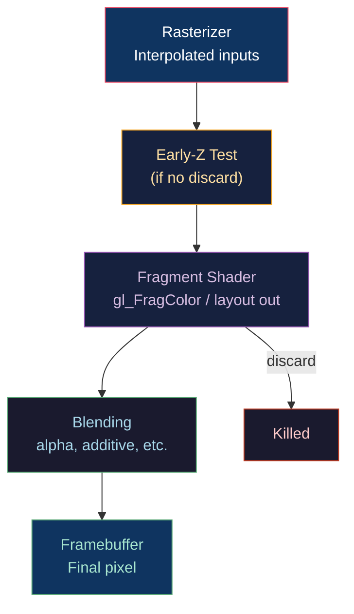

# 🌈 Fragment Shaders and Effects

> [!abstract] TL;DR
> The fragment shader runs once per rasterized fragment (candidate pixel). Key built-ins: `gl_FragCoord` (window coordinates, xy = pixel center, z = depth value), `gl_FrontFacing` (CCW = true). Texture sampling: `texture()` uses computed LOD from implicit gradients; `textureLod()` overrides LOD manually; `textureGather()` fetches a 2×2 block's single channel in one call. `dFdx`/`dFdy` compute screen-space derivatives of any varying — used for mip level selection, edge detection, and anisotropy. `discard` unconditionally kills the fragment — used for alpha cutout but breaks early-Z optimization. Bloom requires threshold (bright-pass), Gaussian blur (ping-pong), and additive composite.

---

## Intuition — Analogy First

The fragment shader is the paint-brush stroke: for each tiny square on the canvas (fragment), it decides exactly which color to put there. It has access to the interpolated vertex data (texture coordinates, normals) and can sample textures, compute lighting, and apply any mathematical transformation to produce the final color. The `dFdx`/`dFdy` derivatives are the shader's "peripheral vision" — they know how quickly a value is changing in the neighborhood, which tells the texture sampler how coarse to sample (LOD).

---

## How It Works



---

## Key Concepts / Details

### Core Fragment Built-ins

```glsl
gl_FragCoord    // vec4: .xy = pixel center (0.5 offset), .z = depth [0,1], .w = 1/w_clip
gl_FrontFacing  // bool: true if fragment from CCW front face (backface culling check)
gl_FragDepth    // float: write to override depth (disables early-Z)
```

### Texture Sampling Functions

```glsl
// Basic sampling — implicit LOD from dFdx/dFdy derivatives
vec4 color = texture(sampler2D, uv);

// Explicit LOD override
vec4 color = textureLod(sampler2D, uv, mipLevel);  // mipLevel 0 = full res

// Bias: adjust auto-computed LOD by a bias value (negative = sharper)
vec4 color = texture(sampler2D, uv, -0.5);  // sample half-LOD sharper

// Gather: fetch single channel from 2×2 texel quad (RGBA = bottom-left, bottom-right, top-right, top-left)
vec4 depths = textureGather(shadowMap, uv, 0);  // component 0 (red/depth)
// Useful for manual PCF shadow filtering with 4 samples in one call

// Fetch by integer texel coordinate (no filtering)
vec4 pixel = texelFetch(sampler2D, ivec2(x, y), mipLevel);
```

### dFdx and dFdy — Screen-Space Derivatives

`dFdx(v)` returns the difference in `v` between the current fragment and the fragment to its right. `dFdy(v)` is the difference to the fragment above.

```glsl
// Manual mip LOD computation (matches GPU's implicit computation)
vec2 dxuv = dFdx(uv);
vec2 dyuv = dFdy(uv);
float maxDeriv = max(dot(dxuv, dxuv), dot(dyuv, dyuv));
float mipLevel = 0.5 * log2(maxDeriv);

// Edge detection (Sobel-like) using depth gradient
float depth = texture(depthBuffer, uv).r;
float dx = dFdx(depth);
float dy = dFdy(depth);
float edgeStrength = sqrt(dx*dx + dy*dy);

// Wireframe rendering via barycentric coordinates derivative
// fwidth(v) = abs(dFdx(v)) + abs(dFdy(v))
float lineWidth = 1.0;
float d = min(min(bary.x, bary.y), bary.z);
float wire = smoothstep(0.0, fwidth(d) * lineWidth, d);
```

`dFdx`/`dFdy` are computed using 2×2 pixel quads — the GPU always runs fragment shaders in 2×2 groups even for single-pixel triangles. This means up to 75% of invocations can be "helper" pixels outside the triangle, executing only to compute derivatives.

### Alpha Cutout with discard

```glsl
uniform float uAlphaThreshold; // e.g., 0.5

void main() {
    vec4 albedo = texture(uAlbedoMap, vTexCoord);
    
    // Alpha cutout: kill the fragment if below threshold
    if (albedo.a < uAlphaThreshold) discard;
    
    outColor = vec4(albedo.rgb, 1.0);
}
```

**Discard performance cost**: discard prevents the GPU from using Early-Z optimization (testing depth before running the shader). For alpha-tested vegetation with complex shading, this can reduce GPU throughput by 30–50%.

**Alternative**: use `gl_FragDepth = gl_FragDepth` (no actual change) in shaders that need early-Z but use discard conditionally — some drivers can recover early-Z when discard is provably not taken.

**Alpha-to-coverage**: better for MSAA scenes:
```glsl
// Fragment shader: no discard needed
// Enable: glEnable(GL_SAMPLE_ALPHA_TO_COVERAGE);
// GPU converts alpha to MSAA coverage mask — gives AA edges for free
```

### Bloom Effect Pipeline


```glsl
// Bright-pass filter (extracts pixels brighter than threshold)
void brightPass(sampler2D hdrBuffer, float threshold) {
    vec3 color = texture(hdrBuffer, uv).rgb;
    float luma = dot(color, vec3(0.2126, 0.7152, 0.0722));
    outColor = vec4(luma > threshold ? color : vec3(0.0), 1.0);
}

// Gaussian blur (horizontal pass, 9-tap)
float weights[5] = float[](0.2270, 0.1945, 0.1216, 0.0540, 0.0162);
void gaussianH(sampler2D tex, vec2 texelSize) {
    vec3 result = texture(tex, uv).rgb * weights[0];
    for (int i = 1; i < 5; i++) {
        result += texture(tex, uv + vec2(texelSize.x * i, 0.0)).rgb * weights[i];
        result += texture(tex, uv - vec2(texelSize.x * i, 0.0)).rgb * weights[i];
    }
    outColor = vec4(result, 1.0);
}

// Composite: additive blend
vec3 hdr = texture(hdrBuffer, uv).rgb;
vec3 bloom = texture(bloomBuffer, uv).rgb;
outColor = vec4(tonemap(hdr + bloom * bloomStrength), 1.0);
```

### gl_FrontFacing for Double-Sided Normals

```glsl
in vec3 vNormal;

void main() {
    // Flip normal for back faces (double-sided rendering without CPU-side solution)
    vec3 N = normalize(gl_FrontFacing ? vNormal : -vNormal);
    // ... use N for lighting ...
}
```

---

## Real-World Notes

- **Fog**: exponential fog `fogFactor = exp(-density * distance)` can be computed in the fragment shader using `gl_FragCoord.w` (= 1/w_clip ∝ 1/eye_depth); `noperspective` interpolation of the raw eye-space depth from vertex is more accurate.
- **Screen-space effects** (SSAO, SSR) read `gl_FragCoord.xy` as texture coordinates into full-screen buffers, using `texelFetch` for exact pixel access without filtering.
- **Velocity vectors**: write `(currentPos_NDC - previousPos_NDC) / 2` as a vec2 to the velocity buffer in the fragment shader — used by TAA for reprojection.

---

## Common Pitfalls

1. **Writing `gl_FragDepth` without reading it first** — any write to `gl_FragDepth` disables early-Z for the entire draw call; if you only conditionally write it, the driver must assume all fragments write depth.
2. **textureGather component order** — `textureGather` returns (BL, BR, TR, TL) not the intuitive (TL, TR, BL, BR); wrong order causes incorrect PCF shadow results.
3. **dFdx/dFdy at discontinuities** — at triangle boundaries, the 2×2 quad may straddle two triangles; derivatives are undefined there and can produce incorrect mip levels at silhouette edges.
4. **discard in a loop** — compilers sometimes can't remove the discard from a loop's induction variable computation, preventing early-Z even when the discard condition is never true at runtime.

---

## Related Concepts

- [[_MOC_Shaders|↑ Shaders MOC]]
- [[GLSL_Vertex_Shaders|GLSL Vertex Shaders]] — provides interpolated inputs
- [[Shader_Optimization_and_Profiling|Shader Optimization]] — discard, branching costs
- [[../03_Rendering_Pipeline/Framebuffers_and_Render_Targets|Framebuffers]] — HDR FBO for bloom
- [[../05_Lighting_and_Materials/Physically_Based_Rendering|PBR]] — full lighting model in fragment shader
- [[Anti_Aliasing|Anti-Aliasing]] — `dFdx`/`dFdy` for shader AA

---

## Review Questions

1. Explain why `discard` disables early-Z optimization. How does alpha-to-coverage provide alpha cutout without this penalty?
2. `textureGather(shadowMap, uv, 0)` returns four depth values. Write a simple PCF shadow filter using these four values and a comparison threshold.
3. Derive the mip level formula from `dFdx(uv)` and `dFdy(uv)`. Explain why the GPU always processes fragments in 2×2 quads, even for 1-pixel triangles.

---

## Sources

#Computer_Graphics #Shaders #GLSL #Fragment
