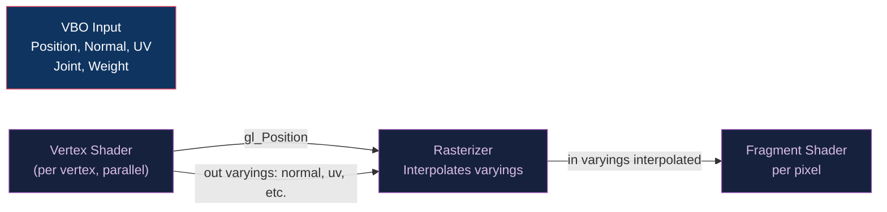

# 🔷 GLSL Vertex Shaders

> [!abstract] TL;DR
> The GLSL vertex shader runs once per vertex and is mandatory in core profile OpenGL. Its primary output is `gl_Position` (clip-space coordinate). Built-ins `gl_VertexID` and `gl_InstanceID` enable procedural and instanced geometry. The `layout(location = N)` qualifier binds vertex attributes to VBO slots. Varyings declared `out` in the vertex shader and `in` in the fragment shader are interpolated across the triangle using one of three qualifiers: `smooth` (perspective-correct, default), `noperspective` (screen-space linear), or `flat` (no interpolation, takes provoking vertex value). UBOs share camera/light matrices. Skinning uses a palette of up to 256 bone matrices multiplied by 4 joint weights per vertex.

---

## Intuition — Analogy First

The vertex shader is the stage crew of a theater: before the audience sees the final scene (pixels), the crew repositions every prop (vertex) from the script's description (object space) to where it will appear on stage (clip space). The MVP matrix is the stage manager's master plan: "take this prop, scale it, rotate it, and place it 10 meters upstage." Each crew member (shader invocation) handles exactly one prop (vertex) simultaneously.

---

## How It Works



---

## Key Concepts / Details

### Layout Qualifiers and Attribute Binding

```glsl
#version 450 core

// Input attributes — match VBO layout
layout(location = 0) in vec3 aPosition;
layout(location = 1) in vec3 aNormal;
layout(location = 2) in vec2 aTexCoord;
layout(location = 3) in vec4 aTangent;    // w = bitangent sign
layout(location = 4) in ivec4 aJoints;   // bone indices (up to 4)
layout(location = 5) in vec4 aWeights;   // bone weights (sum = 1.0)
```

### Output Varyings and Interpolation Qualifiers

```glsl
// Outputs to rasterizer / fragment stage
out vec3 vWorldPos;          // smooth (default) — perspective-correct
out vec3 vNormal;            // smooth
out vec2 vTexCoord;          // smooth — must be smooth for correct texture mapping
flat out int vMaterialID;    // flat — integer can't be interpolated; provoking vertex value
noperspective out vec2 vScreenUV; // screen-space linear (for UI-style effects)
```

| Qualifier | Description | Use Case |
|-----------|------------|---------|
| `smooth` (default) | Perspective-correct hyperbolic interpolation | Texcoords, normals, positions |
| `flat` | No interpolation; provoking vertex value | Integer IDs, face normals, flags |
| `noperspective` | Screen-space linear interpolation | Screen effects, fog |

### Uniform Blocks

```glsl
// Per-frame camera data (shared UBO, binding = 0)
layout(std140, binding = 0) uniform CameraBlock {
    mat4 uView;
    mat4 uProjection;
    vec4 uCameraPos;  // vec4 for std140 alignment
};

// Per-draw model matrix (small — use push constant or separate UBO)
uniform mat4 uModel;
```

### Full Vertex Shader Example

```glsl
#version 450 core

layout(location = 0) in vec3 aPosition;
layout(location = 1) in vec3 aNormal;
layout(location = 2) in vec2 aTexCoord;
layout(location = 3) in vec4 aTangent;

layout(std140, binding = 0) uniform CameraBlock {
    mat4 uView;
    mat4 uProjection;
    vec4 uCameraPos;
};
uniform mat4 uModel;

out vec3 vWorldPos;
out vec3 vNormal;
out vec3 vTangent;
out vec3 vBitangent;
out vec2 vTexCoord;

void main() {
    // World-space position
    vec4 worldPos = uModel * vec4(aPosition, 1.0);
    vWorldPos = worldPos.xyz;
    
    // Transform normals: inverse-transpose model matrix
    mat3 normalMatrix = transpose(inverse(mat3(uModel)));
    vNormal    = normalize(normalMatrix * aNormal);
    vTangent   = normalize(normalMatrix * aTangent.xyz);
    // Re-orthogonalize and apply bitangent sign
    vBitangent = cross(vNormal, vTangent) * aTangent.w;
    
    vTexCoord = aTexCoord;
    
    gl_Position = uProjection * uView * worldPos;
}
```

### gl_VertexID and Procedural Geometry

`gl_VertexID` gives the current vertex index (0-based). Useful for fully procedural geometry without VBOs:

```glsl
// Full-screen triangle without VBO (gl_VertexID = 0, 1, 2)
void main() {
    vec2 uv = vec2((gl_VertexID << 1) & 2, gl_VertexID & 2);
    gl_Position = vec4(uv * 2.0 - 1.0, 0.0, 1.0);
}
```

This generates a triangle covering the entire clip space — the standard technique for fullscreen post-process passes without a quad mesh.

### Instanced Rendering with gl_InstanceID

```glsl
// Per-instance data via instanced attribute (divisor=1)
layout(location = 6) in mat4 aInstanceMatrix;  // 4 vec4 = locations 6,7,8,9

void main() {
    // World transform from per-instance matrix
    vec4 worldPos = aInstanceMatrix * vec4(aPosition, 1.0);
    gl_Position = uProjection * uView * worldPos;
    
    // gl_InstanceID still available for other per-instance data
    // (e.g., index into a material SSBO)
}
```

### Skeletal Animation — Skinning Vertex Shader

Linear Blend Skinning (LBS) computes the final vertex position as a weighted sum of bone-transformed positions:

```glsl
// Bone matrix palette — up to 256 bones
layout(std140, binding = 1) uniform SkinBlock {
    mat4 uBoneMatrices[256];  // Sⱼ = Mⱼ · Bⱼ⁻¹ (skinning matrix)
};

layout(location = 4) in ivec4 aJoints;   // bone indices
layout(location = 5) in vec4  aWeights;  // weights (sum = 1)

void main() {
    // LBS: weighted sum of skinned positions
    mat4 skinMatrix = aWeights.x * uBoneMatrices[aJoints.x]
                    + aWeights.y * uBoneMatrices[aJoints.y]
                    + aWeights.z * uBoneMatrices[aJoints.z]
                    + aWeights.w * uBoneMatrices[aJoints.w];
    
    vec4 skinnedPos    = skinMatrix * vec4(aPosition, 1.0);
    vec3 skinnedNormal = mat3(skinMatrix) * aNormal;  // approx (valid if no non-uniform scale)
    
    vNormal = normalize(skinnedNormal);
    vWorldPos = (uModel * skinnedPos).xyz;
    gl_Position = uProjection * uView * uModel * skinnedPos;
    vTexCoord = aTexCoord;
}
```

LBS artifacts: **candy-wrapper twist** for joints rotating >90° (elbows, knees). Fix: dual quaternion skinning (DQS) blends quaternions instead of matrices.

### Geometry Shader (Optional Stage)

Between vertex and fragment, a geometry shader (GS) can emit multiple primitives:

```glsl
layout(triangles) in;
layout(triangle_strip, max_vertices = 3) out;

void main() {
    for (int i = 0; i < 3; i++) {
        gl_Position = gl_in[i].gl_Position;
        EmitVertex();
    }
    EndPrimitive();
}
```

GS is rarely used in modern code — performance is often poor. Prefer compute-based geometry amplification or mesh shaders.

---

## Real-World Notes

- **Vertex cache**: GPUs cache recently transformed vertices (post-transform cache, typically 32 entries). Index reuse within ~32 vertices gets the transform for free — tool like `meshoptimizer` reorders indices for cache efficiency.
- **Skinning on GPU vs CPU**: GPU skinning (vertex shader) parallelizes well; CPU skinning (compute then draw) allows CPU-side LOD decisions. Most modern engines use GPU skinning.
- **Transform feedback**: capture vertex shader output to a VBO without rasterization — useful for particle simulation updating positions without a compute shader.

---

## Common Pitfalls

1. **Using `mat3(model)` for normal transform** — incorrect with non-uniform scale; must use `transpose(inverse(mat3(model)))`.
2. **Skinning weights not summing to 1** — weights that sum to < 1 make the skinned vertex "shrink" toward the origin; always normalize in the DCC tool.
3. **Integer attributes declared as `in vec4`** — joints/bone indices must be declared `in ivec4`; using `in vec4` for integer data silently reads wrong values.
4. **Forgetting `flat` for integer varyings** — integers cannot be interpolated; declaring an `out int` without `flat` is a GLSL compile error.

---

## Related Concepts

- [[_MOC_Shaders|↑ Shaders MOC]]
- [[Fragment_Shaders_and_Effects|Fragment Shaders]] — receives varyings from vertex stage
- [[../02_3D_Fundamentals/3D_Transforms_and_Matrices|3D Transforms]] — MVP in `gl_Position`
- [[../06_Animation_and_Simulation/Skeletal_Animation_and_Skinning|Skeletal Animation]] — bone matrix derivation
- [[../03_Rendering_Pipeline/OpenGL_Core_Profile|OpenGL Core]] — VAO/VBO feeding attributes

---

## Review Questions

1. Explain why `transpose(inverse(mat3(model)))` is needed for normals with non-uniform scale. When is it safe to use `mat3(model)` directly?
2. Describe the `flat` interpolation qualifier. What value does the rasterizer use for a `flat` varying across a triangle?
3. How does the full-screen triangle technique (`gl_VertexID`) avoid the need for a quad VBO? What are its clip-space coordinates for `gl_VertexID = 0, 1, 2`?

---

## Sources

#Computer_Graphics #Shaders #GLSL #Vertex
