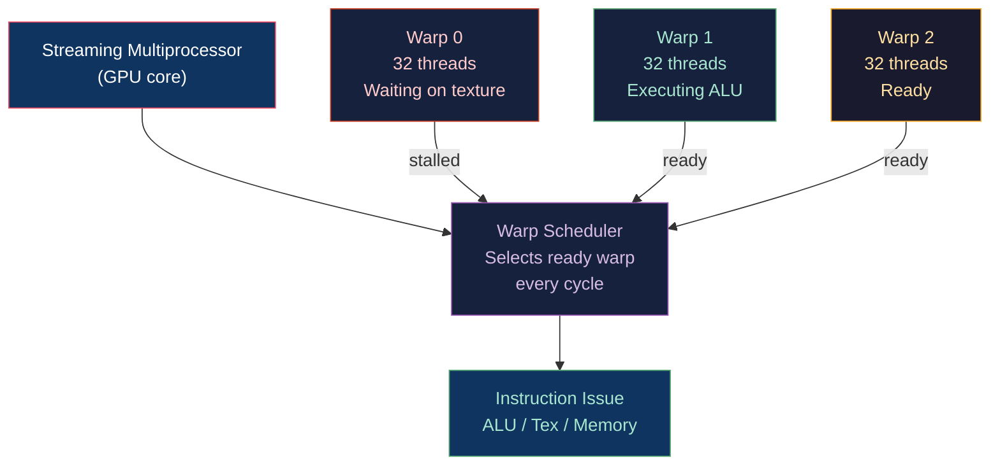

# ⚡ Shader Optimization and Profiling

> [!abstract] TL;DR
> GPU performance is determined by latency hiding: the warp scheduler hides memory latency by switching to ready warps while others wait on texture/buffer reads. Occupancy (active warps / max warps) measures the scheduler's ability to hide latency — limited by register count, shared memory, and workgroup size. Key optimizations: minimize register pressure (use `mediump`/`fp16` where sufficient), avoid dynamic branching (prefer `mix(a,b,step(t,x))` over `if-else`), pack texture lookups (textureGather), use SPIRV-Cross for cross-API compilation, and profile with RenderDoc (frame capture) or NSight/PIX (GPU timing and counters). Texture cache efficiency is critical: L1 hit = ~40 cycles, L2 = ~200 cycles, DRAM = ~500+ cycles.

---

## Intuition — Analogy First

A GPU shader is like a cook making hundreds of dishes simultaneously. When waiting for an oven (memory access), a smart cook doesn't stand idle — they prep the next dish. This is warp scheduling: the GPU's "head cook" switches between dish-groups (warps) so no burner (execution unit) is idle. If each cook is carrying too many pans (high register count), fewer cooks can work simultaneously (low occupancy). Optimization means: fewer pans per cook, predictable recipes (no branching), and using the pantry intelligently (texture cache reuse).

---

## How It Works



---

## Key Concepts / Details

### Occupancy and Register Pressure

**Occupancy** = (Active warps per SM) / (Maximum warps per SM)

Limited by:
- **Registers**: each SM has a fixed register file (e.g., NVIDIA: 65,536 registers/SM). A shader using 64 registers per thread allows 65536/64 = 1024 threads = 32 warps. Using 128 registers cuts occupancy in half.
- **Shared memory**: each SM has fixed shared memory (e.g., 48–96KB). Workgroups consuming more shared mem reduce concurrent workgroup count.

```
Threads_per_SM = min(
    SM_registers / regs_per_thread,
    SM_shared_memory / shared_mem_per_workgroup * workgroup_size,
    SM_max_threads
)
Occupancy = Threads_per_SM / SM_max_threads
```

Check with: NVIDIA NSight → Occupancy Analysis; AMD Radeon GPU Profiler → Wavefront Occupancy.

### Register Minimization

```glsl
// BAD: 6 vec3 temporaries = 18 registers
vec3 ambient = calcAmbient(...);
vec3 diffuse = calcDiffuse(...);
vec3 specular = calcSpecular(...);
vec3 emissive = calcEmissive(...);
vec3 indirect = calcIndirect(...);
vec3 total = ambient + diffuse + specular + emissive + indirect;

// BETTER: accumulate in-place = 3 registers
vec3 total = calcAmbient(...);
total += calcDiffuse(...);
total += calcSpecular(...);
total += calcEmissive(...);
total += calcIndirect(...);
```

### mediump / fp16 Precision

```glsl
// GLSL mediump: 16-bit float on supporting hardware
mediump vec3 color;  // half-precision: 2× bandwidth, 2× ALU throughput on mobile

// GLSL/SPIR-V explicit float16
#extension GL_EXT_shader_explicit_arithmetic_types : enable
float16_t rough = float16_t(roughness);
f16vec3 albedo = f16vec3(texture(map, uv).rgb);
```

```hlsl
// HLSL: min16float = at least 16-bit (driver may use 32)
min16float3 color = (min16float3)texture.Sample(sampler, uv).rgb;

// HLSL explicit half:
half3 albedo = (half3)input.rgb;
```

Mobile GPUs (Adreno, Mali) run `mediump` at 2× throughput. Desktop NVIDIA Ada+ runs `fp16` at 2× throughput. AMD RDNA2+ runs fp16 at 2× throughput.

### Avoiding Dynamic Branching

Dynamic branching (where different threads in a warp take different branches) causes serialization — both branches execute sequentially:

```glsl
// BAD: divergent branch on continuous value
if (roughness > 0.5) {
    color = computeRoughMaterial();
} else {
    color = computeSmoothMaterial();
}

// BETTER: branchless — compute both, blend by condition
vec3 rough  = computeRoughMaterial();
vec3 smooth = computeSmoothMaterial();
color = mix(smooth, rough, step(0.5, roughness));
// step() = 0 or 1, mix() selects — GPU executes both paths but no divergence
```

```glsl
// Saturate (clamp to [0,1]) without branch:
float t = clamp(value, 0.0, 1.0);

// Sign without branch:
float s = sign(x);  // or: float s = (x > 0.0) ? 1.0 : -1.0;  // still branchless on GPU

// Max of two values without branch (compiler knows this):
float m = max(a, b);  // guaranteed branchless
```

**Acceptable branches**: uniform branches (same condition across an entire warp, e.g., `if (lightType == POINT_LIGHT)`) are free — the warp doesn't diverge.

### Texture Cache Efficiency

| Cache Level | Latency | Size |
|-------------|---------|------|
| L1 (per-SM) | ~40 cycles | 48–128KB |
| L2 (on-chip) | ~200 cycles | 4–32MB |
| DRAM | ~500+ cycles | GB+ |

To maximize L1 hit rate:
- Access textures with coherent UV patterns (nearby threads sample nearby texels)
- Prefer `sampler2D` + `texture()` (cached, filtered) over `imageLoad()` (unfiltered, bypasses cache)
- Use `textureGather()` — fetches 4 samples in one cache line (2×2 block)

Anisotropic filtering (`GL_TEXTURE_MAX_ANISOTROPY`) increases L1 bandwidth but improves quality; limit to 4× or 8× for performance.

### SPIRV-Cross and Cross-API Compilation

```bash
# Compile GLSL → SPIR-V
glslangValidator -V shader.vert -o shader.vert.spv

# SPIR-V → MSL (Metal)
spirv-cross --msl shader.vert.spv --output shader.metal

# SPIR-V → HLSL (via spirv-cross)
spirv-cross --hlsl shader.vert.spv --output shader.hlsl

# DXC: HLSL → SPIR-V (Vulkan from HLSL)
dxc -T vs_6_5 -E main -spirv shader.hlsl -Fo shader.spv
```

### RenderDoc Workflow

```
1. Launch RenderDoc → capture a frame of your app
2. Event Browser → find the draw call of interest
3. Texture Viewer → inspect G-buffer, depth, shadow maps
4. Pipeline Inspector → verify bound resources, shader source
5. Mesh Viewer → visualize vertex pre/post-transform data
6. Shader Debugger → step through GLSL/HLSL per-vertex or per-pixel
   (set a breakpoint at a specific pixel coordinate)
```

NSight Aftermath (NVIDIA): provides GPU crash dumps with shader disassembly at the point of hang/TDR.

### Optimization Checklist

| Concern | Check | Tool |
|---------|-------|------|
| Register pressure | NSight Occupancy | NSight Graphics |
| Texture cache | L1 hit rate < 80%? | NSight / AMD RGP |
| Dynamic branching | Warp divergence counter | NSight Compute |
| Overdraw | Pixel count vs draw call cost | RenderDoc Overdraw |
| Fillrate | Fragment shader ALU vs memory bound | NSight / PIX |
| Draw calls | > 5000/frame? Use instancing/indirect | NSight Frame Debugger |

---

## Real-World Notes

- **Shader warm-up**: PSO/shader compilation on first use causes hitching — pre-compile all shaders at startup or use async compilation pipelines.
- **Uber-shader anti-pattern**: a single shader with 100 `#define` permutations compiles to 100 PSOs — exponential compilation time. Use material parameter specialization or GPU-side conditionals for rarely-taken branches.
- **Half-float (fp16) accumulation error**: summing many `mediump` values accumulates error fast; keep accumulators in `highp` (float32) and convert only for output.

---

## Common Pitfalls

1. **Optimizing before profiling** — identifying the correct bottleneck first is essential; "improving" a vertex shader when the app is texture-bandwidth-bound wastes time.
2. **`mix(a,b,step(t,x))` creates code** — the branchless form still computes both `a` and `b`; if computing each is expensive (e.g., full PBR), branchless may be SLOWER than divergent execution for complex conditions.
3. **Shared memory bank conflicts** — in compute shaders, if all 32 threads in a warp access shared memory at stride 32 (or multiples), all accesses go to the same bank → sequential. Pad arrays to `[SHARED_SIZE + 1]` to offset.
4. **Texture sampling in loops with dynamic bounds** — the GPU can't precompute gradient LOD for texture() inside a dynamic loop; use textureLod() with explicit level 0 inside loops.

---

## Related Concepts

- [[_MOC_Shaders|↑ Shaders MOC]]
- [[Compute_Shaders_GPGPU|Compute Shaders]] — occupancy most critical here
- [[HLSL_for_DirectX|HLSL for DirectX]] — PIX profiler
- [[Fragment_Shaders_and_Effects|Fragment Shaders]] — discard, branching costs
- [[../03_Rendering_Pipeline/Deferred_and_Forward_Rendering|Deferred Rendering]] — G-buffer bandwidth optimization

---

## Review Questions

1. A vertex shader uses 128 registers. An SM has 65,536 registers and supports 2048 max threads. What is the occupancy, and how does halving register count (to 64) change it?
2. Explain why `mix(a, b, step(threshold, x))` is not always faster than `if (x > threshold)` for expensive computations. When is the branchless version truly faster?
3. You suspect your fragment shader is L1 texture-cache bound. Name three concrete changes to the shader or texture setup that could improve the cache hit rate.

---

## Sources

#Computer_Graphics #Shaders #Optimization #Profiling
