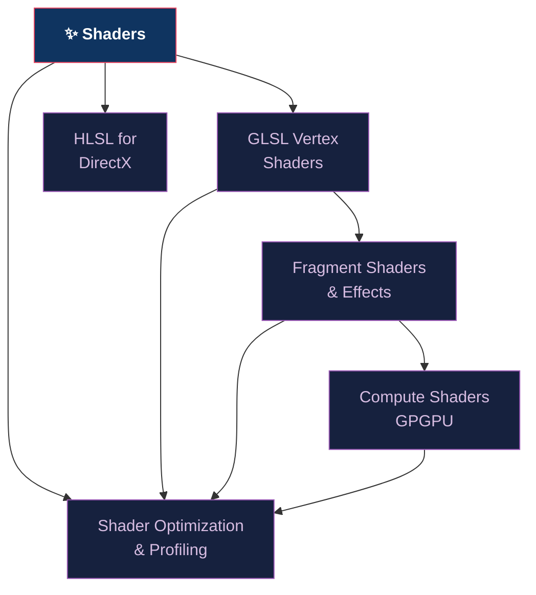

# ✨ Shaders — Section Map of Content

> [!abstract] Section Overview
> Shaders are GPU programs written in domain-specific languages (GLSL for OpenGL/Vulkan, HLSL for DX12, MSL for Metal) that run at specific pipeline stages. Vertex shaders transform geometry; fragment shaders determine pixel color; compute shaders provide general GPGPU computation. This section covers the full shader ecosystem: GLSL vertex and fragment stages, compute/GPGPU programming, HLSL for DX12, and critical optimization techniques for GPU performance.

---

## Concept Map

---

## Learning Path

1. [[GLSL_Vertex_Shaders|GLSL Vertex Shaders]] — attributes, uniforms, varyings, instancing, skinning
2. [[Fragment_Shaders_and_Effects|Fragment Shaders & Effects]] — texturing, dFdx/dFdy, discard, bloom, compositing
3. [[Compute_Shaders_GPGPU|Compute Shaders & GPGPU]] — workgroups, barriers, SSBOs, parallel algorithms
4. [[HLSL_for_DirectX|HLSL for DirectX]] — semantics, register spaces, wave intrinsics, SM6
5. [[Shader_Optimization_and_Profiling|Shader Optimization & Profiling]] — occupancy, branching, precision, tools

---

## Notes at a Glance

| Note | Core Concept | Key Built-in/Intrinsic | Difficulty |
|------|-------------|----------------------|------------|
| [[GLSL_Vertex_Shaders]] | gl_Position, instancing | `gl_VertexID`, `gl_InstanceID` | Intermediate |
| [[Fragment_Shaders_and_Effects]] | Texturing, alpha, bloom | `dFdx`, `textureGather` | Intermediate |
| [[Compute_Shaders_GPGPU]] | Parallel prefix sum | `gl_GlobalInvocationID` | Advanced |
| [[HLSL_for_DirectX]] | Semantics, wave ops | `WaveActiveSum` | Advanced |
| [[Shader_Optimization_and_Profiling]] | Occupancy, latency hiding | `mediump`, mix() | Advanced |

---

## Key Questions

1. What is the difference between `flat`, `smooth`, and `noperspective` interpolation qualifiers?
2. How does `dFdx` enable implicit mip-level selection in texture sampling?
3. What is a workgroup in a compute shader, and why must `barrier()` only synchronize within a workgroup?
4. What is a wave (HLSL) and how does `WavePrefixSum` enable GPU-side parallel prefix sum?
5. Why does dynamic branching hurt performance, and when does `mix(a,b,step(t,x))` help?

---

## Related Sections

- [[_MOC_Computer_Graphics_Master|↑ Master MOC]]
- [[../03_Rendering_Pipeline/_MOC_Rendering_Pipeline|← Rendering Pipeline]] (pipeline stages contain shaders)
- [[../05_Lighting_and_Materials/_MOC_Lighting_and_Materials|→ Lighting & Materials]] (PBR shaders)
- [[../06_Animation_and_Simulation/_MOC_Animation_and_Simulation|→ Animation]] (skinning in vertex shader, simulation in compute)

---

#Computer_Graphics #Shaders #MOC
