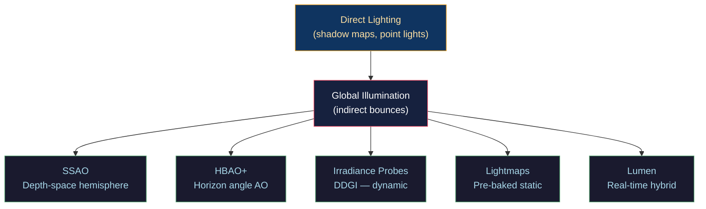

# 🌍 Global Illumination

> [!abstract] TL;DR
> Global illumination (GI) accounts for indirect light: light that bounces off multiple surfaces before reaching the viewer. Ambient Occlusion (AO) is the cheapest approximation — darker in crevices. SSAO samples a hemisphere of depth-buffer points around each pixel to estimate occlusion. HBAO+ uses actual horizon angles for more accurate occlusion, respecting depth discontinuities. Dynamic Diffuse GI (DDGI) caches indirect radiance in a 3D grid of probes, each storing a spherical harmonic (SH) or octahedral radiance map updated per-frame via ray tracing. Lightmap baking pre-computes static indirect lighting at ≥2 texels/unit resolution. Lumen (Unreal Engine 5) combines HWRT reflections with software SDF trace for GI with probe caching for diffuse, achieving real-time GI on console hardware.

---

## Intuition — Analogy First

Direct lighting is easy — you only need to know if a point can see the light. Indirect lighting is hard: light bounces off a red wall and tints the ceiling pink, even though the ceiling doesn't face the red wall. A room with direct light from a single window would be pitch black everywhere the sunbeam doesn't touch, if we only computed direct illumination. GI fills in those dark areas by modeling light's many-bounce journey. Each technique makes a different approximation about how to estimate those bounces cheaply.

---

## How It Works



---

## Key Concepts / Details

### Ambient Occlusion Theory

The AO factor for a surface point x with normal N is:

```
AO(x) = (1/π) · ∫_Ω V(x, ω) · (ω·N) dω

V(x, ω) = 1 if the ray in direction ω is unoccluded, 0 otherwise
```

AO ∈ [0,1]: 0 = fully occluded (inside crevice), 1 = fully unoccluded (open sky). Typically inverted for artistic use: `darkness = 1 - AO`.

### SSAO — Screen-Space Ambient Occlusion

```glsl
// SSAO fragment shader
uniform sampler2D gPosition;   // world position G-buffer
uniform sampler2D gNormal;     // world normal G-buffer
uniform sampler2D texNoise;    // small random rotation texture
uniform vec3 samples[64];      // hemisphere sample kernel

float SSAO() {
    vec3 fragPos = texture(gPosition, uv).xyz;
    vec3 normal  = normalize(texture(gNormal, uv).rgb);
    
    // Random rotation to break up pattern
    vec3 randomVec = normalize(texture(texNoise, uv * noiseScale).xyz);
    
    // Build TBN for rotating samples to align with normal
    vec3 tangent   = normalize(randomVec - normal * dot(randomVec, normal));
    vec3 bitangent = cross(normal, tangent);
    mat3 TBN = mat3(tangent, bitangent, normal);
    
    float occlusion = 0.0;
    for (int i = 0; i < 64; i++) {
        vec3 samplePos = TBN * samples[i];     // hemisphere sample in view space
        samplePos = fragPos + samplePos * radius;
        
        // Project sample to screen space
        vec4 offset = projection * vec4(samplePos, 1.0);
        offset.xy = (offset.xy / offset.w) * 0.5 + 0.5;
        
        // Get depth at sample position
        float sampleDepth = texture(gPosition, offset.xy).z;
        
        // Range check: only count nearby occluders
        float rangeCheck = smoothstep(0.0, 1.0, radius / abs(fragPos.z - sampleDepth));
        occlusion += (sampleDepth >= samplePos.z + bias ? 1.0 : 0.0) * rangeCheck;
    }
    return 1.0 - (occlusion / 64.0);
}
```

SSAO artifacts: halo around objects, fails at sharp edges (depth discontinuities), limited to 1-2 unit radius.

### HBAO+ — Horizon-Based AO

Instead of point samples, HBAO traces 2D angles along several directions in screen space, finding the "horizon angle" (maximum elevation angle before hitting geometry). The AO contribution from a direction is `sin(horizon) - sin(normal_angle)`.

Improvements over SSAO:
- Respects depth discontinuities (no cross-boundary bleeding)
- More physically accurate hemisphere integration
- Temporal accumulation for less noise

### DDGI — Dynamic Diffuse GI

DDGI maintains a 3D grid of irradiance probes. Each probe stores indirect radiance from all directions, updated each frame via ray tracing.

**Probe update pipeline:**
1. For each probe: trace N rays (e.g., 256) into the scene using HWRT/SWRT
2. Each ray gets the direct illumination at its hit point
3. Project results onto the probe's octahedral map or SH (L1 = 9 coefficients)
4. Blend new results with previous frame's probe (temporal accumulation ~5% new, 95% history)

**Probe shading:**
```glsl
// Compute indirect illumination from probe grid
vec3 sampleIrradiance(vec3 worldPos, vec3 N) {
    // Find surrounding probes in the grid
    ivec3 probeIdx = worldPosToProbeIndex(worldPos);
    
    vec3 irradiance = vec3(0.0);
    for each of 8 surrounding probes:
        // Trilinear blend weight + backface weight
        vec3 probeIrr = sampleProbe(probeIdx, N);
        irradiance += probeIrr * weight;
    irradiance /= totalWeight;
    
    return albedo * irradiance;
}
```

DDGI probe spacing: 1–2 meters for interior scenes, 5–10 meters for outdoor. Self-occlusion from probes inside geometry requires probe relocation or cliff bias.

### Lightmap Baking

Lightmaps store pre-computed irradiance for static geometry:

```
UV2 channel: unique, non-overlapping UV island for each static mesh
Resolution: ≥2 texels per world unit (prevent UV seam artifacts)
Format: RGBA16F or BC6H for HDR irradiance
```

**Baking pipeline:**
1. Unwrap all static mesh geometry to UV2 (Lightmap UV)
2. Render offline path tracing or radiosity into the UV2 texture
3. Dilate texel values at UV island borders (prevent black seam sampling)
4. Compress to BC6H for runtime storage
5. At runtime: sample lightmap with UV2, multiply by albedo for diffuse GI

```glsl
// Runtime lightmap sampling
vec3 indirectDiffuse = texture(lightmap, vUV2).rgb * albedo;
```

Tools: Unity Enlighten/GPU lightmapper, Unreal Lightmass, Bakery, Lm.exr (open source).

**Minimum texel density rule**: a lightmap shadow's maximum sharpness = lightmap texel size. At ≥2 texels/unit and 1024² lightmap, smallest feature = 0.5 units. Shadow contact requires 4–8 texels/unit.

### Lumen (Unreal Engine 5)

Lumen combines multiple techniques:
1. **Software ray tracing**: screen-space trace against signed distance fields (no RT hardware needed)
2. **Hardware RT** (optional): reflections and higher quality traces on RT hardware
3. **Surface cache**: every mesh has a GPU-side irradiance cache at its lightmap UV — updated each frame
4. **Radiance cache**: screen-space irradiance accumulation for diffuse
5. **DDGI probes**: world-space probes for large-scale indirect

| Technique | Dynamic GI | HWRT Required | Real-time | Quality |
|-----------|-----------|--------------|-----------|---------|
| SSAO | No (AO only) | No | Yes | Low |
| HBAO+ | No (AO only) | No | Yes | Medium |
| DDGI | Yes | Optional | Yes | Medium |
| Lightmaps | No (static only) | No | Yes | High |
| Lumen | Yes | Optional | Yes (console) | High |
| Path Tracing (UE5) | Yes | Yes | No (offline) | Reference |

---

## Real-World Notes

- **Diffuse GI budget**: typically 0.5–2ms for probe updates, 0.5–1ms for shading at 4K.
- **Probe hell**: too many probes per unit volume causes over-blending and incorrect irradiance — use hierarchical probe grids (coarse outdoors, fine indoors).
- **Temporal ghosting in DDGI**: fast-moving lights or objects leave "probe memory" artifacts. Fix: adaptive accumulation weight based on local irradiance change magnitude.
- **Lightmap seams**: UV island borders must be padded (dilated) by at least 2 texels; bilinear filtering at boundaries reads the dilated value, not the black background.

---

## Common Pitfalls

1. **SSAO with no bias** — without a small depth bias, the surface's own depth value causes self-occlusion (everything looks 50% occluded). Bias = 0.025 units typical.
2. **DDGI probes inside geometry** — a probe inside a wall samples incorrect irradiance (all rays blocked). Solution: probe relocation (ray-cast probe origin, move away from nearby geometry).
3. **Lightmap resolution insufficient** — at 1 texel/unit, shadows appear blocky at close distances. For characters/vehicles in hero shots, use 4–8 texels/unit.
4. **GI without sky occlusion** — DDGI misses the sky hemisphere contribution without an explicit sky probe or environment map sample. Add an environment map term to the probe shading.

---

## Related Concepts

- [[_MOC_Lighting_and_Materials|↑ Lighting & Materials MOC]]
- [[Ray_Tracing_and_Path_Tracing|Ray Tracing]] — reference GI via path tracing
- [[Physically_Based_Rendering|PBR]] — GI provides the irradiance term in PBR
- [[../03_Rendering_Pipeline/Deferred_and_Forward_Rendering|Deferred Rendering]] — G-buffer provides position/normal for SSAO
- [[../04_Shaders/Compute_Shaders_GPGPU|Compute Shaders]] — DDGI probe updates in compute

---

## Review Questions

1. Explain the SSAO algorithm step by step: why does the hemisphere kernel need to be rotated per-pixel, and why does the range check prevent cross-boundary bias?
2. DDGI blends new probe data with history at α = 0.05 (5% new per frame). How many frames does it take to fully "forget" an incorrect irradiance value (to < 1%)? What is this convergence called?
3. A lightmap at 1024² with 1 texel/unit covers a 1024×1024 world unit area. A shadow caster 5 units wide should appear sharp. What minimum texel/unit density is needed, and what lightmap resolution at that density?

---

## Sources

#Computer_Graphics #Lighting_and_Materials #GI #SSAO #DDGI
