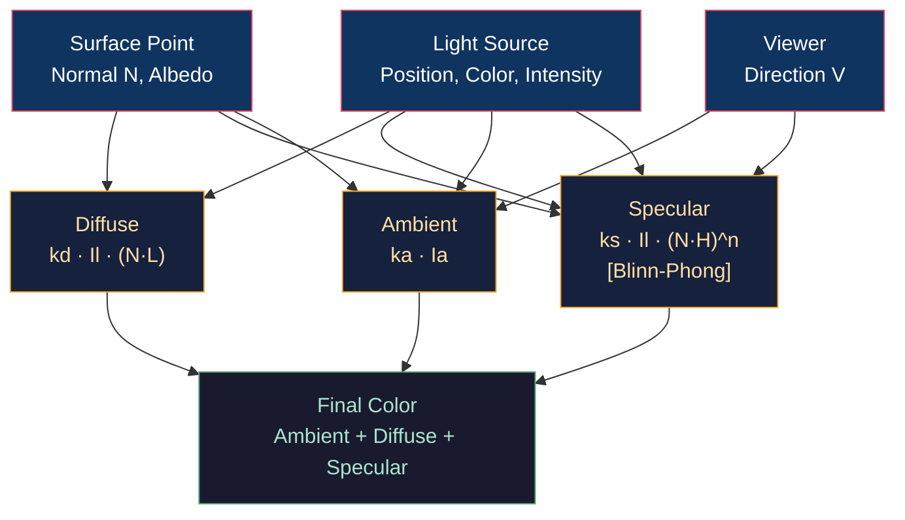

# 🌟 Phong and Blinn-Phong Lighting

> [!abstract] TL;DR
> Phong shading is an empirical local illumination model: `I = ambient + diffuse + specular`. Diffuse (Lambertian) component: `kd · Il · max(N·L, 0)`. Specular (Phong): `ks · Il · max(R·V, 0)^n` where R = reflect(-L, N). Blinn-Phong replaces R·V with the half-vector H = normalize(L + V): `ks · Il · max(N·H, 0)^n`. Blinn-Phong is faster (no reflect(), only one normalize), physically slightly more correct (energy conserving for specific n), and produces bigger highlights for the same shininess exponent. Common bug: `reflect(L, N)` (without negating L) points the wrong direction — must use `reflect(-L, N)` or `2.0*(N·L)*N - L`.

---

## Intuition — Analogy First

Imagine shining a flashlight on a billiard ball in a dark room. You see three contributions: a faint glow everywhere (ambient — approximates light bouncing from the walls), a broad bright patch facing the light (diffuse — Lambertian scattering independent of viewing angle), and a sharp white dot near the mirror-reflection direction (specular — the highlight that moves as you move your head). Phong invented a mathematical formula to replicate these three perceptual components without solving the actual physics of light transport.

---

## How It Works



---

## Key Concepts / Details

### Phong Model Components

**Ambient term** (hack for global illumination):
```
Iambient = ka · Ia
```
`ka` = ambient material coefficient, `Ia` = ambient light color. Uniform, view-independent.

**Diffuse term** (Lambertian scattering):
```
Idiffuse = kd · Il · max(N · L̂, 0)
```
- `kd` = diffuse material color (albedo)
- `Il` = light intensity/color
- `N` = surface normal (normalized)
- `L̂` = unit vector from surface point toward light
- `max(..., 0)`: clamps negative dot product (surfaces facing away from light receive no diffuse)

Lambert's cosine law: a surface oriented 60° to a light receives cos(60°) = 0.5× the flux of a directly-facing surface.

**Specular term (Phong)**:
```
R = reflect(-L̂, N) = 2(N · L̂)N - L̂
Ispecular = ks · Il · max(R · V̂, 0)^shininess
```

**Bug alert**: the `reflect` function in GLSL/HLSL reflects an incident ray `I` about normal `N` as `I - 2·(N·I)·N`. The **incident** direction is toward the surface. If `L` points from surface TO light, the incident direction is `-L`:

```glsl
// CORRECT:
vec3 R = reflect(-L, N);   // reflect -L (incident direction) about N

// WRONG:
vec3 R = reflect(L, N);    // reflects L about N → points AWAY from viewer always
```

### Blinn-Phong Half-Vector

Instead of computing R and V, compute the halfway vector between L and V:

```
H = normalize(L̂ + V̂)
Ispecular = ks · Il · max(N · H, 0)^(n')
```

Relationship between shininess exponents: `n'_blinn ≈ 4 × n_phong` for similar highlight size.

Advantages:
- No `reflect()` call (saves 3 MADs)
- H is symmetric in L and V — reciprocal (correct for BRDF)
- Doesn't produce negative values when R·V could go negative off-angle
- Provides physically correct 1/π normalization for Lambertian diffuse

### Full Blinn-Phong Implementation

```glsl
// Fragment shader: Blinn-Phong with multiple lights
struct Light {
    vec3 position;
    vec3 color;
    float intensity;
};

vec3 blinnPhong(vec3 fragPos, vec3 N, vec3 albedo, Light light) {
    vec3 L = normalize(light.position - fragPos);
    vec3 V = normalize(cameraPos - fragPos);
    vec3 H = normalize(L + V);
    
    // Diffuse: Lambert
    float NdotL = max(dot(N, L), 0.0);
    vec3 diffuse = albedo * light.color * light.intensity * NdotL;
    
    // Specular: Blinn-Phong
    float shininess = 64.0;
    float NdotH = max(dot(N, H), 0.0);
    float spec = pow(NdotH, shininess);
    vec3 specular = light.color * light.intensity * spec * specularColor;
    
    // Attenuation: 1 / (constant + linear*d + quadratic*d²)
    float d = length(light.position - fragPos);
    float attenuation = 1.0 / (1.0 + 0.09 * d + 0.032 * d * d);
    
    return (diffuse + specular) * attenuation;
}

void main() {
    vec3 N = normalize(vNormal);
    vec3 color = ambientColor * ambientStrength;  // ambient
    for (int i = 0; i < numLights; i++) {
        color += blinnPhong(vWorldPos, N, albedo, lights[i]);
    }
    outColor = vec4(color, 1.0);
}
```

### Attenuation Models

| Model | Formula | Notes |
|-------|---------|-------|
| Constant | `1.0` | No falloff (sun/directional) |
| Linear | `1/(k₀ + k₁·d)` | Unrealistic but simple |
| Quadratic (physical) | `1/(k₀ + k₁·d + k₂·d²)` | Physically correct (inverse-square) |
| UE4 windowed | `saturate(1-(d/r)²)² / d²` | Hard cutoff at radius r |

### Phong vs Blinn-Phong vs PBR

| Property | Phong | Blinn-Phong | PBR (Cook-Torrance) |
|----------|-------|------------|---------------------|
| Energy conserving | No | Approximately | Yes |
| View-direction dependent | Yes | Yes | Yes |
| Reciprocal (symmetric) | No | Yes | Yes |
| Matches real materials | Poor | Fair | Excellent |
| Parameter artist-friendly | Fair | Fair | Yes (roughness/metallic) |
| GPU cost | Low | Low | Medium |

---

## Real-World Notes

- **Cell/toon shading** discretizes the NdotL value: `float toon = step(0.5, NdotL)` gives a hard edge for stylized rendering.
- **Rim lighting** (edge highlight): `rimLight = pow(1.0 - dot(N, V), 3.0)` — bright at grazing angles, used for character silhouettes.
- **Hemisphere ambient** (simple GI approximation): blend between sky color (NdotUp > 0) and ground color (NdotUp < 0) based on `dot(N, vec3(0,1,0))`.
- **Per-pixel vs per-vertex Phong**: Gouraud shading computes lighting per vertex and interpolates — fast but misses specular highlights for large polygons. Per-pixel Phong (fragment shader) is standard.

---

## Common Pitfalls

1. **`reflect(L, N)` instead of `reflect(-L, N)`** — the single most common Phong bug; produces a reflection direction pointing into the surface or away from the viewer.
2. **Not normalizing interpolated normals** — normals interpolated across a triangle are not unit-length; `normalize(vNormal)` in the fragment shader is required.
3. **`max(NdotL, 0)` omission** — surfaces facing away from the light (NdotL < 0) would receive negative diffuse, darkening the surface below ambient level.
4. **Shininess = 0** — `pow(NdotH, 0)` = 1.0 regardless of angle, making the entire surface uniformly white with specular. Clamp shininess to at least 1.0.

---

## Related Concepts

- [[_MOC_Lighting_and_Materials|↑ Lighting & Materials MOC]]
- [[Physically_Based_Rendering|PBR]] — physically correct successor
- [[../04_Shaders/Fragment_Shaders_and_Effects|Fragment Shaders]] — implementation stage
- [[Texture_Mapping_and_UV|Texture Mapping]] — albedo, specular, and normal textures feed Phong

---

## Review Questions

1. Derive the reflect(-L, N) formula from geometric principles (no `reflect()` built-in). What is the mathematical relationship between the incident, normal, and reflected vectors?
2. For the same visual result, Blinn-Phong needs `n' ≈ 4·n_phong`. Why? Hint: consider the angular relationship between N·H and R·V.
3. A Phong shader produces a perfectly circular highlight on a sphere. A Blinn-Phong shader with the same shininess produces a slightly larger, elongated highlight on the same sphere. Explain the geometric reason for the difference.

---

## Sources

#Computer_Graphics #Lighting_and_Materials #Phong
