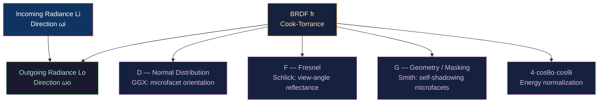

# 🔮 Physically Based Rendering (PBR)

> [!abstract] TL;DR
> PBR models light-matter interaction using the microfacet reflectance equation: `Lo(ωo) = ∫ fr(ωi,ωo) · Li(ωi) · (ωi·n) dωi`. The Cook-Torrance BRDF is `fr = D·F·G / (4·(ωo·n)·(ωi·n))`. GGX NDF: `D(h) = α² / (π·((n·h)²·(α²-1)+1)²)` where `α = roughness²`. Fresnel-Schlick: `F(θ) = F₀ + (1-F₀)·(1-h·v)⁵`. Smith-Schlick masking: `G = G1(l)·G1(v)`. Energy conservation: `kd = (1-F)·(1-metallic)`. The metallic-roughness workflow uses two maps: base color (albedo/specular from metallic) and roughness, making material authoring physically consistent. F₀ for dielectrics ≈ 0.04; for metals = base color.

---

## Intuition — Analogy First

At a microscopic level, even "smooth" surfaces are covered with tiny bumps and valleys (microfacets). Only microfacets oriented exactly halfway between the light direction and viewer direction (the half-vector H) reflect light toward the viewer. The GGX Normal Distribution Function describes how many microfacets have this magical orientation — more for rough materials (wide distribution), fewer for smooth ones (narrow peak). Fresnel tells us how reflective a surface is at different angles — metal reflects more than plastic, and ALL materials reflect more at grazing angles (that's why wet pavement looks mirrored when seen at a shallow angle).

---

## How It Works



---

## Key Concepts / Details

### Rendering Equation

Kajiya's rendering equation (the fundamental equation of light transport):

```
Lo(x, ωo) = Le(x, ωo) + ∫ fr(x, ωi, ωo) · Li(x, ωi) · (ωi·n) dωi
              emitted        Ω  BRDF           incident       cosine
```

For real-time PBR, we approximate the integral by:
1. Summing over discrete light sources (analytic lights)
2. Using environment maps for image-based lighting (IBL)
3. Adding pre-computed indirect (probes/lightmaps) for indirect lighting

### GGX Normal Distribution Function

```
D_GGX(h, α) = α² / (π · ((n·h)²·(α²-1)+1)²)
```

Where `α = roughness²` (remapping roughness to α² gives more perceptually linear feel). GGX has a heavier tail than Blinn-Phong's NDF — highlights fade more gradually, matching real-world glints on metallic surfaces.

```glsl
float D_GGX(float NdotH, float roughness) {
    float alpha = roughness * roughness;
    float a2 = alpha * alpha;
    float denom = (NdotH * NdotH) * (a2 - 1.0) + 1.0;
    return a2 / (PI * denom * denom);
}
```

### Fresnel-Schlick Approximation

The Fresnel equations describe how much light reflects vs refracts at a surface. Schlick's approximation:

```
F(h·v) = F₀ + (1 - F₀)·(1 - h·v)⁵
```

`F₀` = reflectance at normal incidence (θ = 0):
- Dielectrics (plastic, wood, skin): F₀ ≈ 0.04 (4%)
- Metals: F₀ = base color (colored reflectance)

```glsl
vec3 F_Schlick(float HdotV, vec3 F0) {
    return F0 + (1.0 - F0) * pow(clamp(1.0 - HdotV, 0.0, 1.0), 5.0);
}

vec3 F0 = mix(vec3(0.04), albedo, metallic);  // dielectric vs metallic
```

### Smith Masking-Shadowing Function

```
G = G1(ωo, h) · G1(ωi, h)

G1(v, h) = 2·(n·v) / ((n·v)·(1+k) + k)   where k = α/2 (for direct lighting)
                                                      k = (α+1)²/8 (IBL)
```

G accounts for microfacet self-shadowing (masking when viewing) and self-shadowing (shadowing from light). Smith formulation approximates G as separable in view and light directions.

```glsl
float G_SchlickGGX(float NdotV, float roughness) {
    float r = (roughness + 1.0);
    float k = (r * r) / 8.0;  // direct lighting
    return NdotV / (NdotV * (1.0 - k) + k);
}
float G_Smith(float NdotV, float NdotL, float roughness) {
    return G_SchlickGGX(NdotV, roughness) * G_SchlickGGX(NdotL, roughness);
}
```

### Cook-Torrance BRDF

```
fr(ωi, ωo) = kd·fdiffuse + ks·fspecular

fdiffuse = albedo / π           (Lambertian, energy normalized)
fspecular = D·F·G / (4·(n·ωo)·(n·ωi))
```

Energy conservation via `kd`:
```glsl
vec3 F = F_Schlick(HdotV, F0);
vec3 kS = F;                           // specular fraction
vec3 kD = (1.0 - kS) * (1.0 - metallic);  // diffuse fraction (0 for metals)
```

Metals have no subsurface diffuse — all reflection is specular and colored by F₀ = base color.

### Full PBR BRDF Implementation

```glsl
vec3 CookTorrance_PBR(
    vec3 N, vec3 V, vec3 L,
    vec3 albedo, float roughness, float metallic,
    vec3 lightColor, float lightIntensity)
{
    vec3 H = normalize(V + L);
    float NdotV = max(dot(N, V), 0.001);
    float NdotL = max(dot(N, L), 0.001);
    float NdotH = max(dot(N, H), 0.0);
    float HdotV = max(dot(H, V), 0.0);
    
    vec3 F0 = mix(vec3(0.04), albedo, metallic);
    
    // DFG terms
    float D = D_GGX(NdotH, roughness);
    vec3  F = F_Schlick(HdotV, F0);
    float G = G_Smith(NdotV, NdotL, roughness);
    
    // Specular
    vec3 numerator   = D * F * G;
    float denominator = 4.0 * NdotV * NdotL;
    vec3 specular = numerator / max(denominator, 0.001);
    
    // Diffuse (energy conserving)
    vec3 kD = (vec3(1.0) - F) * (1.0 - metallic);
    vec3 diffuse = kD * albedo / PI;
    
    return (diffuse + specular) * lightColor * lightIntensity * NdotL;
}
```

### IBL — Image-Based Lighting

For environment/indirect lighting, approximate the rendering equation split:

```
Lo(ωo) ≈ (∫ f_diffuse·Li dωi) + (∫ D·G·Li / 4·cosθ dωi)·F
       ≈ irradiance_map.sample(N) · kD · albedo   // prefiltered diffuse
         + prefiltered_env_map.sample(R, roughness) · (F0·BRDFlut.x + BRDFlut.y)
```

Split-sum approximation (UE4):
1. **Irradiance map**: diffuse environment integral precomputed into a low-res cubemap (9 SH coefficients)
2. **Prefiltered environment map**: specular environment integral for each roughness level (mip chain)
3. **BRDF LUT**: 2D texture `(NdotV, roughness)` → `(scale, bias)` for Fresnel and G

### Metallic-Roughness Workflow Parameters

| Parameter | Range | Meaning |
|-----------|-------|---------|
| Base color / Albedo | RGB [0,1] | Diffuse color (dielectric) or F₀ (metal) |
| Metallic | 0–1 | 0 = dielectric, 1 = conductor |
| Roughness | 0–1 | 0 = mirror, 1 = fully diffuse |
| AO | 0–1 | Ambient occlusion factor |
| Normal | XYZ [−1,1] | Perturbed surface normal |
| Emissive | RGB [0,∞) | Self-emission (adds directly) |

---

## Real-World Notes

- **glTF 2.0** uses the metallic-roughness workflow as its standard PBR material model.
- **Energy conservation check**: at roughness=1.0 with metallic=0, the specular should approach 4% (F₀ for dielectrics) and diffuse should be dominant — not equal.
- **Specular aliasing**: micro-geometry produces specular at frequencies below the pixel level; `roughness = max(roughness, geometricRoughness)` derived from mesh curvature prevents sub-pixel flickering.
- **Disney BSDF**: extends Cook-Torrance with subsurface scattering, clearcoat, sheen, anisotropy — the standard for film rendering (Hyperion, Arnold).

---

## Common Pitfalls

1. **Roughness vs α confusion** — many papers define `α = roughness²`; some define `α = roughness`. Consistent squaring in the D, G, and G₁ functions is critical.
2. **Division by near-zero** — `4·(n·ωo)·(n·ωi)` approaches 0 at grazing angles; always use `max(denominator, 0.001)`.
3. **F₀ for metals not equal to 1** — metals have colored F₀ (copper ≈ (1.0, 0.71, 0.29)); using `(1,1,1)` makes all metals silver.
4. **Missing IBL** — a PBR shader without any indirect lighting (ambient only) makes all surfaces look flat and unrealistic regardless of roughness/metallic values.

---

## Related Concepts

- [[_MOC_Lighting_and_Materials|↑ Lighting & Materials MOC]]
- [[Phong_and_Blinn_Phong|Phong & Blinn-Phong]] — predecessor model
- [[Ray_Tracing_and_Path_Tracing|Ray Tracing]] — unbiased computation of the full rendering equation
- [[Texture_Mapping_and_UV|Texture Mapping]] — PBR maps (albedo, roughness, metallic, normal)
- [[Global_Illumination|Global Illumination]] — indirect lighting for PBR

---

## Review Questions

1. Derive why `kd = (1-F)·(1-metallic)` ensures energy conservation in the Cook-Torrance BRDF. What happens to the "missing" energy for metals?
2. GGX has a heavier tail than Blinn-Phong NDF. What visual effect does this produce on a rough metal surface, and why does it match real-world materials better?
3. A PBR material has roughness=0.1 and metallic=0. At normal incidence, approximately what fraction of light is specularly reflected? (Use F₀ = 0.04 and small roughness → sharp specular)

---

## Sources

#Computer_Graphics #Lighting_and_Materials #PBR #Microfacet
