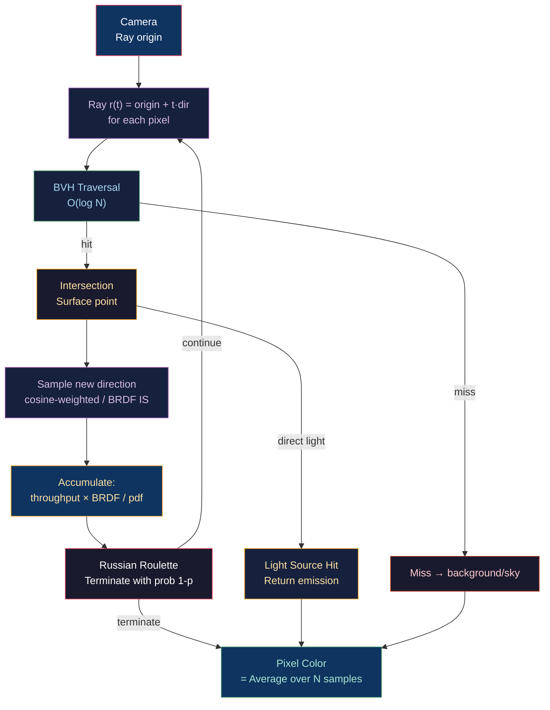

# ☀️ Ray Tracing and Path Tracing

> [!abstract] TL;DR
> Ray tracing casts rays from the camera through each pixel, finding the nearest intersection via BVH traversal (O(log n) per ray). Path tracing implements the full Kajiya rendering equation via Monte Carlo integration: at each hit, sample a new direction using cosine-weighted importance sampling, accumulate throughput, and terminate probabilistically (Russian Roulette, p = max(throughput) after 3 bounces). Multiple Importance Sampling (MIS) combines BRDF and light sampling to reduce variance. Modern real-time ray tracing uses DXR/Vulkan ray tracing with hardware RT cores, typically 1–4 rays/pixel + denoising (OIDN, DLSS RR). Convergence: Monte Carlo variance = σ²/N → standard deviation ∝ 1/√N.

---

## Intuition — Analogy First

Path tracing is like asking "where did this photon come from?" backwards — instead of simulating every photon from light sources (90% of which never reach the camera), we send rays FROM the camera, bounce them around the scene, and eventually reach a light source. Each bounce direction is randomly sampled (hence Monte Carlo), and after enough random paths, the average converges to the correct image. The 1/√N convergence means doubling quality requires 4× more samples — expensive, but physically correct.

---

## How It Works



---

## Key Concepts / Details

### Monte Carlo Integration

The rendering equation integral is approximated as:

```
Lo ≈ (1/N) · Σ [fr(ωi, ωo) · Li(ωi) · cosθi / p(ωi)]

where p(ωi) = pdf of the chosen sampling distribution
```

For cosine-weighted hemisphere sampling: `p(ωi) = cosθ/π`

This cancels the cosine term: `Lo ≈ (π/N) · Σ [fr · Li]`

**Variance reduction techniques**:
1. **Importance sampling**: sample proportional to the integrand (BRDF or luminance) → fewer samples needed for same quality
2. **Multiple Importance Sampling (MIS)**: combine BRDF IS and light IS with balance heuristic weights
3. **Next Event Estimation (NEE)**: explicitly sample a light source at each hit point + BRDF-sampled indirect

### BVH — Bounding Volume Hierarchy

The acceleration structure for ray-scene intersection:

```
Build (offline, per mesh):
1. Compute AABB of all primitives
2. For each node, sort primitives on the axis with maximum extent
3. Split at median (simple) or Surface Area Heuristic (SAH, optimal):
   cost(split) = Traversal + SA(left)/SA(root) × N(left) + SA(right)/SA(root) × N(right)
4. Recursively build left and right subtrees

Traverse (per ray):
def trace(ray, node):
    if ray misses node.aabb: return NO_HIT
    if node.is_leaf: intersect_triangles(ray, node.primitives)
    else:
        hit1 = trace(ray, node.left)
        hit2 = trace(ray, node.right)
        return nearest(hit1, hit2)
```

Hardware BVH (DXR, Vulkan RT): `TraceRay()` / `traceRayEXT()` triggers fixed-function RT core traversal — typically 2–10× faster than software BVH.

### Ray-Triangle Intersection (Möller-Trumbore)

```python
def ray_triangle(orig, dir, v0, v1, v2):
    edge1 = v1 - v0
    edge2 = v2 - v0
    h = cross(dir, edge2)
    a = dot(edge1, h)
    if abs(a) < 1e-7: return None  # ray parallel to triangle
    f = 1.0 / a
    s = orig - v0
    u = f * dot(s, h)
    if u < 0 or u > 1: return None
    q = cross(s, edge1)
    v = f * dot(dir, q)
    if v < 0 or u + v > 1: return None
    t = f * dot(edge2, q)
    return t if t > 1e-7 else None  # t > epsilon avoids self-intersection
```

Barycentric coordinates (u, v, 1-u-v) give interpolated normals/UVs at the hit point.

### Russian Roulette Termination

Instead of fixed max bounces, terminate rays probabilistically to avoid bias:

```python
def path_trace(ray, depth=0):
    hit = intersect(ray, scene)
    if not hit: return sky_color(ray.direction)
    
    # Emission (direct hit on light)
    color = hit.emission
    
    # Terminate early with Russian Roulette after bounce 3
    throughput = max(hit.albedo)
    if depth > 3:
        if random() > throughput: return color  # terminate
        throughput = 1.0 / throughput  # boost surviving rays to maintain expectation
    
    # Sample new direction
    new_dir = cosine_hemisphere_sample(hit.normal)
    pdf = dot(hit.normal, new_dir) / PI
    brdf = hit.albedo / PI  # Lambertian
    
    # Recurse
    incoming = path_trace(Ray(hit.pos + new_dir * 0.001, new_dir), depth + 1)
    color += (brdf * incoming * dot(hit.normal, new_dir) / pdf) * throughput
    return color
```

### Multiple Importance Sampling (MIS)

Combines two sampling strategies (BRDF IS and light IS) using the balance heuristic:

```
L_MIS = w_brdf · L_brdf / p_brdf + w_light · L_light / p_light

w_brdf  = p_brdf  / (p_brdf + p_light)    (balance heuristic)
w_light = p_light / (p_brdf + p_light)
```

MIS dramatically reduces variance for scenes with specular materials near area lights (where pure BRDF sampling rarely hits the light, and pure light sampling generates low-probability BRDF directions).

### Denoising

Path tracing at 1–4 SPP (samples per pixel) is too noisy for real-time. Denoisers reconstruct a clean image:

| Denoiser | Type | Quality | Cost |
|----------|------|---------|------|
| OIDN (Intel OpenImage Denoise) | AI (trained CNN) | Excellent | ~2ms/frame |
| DLSS Ray Reconstruction (NVIDIA) | AI + temporal | Best | ~1–2ms |
| Temporal accumulation + SVGF | Spatiotemporal filter | Good | ~1ms |
| A-SVGF | Adaptive spatiotemporal | Very good | ~2ms |

AI denoisers are trained on ground truth rendered images and learn the noise distribution from low-SPP inputs. They generalize well across scenes but require GPU-side inference.

### DXR/Vulkan Ray Tracing API

```hlsl
// DXR ray generation shader
[shader("raygeneration")]
void RayGenShader() {
    uint2 LaunchIndex = DispatchRaysIndex().xy;
    float2 d = (LaunchIndex / (float2)DispatchRaysDimensions().xy) * 2.0 - 1.0;
    
    RayDesc ray;
    ray.Origin = CameraPos;
    ray.Direction = normalize(d.x * Right + d.y * Up + Forward);
    ray.TMin = 0.001;
    ray.TMax = 10000.0;
    
    RayPayload payload = { float3(0,0,0), 0 };
    TraceRay(SceneBVH, RAY_FLAG_NONE, 0xFF, 0, 0, 0, ray, payload);
    
    RenderTarget[LaunchIndex] = float4(payload.color, 1.0);
}

// Closest hit shader
[shader("closesthit")]
void ClosestHitShader(inout RayPayload payload, BuiltInTriangleIntersectionAttributes attr) {
    float3 barycentrics = float3(1-attr.barycentrics.x-attr.barycentrics.y,
                                 attr.barycentrics.x, attr.barycentrics.y);
    // ... interpolate normal, UV, shade, recursively trace ...
    payload.color = shadedColor;
}
```

---

## Real-World Notes

- **NVIDIA RTX**: TLAS (top-level BVH over instances) + BLAS (per-mesh BVH) two-level hierarchy enables dynamic scenes (update TLAS each frame without rebuilding BLAS).
- **Unreal Engine Lumen**: hybrid approach — software ray tracing against signed distance fields (fast, any GPU) + hardware RT for reflections (quality).
- **Path tracing for film**: Pixar RenderMan, SPI Arnold, and DreamWorks MoonRay use unbiased path tracing at 4096+ SPP with AI denoising for final frames.
- **ReSTIR (Reservoir-based SpatioTemporal Importance Resampling)**: reuses and resamples light samples across pixels and frames — enables thousands of lights with 1 SPP per pixel.

---

## Common Pitfalls

1. **Self-intersection (shadow acne)** — the new ray starts exactly at the hit surface; floating-point error places it inside the geometry. Always offset along the normal: `origin + normal * 0.001`.
2. **Fireflies** — extremely bright samples from low-probability paths (small pdf denominator) create bright speckles. Mitigate with MIS or clamping throughput (biased but necessary in real-time).
3. **Energy gain from skipping Russian Roulette boost** — if you terminate a path without boosting the surviving rays by 1/p, your image will be systematically too dark (biased).
4. **BVH intersection without epsilon** — `t > 0` allows self-intersection from floating-point; use `t > 1e-7` as minimum.

---

## Related Concepts

- [[_MOC_Lighting_and_Materials|↑ Lighting & Materials MOC]]
- [[Physically_Based_Rendering|PBR]] — the BRDF used in path tracing
- [[Global_Illumination|Global Illumination]] — path tracing is the gold standard GI algorithm
- [[Frustum_Culling_and_Clipping|BVH Culling]] — same BVH structure used for both culling and RT
- [[../04_Shaders/Compute_Shaders_GPGPU|Compute Shaders]] — software RT traversal in compute

---

## Review Questions

1. Prove that Monte Carlo integration with cosine-weighted importance sampling (`p(ω) = cosθ/π`) gives an unbiased estimate of the rendering equation's Lambertian term.
2. Explain Russian Roulette termination. Why must paths that survive be boosted by `1/p`? What happens to the expected value if they are not?
3. MIS with balance heuristic uses `w = p1/(p1+p2)`. For a glossy material where the BRDF is very narrow (specular), what do the MIS weights approach, and why is this correct?

---

## Sources

#Computer_Graphics #Lighting_and_Materials #RayTracing #PathTracing
