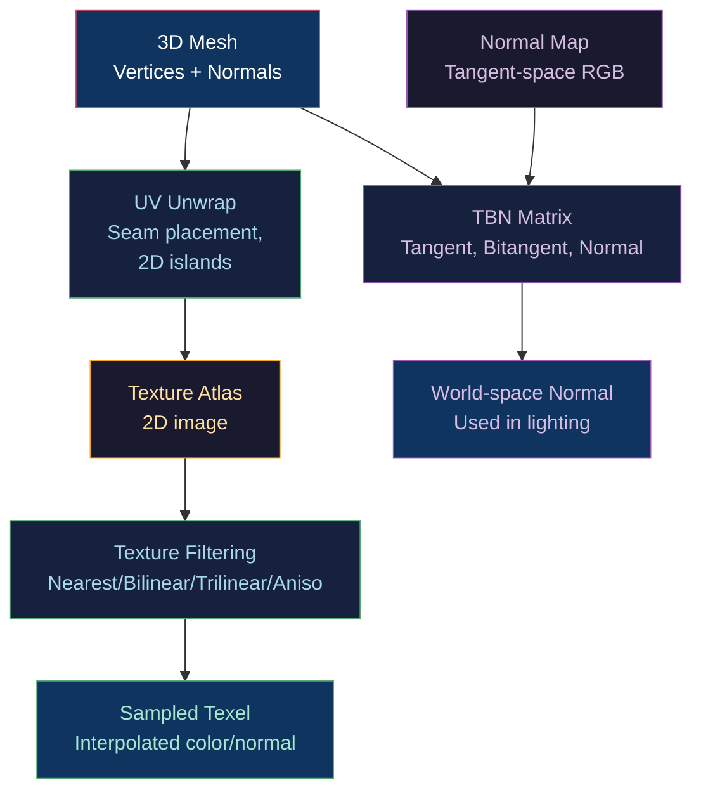

# 🗺️ Texture Mapping and UV

> [!abstract] TL;DR
> Texture mapping applies 2D image data to 3D surfaces via UV coordinates (alias: texcoords, st-coords). UV unwrapping projects the 3D mesh onto 2D islands without overlap. Texture filtering choices: nearest (pixelated), bilinear (smooth, 4-tap), trilinear (mip-linear, 8-tap), anisotropic (directional filter, 8–16×). Mipmaps are pre-downsampled levels: LOD = 0.5·log₂(max(|du/dx|,|du/dy|)²+...). Normal mapping stores perturbed normals in tangent space (encoded as RGB = XYZ remapped [−1,1]→[0,1]); TBN matrix transforms them to world space. The bitangent is re-orthogonalized as B = cross(N,T)·tangent.w. Parallax offset mapping shifts UV by height·(V·N) to fake surface depth. Texture atlases pack multiple textures to minimize bind changes.

---

## Intuition — Analogy First

UV mapping is like unwrapping a chocolate orange: you cut along strategic seams and peel the orange skin flat onto a table (the UV atlas). Each point on the skin (3D surface) corresponds to a unique point on the flat table (2D texture). "UVs" are just the coordinates in that flat space — U for horizontal, V for vertical. Mipmaps are like pre-printing the map at different zoom levels: use the detailed version up close and the blurry version from far away, preventing flickering aliasing (Moiré) at distance.

---

## How It Works



---

## Key Concepts / Details

### UV Coordinate Conventions

UV coordinates are normalized [0,1]² where (0,0) and (1,1) define the texture corners. Convention varies by API:

| API | (0,0) corner | V direction |
|-----|------------|------------|
| OpenGL | Bottom-left | Up |
| DirectX/Vulkan | Top-left | Down |
| Metal | Top-left | Down |

UV values outside [0,1] are handled by the wrap mode:
- `GL_REPEAT`: tiles the texture
- `GL_MIRRORED_REPEAT`: tiles with alternating mirror (reduces visible seams)
- `GL_CLAMP_TO_EDGE`: clamps to edge texel (no border artifact)
- `GL_CLAMP_TO_BORDER`: outside UV reads a user-defined border color

### Mipmap LOD Calculation

Mipmaps are pre-computed half-resolution copies: level 0 = full resolution, level k = 2^k downsampled.

LOD selection formula:
```
ρ = max(sqrt(|∂u/∂x|² + |∂v/∂x|²), sqrt(|∂u/∂y|² + |∂v/∂y|²))
LOD = log₂(ρ)  (GPU computes this implicitly from dFdx/dFdy)
```

GPU samples between `floor(LOD)` and `ceil(LOD)` linearly (trilinear filtering = bilinear at each mip level + linear blend between two mip levels).

```cpp
// Upload mip chain
glTexImage2D(GL_TEXTURE_2D, 0, GL_RGBA8, 1024, 1024, ...);  // mip 0
glTexImage2D(GL_TEXTURE_2D, 1, GL_RGBA8, 512, 512, ...);   // mip 1
// ...
glGenerateMipmap(GL_TEXTURE_2D);  // auto-generate all levels
```

### Filtering Comparison

| Filter Mode | Taps | LOD Use | Quality | Cost |
|------------|------|---------|---------|------|
| Nearest | 1 | No | Pixelated | Minimal |
| Bilinear | 4 | One level | Smooth | Low |
| Trilinear | 8 | Two levels | Smooth at distance | Medium |
| Anisotropic 4× | Up to 32 | Ratio-based | Correct oblique | High |
| Anisotropic 16× | Up to 128 | Ratio-based | Best | Very High |

Anisotropic filtering samples the texture along an ellipse aligned with the screen-space gradient direction, preventing the "blurry texture on oblique surfaces" artifact that trilinear filtering produces. `glTexParameterf(GL_TEXTURE_2D, GL_TEXTURE_MAX_ANISOTROPY, 8.0f)` (require `GL_EXT_texture_filter_anisotropic`).

### Normal Map — Tangent Space Encoding

Normal maps store perturbed normals in tangent space:
- A flat normal (pointing straight out) = RGB (0.5, 0.5, 1.0) = XYZ (0, 0, 1) in tangent space
- A tilted normal = different RGB

```glsl
// Fragment shader: decode and transform normal map
vec3 normalSample = texture(normalMap, uv).rgb;
normalSample = normalSample * 2.0 - 1.0;  // [0,1] → [-1,1]

// Build TBN (tangent-space to world-space rotation matrix)
vec3 N = normalize(vNormal);
vec3 T = normalize(vTangent.xyz);
T = normalize(T - dot(T, N) * N);  // Gram-Schmidt re-orthogonalize
vec3 B = cross(N, T) * vTangent.w;  // tangent.w = bitangent sign (±1)
mat3 TBN = mat3(T, B, N);

vec3 worldNormal = normalize(TBN * normalSample);
// worldNormal is now in world space, ready for lighting
```

**Why tangent.w matters**: for UV-mirrored geometry (like a symmetric character's left/right faces), the bitangent direction flips across the mirror axis. Storing ±1 in tangent.w encodes this flip without storing a separate bitangent per vertex (saves 12 bytes/vertex).

**Mikktspace**: the standard algorithm for computing tangent space consistently between DCC tools and game engines. Inconsistent tangent basis causes seam artifacts at UV island borders.

### Parallax Offset Mapping

Simulates surface depth using a height map — UV is offset based on the view angle:

```glsl
// Simple parallax offset
uniform sampler2D heightMap;
uniform float heightScale;

vec3 V_tangent = normalize(TBN_inv * viewDir);  // view in tangent space
float height = texture(heightMap, uv).r;
vec2 offset = V_tangent.xy / V_tangent.z * height * heightScale;
vec2 newUV = uv - offset;  // shift UV toward viewer

// Then sample albedo/normal with newUV
```

Steep Parallax Mapping (Parallax Occlusion Mapping, POM): ray-march along the view direction through the height field for accurate depth offset, enabling self-shadowing and correct silhouettes on height-field surfaces.

### Texture Atlases and Sprite Sheets

Pack multiple textures into one large texture to reduce draw call count (each texture bind = possible pipeline flush):

```glsl
// Atlas: material ID → UV region mapping
struct AtlasRegion { vec2 offset, scale; };
AtlasRegion region = materialAtlas[materialID];
vec2 atlasUV = region.offset + uv * region.scale;
vec4 color = texture(atlasTexture, atlasUV);
```

Atlas packing rules:
- All sub-textures same format and mip count
- Padding between islands to prevent mip bleeding (border = ≥ 2^maxMipLevel pixels)
- Square power-of-two atlas for efficient GPU tile caching

### BC Texture Compression

| Format | Ratio | Quality | Use |
|--------|-------|---------|-----|
| BC1/DXT1 | 6:1 | RGB, 1-bit alpha | Opaque color maps |
| BC3/DXT5 | 4:1 | RGBA | Color + full alpha |
| BC4/ATI1 | 6:1 | Single-channel | Roughness, AO |
| BC5/ATI2 | 3:1 | Two-channel | Normal maps (XY, derive Z) |
| BC6H | 6:1 | HDR RGB | Environment maps, lightmaps |
| BC7 | 3:1 | High-quality RGBA | Albedo maps |
| ASTC 4×4 | 8:1 | Variable | Mobile all-purpose |

Normal maps should use BC5 (stores only X and Y; Z = sqrt(1-x²-y²) in shader) to preserve precision in the important channels.

---

## Real-World Notes

- **Texture streaming**: modern engines (Unreal, Unity) stream mip levels on demand — only the visible LOD is resident in GPU memory. Unresolved streaming = low-res "pop-in" during camera moves.
- **Virtual texturing** (Sparse Virtual Textures): treat the GPU as a virtual memory system — only physically load pages (128×128 texel blocks) that are actually visible, allowing trillion-texel virtual texture spaces.
- **Texture budget**: a typical next-gen game scene has 2–4GB of compressed textures. BC7 at 4K = 8MB/texture; 500 textures = 4GB uncompressed but 500MB compressed.

---

## Common Pitfalls

1. **Normal map seams from inconsistent tangent space** — using the DCC tool's tangent basis vs the engine's (non-mikktspace) tangent basis causes visible seams at UV island borders.
2. **BC5 normal map requires Z reconstruction** — engines that use BC5 for normals must reconstruct Z in the shader; forgetting this produces incorrect normals.
3. **Missing mipmap on wrap-sampled textures** — sampling at high anisotropy without mipmaps reads only from level 0, producing aliased results that anisotropic filtering cannot fix.
4. **Tangent.w = 0** — if the exporter doesn't write tangent.w, it defaults to 0, making `cross(N,T) * 0 = vec3(0)` — a zero bitangent produces incorrect normal mapping.

---

## Related Concepts

- [[_MOC_Lighting_and_Materials|↑ Lighting & Materials MOC]]
- [[Physically_Based_Rendering|PBR]] — uses albedo/roughness/metallic/normal textures
- [[../02_3D_Fundamentals/Coordinate_Systems_and_Handedness|Coordinate Systems]] — tangent space TBN derivation
- [[../04_Shaders/Fragment_Shaders_and_Effects|Fragment Shaders]] — texture sampling, dFdx/dFdy for LOD
- [[../01_2D_Graphics/Anti_Aliasing|Anti-Aliasing]] — mipmapping as texture pre-filtering

---

## Review Questions

1. Explain why `tangent.w` must store ±1 for UV-mirrored geometry. What visual artifact appears if it's always set to +1?
2. A 4K texture is sampled on a surface viewed at a 45° angle with 8× anisotropic filtering. Describe the sampling pattern the GPU uses and why it outperforms trilinear filtering here.
3. Derive the parallax UV offset formula from the view vector in tangent space. What limitation does it have, and how does POM (Parallax Occlusion Mapping) address it?

---

## Sources

#Computer_Graphics #Lighting_and_Materials #Textures #UV
