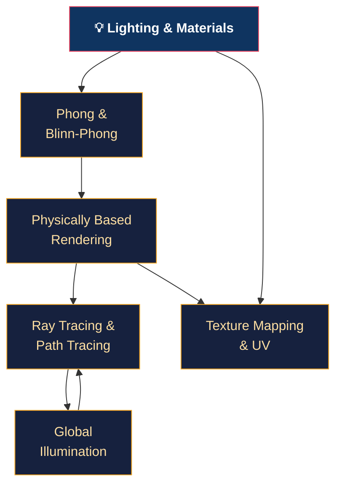

# 💡 Lighting and Materials — Section Map of Content

> [!abstract] Section Overview
> From basic Phong to physically-based rendering, ray tracing, global illumination, and texture mapping. This section progresses from empirical lighting models through the physics of light transport (rendering equation, microfacet BRDF), Monte Carlo integration for path tracing, indirect illumination techniques (SSAO, DDGI probes, lightmaps), and the full texture mapping pipeline (UV unwrapping, filtering, normal/parallax maps).

---

## Concept Map

---

## Learning Path

1. [[Phong_and_Blinn_Phong|Phong & Blinn-Phong]] — ambient/diffuse/specular, half-vector, reflect sign bug
2. [[Physically_Based_Rendering|Physically Based Rendering]] — microfacet BRDF, GGX, Fresnel-Schlick, metallic-roughness
3. [[Texture_Mapping_and_UV|Texture Mapping & UV]] — filtering, mipmaps, normal maps, TBN, parallax
4. [[Global_Illumination|Global Illumination]] — SSAO, HBAO+, DDGI probes, lightmaps, Lumen
5. [[Ray_Tracing_and_Path_Tracing|Ray Tracing & Path Tracing]] — Kajiya equation, Monte Carlo, BVH, OIDN denoising

---

## Notes at a Glance

| Note | Core Concept | Key Formula | Difficulty |
|------|-------------|-------------|------------|
| [[Phong_and_Blinn_Phong]] | Empirical lighting | `H = normalize(L+V)` | Beginner |
| [[Physically_Based_Rendering]] | Microfacet BRDF | `Lo = ∫ fr·Li·cosθ dωi` | Advanced |
| [[Texture_Mapping_and_UV]] | Normal maps, mipmaps | `B = cross(N,T)·tangent.w` | Intermediate |
| [[Global_Illumination]] | SSAO, probes | Hemisphere sampling | Advanced |
| [[Ray_Tracing_and_Path_Tracing]] | Path tracing, BVH | Monte Carlo estimator | Advanced |

---

## Key Questions

1. Why does `reflect(-L, N)` produce the correct specular reflection direction?
2. What does GGX NDF model differently from Blinn-Phong, and why does it produce a more realistic tail?
3. How does Cook-Torrance energy conservation (kd = (1−F)(1−metallic)) work?
4. Why does path tracing converge to the correct answer given enough samples?
5. What causes shadow acne on shadow maps and how does the bias fix it?

---

## Related Sections

- [[_MOC_Computer_Graphics_Master|↑ Master MOC]]
- [[../04_Shaders/_MOC_Shaders|← Shaders]] (PBR is implemented in fragment shaders)
- [[../03_Rendering_Pipeline/_MOC_Rendering_Pipeline|← Rendering Pipeline]] (deferred uses G-buffer for lighting)
- [[../06_Animation_and_Simulation/_MOC_Animation_and_Simulation|→ Animation]] (material changes on animated meshes)

---

#Computer_Graphics #Lighting_and_Materials #MOC
