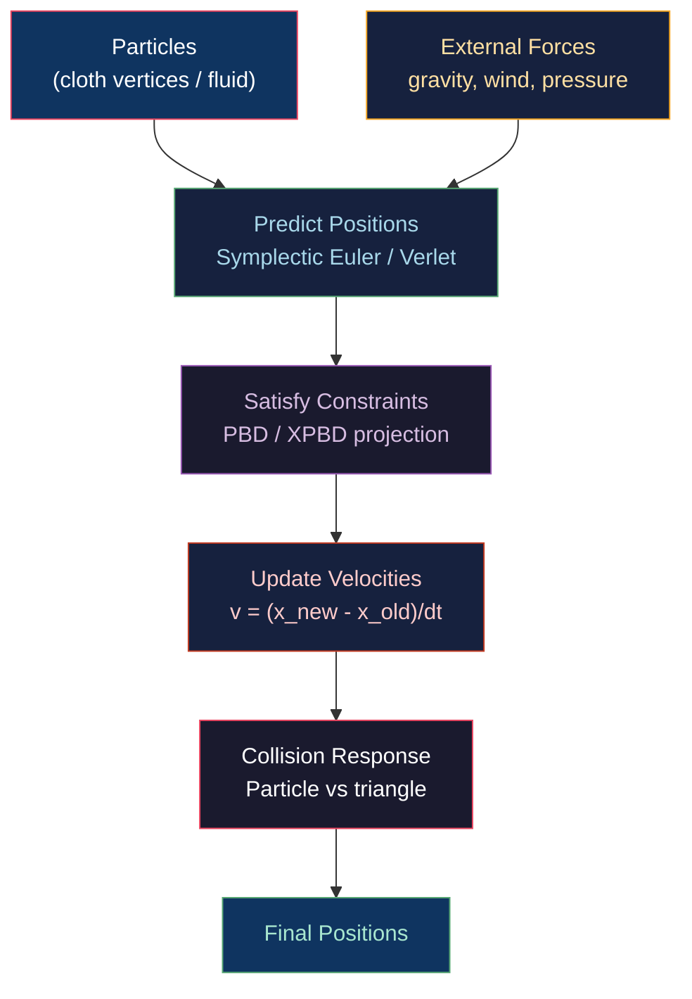

# 🌊 Cloth and Fluid Simulation

> [!abstract] TL;DR
> Cloth simulation models fabric as a mesh of mass particles connected by springs (stretch, shear, bend). The classic mass-spring model is unstable with large timesteps; Position Based Dynamics (PBD) projects positions to satisfy constraints directly — stable at any timestep but with artificial damping. XPBD (eXtended PBD) adds a compliance parameter α to control stiffness correctly. SPH (Smoothed Particle Hydrodynamics) models fluids as particles that interpolate density/pressure via kernel functions. Eulerian Navier-Stokes simulates fluid on a fixed grid with pressure projection for incompressibility. Integration: Verlet is second-order, time-reversible; Symplectic Euler is first-order but energy-conserving; Semi-implicit Euler is stable for stiff springs.

---

## Intuition — Analogy First

A cloth is a net of rubber bands — stretch it and it pulls back, shear it and diagonal bands resist. Mass-spring treats each rubber band as a spring (Hooke's law F = -k·(|Δx|-rest)), and Newton's second law propagates forces through the net. The problem: stiffer rubber bands require smaller timesteps for stability, making simulation expensive. PBD skips forces entirely and directly "snaps" positions to satisfy the rubber-band constraint — always stable but feels a bit "magical" (constraints aren't physically rigorous). XPBD restores physical correctness by modeling compliance.

---

## How It Works



---

## Key Concepts / Details

### Mass-Spring Cloth Model

Springs connect adjacent and diagonal cloth vertices to model three deformation modes:

| Spring Type | Connection | Resists |
|-------------|-----------|---------|
| Stretch | Edge neighbors (cardinal) | Elongation |
| Shear | Diagonal neighbors | Shear deformation |
| Bend | 2-hop neighbors (skip one) | Bending |

```python
def spring_force(p1, p2, rest_length, k_spring):
    delta = p2.x - p1.x
    current_length = np.linalg.norm(delta)
    extension = current_length - rest_length
    direction = delta / current_length
    force = k_spring * extension * direction
    p1.f += force
    p2.f -= force  # Newton's 3rd law
```

**Stability limit**: for explicit Euler, `dt < 2/sqrt(k/m)`. High stiffness (k large) → tiny timesteps. A cloth needing k = 10,000 with m = 0.01kg requires dt < 0.002s.

### Position Based Dynamics (PBD)

PBD directly projects positions to satisfy constraints without force integration:

**Distance constraint** (|p₁ - p₂| = d):

```
C(p₁, p₂) = |p₁ - p₂| - d = 0

Correction:
n = (p₁ - p₂) / |p₁ - p₂|
Δp₁ = -w₁/(w₁+w₂) · C · n
Δp₂ = +w₂/(w₁+w₂) · C · n

where wᵢ = 1/mᵢ (inverse mass; 0 for fixed/pinned particles)
```

```python
def pbd_step(particles, constraints, dt, iterations=10):
    # Predict positions (ignore constraints)
    for p in particles:
        p.v += (gravity + p.external_force / p.mass) * dt
        p.x_pred = p.x + p.v * dt
    
    # Project constraints (iteratively)
    for _ in range(iterations):
        for constraint in constraints:
            constraint.project(particles)  # adjust x_pred in-place
    
    # Update velocities and positions
    for p in particles:
        p.v = (p.x_pred - p.x) / dt
        p.x = p.x_pred
```

**Stiffness** in PBD: `k_pbd = 1 - (1 - k_material)^(1/iterations)`. Higher iterations = stiffer constraint satisfaction. Not directly related to physical stiffness.

### XPBD — Extended PBD

XPBD introduces **compliance** α (physical inverse stiffness) to give constraints real physical meaning:

```
Constraint:      C(x) = 0
Correction:      Δλ = (-C - α/dt² · λ) / (Σ wᵢ|∇Cᵢ|² + α/dt²)
Position update: Δxᵢ = wᵢ · ∇Cᵢ · Δλ

where: λ = Lagrange multiplier (force magnitude), α = compliance (1/stiffness)
```

XPBD benefits:
- Timestep-independent stiffness (stiffness doesn't change with `dt`)
- Energy preservation (no artificial damping)
- Convergence to correct static equilibrium

### Integration Methods Comparison

| Method | Order | Stability | Energy | Use |
|--------|-------|---------|--------|-----|
| Explicit Euler | 1st | Conditionally stable | Gains energy | Simple, fast |
| Verlet | 2nd | Better | Conserves | Cloth position-based |
| Symplectic Euler | 1st | Conditionally stable | Conserves | Rigid body, PBD |
| Semi-implicit Euler | 1st | Unconditionally stable | Dissipates slightly | Stiff springs |
| Runge-Kutta 4 (RK4) | 4th | Good | Near-conserving | Accurate but expensive |

**Verlet integration** (position-based, no explicit velocity):
```
x(t+dt) = 2·x(t) - x(t-dt) + a·dt²
```
Velocity recovered as `v = (x(t+dt) - x(t-dt)) / (2·dt)`. Self-correcting for floating-point error.

### SPH — Smoothed Particle Hydrodynamics

SPH represents fluid as particles, each storing mass and velocity. A scalar quantity A is interpolated from neighbors:

```
A(x) = Σⱼ mⱼ · (Aⱼ/ρⱼ) · W(|x - xⱼ|, h)

ρᵢ = Σⱼ mⱼ · W(|xᵢ - xⱼ|, h)    (density estimate)
```

Where `W(r, h)` is the smoothing kernel (e.g., cubic spline, Wendland C2).

**Pressure force** (Navier-Stokes SPH):
```
f_pressure_i = -Σⱼ mⱼ · (pᵢ/ρᵢ² + pⱼ/ρⱼ²) · ∇W(|xᵢ-xⱼ|, h)
p = k·(ρ - ρ₀)   (simple equation of state; k = stiffness)
```

### Eulerian Navier-Stokes (Grid-Based Fluid)

```
∂v/∂t + (v·∇)v = -∇p/ρ + ν∇²v + f
∇·v = 0  (incompressibility constraint)
```

Simulation steps per frame:
1. **Advect** velocity field (semi-Lagrangian method: trace particles backward, sample)
2. **Apply forces** (gravity, buoyancy, surface tension)
3. **Diffuse** velocity (viscosity term ν∇²v)
4. **Project** velocity to be divergence-free (solve Poisson equation: ∇²p = ρ/dt · ∇·v*)

The projection step solves a large sparse linear system (pressure Poisson). Methods: Gauss-Seidel iteration (simple), Conjugate Gradient (faster), Multigrid (fastest).

### Cloth-Collision with a Mesh

```python
# Vertex-triangle closest point test
def cloth_mesh_collision(cloth_particles, scene_mesh, dt, thickness=0.01):
    for particle in cloth_particles:
        for triangle in scene_mesh.triangles:
            dist, normal = closest_point_on_triangle(particle.x, triangle)
            if dist < thickness:
                # Push particle out + reflect velocity
                particle.x += normal * (thickness - dist)
                vn = dot(particle.v, normal)
                if vn < 0:
                    particle.v -= (1 + restitution) * vn * normal
```

---

## Real-World Notes

- **Unreal Engine Chaos Cloth**: uses XPBD with aerodynamic drag and self-collision; runs on the game thread or an async physics thread.
- **NVIDIA FleX**: unified particle-based framework for cloth, fluid, rigid bodies, and soft bodies — all as PBD particles; runs fully on GPU via CUDA.
- **GPU cloth via compute**: each PBD constraint iteration dispatches a compute shader; shared memory stores particle positions for neighbor access within a workgroup tile.
- **Adaptive timestep**: cloth simulations often run at a fixed sub-step rate (e.g., 200Hz / dt=5ms) independent of the render frame rate for stability.

---

## Common Pitfalls

1. **Explicit spring stiffness too high** — k > 2m/dt² causes exponential blowup in explicit Euler. Solution: reduce k, use smaller dt, or switch to implicit/PBD.
2. **PBD constraint ordering bias** — iterating constraints in fixed order biases cloth toward one end; shuffle constraint order each frame or use Gauss-Seidel parallelism.
3. **SPH density inconsistency** — particles near the boundary have fewer neighbors, causing artificially low density and outward pressure artifacts. Fix: ghost particles or boundary density correction.
4. **Cloth-mesh penetration accumulation** — if collision response doesn't separate the cloth completely in one frame, penetration accumulates. Add a position correction proportional to remaining penetration.

---

## Related Concepts

- [[_MOC_Animation_and_Simulation|↑ Animation & Simulation MOC]]
- [[Rigid_Body_Physics|Rigid Body Physics]] — similar impulse/constraint framework
- [[../04_Shaders/Compute_Shaders_GPGPU|Compute Shaders]] — GPU PBD dispatch
- [[Procedural_Generation|Procedural Generation]] — fluid noise for ripple effects

---

## Review Questions

1. Derive the PBD distance constraint correction Δp₁ and Δp₂. Why is the correction weighted by inverse mass, and what happens to a particle with wᵢ = 0?
2. XPBD adds compliance α to PBD. For α → 0 (infinite stiffness), what does the XPBD correction reduce to? For α → ∞ (very compliant), what happens?
3. Semi-Lagrangian advection "traces particles backward in time" to find where fluid was in the previous frame. Describe the algorithm and explain why it is unconditionally stable while forward advection is not.

---

## Sources

#Computer_Graphics #Animation_and_Simulation #Cloth #Fluid #PBD
