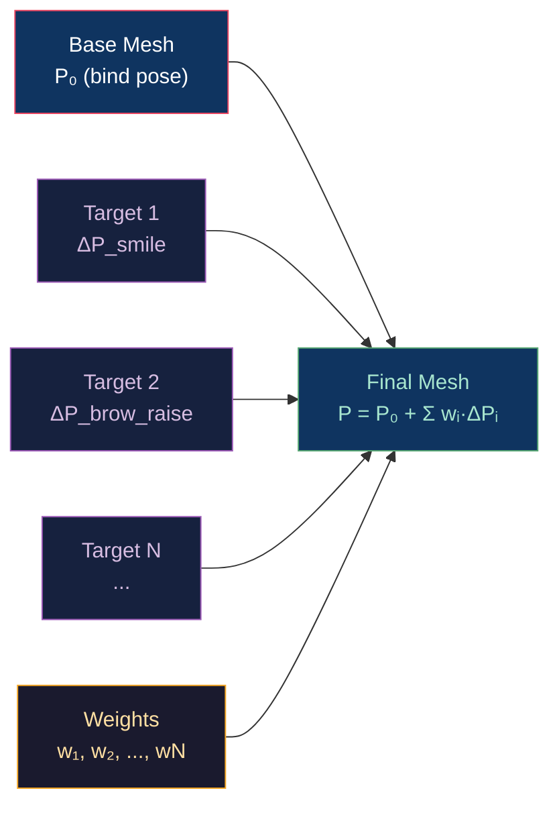

# 😮 Morph Targets and Blend Shapes

> [!abstract] TL;DR
> Morph targets (blend shapes) deform a mesh by additively blending delta vertex positions and normals from multiple target shapes: `P = P₀ + Σ wᵢ·ΔPᵢ`. Each target stores only non-zero deltas (sparse encoding). The Facial Action Coding System (FACS) defines ~50 anatomically motivated Action Units (AUs) as a basis for facial animation — any expression is a weighted sum of AUs. Corrective shapes are activated by joint angle combinations (e.g., bicep bulge = corrective shape × elbow flexion weight × forearm weight). GPU morph is computed in a vertex shader (all targets) or compute shader (sparse SSBOs). Combined skeletal + morph animation: apply morph in bind pose, then skin.

---

## Intuition — Analogy First

Blend shapes are like a sliding ruler between extreme face expressions. The base mesh is "neutral face." A "smile" target stores where each vertex moves relative to the neutral to form a smile. You set a weight (0 = neutral, 1 = full smile) and the mesh interpolates to that expression. Adding 50 such sliders (FACS AUs) gives you the full range of human facial expression, because any expression can be decomposed into combinations of anatomical muscle activations.

---

## How It Works



---

## Key Concepts / Details

### Delta Encoding

Instead of storing full vertex positions per target, store only the **difference** (delta) from the base:

```
ΔPᵢ[v] = Target_i.P[v] - Base.P[v]
ΔNᵢ[v] = Target_i.N[v] - Base.N[v]
```

Most vertices don't move for any given target — smile only affects the mouth region. Sparse encoding stores only `(vertex_index, delta)` pairs for non-zero deltas:

```
Full encoding:  N_targets × N_vertices × 12 bytes  (may be 50 × 100K × 12 = 60MB)
Sparse encoding: Σ(non-zero deltas) × 16 bytes     (typically 10× smaller)
```

### GPU Morph Vertex Shader

```glsl
// Dense morph (all vertices for each target)
layout(std430, binding = 1) buffer MorphDeltas {
    vec4 deltas[];  // [target][vertex] layout: deltas[targetIdx * vertexCount + vertexIdx]
};
uniform float morphWeights[MAX_TARGETS];

void main() {
    vec3 pos = aBasePosition;
    vec3 norm = aBaseNormal;
    
    for (int t = 0; t < numTargets; t++) {
        uint deltaIdx = t * numVertices + gl_VertexID;
        float w = morphWeights[t];
        if (abs(w) > 0.001) {
            pos  += w * deltas[deltaIdx].xyz;
            norm += w * deltas[deltaIdx + numVertices * numTargets].xyz;  // normals after positions
        }
    }
    
    // Then apply skinning to morphed vertex
    gl_Position = MVP * skinMatrix * vec4(pos, 1.0);
}
```

Compute shader approach (sparse, efficient for many inactive targets):
```glsl
// Compute shader: accumulate non-zero morph contributions into output buffer
layout(local_size_x = 256) in;
layout(std430, binding = 0) buffer SparseDeltas { vec4 sparseDeltas[]; }; // (vtxIdx, dx,dy,dz)
layout(std430, binding = 1) buffer OutPos { vec4 outPositions[]; };

uniform float weights[MAX_TARGETS];

void main() {
    uint workIdx = gl_GlobalInvocationID.x;
    if (workIdx >= totalNonZeroDeltas) return;
    
    // Each invocation adds one sparse delta
    uint vtxIdx = uint(sparseDeltas[workIdx].w);  // packed vtx idx in .w
    vec3 delta = sparseDeltas[workIdx].xyz;
    uint targetIdx = workIdx / deltasPerTarget;
    
    atomicAdd_vec3(outPositions[vtxIdx], delta * weights[targetIdx]);  // pseudocode
}
```

### FACS — Facial Action Coding System

Developed by Ekman and Friesen, FACS codifies facial expressions into ~44 **Action Units (AUs)** corresponding to individual facial muscle groups:

| AU | Muscle | Expression contribution |
|----|--------|------------------------|
| AU1 | Inner brow raiser | Sadness, surprise, worry |
| AU2 | Outer brow raiser | Surprise, fear |
| AU4 | Brow lowerer | Anger, concentration |
| AU6 | Cheek raiser | Duchenne smile (felt, not fake) |
| AU12 | Lip corner puller | Smile |
| AU17 | Chin raiser | Doubt, contempt |
| AU25 | Lips part | Speaking, surprise |

Game characters use 50–100 blend shapes covering FACS AUs + visemes (phoneme-driven mouth shapes for lip sync). A lip sync system drives viseme weights from phonemes extracted from audio (ARKit, Oculus Lip Sync).

### Corrective Shapes

Simple blending of base shapes fails at extreme poses because joints create secondary deformations (e.g., skin bunches up at the elbow crease). Corrective shapes add a THIRD term:

```
P = P₀ + Σ wᵢ·ΔPᵢ + Σ combo_shapes[j] · f(joint_angles)
```

Combination shapes are activated by joint angle functions:
```
corrective_weight = max(0, 1 - |elbow_angle - target_angle| / range)
```

**Driver-based correctives** (used in film/character rigs): blend shape weight driven by a combination of joint angles via a neural network or RBF (Radial Basis Function) interpolation — PSD (Pose-Space Deformation).

### Skinning + Morphing Pipeline Order

```
Correct order:
1. Apply morph targets IN BIND POSE (base pose)
2. Apply skeletal skinning to morphed mesh

Wrong order:
1. Skin first (deforms the mesh)
2. Add morph deltas (deltas are now in the wrong space)
```

The morph deltas are authored in the bind pose (T-pose / neutral) space. Applying them after skinning adds deltas in world space, which is incorrect as the mesh has already been transformed.

### Storage Formats

| Format | Storage | Notes |
|--------|---------|-------|
| glTF morph targets | Accessor per target | Positions + normals per target |
| FBX blend shapes | Per-shape full mesh | Sparse possible in export options |
| OpenUSD blend shapes | Point offsets | Sparse by default |
| Sparse SSBO | (idx, delta) pairs | Efficient for GPU direct |

---

## Real-World Notes

- **ARKit**: iPhone face tracking outputs 52 blend shape weights (FACS-based) at 60fps via True Depth camera depth data.
- **MetaHuman (Unreal)**: uses ~300 blend shapes for high-fidelity facial animation, driven by performance capture data retargeted from an actor's face.
- **LOD for morph**: reduce blend shape count at lower LODs — only keep the most visible AUs (smile, brows) at mid-LOD; drop all at far LOD.
- **Intermediate normals**: when morphing changes the surface significantly, normals must be recalculated (not just morphed from delta normals). Full normal recomputation is expensive; delta normals are a compromise.

---

## Common Pitfalls

1. **Applying skinning before morphing** — this is the most common morph pipeline bug in custom engines; the deltas land in world space instead of bind-pose space.
2. **Dense GPU morph with 100+ targets** — 100 targets × 100K vertices × 12 bytes = 120MB SSBO bandwidth per frame. Use sparse encoding or compute-shader activation gating.
3. **FACS weights outside [0,1]** — blend shapes are designed for [0,1]; weights outside this range (overcorrection) can produce intersecting geometry. Clamp or use a separate out-of-range shape.
4. **Delta normals not renormalized** — after applying delta normals, the result must be renormalized in the vertex shader; raw delta addition can produce non-unit normals.

---

## Related Concepts

- [[_MOC_Animation_and_Simulation|↑ Animation & Simulation MOC]]
- [[Skeletal_Animation_and_Skinning|Skeletal Animation]] — combined pipeline; morph first, then skin
- [[../04_Shaders/GLSL_Vertex_Shaders|GLSL Vertex Shaders]] — morph in vertex stage
- [[../04_Shaders/Compute_Shaders_GPGPU|Compute Shaders]] — sparse morph accumulation

---

## Review Questions

1. Explain why morph targets must be applied before skeletal skinning, not after. Use a specific example (e.g., a smile on a character whose head bone is rotated 90°).
2. A character has 100 blend shapes, each with 50K non-zero deltas out of 200K vertices (25% sparse). Compare the GPU memory bandwidth for dense vs sparse morph at 60fps.
3. What is a corrective shape, and why is simple additive blending of FACS AUs insufficient for realistic elbow/shoulder deformation?

---

## Sources

#Computer_Graphics #Animation_and_Simulation #Morph #BlendShapes
