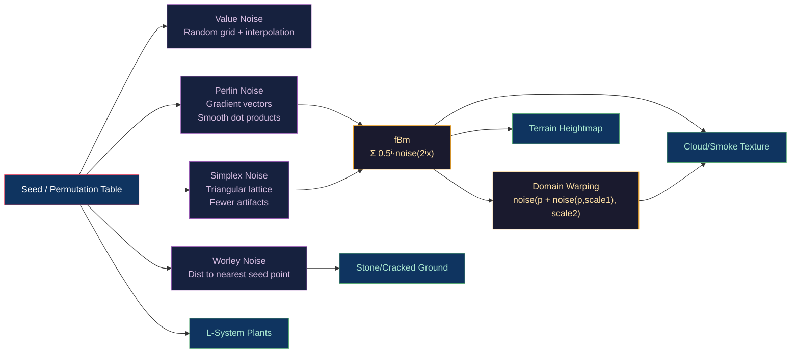

# 🌿 Procedural Generation

> [!abstract] TL;DR
> Procedural generation creates content algorithmically from mathematical functions and seeds — infinite variation from compact code. Value noise interpolates random grid values. Perlin noise uses gradient vectors at grid lattice points for smoother, feature-rich results. Simplex noise (Ken Perlin 2001) uses a simplex lattice (triangles in 2D, tetrahedra in 3D) — O(n²) vs O(2ⁿ) grid complexity, no directional artifacts. Fractional Brownian Motion (fBm) = `Σᵢ 0.5ⁱ·noise(2ⁱ·x)` (6–8 octaves). Worley/cellular noise measures distance to nearest seed point — useful for cracked stone, water ripples. L-systems use rewriting rules to generate fractal plant structures. Domain warping applies noise to distort the input coordinates of another noise function.

---

## Intuition — Analogy First

Noise functions are "smooth randomness" — random values that vary gradually across space. Perlin noise is like a hilly landscape where height varies smoothly, not in sharp steps. fBm is like overlaying maps of hills at multiple scales: start with continental mountains, add regional hills, local bumps, and tiny pebbles — each scale at half the amplitude, twice the frequency. The result looks like real terrain because nature builds structure this way: geology (large scale) shapes the land, erosion (medium) carves valleys, and surface features (fine) add texture.

---

## How It Works



---

## Key Concepts / Details

### Value Noise

Assign a random scalar to each integer grid point. Interpolate between grid values:

```python
def value_noise_2d(x, y, permutation):
    xi, yi = int(x), int(y)
    xf, yf = x - xi, y - yi
    
    # Fade function: smoothstep
    u = fade(xf)  # 6t⁵ - 15t⁴ + 10t³ (Perlin's quintic)
    v = fade(yf)
    
    # Grid corner random values
    v00 = rand(xi, yi, permutation)
    v10 = rand(xi+1, yi, permutation)
    v01 = rand(xi, yi+1, permutation)
    v11 = rand(xi+1, yi+1, permutation)
    
    # Bilinear interpolation
    return lerp(lerp(v00, v10, u), lerp(v01, v11, u), v)
```

Artifacts: boxy appearance from axis-aligned grid, visible grid pattern at high zoom.

### Perlin Noise

Instead of random scalars, assign random **gradient vectors** at grid lattice points. Each point contributes: `dot(gradient, (x - grid_point))`:

```glsl
float perlin_noise(vec2 p) {
    vec2 i = floor(p);
    vec2 f = fract(p);
    
    // Smooth interpolation (quintic: 6t⁵−15t⁴+10t³)
    vec2 u = f * f * f * (f * (f * 6.0 - 15.0) + 10.0);
    
    // Gradient hash at 4 corners
    float a = dot(random_grad(i + vec2(0,0)), f - vec2(0,0));
    float b = dot(random_grad(i + vec2(1,0)), f - vec2(1,0));
    float c = dot(random_grad(i + vec2(0,1)), f - vec2(0,1));
    float d = dot(random_grad(i + vec2(1,1)), f - vec2(1,1));
    
    return mix(mix(a, b, u.x), mix(c, d, u.x), u.y);
}
```

Properties:
- Range approximately [−0.7, 0.7] in 2D (not [−1, 1])
- Stationary zero at all grid integer points
- Directional bias along diagonals in 2D

### Simplex Noise

Simplex noise uses a **simplex lattice** (equilateral triangles in 2D, regular tetrahedra in 3D, etc.) instead of the square grid:

Advantages over Perlin:
- O(n²) complexity in n dimensions vs O(2ⁿ) for classic Perlin
- No directional artifacts (axis-aligned bands)
- Smoother gradient contributions

```glsl
// Simplex 2D kernel summary (from Stefan Gustavson)
float snoise(vec2 v) {
    const vec4 C = vec4(0.211324865, 0.366025403, -0.577350269, 0.024390244);
    vec2 i  = floor(v + dot(v, C.yy));
    vec2 x0 = v - i + dot(i, C.xx);
    vec2 i1 = (x0.x > x0.y) ? vec2(1,0) : vec2(0,1);
    vec4 x12 = x0.xyxy + C.xxzz - vec4(i1, 1, 1);
    i = mod(i, 289.0);  // permutation
    vec3 p = permute(permute(i.y + vec3(0, i1.y, 1)) + i.x + vec3(0, i1.x, 1));
    vec3 m = max(0.5 - vec3(dot(x0,x0), dot(x12.xy,x12.xy), dot(x12.zw,x12.zw)), 0.0);
    m = m * m; m = m * m;
    vec3 x = 2.0 * fract(p * C.www) - 1.0;
    vec3 h = abs(x) - 0.5;
    vec3 ox = floor(x + 0.5);
    vec3 a0 = x - ox;
    m *= 1.79284291 - 0.85373472 * (a0*a0 + h*h);
    vec3 g;
    g.x = a0.x * x0.x + h.x * x0.y;
    g.yz = a0.yz * x12.xz + h.yz * x12.yw;
    return 130.0 * dot(m, g);
}
```

### Fractional Brownian Motion (fBm)

fBm sums noise at increasing frequencies with decreasing amplitudes (octaves):

```glsl
float fbm(vec2 x, int octaves) {
    float value = 0.0;
    float amplitude = 0.5;
    float frequency = 1.0;
    for (int i = 0; i < octaves; i++) {
        value += amplitude * noise(x * frequency);
        frequency *= 2.0;   // lacunarity (default 2.0)
        amplitude *= 0.5;   // persistence (default 0.5)
    }
    return value;
}
```

Parameters:
- **Octaves**: 6 for terrain, 8 for clouds, 4 for quick preview
- **Lacunarity**: frequency multiplier per octave (typically 2.0)
- **Persistence**: amplitude multiplier per octave (0.5 = each octave half as strong)
- **Hurst exponent** H: persistence = 2^(−H), with H = 0.5 → standard fBm

### Worley / Cellular Noise

Assigns random seed points in space. Each location returns the distance to the nearest seed:

```glsl
float worley_noise(vec2 p) {
    vec2 id = floor(p);
    float minDist = 1e10;
    
    // Check 3×3 neighboring cells
    for (int y = -1; y <= 1; y++) {
        for (int x = -1; x <= 1; x++) {
            vec2 neighbor = id + vec2(x, y);
            vec2 point = neighbor + hash22(neighbor);  // random point in cell
            float dist = length(point - p);
            minDist = min(minDist, dist);
        }
    }
    return minDist;
}
```

**F1** (nearest distance): Voronoi regions, cellular patterns, stone cracks  
**F2 - F1**: ridge between cells, useful for cracks, veins in marble  
**F2**: bubbles, biological cell membranes

### Domain Warping

Input coordinates are distorted by another noise function before sampling:

```glsl
// Iq's domain warping: applies noise to distort input coordinates
vec3 domainWarp(vec2 p) {
    vec2 q = vec2(fbm(p + vec2(0.0, 0.0)),
                  fbm(p + vec2(5.2, 1.3)));  // two independent fBm calls

    vec2 r = vec2(fbm(p + 4.0*q + vec2(1.7, 9.2)),
                  fbm(p + 4.0*q + vec2(8.3, 2.8)));  // warp the warp

    return fbm(p + 4.0*r);  // final displaced lookup
}
```

Domain warping produces highly organic, flowing patterns — essential for clouds, fire, lava, and terrain erosion effects.

### L-Systems

Lindenmayer systems use string rewriting to generate fractal plant structures:

```python
# Axiom and rules
axiom = "F"
rules = {
    "F": "FF+[+F-F-F]-[-F+F+F]"  # Bush L-system
}

def expand(axiom, rules, n):
    s = axiom
    for _ in range(n):
        s = "".join(rules.get(c, c) for c in s)
    return s

# Turtle interpretation
def draw(s, angle=25, step=1):
    stack = []
    for c in s:
        if c == "F": move_forward(step)
        elif c == "+": turn_left(angle)
        elif c == "-": turn_right(angle)
        elif c == "[": stack.append(state())
        elif c == "]": restore_state(stack.pop())
```

L-systems generate self-similar structures through recursion — fractal ferns, trees, coral, coastlines. Stochastic L-systems add randomness to rules for natural variation.

### Noise Type Comparison

| Type | Continuity | Complexity | Directional Bias | Best Use |
|------|-----------|-----------|-----------------|---------|
| Value | C1 (quintic) | O(2ⁿ) | Grid-aligned | Simple height maps |
| Perlin | C2 | O(2ⁿ) | Slight diagonal | Terrain, textures |
| Simplex | C2 | O(n²) | Minimal | 3D/4D noise |
| Worley F1 | C∞ (in cells) | O(k·n) | None | Cracks, cells |
| fBm | — | O(octaves × base) | Inherits base | Terrain, clouds |
| Tileable | C1 | O(2ⁿ) | Grid | Repeating textures |

---

## Real-World Notes

- **Shadertoy.com**: the canonical playground for GLSL noise-based procedural graphics; most techniques here have live demos.
- **GPU noise**: Simplex/Perlin in fragment/compute shaders — hash functions (`mod289`, `permute`) replace lookup tables for better GPU coherence.
- **Terrain generation**: fBm for base shape, Worley for rocky detail, erosion simulation (hydraulic + thermal) for realism, gradient shaping for mountains vs plains.
- **Procedural textures** (Blender's node system): stacks value/Perlin/Voronoi nodes with math operations to create stone, wood grain, marble, cloud materials entirely without bitmap textures.

---

## Common Pitfalls

1. **Perlin noise zero at integer coordinates** — the gradient dot product is always 0 at exact integer positions; placing objects precisely on grid points produces flat/zero noise values.
2. **fBm not normalized** — summing 8 octaves of amplitude 0.5ⁱ gives max value Σ 0.5ⁱ ≈ 2.0 (not 1.0); divide by the same sum or set persistence = 0.5 / (1 - 0.5^octaves).
3. **Tileable noise boundary artifacts** — when wrapping noise for a repeating texture, tiling must be built into the noise function (period modulo); standard Perlin doesn't tile.
4. **Too many L-system iterations** — string length grows exponentially; 6 iterations of "F" → "FF" already gives 2⁶ = 64 F's. Limit iterations or use stochastic pruning.

---

## Related Concepts

- [[_MOC_Animation_and_Simulation|↑ Animation & Simulation MOC]]
- [[Cloth_and_Fluid_Simulation|Cloth & Fluid Simulation]] — noise drives fluid turbulence
- [[../04_Shaders/Fragment_Shaders_and_Effects|Fragment Shaders]] — noise implemented in GLSL fragment/compute
- [[../05_Lighting_and_Materials/Texture_Mapping_and_UV|Texture Mapping]] — noise-based procedural textures replace bitmaps

---

## Review Questions

1. Explain why Perlin noise is always 0 at integer lattice points. How does this affect terrain generation if mountains are placed exactly on grid coordinates?
2. Derive the fBm formula's maximum value for N octaves with amplitude 0.5ⁱ and base noise in [-1, 1]. How do you normalize fBm to output [-1, 1]?
3. Domain warping applies noise to distort the input of another noise call. Why does this produce more organic results than simply adding two noise functions together?

---

## Sources

#Computer_Graphics #Animation_and_Simulation #Procedural #Noise
