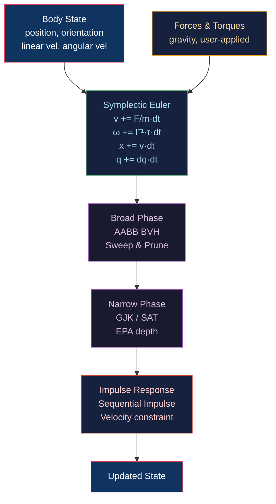

# ⚙️ Rigid Body Physics

> [!abstract] TL;DR
> Rigid body simulation maintains 6-DOF state: position x, orientation q (quaternion), linear velocity v, angular velocity ω. Forces integrate state via Symplectic Euler: `v += F/m · dt; x += v · dt`. Collision detection has two phases: broad phase (AABB BVH, sweep-and-prune) and narrow phase (GJK for convex shapes, EPA for penetration depth). Impulse-based collision response: `j = −(1+e)·v_rel·n / (1/m₁ + 1/m₂ + n·(I₁⁻¹(r₁×n))×r₁ + ...)`. Sequential impulse (SI) solvers iterate until constraints converge. Bullet Physics and NVIDIA PhysX are the standard open-source and commercial solutions respectively.

---

## Intuition — Analogy First

A rigid body simulation is like perfectly rigid billiard balls on a table. Each ball has position, orientation, and velocity. When two balls touch, we compute how hard they should bounce off each other (impulse) such that they separate with the correct relative speed (coefficient of restitution). The challenge is that one ball might simultaneously touch three others — the sequential impulse solver iterates over all contacts multiple times until all constraints are satisfied simultaneously.

---

## How It Works



---

## Key Concepts / Details

### Rigid Body State

```python
@dataclass
class RigidBody:
    # Primary state
    x: np.ndarray   # position (world)
    q: np.ndarray   # orientation quaternion
    v: np.ndarray   # linear velocity
    omega: np.ndarray  # angular velocity
    
    # Derived
    mass: float
    inertia_tensor_local: np.ndarray  # 3×3, computed from shape
    
    @property
    def inertia_tensor_world(self):
        R = quat_to_matrix(self.q)
        return R @ self.inertia_tensor_local @ R.T
```

### Inertia Tensors

For common shapes (principal axes, uniform density):

| Shape | Ixx = Iyy | Izz |
|-------|-----------|-----|
| Sphere (r) | 2mr²/5 | 2mr²/5 |
| Box (w,h,d) | m(h²+d²)/12 | m(w²+h²)/12 |
| Cylinder (r,h) | m(3r²+h²)/12 | mr²/2 |
| Capsule | Cylinder approx | Cylinder approx |

### Symplectic Euler Integration

```python
def integrate(body, forces, torques, dt):
    # Linear
    acceleration = forces / body.mass
    body.v += acceleration * dt        # velocity first (symplectic)
    body.x += body.v * dt
    
    # Angular
    I_world = body.inertia_tensor_world
    angular_accel = np.linalg.solve(I_world, torques - np.cross(body.omega, I_world @ body.omega))
    body.omega += angular_accel * dt
    
    # Quaternion update: dq/dt = 0.5 * [omega] * q
    dq = 0.5 * quat_multiply(np.array([0, body.omega[0], body.omega[1], body.omega[2]]), body.q)
    body.q = normalize(body.q + dq * dt)
```

Symplectic Euler (update velocity before position) is energy-preserving for springs — important for stable rigid body simulation.

### Broad Phase — AABB BVH and Sweep & Prune

**AABB BVH**: same structure as graphics culling BVH — test each AABB pair that overlaps. O(n log n) for sorted lists.

**Sweep & Prune (SAP)**: sort all AABB min/max endpoints on each axis. Two AABBs overlap on an axis iff they overlap on ALL three axes. Insertion sort maintains sorted lists; overlapping pair set updated incrementally — O(n) per frame for mostly coherent motion.

### Narrow Phase — GJK Algorithm

GJK (Gilbert-Johnson-Keerthi) determines if two convex shapes overlap using their **Minkowski difference**:

```
A ⊖ B = {a - b | a ∈ A, b ∈ B}
Two shapes overlap ↔ origin ∈ A ⊖ B
```

```python
def gjk(shapeA, shapeB):
    """Returns True if shapes overlap."""
    d = shapeA.center - shapeB.center  # initial direction
    simplex = [support(shapeA, shapeB, d)]  # support function
    d = -simplex[0]
    
    for _ in range(64):  # max iterations
        A = support(shapeA, shapeB, d)
        if dot(A, d) < 0: return False  # no overlap
        simplex.append(A)
        d = nearest_simplex(simplex)  # reduce to nearest feature, update d
        if origin_in_simplex(simplex): return True
    return False

def support(A, B, d):
    """Furthest point in shape A-B in direction d."""
    return A.support(d) - B.support(-d)
```

### EPA — Expanding Polytope Algorithm

After GJK confirms overlap, EPA computes the minimum translation vector (MTV) to separate shapes:

```python
def epa(shapeA, shapeB, gjk_simplex):
    """Returns penetration depth and contact normal."""
    polytope = gjk_simplex
    while True:
        # Find closest face to origin
        face, dist = closest_face(polytope)
        # Expand polytope with support in face normal direction
        p = support(shapeA, shapeB, face.normal)
        if abs(dot(p, face.normal) - dist) < 0.0001:
            return dist, face.normal  # converged
        polytope.add_vertex(p)
```

### Impulse-Based Collision Response

For two bodies colliding at contact point `c` with normal `n` (pointing from B to A):

```
Relative velocity at contact:
v_rel = (vA + ωA × rA) - (vB + ωB × rB)
         [A's velocity at contact]   [B's velocity at contact]

rA = c - xA,  rB = c - xB  (contact point relative to COM)

Impulse magnitude:
j = -(1+e) · (v_rel · n)
    ─────────────────────────────────────────────────────────
    1/mA + 1/mB + n · ((IA⁻¹ (rA×n)) × rA) + n · ((IB⁻¹ (rB×n)) × rB)

Apply:
vA += j/mA · n
vB -= j/mB · n
ωA += IA⁻¹ · (rA × (j·n))
ωB -= IB⁻¹ · (rB × (j·n))
```

`e` = coefficient of restitution: 0 = perfectly inelastic (sticks), 1 = perfectly elastic (bounces).

### Sequential Impulse Solver

For N constraints (contacts, joints), iterate:
```
repeat K times:  (K = 10–50 iterations)
    for each contact:
        compute impulse j for this contact only
        apply impulse (warm-start from previous frame)
        clamp j ≥ 0 (contacts only push, not pull)
```

Convergence depends on K: more iterations = more stable stacking. PhysX defaults: 4 position iterations, 1 velocity iteration. Bullet defaults: 10 iterations.

### Bullet Physics API

```cpp
// Bullet Physics setup
btBroadphaseInterface* broadphase = new btDbvtBroadphase();
btDefaultCollisionConfiguration* config = new btDefaultCollisionConfiguration();
btCollisionDispatcher* dispatcher = new btCollisionDispatcher(config);
btSequentialImpulseConstraintSolver* solver = new btSequentialImpulseConstraintSolver();
btDiscreteDynamicsWorld* world = new btDiscreteDynamicsWorld(dispatcher, broadphase, solver, config);
world->setGravity(btVector3(0, -9.81f, 0));

// Create rigid body
btCollisionShape* shape = new btBoxShape(btVector3(0.5f, 0.5f, 0.5f));
btTransform startTransform;
startTransform.setIdentity();
startTransform.setOrigin(btVector3(0, 10, 0));
btScalar mass = 1.0f;
btVector3 inertia(0, 0, 0);
shape->calculateLocalInertia(mass, inertia);
btDefaultMotionState* motionState = new btDefaultMotionState(startTransform);
btRigidBody::btRigidBodyConstructionInfo rbInfo(mass, motionState, shape, inertia);
btRigidBody* body = new btRigidBody(rbInfo);
world->addRigidBody(body);

// Simulate
world->stepSimulation(1.0f/60.0f, 10);  // 10 substeps
```

---

## Real-World Notes

- **GPU physics** (NVIDIA PhysX CUDA backend): parallel broad phase via GPU radix sort + parallel narrow phase for thousands of contacts at once.
- **Continuous collision detection (CCD)**: fast-moving thin objects can "tunnel" through geometry in one time step. CCD sweeps the object's volume along its trajectory to catch tunneling.
- **Sleeping**: when a body's velocity < threshold for several frames, mark it "sleeping" — no integration, no broad-phase. Essential for stacking stability.
- **Ragdolls**: chain rigid bodies together with hinge/cone constraints to simulate body falling; drive via animation-to-physics blending.

---

## Common Pitfalls

1. **Position correction instead of impulse** — correcting positions directly (Baumgarte stabilization alone) introduces phantom energy; use velocity impulses for realistic bouncing.
2. **GJK without EPA** — GJK only returns overlap yes/no; without EPA you don't know the penetration depth or contact normal needed for impulse response.
3. **Forgetting angular velocity contribution** — using only linear velocities in the impulse formula ignores spinning objects; a spinning top hitting a wall must account for ω.
4. **Large timestep instability** — dt > 1/(2·sqrt(k/m)) for spring constraints causes instability. Clamp dt or use multiple substeps: `world->stepSimulation(dt, maxSubsteps, fixedDt)`.

---

## Related Concepts

- [[_MOC_Animation_and_Simulation|↑ Animation & Simulation MOC]]
- [[Cloth_and_Fluid_Simulation|Cloth & Fluid Simulation]] — softer version of rigid body (deformable)
- [[../02_3D_Fundamentals/Frustum_Culling_and_Clipping|Frustum Culling]] — BVH same data structure for broad-phase
- [[Skeletal_Animation_and_Skinning|Skeletal Animation]] — ragdoll integration with skeletal system

---

## Review Questions

1. Derive the impulse magnitude formula for two rigid bodies colliding. What does the denominator represent physically?
2. Why must the impulse j be clamped to ≥ 0 in the sequential impulse solver for contact constraints (non-penetration constraints)?
3. GJK returns "overlap" for two convex shapes. Describe the EPA algorithm step-by-step and explain what information it produces that GJK alone cannot.

---

## Sources

#Computer_Graphics #Animation_and_Simulation #Physics #RigidBody
