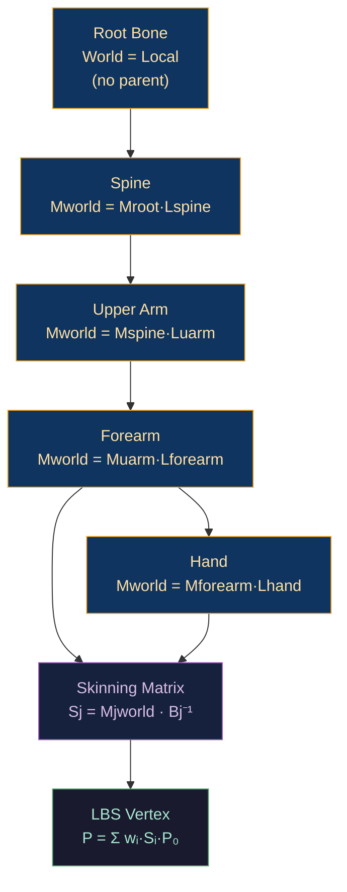

# 🦴 Skeletal Animation and Skinning

> [!abstract] TL;DR
> Skeletal animation deforms a mesh using a hierarchy of bones. Each bone's world transform is computed forward kinematically: `Mj_world = Mparent_world · Lj` (parent before child). The skinning matrix is `Sj = Mj_world · Bj⁻¹` where Bj⁻¹ is the inverse bind pose matrix (baked into the asset). Linear Blend Skinning (LBS) sums up to 4 weighted bone transforms: `P_final = Σ wᵢ·Sᵢ·P_bind`. LBS produces the "candy-wrapper" artifact for joints rotating >90° — dual quaternion skinning (DQS) fixes this by blending quaternions instead of matrices. Bone hierarchy must be stored parent-before-child (topological sort) for a single-pass CPU update. Slerp interpolates joint rotations between keyframes.

---

## Intuition — Analogy First

Imagine a marionette puppet: the strings connect to the skeleton (bone hierarchy), and the cloth body (mesh skin) follows wherever the skeleton goes. Each cloth vertex is stitched to 1–4 bones with varying weights — vertices at the elbow are 50% upper-arm, 50% forearm. When the forearm rotates, the elbow cloth follows both bones, weighted blend. LBS is the "average the puppet strings" approach — simple but produces unnatural volume loss at joints twisted beyond 90° (candy-wrapper effect). Dual quaternion skinning is the "use a better string physics" approach.

---

## How It Works



---

## Key Concepts / Details

### Bone Hierarchy and Forward Kinematics

Each bone has a **local transform** Lj relative to its parent. The world transform is the product of all ancestor locals:

```
Mj_world = M_root → M_parent → ... → Mj

Mj_world = M_grandparent_world · Lparent · Lj
```

Efficient computation requires processing **parent before child** (topological sort):

```python
def update_bone_hierarchy(bones):
    """bones: sorted parent-before-child (topological order)"""
    for bone in bones:
        if bone.parent is None:
            bone.world_matrix = bone.local_matrix
        else:
            bone.world_matrix = bone.parent.world_matrix @ bone.local_matrix
```

Topological sort ensures each parent is processed before its children in a single pass.

### Bind Pose and Inverse Bind Matrix

The **bind pose** Bj is the bone's world transform when the mesh was originally bound (the T-pose or rest pose stored in the asset). The **inverse bind matrix** Bj⁻¹ transforms vertices from world space back into the bone's local space:

```
Skinning matrix Sj = Mj_world · Bj⁻¹

Effect:
P_world = Sj · P_bind
        = Mj_world · (Bj⁻¹ · P_bind)
                      ^^^^^^^^^^^^^^^^^^^
                      = P in bone-local space
```

The inverse bind matrices are baked into the asset (GLTF/FBX) and uploaded to the GPU as a constant once per mesh, not per frame.

### Linear Blend Skinning (LBS)

Each vertex is influenced by up to 4 bones:

```glsl
// Vertex shader LBS
mat4 skinMatrix = weight.x * boneMatrices[joint.x]
                + weight.y * boneMatrices[joint.y]
                + weight.z * boneMatrices[joint.z]
                + weight.w * boneMatrices[joint.w];
// weights must sum to 1.0

vec3 skinnedPos = (skinMatrix * vec4(bindPos, 1.0)).xyz;
vec3 skinnedNorm = normalize(mat3(skinMatrix) * bindNormal);
```

Cost: 4 matrix-vector multiplications per vertex (each mat4×vec4 = 16 MADs).

### Candy-Wrapper Artifact

When a joint (e.g., wrist) rotates 180°, the two bone matrices are nearly opposite. Their weighted average collapses to a near-zero matrix — the skin "twists" and shrinks to a thin spike (like twisting a candy wrapper).

Root cause: 4×4 matrix interpolation is NOT the same as rotation interpolation. Two rotations on opposite sides of the hemisphere average to a near-zero matrix.

### Dual Quaternion Skinning (DQS)

Dual quaternions represent rigid transforms (rotation + translation) as a pair (q_r, q_d) where:
- `q_r` = rotation quaternion
- `q_d = 0.5 · t · q_r` (translation quaternion, encodes translation t)

Blending in DQ space is rotation-correct:

```glsl
// Convert bone matrices to dual quaternions (CPU side)
// DQ blending (vertex shader)
vec4 q0 = bonesDQ[joint.x].rotation;
vec4 q1 = bonesDQ[joint.y].rotation;
// Ensure shortest arc (negate if dot < 0)
if (dot(q0, q1) < 0.0) q1 = -q1;
if (dot(q0, bonesDQ[joint.z].rotation) < 0.0) ... // similar for z,w

vec4 blendedR = weight.x * bonesDQ[joint.x].rotation
              + weight.y * bonesDQ[joint.y].rotation
              + weight.z * bonesDQ[joint.z].rotation
              + weight.w * bonesDQ[joint.w].rotation;
vec4 blendedT = weight.x * bonesDQ[joint.x].translation + ...;

// Normalize and extract transform
float len = length(blendedR);
blendedR /= len;
blendedT /= len;

vec3 skinnedPos = transformByDQ(blendedR, blendedT, bindPos);
```

DQS eliminates candy-wrapper artifacts for rotations >90°. Used in: Unreal Engine character skinning, Unity SkinnedMeshRenderer DQ mode.

### Quaternion Slerp for Keyframe Interpolation

Between keyframe A (time tA) and B (time tB), interpolate at time t:

```python
def slerp(q0, q1, t):
    # Ensure shortest arc
    if dot(q0, q1) < 0:
        q1 = -q1
    cosTheta = dot(q0, q1)
    if cosTheta > 0.9995:  # near-identical: use linear
        return normalize(q0 + t * (q1 - q0))
    theta = acos(cosTheta)
    return (sin((1-t)*theta)*q0 + sin(t*theta)*q1) / sin(theta)
```

Position and scale components of keyframes are interpolated with standard lerp. The TRS components are interpolated separately and then recombined into the local bone matrix.

### Flat Bone Array Layout

For efficient CPU hierarchical update, store bones in a **parent-before-child** flat array:

```
Index: 0=Root, 1=Spine, 2=UpperArmL, 3=ForearmL, 4=HandL, 5=UpperArmR, ...
Parent: [-1,   0,     1,            2,            3,       1,           ...]
```

Single-pass update:
```cpp
for (int i = 0; i < boneCount; i++) {
    int parent = skeleton.parents[i];
    if (parent < 0) worldMatrices[i] = localMatrices[i];
    else            worldMatrices[i] = worldMatrices[parent] * localMatrices[i];
    // Compute skinning: skinMatrices[i] = worldMatrices[i] * invBindMatrices[i]
}
// Upload skinMatrices[] to UBO/SSBO
```

---

## Real-World Notes

- **Animation blending**: in game characters, blend multiple animation clips (idle 60%, walk 40%) by slerping bone rotations, not matrix blending.
- **Animation compression**: typical character has 50 bones × 3 TRS components × 30fps × 10s = 45,000 keyframes. Compress using curve fitting (Hermite splines on reduced knots), retaining only non-constant channels.
- **IK (Inverse Kinematics)**: instead of authoring every bone's rotation, specify end-effector position (hand/foot) and solve backward with FABRIK or CCD algorithms.
- **GPU skinning vs compute skinning**: vertex shader skinning is most common; compute-based pre-skinning allows skinned mesh LOD and BLAS updates for RT.

---

## Common Pitfalls

1. **Not normalizing DQ blend result** — the blended dual quaternion must be renormalized; unnormalized DQs produce scaling artifacts.
2. **Incorrect parent order in bone array** — if a child appears before its parent in the array, it uses last frame's parent transform. Must sort topologically.
3. **Inverse bind matrices not pre-baked** — computing Bj⁻¹ on the fly each frame requires 50+ matrix inversions; bake once into the asset.
4. **Weights not summing to 1** — if joint weights sum to < 1, the skinned vertex "shrinks" toward the origin. Normalize during authoring or in the vertex shader.

---

## Related Concepts

- [[_MOC_Animation_and_Simulation|↑ Animation & Simulation MOC]]
- [[Morph_Targets_and_Blend_Shapes|Morph Targets]] — combined with skeletal for facial expressions
- [[../04_Shaders/GLSL_Vertex_Shaders|GLSL Vertex Shaders]] — LBS implementation in GPU vertex shader
- [[../02_3D_Fundamentals/3D_Transforms_and_Matrices|3D Transforms]] — TRS decomposition, quaternion math

---

## Review Questions

1. Derive the skinning matrix equation Sj = Mj_world · Bj⁻¹. What does multiplying by Bj⁻¹ accomplish geometrically?
2. Explain the candy-wrapper artifact in LBS at 180° rotation. Trace through the matrix math to show why the weighted average produces a near-zero matrix.
3. A character has 80 bones. You want to update the hierarchy in a single CPU pass. What property must the bone array satisfy, and how do you verify it from a parent index array?

---

## Sources

#Computer_Graphics #Animation_and_Simulation #Skeletal #Skinning
